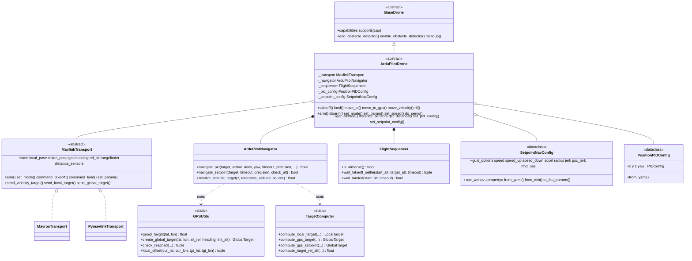
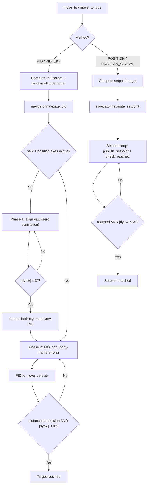

# ArduPilot Vehicle Core

Transport-agnostic ArduPilot flight logic shared by every ArduPilot drone in the SDK. `MavrosDrone` and `MavlinkDrone` are the **same vehicle reached over two different transports** — all navigation, takeoff/land detection, GPS math, parameter handling, and PID/setpoint control live here exactly once. The transport READMEs ([mavros](../mavros/README.md), [mavlink](../mavlink/README.md)) cover only their wire specifics and link back here for behavior.

## Design

The core operates on plain, ROS-free types ([`types.py`](types.py)) and reaches the flight controller through a pluggable [`MavlinkTransport`](transport.py). A transport encapsulates *how* the SDK talks to the FCU (ROS topics/services, or a raw MAVLink link), so identical flight logic serves both MAVROS and direct pymavlink without duplication.

## Architecture



## Modules

| File | Responsibility |
| --- | --- |
| `types.py` | Plain dataclasses (`Vec3`, `LocalPose`, `GeoPoint`, `Attitude`, `VehicleState`, `LocalTarget`, `GlobalTarget`, `TargetFrame`). ENU/radians conventions. No ROS imports. |
| `transport.py` | `MavlinkTransport` ABC: telemetry read-properties + command/setpoint write-methods + lifecycle. |
| `drone.py` | `ArduPilotDrone(BaseDrone)` — all shared flight behavior, constructed with a transport. |
| `navigator.py` | `ArduPilotNavigator` — PID and setpoint navigation loops over plain targets/poses. |
| `target_computer.py` | Stateless target computation (local/GPS offsets → `LocalTarget`/`GlobalTarget`). |
| `gps_utils.py` | EGM96 geoid correction, geodesic arrival checks, global-target construction. |
| `sequencer.py` | `FlightSequencer` — velocity-based takeoff/land settle detection (all tunables preserved). |
| `setpoint_config.py` | `SetpointNavConfig` — `GUID_OPTIONS`/`WPNAV` parameter handling (with 4.6/4.8 aliases). |

## Conventions

- **Frames**: the core is ENU (x=East, y=North, z=Up) / FLU; transports convert to/from the wire's NED/FRD.
- **Yaw**: radians, ENU (0 = East, CCW positive). Compass *heading* (degrees, NED) is kept separate for GPS body-frame math.
- **Atomicity**: telemetry properties return the most-recent value via whole-object assignment (atomic under the GIL), so the flight thread never sees a half-written pose.

## Capabilities

`ArduPilotDrone.capabilities` is derived declaratively from the configured `pose_source` (see [`capabilities.py`](../capabilities.py)): outdoor adds `GPS_NAV`/`GLOBAL_SETPOINT`, indoor adds `VISION_POSE`. Use `drone.supports(Capability.GPS_NAV)` instead of ad-hoc checks; unsupported operations raise `CapabilityNotSupportedError`.

## Concepts

### MAVLink and the FCU

[MAVLink](https://ardupilot.org/dev/docs/mavlink-basics.html) is the binary protocol between the flight controller (FCU), ground stations, and companion computers. The SDK sends velocity/position commands and reads sensor data over it — through MAVROS in one transport, through pymavlink directly in the other. The drone must be in [GUIDED mode](https://ardupilot.org/dev/docs/copter-commands-in-guided-mode.html) for offboard control.

### Connection and Readiness

`connect()` does not return as soon as the transport starts — it waits (up to a timeout) for a live FCU heartbeat, setting `_connected` only once the link is up. After connecting:

- `is_fcu_connected` — FCU heartbeat present (raw link state).
- `is_ready` — connected **and** the driver/transport is running; this is the gate the higher-level calls check before arming or commanding.

### Flight Modes

ArduPilot [flight modes](https://ardupilot.org/copter/docs/flight-modes.html) determine how the FCU interprets inputs. Modes used by this SDK:

| Mode | Description |
|------|-------------|
| GUIDED | Offboard control. Accepts position/velocity commands from the companion computer. Required for SDK navigation. |
| STABILIZE | Manual stabilized flight. Pilot controls via RC. |
| LOITER | GPS-based position hold. |
| RTL | Return to launch — fly back to home and land. |
| LAND | Auto-land at current position. |

Set via `drone.set_mode()`. See [MAVLink flight mode protocol](https://ardupilot.org/dev/docs/mavlink-get-set-flightmode.html).

### EKF (Extended Kalman Filter)

The [EKF](https://ardupilot.org/copter/docs/common-apm-navigation-extended-kalman-filter-overview.html) is ArduPilot's state estimator. It fuses IMU, GPS, barometer, and optionally vision/rangefinder data into a position/velocity/attitude estimate. All altitude and position values in this SDK ultimately come from the EKF output, exposed by the transport as `local_pose`, `gps`, `rel_alt`, etc.

### Altitude Types

ArduPilot uses [several altitude definitions](https://ardupilot.org/copter/docs/common-understanding-altitude.html):

| Type | Description | Source | SDK Usage |
|------|-------------|--------|-----------|
| **AGL** (Above Ground Level) | Distance to ground directly below | Rangefinder (lidar) | `AltitudeSource.LIDAR`, terrain following |
| **Relative** | Altitude above HOME/ORIGIN | EKF (baro + GPS) | `AltitudeSource.REL_ALT`, `move_to_gps` |
| **AMSL** (Above Mean Sea Level) | Altitude above mean sea level | EKF + geoid model | Global setpoints |
| **Ellipsoid (WGS84)** | Raw GPS altitude above WGS84 ellipsoid | GPS receiver | Raw `GeoPoint.altitude` |
| **Vision Z** | Z from vision pose, relative to vision origin | External VIO | `AltitudeSource.VISION`, indoor navigation |

**AMSL vs Ellipsoid**: GPS receivers output altitude above the WGS84 ellipsoid, but global setpoints expect AMSL. The difference is the [geoid height](https://en.wikipedia.org/wiki/EGM96), corrected by `GPSUtils` using the EGM96 model.

**Surface Tracking**: with a [downward-facing rangefinder](https://ardupilot.org/copter/docs/common-rangefinder-landingpage.html) in range, ArduPilot performs [surface tracking](https://ardupilot.org/copter/docs/terrain-following.html) — holding constant AGL. `AltitudeSource.LIDAR` implements a similar concept at the SDK level via PID control.

### Distance Sensors

`rangefinder` / `AltitudeSource.LIDAR` exposes only the downward sensor used for altitude. Every rangefinder and proximity sector the FCU reports (one `DISTANCE_SENSOR` message per unit) is also available as raw telemetry, for obstacle detection, redundancy, or verification:

- `drone.distance_sensors` — `dict[int, DistanceReading]` keyed by MAVLink sensor id, holding the most recent reading per sensor.
- `drone.get_distance(orientation)` — the latest `DistanceReading` facing a given `SensorOrientation`, or `None`.

`SensorOrientation` mirrors the [MAV_SENSOR_ORIENTATION](https://mavlink.io/en/messages/common.html#MAV_SENSOR_ORIENTATION) values ArduPilot uses for distance sensors: `FORWARD`, the yaw sectors (`FORWARD_RIGHT`, `RIGHT`, `BACK_RIGHT`, `BACK`, `BACK_LEFT`, `LEFT`, `FORWARD_LEFT`), `UP`, `DOWN`, and `OTHER`. Each `DistanceReading` carries `distance`, `orientation`, `min_distance` / `max_distance`, `sensor_id`, `sensor_type` ([MAV_DISTANCE_SENSOR](https://mavlink.io/en/messages/common.html#MAV_DISTANCE_SENSOR)), `signal_quality` (when reported), `raw_orientation`, and a monotonic `timestamp`.

Sensor setup is on the FCU side: configure each unit with `RNGFNDx_*` ([rangefinder setup](https://ardupilot.org/copter/docs/common-rangefinder-setup.html)) and, for horizontal sectors, `PRXx_*` ([proximity sensors](https://ardupilot.org/copter/docs/common-proximity-landingpage.html)). The downward sensor (`SensorOrientation.DOWN`) also updates `rangefinder`. The direct MAVLink transport collects all readings automatically; the MAVROS transport requires them declared in config (see the [MAVROS README](../mavros/README.md)).

### Coordinate Frames

The FCU uses **NED** (North-East-Down) / **FRD** (Forward-Right-Down) internally. The SDK core uses **ENU** (East-North-Up) / **FLU** (Forward-Left-Up). The transport performs the conversion on egress/ingest — **SDK code always uses ENU/FLU**.

| Frame | SDK (ENU/FLU) | FCU Internal (NED/FRD) | Origin |
|-------|---------------|------------------------|--------|
| **World** | X=East, Y=North, Z=Up | X=North, Y=East, Z=Down | EKF origin |
| **Body** | X=Forward, Y=Left, Z=Up | X=Forward, Y=Right, Z=Down | Vehicle center |
| **WGS84** | Latitude, Longitude, Altitude | Same | Earth reference ellipsoid |

The SDK's `MoveReference` enum maps to a wire `TargetFrame`:

| MoveReference | TargetFrame | Velocity meaning (SDK input) |
|---|---|---|
| **BODY** | BODY (FRAME_BODY_NED) | vx=forward, vy=left, vz=up (heading-relative) |
| **WORLD** | LOCAL (FRAME_LOCAL_NED) | vx=east, vy=north, vz=up (absolute directions) |
| **TAKEOFF** | BODY (FRAME_BODY_NED) | Velocities in takeoff heading, rotated to current body frame |

#### EKF Origin (Indoor Requirement)

The EKF local frame needs an origin — the (0,0,0) reference point. Outdoors, GPS sets this automatically. **Indoors, set it manually before flight** via Mission Planner ("Set EKF Origin Here") or the [`SET_GPS_GLOBAL_ORIGIN`](https://mavlink.io/en/messages/common.html#SET_GPS_GLOBAL_ORIGIN) message. The actual lat/lon don't matter — the EKF just needs a defined origin to fuse vision data. Without it, the local pose is not published and `FRAME_LOCAL_NED` commands won't work.

#### Vision Systems (Indoor Position Source)

An external vision system feeds pose data to ArduPilot's EKF as [`VISION_POSITION_ESTIMATE`](https://mavlink.io/en/messages/common.html#VISION_POSITION_ESTIMATE). The EKF fuses it with IMU and outputs the local pose. The two transports inject this differently — see each transport README — but the vehicle behavior is identical.

Key ArduPilot parameters: `EK3_SRC1_POSXY=6`, `EK3_SRC1_POSZ=6`, `EK3_SRC1_YAW=6` (ExternalNav), `VISO_TYPE=1`. See [ArduPilot VIO setup](https://ardupilot.org/copter/docs/common-vio-tracking-camera.html), [ROS VIO guide](https://ardupilot.org/dev/docs/ros-vio-tracking-camera.html), and [Non-GPS Position Estimation](https://ardupilot.org/dev/docs/mavlink-nongps-position-estimation.html).

## Takeoff and Landing

Liftoff/touchdown detection lives in [`FlightSequencer`](sequencer.py). Detection is **velocity-based**: a hovering or grounded airframe has `|dz/dt| ≈ 0` even when the rangefinder/EKF/vision spike ±0.2–0.3 m for a fraction of a second. This is drone-size agnostic — it tracks rate-of-change, not absolute altitude — so it works regardless of where the rangefinder reads zero (body height, hook/payload offset).

### Takeoff

```python
drone.takeoff(altitude=1.5)  # defaults: max_retries=2, adjust_altitude=True, precision=0.12m, timeout=25s
drone.takeoff(altitude=2.0, adjust_altitude=False)
```

**Sequence** (per attempt):

1. **Arm**: set `GUIDED` and arm, polling vehicle state to confirm each step.
2. **Spin-up**: short hardware-safety delay (`_SPIN_UP_DELAY`).
3. **Takeoff position**: captured on the first attempt only (used by `MoveReference.TAKEOFF` and RTL).
4. **Takeoff command**: `command_takeoff(altitude)` via the transport.
5. **Wait for liftoff + settle**: `wait_takeoff_settle(start_alt, start_alt + altitude, timeout)`. No fixed sleep.
6. **Adjust** (if `adjust_altitude=True` and off-target by more than `precision`): `move_to(z=altitude, reference=TAKEOFF, method=PID)`.

**Settle detection** — the climb is declared settled when **all** hold:

- **Lifted**: altitude rose by `_LIFTOFF_DELTA` above `start_alt`.
- **Target-proximity gate**: altitude is at or above `floor = target_alt - _settle_band`, where `_settle_band = min(_SETTLE_ALT_TOLERANCE, _SETTLE_ALT_FRACTION × climb)`. This prevents a slow initial liftoff (low velocity, still near the ground) from being mistaken for a completed takeoff. The band scales with the commanded climb, so short hops use a tight gate and tall climbs are not forced to hit the target exactly (the post-settle adjustment refines the remainder).
- **Velocity**: the mean vertical velocity over `_SETTLE_WINDOW` is below `_SETTLE_VELOCITY`.

Climb progress (altitude, gain, vertical velocity) is logged at roughly 1 Hz so a long takeoff stays observable.

**Short-circuits**:
- Already airborne (`is_airborne`): skip the flow and return success.
- Settled but `height_gain < _LIFTOFF_DELTA` while `is_airborne` reports flight: accept (sensor-glitch tolerance).
- Liftoff never detected after `timeout`: disarm and retry; on the last attempt, fail.

**Tunables** (class constants on `FlightSequencer`):

| Constant | Default | Meaning |
|---|---|---|
| `_SPIN_UP_DELAY` | 2.7 s | Post-arm hardware-safety delay before the takeoff command |
| `_LIFTOFF_DELTA` | 0.08 m | Rise above `start_alt` to consider lifted |
| `_SETTLE_WINDOW` | 0.8 s | Rolling window over which vertical velocity is averaged |
| `_SETTLE_VELOCITY` | 0.25 m/s | `|dz/dt|` below which the hover is declared settled |
| `_SETTLE_POLL` | 0.1 s | Poll interval for settle/landed loops |
| `_SETTLE_LOG_INTERVAL` | 1.0 s | Throttle for the climb-progress log |
| `_SETTLE_ALT_TOLERANCE` | 0.5 m | Maximum settle band below target |
| `_SETTLE_ALT_FRACTION` | 0.3 | Fraction of the climb used as the settle band |

If detection still times out (very noisy lidar, slow climb that never fully stops), raise `_SETTLE_VELOCITY` or shorten `_SETTLE_WINDOW`. The end-of-takeoff adjustment still pulls the drone to within `precision`, so a permissive velocity threshold costs nothing in final altitude accuracy.

### Land

```python
drone.land()              # default timeout=60s
drone.land(timeout=45.0)
```

**Sequence**:
1. Capture `start_alt`.
2. Send `command_land()` via the transport.
3. **Wait for touchdown** (`wait_landed`): the drone has descended (`start_alt - alt > _LIFTOFF_DELTA` or `alt < _LANDED_THRESHOLD`) **and** its descent velocity over `_LAND_SETTLE_WINDOW` has dropped below `_LAND_STOP_VELOCITY`, **or** the FCU reports `armed=False`.

`land()` returns `True` at touchdown without waiting for ArduPilot's `DISARM_DELAY`, so the caller is unblocked as soon as the drone is on the ground. Check `drone.is_armed` to confirm motors are off.

| Constant | Default | Meaning |
|---|---|---|
| `_LANDED_THRESHOLD` | 0.3 m | Absolute "already low" fallback for the descent gate |
| `_LAND_SETTLE_WINDOW` | 1.2 s | Rolling window for descent-velocity calculation |
| `_LAND_STOP_VELOCITY` | 0.05 m/s | Descent rate below which touchdown is declared |

| Symptom | Knob |
|---|---|
| `Land timed out` on very slow descent (< 0.1 m/s) | ↓ `_LAND_STOP_VELOCITY` (e.g. 0.03) |
| Detection fires while still descending fast | ↑ `_LAND_STOP_VELOCITY` (e.g. 0.08) |
| Noisy lidar on ground (prop wash) causes false negatives | ↑ `_LAND_SETTLE_WINDOW` (e.g. 2.0) |
| Real drone — want faster detection | ↓ `_LAND_SETTLE_WINDOW` (e.g. 0.8) |

## Navigation

Navigation lives in [`ArduPilotNavigator`](navigator.py), keeping `ArduPilotDrone` focused on hardware interface, sensor data, and target computation.

`move_to` and `move_to_gps` accept `method: NavigationMethod` (defaults: `move_to` → `PID_EKF`, `move_to_gps` → `PID`). `rtl` accepts `method: RTLMethod` (default `NAVIGATE`, which uses `PID_EKF` internally).

### Capability Matrix

| Entry Point | PoseSource | Method | Reference | AltitudeSource | Notes |
|------------|-----------|--------|-----------|----------------|-------|
| `move_to` | VISION | PID | BODY, TAKEOFF | AUTO, VISION, LIDAR | Raw vision pose (SDK velocity PID) |
| `move_to` | VISION | PID_EKF | BODY, TAKEOFF | AUTO, VISION, LIDAR | **Default** — EKF local pose (unified frame) |
| `move_to` | VISION | POSITION | BODY, TAKEOFF | N/A | Local setpoint |
| `move_to` | VISION | POSITION_GLOBAL | — | — | Unsupported (no GPS indoors) |
| `move_to` | GPS | PID | BODY, TAKEOFF | AUTO, LIDAR, REL_ALT | Raw GPS (SDK velocity PID) |
| `move_to` | GPS | PID_EKF | BODY, TAKEOFF | AUTO, LIDAR, REL_ALT | **Default** — EKF local pose (unified frame) |
| `move_to` | GPS | POSITION | BODY, TAKEOFF | N/A | Local setpoint |
| `move_to` | GPS | POSITION_GLOBAL | BODY, TAKEOFF | N/A | GPS setpoint with AMSL (long range) |
| `move_to` | any | any | WORLD | any | Unsupported (raises `CapabilityNotSupportedError`) |
| `move_to_gps` | GPS | PID | N/A | REL_ALT | GPS waypoint, raw GPS PID (**default**) |
| `move_to_gps` | GPS | PID_EKF | N/A | REL_ALT | GPS waypoint, EKF local PID |
| `move_to_gps` | GPS | POSITION | — | — | Unsupported (GPS input needs global output) |
| `move_to_gps` | GPS | POSITION_GLOBAL | N/A | N/A | GPS setpoint to FCU |
| `move_to_gps` | VISION | any | N/A | any | Unsupported |
| `move_velocity` | any | N/A | BODY, WORLD, TAKEOFF | N/A | Direct velocity command |

### `move_to` Parameter Behavior

**Axis values — `x`, `y`, `z`, `yaw`**: each can be a `float` or `None`. The behavior depends on the method:

| Value | PID / PID_EKF | POSITION / POSITION_GLOBAL |
|-------|---------------|----------------------------|
| `float` | Active — PID drives this axis | Included in the FCU target |
| `None` | **Disabled** — no velocity on this axis, excluded from the arrival check | Zero offset — holds current position/yaw on this axis |

**Key difference**: with PID methods, `None` truly disables the axis (no velocity, excluded from the distance check). With POSITION methods the FCU receives a full 3D+yaw target and controls all axes; `None` means zero offset (a snapshot of the current value at call time).

> **Note on `None` accuracy**: with **PID**, a disabled axis is uncontrolled — wind or inertia can cause drift with no correction. With **POSITION**, the target for a `None` axis is a snapshot of the current position, which may differ slightly from where you want to be. For precise multi-axis positioning, specify all axes explicitly.

**Reference frames — `reference`**:

| Reference | Origin | Heading | Use case |
|-----------|--------|---------|----------|
| `BODY` | Current position | Current heading | "Move 2m forward from where I am now" |
| `TAKEOFF` | Takeoff position | Takeoff heading | "Go to the point 3m forward of where I took off" |

With **BODY**, offsets chain from the current position. With **TAKEOFF**, offsets are absolute from the takeoff origin; `None` axes hold the current position on that axis (not the takeoff origin). `move_to` does not support `WORLD` and raises `CapabilityNotSupportedError`.

```
TAKEOFF reference, drone at (3, -2) in takeoff frame:

move_to(x=0, y=None) → target (0, -2)   # takeoff-origin X, current Y preserved
move_to(x=0, y=0)    → target (0, 0)    # full takeoff origin
```

#### Yaw + Position Behavior (PID / PID_EKF)

When `yaw` is specified together with a position axis (`x` or `y`), PID navigation is **yaw-first**:

1. **Phase 1 — Yaw alignment**: rotate to target yaw while holding position (zero translation). Completes when `|dyaw| ≤ 3°` (`YAW_THRESHOLD`).
2. **Phase 2 — Translation**: move to the target with yaw hold. Both `x` and `y` are activated regardless of which was specified, because after rotation the world-frame target may project onto either body axis.

The position target is computed at call time in the original heading direction — yaw rotation changes only the final orientation. With POSITION / POSITION_GLOBAL, yaw and position are controlled simultaneously by the FCU (no yaw-first phase).

### Navigation Examples

```python
# BODY (relative to current position)
drone.move_to(x=2.0, y=0.0, z=0.0)            # 2m forward
drone.move_to(z=0.5)                           # 0.5m up (x/y disabled)
drone.move_to(x=3.0, yaw=45.0)                 # rotate 45°, then 3m to target

# TAKEOFF (absolute offsets from takeoff origin)
drone.move_to(x=2.0, y=0.0, z=0.0, reference=MoveReference.TAKEOFF)
drone.move_to(x=0.0, y=0.0, z=0.0, reference=MoveReference.TAKEOFF)  # back to takeoff

# Terrain following (z = height above ground)
drone.move_to(x=2.0, z=0.3, altitude_source=AltitudeSource.LIDAR)   # fly at 0.3m AGL

# EKF local PID (unified indoor/outdoor) and FCU position control
drone.move_to(x=2.0, method=NavigationMethod.PID_EKF)
drone.move_to(x=2.0, y=1.0, method=NavigationMethod.POSITION)

# GPS waypoints (outdoor)
drone.move_to_gps(latitude=-27.1234, longitude=-48.4567, altitude=15.0, precision=1.0)
drone.move_to_gps(latitude=-27.1234, longitude=-48.4567, altitude=15.0,
                  method=NavigationMethod.POSITION_GLOBAL)

# Velocity
drone.move_velocity(vx=0.5, reference=MoveReference.BODY)     # forward (heading-relative)
drone.move_velocity(vx=0.5, reference=MoveReference.WORLD)    # east (ENU absolute)
drone.move_velocity(vx=1.0, duration=2.0)                     # forward for 2s, then stop
```

### Altitude Source Behavior

| AltitudeSource | Sensor | When Used | dz Computation |
|---------------|--------|-----------|----------------|
| AUTO | Best available | Default for `move_to` | Position-based body distance |
| LIDAR | Rangefinder | Terrain following, precise AGL | `altitude_target - current_lidar` |
| VISION | Vision pose Z | Indoor altitude hold | Position-based body distance |
| REL_ALT | GPS relative alt | `move_to_gps` PID, outdoor | `altitude_target - current_rel_alt` |

**Altitude `z` parameter by reference**:

| Reference | `z` | LIDAR | REL_ALT | AUTO / VISION |
|-----------|-----|-------|---------|---------------|
| BODY | `float` | `current_lidar + z` | `current_rel_alt + z` | Position-based dz |
| BODY | `None` | Disabled | Disabled | Disabled (FCU holds) |
| TAKEOFF | `float` | `z` (absolute AGL) | `z` (absolute rel alt) | `takeoff_z + z` |
| TAKEOFF | `None` | Disabled | Disabled | Disabled (holds current) |

**LIDAR limit**: capped at 15 m (`LIDAR_ALTITUDE_LIMIT`); falls back to position-based if exceeded.

The takeoff position is stored at the **start of `takeoff()`** (on the ground, before climbing). For vision/local frames `takeoff_z ≈ 0`, so with AUTO/VISION + TAKEOFF reference `z` is effectively the **absolute height above the takeoff ground level**. After `takeoff(1.5)`, use `z=1.5` to hold the same height — `z=0` means "go to ground level".

**Ground collision safety**: `move_to` rejects `z` values that would produce a target altitude ≤ 0 (with TAKEOFF, `z ≤ 0`; with BODY, `current_altitude + z ≤ 0`). The axis is set to `None` (altitude disabled) and a warning is logged; the drone still moves on the other axes.

### Navigation Flow



### PID Navigation

Velocity-based control with closed-loop feedback via `navigate_pid()`:

1. `ArduPilotDrone` computes the target position (world frame, per reference) and resolves the altitude target (per altitude source).
2. The navigator creates per-axis PID controllers from `pid_config`.
3. If yaw + position: align yaw first (Phase 1), then enable both x and y.
4. Position loop (~100 Hz): compute the body-frame position and yaw errors, override the altitude error if an altitude target is set (LIDAR/REL_ALT), update the PIDs, publish velocity, and check arrival (`distance ≤ precision AND |dyaw| ≤ 3°`).

**Dead zone**: per-axis velocity is zeroed when `|error| < precision / 2` to prevent oscillation. **Active axes**: only non-`None` axes are controlled and counted in the distance check (the yaw+x/y exception above applies).

### Setpoint (Position) Navigation

Direct setpoint publishing via `navigate_setpoint()`. The FCU receives a full target (position + yaw) and controls all axes simultaneously — no yaw-first phase.

- **Local** (`LocalTarget`): publishes a local NED setpoint; checks Euclidean distance using the EKF local pose.
- **Global** (`GlobalTarget`): publishes a global AMSL setpoint; checks geodesic distance using GPS + relative altitude.

Both verify the target yaw is reached (within `YAW_THRESHOLD = 3°`) before declaring arrival.

#### ArduPilot GUIDED Mode Position Controllers

When the SDK publishes a local position setpoint, ArduPilot's GUIDED mode routes it to one of two controllers, selected by the [`GUID_OPTIONS`](https://ardupilot.org/copter/docs/ac2_guidedmode.html#guided-mode-options) parameter:

| Controller | GUID_OPTIONS | SubMode | Trajectory | Speed Control |
|---|---|---|---|---|
| **AC_PosControl** (default) | bit 6 = 0 | `SubMode::Pos` | Direct PID to target | Speed limits from WPNAV at init |
| **AC_WPNav** | bit 6 = 1 (value 64) | `SubMode::WP` | S-curve path planning | Full WPNAV parameter set |

Source: [`mode_guided.cpp :: set_pos_NED_m()`](https://github.com/ArduPilot/ardupilot/blob/master/ArduCopter/mode_guided.cpp) — `use_wpnav_for_position_control()` selects the sub-mode from `GUID_OPTIONS` bit 6.

- **AC_PosControl (SubMode::Pos)** — direct PID toward the target, no trajectory shaping. Speed limits read once at mode init. No internal arrival radius (the SDK's arrival check handles it). Suitable for continuous position streaming; can produce abrupt motion at high speed/long distance.
- **AC_WPNav (SubMode::WP)** — straight-line path with an S-curve speed profile; respects all `WPNAV_*` parameters dynamically (including `WPNAV_RADIUS` for deceleration and arrival), supports object-avoidance path planning. Each new target triggers a full replan — best for point-to-point missions, not rapid retargeting.

#### WPNAV Parameters

ArduPilot v4.6.3 [`WPNAV_*` parameters](https://ardupilot.org/copter/docs/parameters-Copter-stable-V4.6.3.html#wpnav-parameters) control navigation speed, acceleration, and precision:

| Parameter | Description | ArduPilot Default | Unit |
|---|---|---|---|
| `WPNAV_SPEED` | Horizontal speed | 1000 (10 m/s) | cm/s |
| `WPNAV_SPEED_UP` | Climb speed | 250 (2.5 m/s) | cm/s |
| `WPNAV_SPEED_DN` | Descent speed | 150 (1.5 m/s) | cm/s |
| `WPNAV_ACCEL` | Horizontal acceleration | 250 (2.5 m/s²) | cm/s/s |
| `WPNAV_RADIUS` | Waypoint arrival radius | 200 (2.0 m) | cm |
| `WPNAV_JERK` | Horizontal jerk | 1.0 | m/s/s/s |
| `WPNAV_RFND_USE` | Rangefinder terrain following | 1 (enabled) | bool |

> In ArduPilot dev (v4.8+) these are renamed to `WP_*`. `SetpointNavConfig` uses descriptive field names and carries a `PARAM_ALIASES` map (`WPNAV_SPEED` → `WP_SPD`, etc.), so version changes only require the alias table.

The SDK also sets `PSC_JERK_XY` (4.6.3) / `PSC_JERK_NE` (4.8+) — position controller horizontal jerk, default 5.0 m/s³ — via `SetpointNavConfig.psc_jerk`. This controls AC_PosControl response speed in SubMode::Pos; SITL typically needs higher values (e.g. 50) for usable response.

**Runtime effect of `set_param` per sub-mode**: in SubMode::WP, all `WPNAV_*` are re-read on each new target (`wp_nav->set_wp_destination()`). In SubMode::Pos, speed/accel limits are set once at submode entry — use `set_speed()` for dynamic changes. The SDK's `_sync_wpnav_radius()` leverages WPNav's re-read to update `WPNAV_RADIUS` from the `precision` argument on each `POSITION`/`POSITION_GLOBAL` call when WPNav is enabled and `apply_setpoint_params=True`.

#### Speed Control at Runtime

`set_speed(speed, speed_type)` sends [`MAV_CMD_DO_CHANGE_SPEED`](https://ardupilot.org/copter/docs/common-mavlink-mission-command-messages-mav_cmd.html#mav-cmd-do-change-speed) (178), which immediately updates AC_PosControl's active speed limits in **both** sub-modes:

```python
drone.set_speed(0.5, "horizontal")   # 0.5 m/s horizontal
drone.set_speed(0.3, "climb")        # 0.3 m/s climb
drone.set_speed(0.3, "descent")      # 0.3 m/s descent
drone.set_speed(-2, "horizontal")    # revert to WPNAV_SPEED default
```

By contrast, `set_param("WPNAV_SPEED", value)` only takes effect on the next target (WP) or the next mode init (Pos).

### Reference Frame Transformations

| API | BODY | WORLD | TAKEOFF |
|-----|------|-------|---------|
| `move_velocity()` | yes | yes | yes |
| `move_to()` | yes | no | yes |

- **BODY** — relative to current position/orientation. `move_to` rotates the offset into world coordinates by the current yaw before adding it to the current position.
- **WORLD** — absolute ENU directions regardless of heading (`move_velocity` only; `move_to` raises `CapabilityNotSupportedError`). Works indoors (vision + EKF origin) and outdoors (GPS).
- **TAKEOFF** — relative to the takeoff position/orientation. Requires the takeoff position to be set via `takeoff()` or `set_takeoff_position()`.

## RTL

`rtl()` defaults to `RTLMethod.NAVIGATE` (SDK PID path to home). Use `RTLMethod.NATIVE` for the FCU's own RTL mode.

```python
drone.rtl(altitude=5.0, method=RTLMethod.NAVIGATE, land=True)   # climb, fly to takeoff via PID, land
drone.rtl(method=RTLMethod.NATIVE)                              # FCU RTL at current altitude, auto-land
```

- **NAVIGATE**: optionally climb/descend to `altitude`, navigate to the takeoff position (`x=0, y=0, z=0, reference=TAKEOFF`, `PID_EKF`), then land if `land=True`.
- **NATIVE**: sets `RTL_ALT` (return altitude, or 0 to keep the current altitude rather than ArduPilot's 15 m default) and `RTL_ALT_FINAL` (0 to auto-land, or the return altitude to hold above home), then sets mode `RTL`. Parameter names differ by version: `RTL_ALT` / `RTL_ALT_FINAL` (v4.6.3, cm) vs `RTL_ALT_M` / `RTL_ALT_FINAL_M` (v4.8+, m); the SDK tries the v4.6.3 name first and falls back automatically. See [RTL Mode](https://ardupilot.org/copter/docs/rtl-mode.html).

## Parameter Handling

`drone.set_param(name, value)` forwards to the transport. Integers are sent as int, floats as double. ArduPilot persists `PARAM_SET` to storage, so values survive reboots.

```python
drone.set_param("RTL_ALT", 1500)        # int, cm
drone.set_param("WPNAV_SPEED", 200.0)   # float, cm/s
drone.set_param("GUID_OPTIONS", 65)     # int, bits 0 + 6
```

Version-dependent parameters (WPNAV/PSC, RTL) are written with the v4.6.3 name first and fall back to the v4.8+ alias on failure, using `SetpointNavConfig.PARAM_ALIASES`. How a `set_param` is confirmed depends on the transport (service result vs `PARAM_VALUE` echo) — see the transport READMEs. See [Get/Set Parameters](https://ardupilot.org/dev/docs/mavlink-get-set-params.html).

## GPS Utilities

[`GPSUtils`](gps_utils.py) provides static methods for outdoor navigation, used by the navigator and drone.

### EGM96 Geoid Correction

GPS altitude (WGS84 ellipsoid) differs from AMSL by the geoid height. Global setpoints expect AMSL. `GPSUtils` uses the [EGM96 geoid model](https://en.wikipedia.org/wiki/EGM96) (5′ grid, cubic interpolation) to convert:

```
AMSL = GPS_ellipsoid_altitude - geoid_height + relative_altitude
```

The EGM96 dataset must be installed (provided by [GeographicLib](https://geographiclib.sourceforge.io/), read from `/usr/share/GeographicLib/geoids/egm96-5.pgm`).

### API

```python
from nectar.control.ardupilot.gps_utils import GPSUtils

GPSUtils.geoid_height(latitude, longitude)                     # EGM96 geoid height (m)

GPSUtils.create_global_target(                                 # AMSL-corrected GlobalTarget
    latitude, longitude, altitude_rel, heading, initial_altitude
)

reached, distance, alt_diff = GPSUtils.check_reached(          # geodesic arrival check
    cur_lat, cur_lon, cur_alt, tgt_lat, tgt_lon, tgt_alt,
    precision_radius=0.5, alt_threshold=0.5,
)

east, north = GPSUtils.local_offset(                           # equirectangular E/N offset (m)
    cur_lat, cur_lon, tgt_lat, tgt_lon,
)
```

`create_global_target` stores yaw in ENU radians (converted from the NED `heading`) to match the local-frame convention. `local_offset` is an equirectangular approximation of the east/north offset in meters; arrival is always decided by the geodesic distance from `check_reached`.

## PID Configuration

`ArduPilotDrone` loads a `PositionPIDConfig` (per-axis `x/y/z/yaw` `PIDConfig`) at construction. If `pid_config_file` is set it is loaded from there; otherwise the bundled `position_indoor.yaml` / `position_outdoor.yaml` (in [`control/ardupilot/config/`](config)) is selected by `is_indoor`. SITL presets ship as `position_sim_indoor.yaml` / `position_sim_outdoor.yaml` (and `setpoint_sim_*.yaml`) — point `pid_config_file` / `setpoint_config_file` at them when flying the simulator. Update at runtime from a file path, dict, or object:

```python
drone.set_pid_config("/path/to/config.yaml")
drone.set_pid_config({"x": {"kp": 0.8, "output_min": -1.0, "output_max": 1.0}})
```

The controller internals (gains, output clamps, integral handling) live in [`pid/README.md`](../pid/README.md).

## Setpoint Navigation Configuration

`SetpointNavConfig` controls GUIDED-mode behavior for `NavigationMethod.POSITION` / `POSITION_GLOBAL`: the position-controller sub-mode (AC_PosControl vs AC_WPNav) and the WPNAV/PSC parameters.

**Lifecycle**:
1. **On init**: `_load_setpoint_config()` loads from `setpoint_config_file`, else the bundled `setpoint_indoor.yaml` / `setpoint_outdoor.yaml` by `is_indoor`. Always loaded for SDK-side logic (e.g. `use_wpnav` checks).
2. **On arm** (only if `apply_setpoint_params=True`): `_apply_setpoint_config()` pushes `GUID_OPTIONS` and the `WPNAV_*` / `PSC_JERK_*` parameters to the FCU via `set_param()`, logging each result.
3. **On `move_to` / `move_to_gps` with a POSITION method** (only if `apply_setpoint_params=True` and `use_wpnav`): `_sync_wpnav_radius()` syncs `WPNAV_RADIUS` with `precision`.

> **FCU persistence**: `set_param` writes to the autopilot's storage and survives reboots. `apply_setpoint_params` defaults to `False`, so by default the SDK does not touch FCU parameters. Set it `True` to let the SDK own them (e.g. SITL). `drone.set_setpoint_config(config)` pushes on demand regardless of the flag (pass `apply=False` to update the SDK-side config only).

**Dataclass defaults** (SI units; speed/accel/radius are converted to cm/s, cm by `to_fcu_params()`):

| Field | Default | ArduPilot Factory Default |
|---|---|---|
| `guid_options` | `1` (bit 0) | `0` |
| `speed` | 2.0 m/s | 10.0 m/s |
| `speed_up` | 1.5 m/s | 2.5 m/s |
| `speed_down` | 1.5 m/s | 1.5 m/s |
| `accel` | 1.0 m/s² | 2.5 m/s² |
| `radius` | 0.2 m | 2.0 m |
| `jerk` | 1.0 m/s³ | 1.0 m/s³ |
| `psc_jerk` | 5.0 m/s³ | 5.0 m/s³ |
| `rfnd_use` | 1 | 1 |

`guid_options` is the [`GUID_OPTIONS`](https://ardupilot.org/copter/docs/ac2_guidedmode.html#guided-mode-options) bitmask; `use_wpnav` is `True` when bit 6 is set. Common values: `1` (arm from TX), `64` (WPNav only), `65` (arm from TX + WPNav). The SDK speed defaults are intentionally conservative versus ArduPilot's factory values to avoid aggressive motion.

```python
drone.set_setpoint_config({"guid_options": 65, "speed": 0.5, "radius": 0.1})  # push to FCU
drone.set_setpoint_config({"speed": 0.5}, apply=False)                         # SDK-side only
```

## Transports

- [`mavros/`](../mavros/README.md) — `MavrosTransport`: subscriptions → telemetry, service clients → commands, publishers → setpoints. Requires a running `mavros_node`.
- [`mavlink/`](../mavlink/README.md) — `PymavlinkTransport`: owns the FCU link, RX timer decode, direct `mav.*_send`, built-in vision bridge.

## References

### MAVLink & ArduPilot
- [MAVLink Basics](https://ardupilot.org/dev/docs/mavlink-basics.html) · [MAVLink common messages](https://mavlink.io/en/messages/common.html) · [MAV_FRAME](https://mavlink.io/en/messages/common.html#MAV_FRAME)
- [ArduPilot Copter Documentation](https://ardupilot.org/copter/) · [Flight Modes](https://ardupilot.org/copter/docs/flight-modes.html) · [GUIDED Mode](https://ardupilot.org/copter/docs/ac2_guidedmode.html)
- [GUIDED Mode Commands](https://ardupilot.org/dev/docs/copter-commands-in-guided-mode.html) · [PosControl and Navigation Overview](https://ardupilot.org/dev/docs/code-overview-copter-poscontrol-and-navigation.html)
- [WPNAV Parameters (v4.6.3)](https://ardupilot.org/copter/docs/parameters-Copter-stable-V4.6.3.html#wpnav-parameters) · [MAV_CMD_DO_CHANGE_SPEED](https://ardupilot.org/copter/docs/common-mavlink-mission-command-messages-mav_cmd.html#mav-cmd-do-change-speed)
- [Understanding Altitude](https://ardupilot.org/copter/docs/common-understanding-altitude.html) · [EKF Overview](https://ardupilot.org/copter/docs/common-apm-navigation-extended-kalman-filter-overview.html) · [RTL Mode](https://ardupilot.org/copter/docs/rtl-mode.html)
- [Get/Set Parameters](https://ardupilot.org/dev/docs/mavlink-get-set-params.html) · [Set/Get flight mode](https://ardupilot.org/dev/docs/mavlink-get-set-flightmode.html)

### ArduPilot Source
- [`mode_guided.cpp`](https://github.com/ArduPilot/ardupilot/blob/master/ArduCopter/mode_guided.cpp) — GUIDED sub-modes, `pva_control_start()`, `set_pos_NED_m()`
- [`AC_WPNav.cpp`](https://github.com/ArduPilot/ardupilot/blob/Copter-4.6.3/libraries/AC_WPNav/AC_WPNav.cpp) · [`AC_PosControl.h`](https://github.com/ArduPilot/ardupilot/blob/master/libraries/AC_AttitudeControl/AC_PosControl.h) · [`GCS_MAVLink_Copter.cpp`](https://github.com/ArduPilot/ardupilot/blob/master/ArduCopter/GCS_MAVLink_Copter.cpp)

### Vision & Indoor Navigation
- [VIO Tracking Camera](https://ardupilot.org/copter/docs/common-vio-tracking-camera.html) · [ROS VIO Setup](https://ardupilot.org/dev/docs/ros-vio-tracking-camera.html) · [Non-GPS Position Estimation](https://ardupilot.org/dev/docs/mavlink-nongps-position-estimation.html)
- [EGM96](https://en.wikipedia.org/wiki/EGM96) · [GeographicLib](https://geographiclib.sourceforge.io/)
