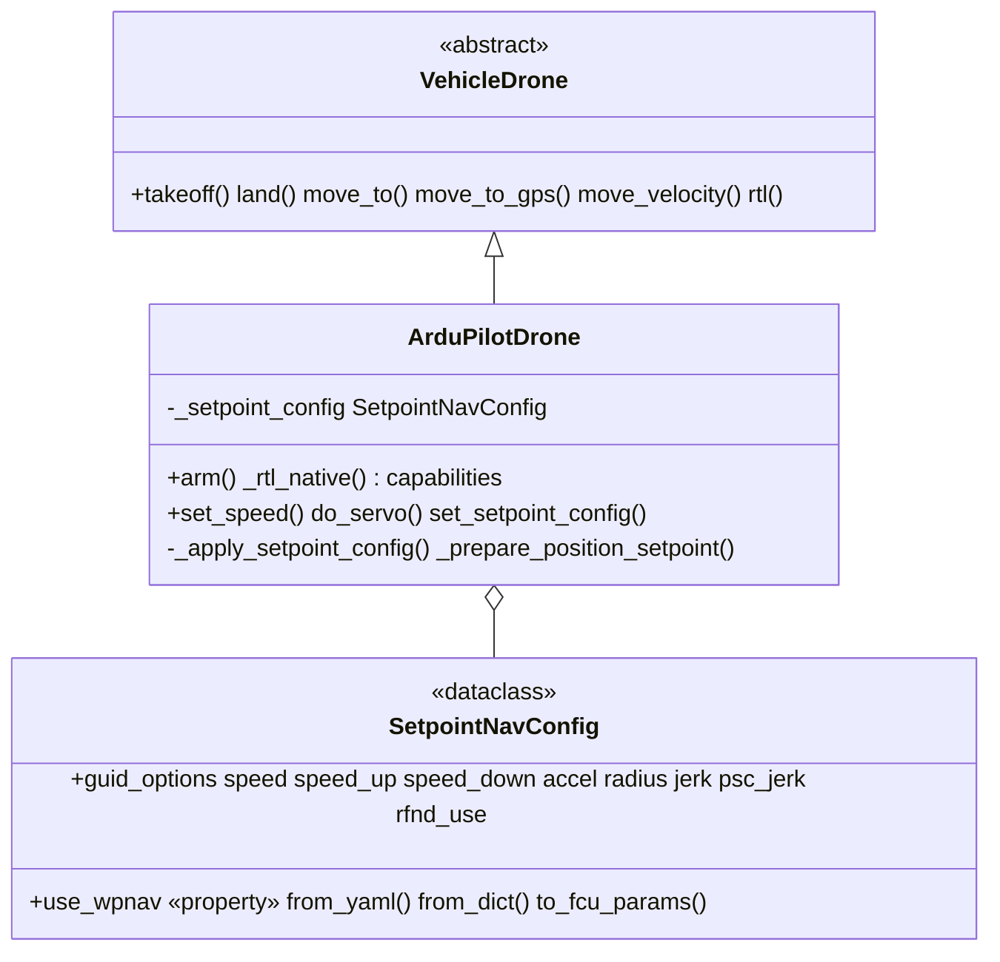

# ArduPilot Vehicle Core

ArduPilot firmware specialization of the shared [vehicle core](../vehicle/README.md). `ArduPilotDrone` ([`drone.py`](drone.py)) adds ArduPilot's flight semantics — GUIDED-mode arming, the `GUID_OPTIONS`/`WPNAV` setpoint configuration, and native `RTL`-mode return-to-launch — on top of [`VehicleDrone`](../vehicle/drone.py); the transport-agnostic navigation, takeoff/land detection, GPS math, and PID control are inherited from the core. `MavrosDrone` and `MavlinkDrone` are the **same vehicle reached over two different transports** ([mavros](../mavros/README.md), [mavlink](../mavlink/README.md)).

> This page documents only ArduPilot specifics. The shared navigation methods, reference frames, altitude sources, takeoff/land detection, GPS/EGM96 handling, and PID configuration — which apply to every vehicle — are in the [vehicle core README](../vehicle/README.md). PX4 specifics are in [PX4](../px4/README.md).

## Architecture



The full core class diagram (`VehicleDrone`, `VehicleNavigator`, `VehicleTransport`, transports) is in the [vehicle core README](../vehicle/README.md#design).

## Modules

| File | Responsibility |
| --- | --- |
| `drone.py` | `ArduPilotDrone(VehicleDrone)` — ArduPilot flight semantics: GUIDED arming, WPNAV/GUID_OPTIONS, native RTL, `set_speed`/`do_servo`. |
| `setpoint_config.py` | `SetpointNavConfig` — `GUID_OPTIONS`/`WPNAV` parameter handling (with 4.6/4.8 aliases). |
| `config/` | Bundled PID + setpoint YAML presets (`position_*.yaml`, `setpoint_*.yaml`, including the `*_sim_*` SITL presets). |

## Capabilities

`ArduPilotDrone.capabilities` is derived declaratively from the configured `pose_source` (see [`capabilities.py`](../capabilities.py)): outdoor adds `GPS_NAV`/`GLOBAL_SETPOINT`, indoor adds `VISION_POSE`. On top of the shared set it declares `SERVO` (ArduPilot's per-channel PWM `do_servo` path, which PX4 does not expose) plus `ACTUATOR` (`DO_SET_ACTUATOR`) and `GRIPPER` (`DO_GRIPPER`) for payloads (both shared with PX4). Capability-gated operations call `_require(...)`, so `do_servo` / `set_actuator` / `set_gripper` raise `CapabilityNotSupportedError` on a drone that does not declare them; query with `drone.supports(Capability.SERVO)`.

## MAVLink and the FCU

[MAVLink](https://ardupilot.org/dev/docs/mavlink-basics.html) is the binary protocol between the flight controller (FCU), ground stations, and companion computers. The SDK sends velocity/position commands and reads sensor data over it — through MAVROS in one transport, through pymavlink directly in the other. The drone must be in [GUIDED mode](https://ardupilot.org/dev/docs/copter-commands-in-guided-mode.html) for offboard control.

## Flight Modes

ArduPilot [flight modes](https://ardupilot.org/copter/docs/flight-modes.html) determine how the FCU interprets inputs. Modes used by this SDK:

| Mode | Description |
|------|-------------|
| GUIDED | Offboard control. Accepts position/velocity commands from the companion computer. Required for SDK navigation. |
| STABILIZE | Manual stabilized flight. Pilot controls via RC. |
| LOITER | GPS-based position hold. |
| RTL | Return to launch — fly back to home and land. |
| LAND | Auto-land at current position. |

Set via `drone.set_mode()`. See [MAVLink flight mode protocol](https://ardupilot.org/dev/docs/mavlink-get-set-flightmode.html).

## Arming (GUIDED)

`ArduPilotDrone.arm()` sets `GUIDED` mode, waits for the mode to reflect in state, optionally pushes the setpoint parameters (when `apply_setpoint_params=True`), commands arm, and polls `is_armed` to confirm. GUIDED is the offboard control mode and persists across navigation, so — unlike PX4 OFFBOARD — no continuous setpoint stream is required to stay in it.

## EKF (Extended Kalman Filter)

The [EKF](https://ardupilot.org/copter/docs/common-apm-navigation-extended-kalman-filter-overview.html) is ArduPilot's state estimator. It fuses IMU, GPS, barometer, and optionally vision/rangefinder data into a position/velocity/attitude estimate. All altitude and position values in this SDK ultimately come from the EKF output, exposed by the transport as `local_pose`, `gps`, `rel_alt`, etc.

### EKF Origin (Indoor Requirement)

The EKF local frame needs an origin — the (0,0,0) reference point. Outdoors, GPS sets this automatically. **Indoors, set it manually before flight** via Mission Planner ("Set EKF Origin Here") or the [`SET_GPS_GLOBAL_ORIGIN`](https://mavlink.io/en/messages/common.html#SET_GPS_GLOBAL_ORIGIN) message. The actual lat/lon don't matter — the EKF just needs a defined origin to fuse vision data. Without it, the local pose is not published and `FRAME_LOCAL_NED` commands won't work.

### Vision Systems (Indoor Position Source)

An external vision system feeds pose data to ArduPilot's EKF as [`VISION_POSITION_ESTIMATE`](https://mavlink.io/en/messages/common.html#VISION_POSITION_ESTIMATE). The EKF fuses it with IMU and outputs the local pose. The two transports inject this differently — see each transport README — but the vehicle behavior is identical.

Key ArduPilot parameters: `EK3_SRC1_POSXY=6`, `EK3_SRC1_POSZ=6`, `EK3_SRC1_YAW=6` (ExternalNav), `VISO_TYPE=1`. See [ArduPilot VIO setup](https://ardupilot.org/copter/docs/common-vio-tracking-camera.html), [ROS VIO guide](https://ardupilot.org/dev/docs/ros-vio-tracking-camera.html), and [Non-GPS Position Estimation](https://ardupilot.org/dev/docs/mavlink-nongps-position-estimation.html).

## ArduPilot GUIDED Mode Position Controllers

When the SDK publishes a local position setpoint (`NavigationMethod.POSITION` / `POSITION_GLOBAL`, documented in the [vehicle core README](../vehicle/README.md#setpoint-position-navigation)), ArduPilot's GUIDED mode routes it to one of two controllers, selected by the [`GUID_OPTIONS`](https://ardupilot.org/copter/docs/ac2_guidedmode.html#guided-mode-options) parameter:

| Controller | GUID_OPTIONS | SubMode | Trajectory | Speed Control |
|---|---|---|---|---|
| **AC_PosControl** (default) | bit 6 = 0 | `SubMode::Pos` | Direct PID to target | Speed limits from WPNAV at init |
| **AC_WPNav** | bit 6 = 1 (value 64) | `SubMode::WP` | S-curve path planning | Full WPNAV parameter set |

Source: [`mode_guided.cpp :: set_pos_NED_m()`](https://github.com/ArduPilot/ardupilot/blob/master/ArduCopter/mode_guided.cpp) — `use_wpnav_for_position_control()` selects the sub-mode from `GUID_OPTIONS` bit 6.

- **AC_PosControl (SubMode::Pos)** — direct PID toward the target, no trajectory shaping. Speed limits read once at mode init. No internal arrival radius (the SDK's arrival check handles it). Suitable for continuous position streaming; can produce abrupt motion at high speed/long distance.
- **AC_WPNav (SubMode::WP)** — straight-line path with an S-curve speed profile; respects all `WPNAV_*` parameters dynamically (including `WPNAV_RADIUS` for deceleration and arrival), supports object-avoidance path planning. Each new target triggers a full replan — best for point-to-point missions, not rapid retargeting.

### WPNAV Parameters

ArduPilot v4.6.3 [`WPNAV_*` parameters](https://ardupilot.org/copter/docs/parameters-Copter-stable-V4.6.3.html#wpnav-parameters) control navigation speed, acceleration, and precision:

| Parameter | Description | ArduPilot Default | Unit |
|---|---|---|---|
| `WPNAV_SPEED` | Horizontal speed | 1000 (10 m/s) | cm/s |
| `WPNAV_SPEED_UP` | Climb speed | 250 (2.5 m/s) | cm/s |
| `WPNAV_SPEED_DN` | Descent speed | 150 (1.5 m/s) | cm/s |
| `WPNAV_ACCEL` | Horizontal acceleration | 250 (2.5 m/s²) | cm/s/s |
| `WPNAV_RADIUS` | Waypoint arrival radius | 200 (2.0 m) | cm |
| `WPNAV_JERK` | Horizontal jerk | 1.0 | m/s/s/s |
| `WPNAV_RFND_USE` | Rangefinder terrain following | 1 (enabled) | bool |

> In ArduPilot dev (v4.8+) these are renamed to `WP_*`. `SetpointNavConfig` uses descriptive field names and carries a `PARAM_ALIASES` map (`WPNAV_SPEED` → `WP_SPD`, etc.), so version changes only require the alias table.

The SDK also sets `PSC_JERK_XY` (4.6.3) / `PSC_JERK_NE` (4.8+) — position controller horizontal jerk, default 5.0 m/s³ — via `SetpointNavConfig.psc_jerk`. This controls AC_PosControl response speed in SubMode::Pos; SITL typically needs higher values (e.g. 50) for usable response.

**Runtime effect of `set_param` per sub-mode**: in SubMode::WP, all `WPNAV_*` are re-read on each new target (`wp_nav->set_wp_destination()`). In SubMode::Pos, speed/accel limits are set once at submode entry — use `set_speed()` for dynamic changes. The SDK's `_prepare_position_setpoint()` uses WPNav's re-read to update `WPNAV_RADIUS` from the `precision` argument on each `POSITION`/`POSITION_GLOBAL` call when WPNav is enabled and `apply_setpoint_params=True`.

### Speed Control at Runtime

`set_speed(speed, speed_type)` sends [`MAV_CMD_DO_CHANGE_SPEED`](https://ardupilot.org/copter/docs/common-mavlink-mission-command-messages-mav_cmd.html#mav-cmd-do-change-speed) (178), which immediately updates AC_PosControl's active speed limits in **both** sub-modes:

```python
drone.set_speed(0.5, "horizontal")   # 0.5 m/s horizontal
drone.set_speed(0.3, "climb")        # 0.3 m/s climb
drone.set_speed(0.3, "descent")      # 0.3 m/s descent
drone.set_speed(-2, "horizontal")    # revert to WPNAV_SPEED default
```

By contrast, `set_param("WPNAV_SPEED", value)` only takes effect on the next target (WP) or the next mode init (Pos).

## RTL

`rtl()` defaults to `RTLMethod.NAVIGATE` (the shared SDK PID path to home — see [Vehicle core](../vehicle/README.md#rtl)). `RTLMethod.NATIVE` uses ArduPilot's own `RTL` flight mode:

```python
drone.rtl(method=RTLMethod.NATIVE)   # ArduPilot RTL mode, auto-land
```

- **NATIVE**: sets `RTL_ALT` (return altitude, or 0 to keep the current altitude rather than ArduPilot's 15 m default) and `RTL_ALT_FINAL` (0 to auto-land, or the return altitude to hold above home), then sets mode `RTL`. Parameter names differ by version: `RTL_ALT` / `RTL_ALT_FINAL` (v4.6.3, cm) vs `RTL_ALT_M` / `RTL_ALT_FINAL_M` (v4.8+, m); the SDK tries the v4.6.3 name first and falls back automatically. See [RTL Mode](https://ardupilot.org/copter/docs/rtl-mode.html).

## Parameter Handling

`drone.set_param(name, value)` forwards to the transport. Integers are sent as int, floats as double. ArduPilot persists `PARAM_SET` to storage, so values survive reboots.

```python
drone.set_param("RTL_ALT", 1500)        # int, cm
drone.set_param("WPNAV_SPEED", 200.0)   # float, cm/s
drone.set_param("GUID_OPTIONS", 65)     # int, bits 0 + 6
```

Version-dependent parameters (WPNAV/PSC, RTL) are written with the v4.6.3 name first and fall back to the v4.8+ alias on failure, using `SetpointNavConfig.PARAM_ALIASES`. How a `set_param` is confirmed depends on the transport (service result vs `PARAM_VALUE` echo) — see the transport READMEs. See [Get/Set Parameters](https://ardupilot.org/dev/docs/mavlink-get-set-params.html).

## Setpoint Navigation Configuration

`SetpointNavConfig` controls GUIDED-mode behavior for `NavigationMethod.POSITION` / `POSITION_GLOBAL`: the position-controller sub-mode (AC_PosControl vs AC_WPNav) and the WPNAV/PSC parameters.

**Lifecycle**:

1. **On init**: `_load_setpoint_config()` loads from `setpoint_config_file`, else the bundled `setpoint_indoor.yaml` / `setpoint_outdoor.yaml` by `is_indoor`. Always loaded for SDK-side logic (e.g. `use_wpnav` checks).
2. **On arm** (only if `apply_setpoint_params=True`): `_apply_setpoint_config()` pushes `GUID_OPTIONS` and the `WPNAV_*` / `PSC_JERK_*` parameters to the FCU via `set_param()`, logging each result.
3. **On `move_to` / `move_to_gps` with a POSITION method** (only if `apply_setpoint_params=True` and `use_wpnav`): `_prepare_position_setpoint()` syncs `WPNAV_RADIUS` with `precision`.

> **FCU persistence**: `set_param` writes to the autopilot's storage and survives reboots. `apply_setpoint_params` defaults to `False`, so by default the SDK does not touch FCU parameters. Set it `True` to let the SDK own them (e.g. SITL). `drone.set_setpoint_config(config)` pushes on demand regardless of the flag (pass `apply=False` to update the SDK-side config only).

**Dataclass defaults** (SI units; speed/accel/radius are converted to cm/s, cm by `to_fcu_params()`):

| Field | Default | ArduPilot Factory Default |
|---|---|---|
| `guid_options` | `1` (bit 0) | `0` |
| `speed` | 2.0 m/s | 10.0 m/s |
| `speed_up` | 1.5 m/s | 2.5 m/s |
| `speed_down` | 1.5 m/s | 1.5 m/s |
| `accel` | 1.0 m/s² | 2.5 m/s² |
| `radius` | 0.2 m | 2.0 m |
| `jerk` | 1.0 m/s³ | 1.0 m/s³ |
| `psc_jerk` | 5.0 m/s³ | 5.0 m/s³ |
| `rfnd_use` | 1 | 1 |

`guid_options` is the [`GUID_OPTIONS`](https://ardupilot.org/copter/docs/ac2_guidedmode.html#guided-mode-options) bitmask; `use_wpnav` is `True` when bit 6 is set. Common values: `1` (arm from TX), `64` (WPNav only), `65` (arm from TX + WPNav). The SDK speed defaults are intentionally conservative versus ArduPilot's factory values to avoid aggressive motion.

**Push to the FCU**:

```python
drone.set_setpoint_config({"guid_options": 65, "speed": 0.5, "radius": 0.1})
```

**Update the SDK-side config only** (`apply=False`):

```python
drone.set_setpoint_config({"speed": 0.5}, apply=False)
```

## PID Configuration

ArduPilot loads its `PositionPIDConfig` from the [bundled presets](config) (`position_indoor.yaml` / `position_outdoor.yaml`, plus the `position_sim_*.yaml` SITL presets) — the loading lifecycle and runtime overrides are shared and documented in the [vehicle core README](../vehicle/README.md#pid-configuration). Controller internals (gains, output clamps, integral handling) are in the [PID module](../pid/README.md).

## Transports

- [MAVROS transport](../mavros/README.md) — `MavrosTransport`: subscriptions → telemetry, service clients → commands, publishers → setpoints. Requires a running `mavros_node`.
- [Direct MAVLink transport](../mavlink/README.md) — `PymavlinkTransport`: owns the FCU link, RX timer decode, direct `mav.*_send`, built-in vision bridge.

## References

### MAVLink & ArduPilot

- [MAVLink Basics](https://ardupilot.org/dev/docs/mavlink-basics.html) · [MAVLink common messages](https://mavlink.io/en/messages/common.html) · [MAV_FRAME](https://mavlink.io/en/messages/common.html#MAV_FRAME)
- [ArduPilot Copter Documentation](https://ardupilot.org/copter/) · [Flight Modes](https://ardupilot.org/copter/docs/flight-modes.html) · [GUIDED Mode](https://ardupilot.org/copter/docs/ac2_guidedmode.html)
- [GUIDED Mode Commands](https://ardupilot.org/dev/docs/copter-commands-in-guided-mode.html) · [PosControl and Navigation Overview](https://ardupilot.org/dev/docs/code-overview-copter-poscontrol-and-navigation.html)
- [WPNAV Parameters (v4.6.3)](https://ardupilot.org/copter/docs/parameters-Copter-stable-V4.6.3.html#wpnav-parameters) · [MAV_CMD_DO_CHANGE_SPEED](https://ardupilot.org/copter/docs/common-mavlink-mission-command-messages-mav_cmd.html#mav-cmd-do-change-speed)
- [Understanding Altitude](https://ardupilot.org/copter/docs/common-understanding-altitude.html) · [EKF Overview](https://ardupilot.org/copter/docs/common-apm-navigation-extended-kalman-filter-overview.html) · [RTL Mode](https://ardupilot.org/copter/docs/rtl-mode.html)
- [Get/Set Parameters](https://ardupilot.org/dev/docs/mavlink-get-set-params.html) · [Set/Get flight mode](https://ardupilot.org/dev/docs/mavlink-get-set-flightmode.html)

### ArduPilot Source

- [`mode_guided.cpp`](https://github.com/ArduPilot/ardupilot/blob/master/ArduCopter/mode_guided.cpp) — GUIDED sub-modes, `pva_control_start()`, `set_pos_NED_m()`
- [`AC_WPNav.cpp`](https://github.com/ArduPilot/ardupilot/blob/Copter-4.6.3/libraries/AC_WPNav/AC_WPNav.cpp) · [`AC_PosControl.h`](https://github.com/ArduPilot/ardupilot/blob/master/libraries/AC_AttitudeControl/AC_PosControl.h) · [`GCS_MAVLink_Copter.cpp`](https://github.com/ArduPilot/ardupilot/blob/master/ArduCopter/GCS_MAVLink_Copter.cpp)

### Vision & Indoor Navigation

- [VIO Tracking Camera](https://ardupilot.org/copter/docs/common-vio-tracking-camera.html) · [ROS VIO Setup](https://ardupilot.org/dev/docs/ros-vio-tracking-camera.html) · [Non-GPS Position Estimation](https://ardupilot.org/dev/docs/mavlink-nongps-position-estimation.html)
- Shared navigation, frames, altitude, GPS/EGM96: [vehicle core README](../vehicle/README.md)
