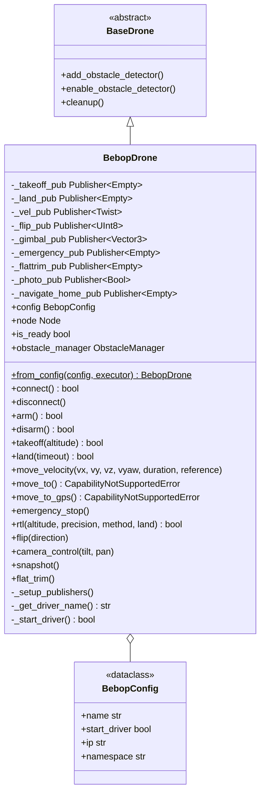

# Bebop Control Module

Parrot Bebop 2 control via the [`ros2_bebop_driver`](https://github.com/jeremyfix/ros2_bebop_driver) ROS 2 package, for velocity-based flight.

## Capabilities

`BebopDrone.capabilities` declares `VELOCITY_BODY` (body-frame `move_velocity` via `cmd_vel`) and `NATIVE_RTL` (`navigate_home`). It does **not** support position control, GPS, vision pose, parameters, or companion-side navigation. Query with `drone.supports(Capability.VELOCITY_BODY)`.

Behavior specific to the Bebop hardware:

- **Velocity is body-frame only**, normalized to `[-1, 1]`; `WORLD`/`TAKEOFF` references are not supported.
- **Takeoff altitude is fixed** — the `altitude` argument to `takeoff()` is ignored (the Bebop climbs to its own preset height; adjust afterward with `move_velocity(vz=...)`).
- `move_to()` / `move_to_gps()` raise `CapabilityNotSupportedError` (no onboard positioning — no GPS, no companion PID).
- `connect()` only verifies the `bebop_driver` process is running; there is no flight-controller handshake.
- `rtl()` publishes the autoflight `navigate_home` command; with `land=True` it waits a fixed delay for the maneuver (it does **not** call `land()`).

## Architecture



## Configuration

```python
from nectar.control import DroneFactory, BebopConfig

config = BebopConfig(
    name="bebop_drone",
    start_driver=True,        # auto-start the ROS 2 driver on init
    ip="192.168.42.1",        # Bebop WiFi IP
    namespace="bebop",        # ROS 2 topic namespace prefix
)
drone = DroneFactory.create("bebop", config)
```

The Bebop creates its own WiFi network — connect to `Bebop2-XXXXXX` (default IP `192.168.42.1`) before launching the driver.

## Control API

### Velocity Control

```python
drone.move_velocity(
    vx=0.0,    # forward (+) / backward (-), normalized [-1, 1]
    vy=0.0,    # left (+) / right (-), normalized [-1, 1]
    vz=0.0,    # up (+) / down (-), normalized [-1, 1]
    vyaw=0.0,  # CCW (+) / CW (-), normalized [-1, 1]
    duration=None,                 # None = single publish; float = republish at 30 Hz for the duration
    reference=MoveReference.BODY,  # BODY only
)
```

All inputs are clamped to `[-1, 1]`.

### Flight Operations

```python
drone.takeoff(altitude=1.5)   # altitude ignored (fixed height)
drone.land(timeout=30.0)
drone.rtl(land=True)          # autoflight navigate_home
drone.emergency_stop()        # reset command (hard stop)
```

### Bebop-Specific Features

```python
drone.flip(0)                                # 0=Front, 1=Back, 2=Right, 3=Left
drone.camera_control(tilt=-45.0, pan=15.0)   # degrees; tilt +down/-up, pan +left/-right
drone.snapshot()                             # capture a photo
drone.flat_trim()                            # IMU calibration (on a flat, level surface)
```

## ROS 2 Topics

All topics use the configured namespace prefix (default `/bebop`):

| Topic | Type | Purpose |
|-------|------|---------|
| `/{ns}/takeoff` | Empty | Trigger takeoff |
| `/{ns}/land` | Empty | Trigger landing |
| `/{ns}/cmd_vel` | Twist | Velocity commands (`linear.x/y/z`, `angular.z`, each `[-1, 1]`) |
| `/{ns}/flip` | UInt8 | Execute flip maneuver |
| `/{ns}/move_camera` | Vector3 | Gimbal control (x=tilt, y=pan) |
| `/{ns}/reset` | Empty | Emergency stop / reset |
| `/{ns}/flattrim` | Empty | IMU calibration |
| `/{ns}/photo` | Bool | Capture photo |
| `/{ns}/autoflight/navigate_home` | Empty | RTL command |

## Installation

**Automated (Nectar)**:

```bash
make drone-bebop            # or: ./scripts/setup.sh drone bebop
```

Installs the apt dependencies, clones `ros2_parrot_arsdk` and `ros2_bebop_driver` into the workspace if missing, and builds them in order (applying the FFmpeg patch below). The manual steps are equivalent:

```bash
sudo apt install ros-${ROS_DISTRO}-camera-info-manager libavdevice-dev libavahi-client-dev python-is-python3
cd ~/ros2_ws/src
git clone https://github.com/jeremyfix/ros2_parrot_arsdk.git
git clone https://github.com/jeremyfix/ros2_bebop_driver.git
cd ~/ros2_ws
colcon build --packages-select ros2_parrot_arsdk
colcon build --packages-select ros2_bebop_driver --symlink-install
```

- `python-is-python3` is required because the ARSDK Alchemy build invokes `python`, which is absent by default on Ubuntu 24.04.
- On Ubuntu 24.04 (FFmpeg 5/6), `avcodec_find_decoder()` returns `const AVCodec*`, so `AVCodec *p_codec_` must become `const AVCodec *p_codec_` in `include/ros2_bebop_driver/video_decoder.hpp`. `make drone-bebop` applies this patch automatically.

Manual launch (when `start_driver=False`):

```bash
ros2 launch ros2_bebop_driver bebop_node_launch.xml ip:=192.168.42.1
```

## Usage Example

```python
import nectar
from nectar.control import DroneFactory, BebopConfig

nectar.init()
drone = DroneFactory.create("bebop", BebopConfig(ip="192.168.42.1"))
drone.connect()                              # verifies the bebop_driver process

drone.takeoff(altitude=1.5)                  # fixed height
drone.move_velocity(vx=0.3, duration=2.0)    # forward 2s
drone.move_velocity(vyaw=0.5, duration=1.0)  # rotate CCW 1s
drone.flip(0)                                # front flip
drone.rtl(land=True)                         # navigate home
```

## References

- [ros2_bebop_driver](https://github.com/jeremyfix/ros2_bebop_driver) · [ros2_parrot_arsdk](https://github.com/jeremyfix/ros2_parrot_arsdk)
- [Parrot Bebop 2 Specifications](https://www.parrot.com/en/support/documentation/bebop-range) · [Bebop Commands and Events](https://developer.parrot.com/docs/bebop/index.html?c#commands-and-events) · [ARSDK Documentation](https://developer.parrot.com/docs/SDK3/)
