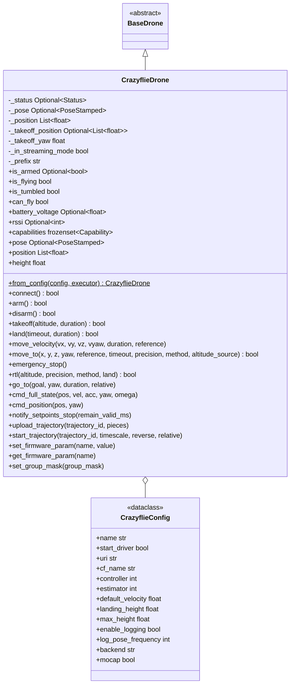

# Crazyflie Control Module

[Bitcraze Crazyflie 2.x](https://www.bitcraze.io/products/crazyflie-2-1/) drone control via [Crazyswarm2](https://imrclab.github.io/crazyswarm2/) for ROS 2.

## Capabilities

`CrazyflieDrone.capabilities` declares `LOCAL_SETPOINT` (`move_to` POSITION via the onboard `goTo` planner), `VELOCITY_BODY`/`VELOCITY_WORLD`/`VELOCITY_TAKEOFF` (streaming `move_velocity`), and `PARAMS` (firmware parameter access). It does not support GPS navigation, companion-side PID, vision pose, rangefinder telemetry, servo control, or native RTL. Query with `drone.supports(Capability.LOCAL_SETPOINT)`.

## Key Concepts

### Crazyswarm2

[Crazyswarm2](https://github.com/IMRCLab/crazyswarm2) is a ROS 2 stack for controlling Crazyflie drones. It provides a `crazyflie_server` node that handles radio communication via [Crazyradio PA/2](https://www.bitcraze.io/products/crazyradio-pa/), firmware parameter syncing, log variable streaming, and exposes flight commands as ROS 2 services and topics.

This SDK uses Crazyswarm2 as the communication bridge -- the same pattern used by MAVROS for ArduPilot/PX4 and `ros2_bebop_driver` for Parrot Bebop. The `CrazyflieDrone` class communicates exclusively via ROS 2, never directly with the Crazyflie radio.

### High-Level vs Low-Level Commands

The Crazyflie firmware has two command modes:

| Mode | Commands | Description |
|------|----------|-------------|
| **High-level** | `takeoff`, `land`, `goTo`, `startTrajectory` | Onboard polynomial planner. Set target and duration, firmware plans smooth trajectory. |
| **Low-level (streaming)** | `cmdFullState`, `cmdPosition` | Direct setpoints at high frequency (~50Hz). Firmware tracks the setpoint. |

Switching from streaming to high-level requires calling `notify_setpoints_stop()`. The SDK handles this automatically in `move_to()`, `land()`, and `go_to()` when preceded by streaming commands.

### Flow Deck v2

The [Flow Deck v2](https://www.bitcraze.io/products/flow-deck-v2/) provides relative position estimation using:
- **Optical flow sensor**: Tracks movement over the ground surface
- **ToF rangefinder**: Measures height above ground (range ~0.2m to ~4m)

The onboard [Kalman estimator](https://www.bitcraze.io/documentation/repository/crazyflie-firmware/master/functional-areas/sensor-to-control/state_estimators/) (EKF) fuses these sensors with the IMU to produce position estimates.

**Constraints**:
- Position drifts over time (no absolute reference)
- Requires textured floor surface for optical flow
- Maximum practical flight height ~3m (ToF range limit)
- Wall proximity can confuse ToF readings (cone-shaped detection)

### Onboard Controller

The Crazyflie supports two onboard controllers:
- **PID** (`controller=1`): Standard cascaded PID controller
- **Mellinger** (`controller=2`): Geometric tracking controller for aggressive maneuvers

The controller selection is a firmware parameter set at startup via `CrazyflieConfig.controller`.

## Architecture



## CrazyflieDrone

### Initialization

```python
from nectar.control import DroneFactory, CrazyflieConfig

config = CrazyflieConfig(
    cf_name="cf231",                   # Robot name in crazyflies.yaml
    uri="radio://0/80/2M/E7E7E7E7E7",  # Crazyradio URI
    controller=2,                       # 1=PID, 2=Mellinger
    estimator=2,                        # 2=Kalman (required for Flow Deck)
    default_velocity=0.3,               # m/s for goTo duration estimation
    max_height=3.0,                     # Flow Deck v2 ToF limit
)

drone = DroneFactory.create("crazyflie", config)
```

### Properties

```python
drone.is_armed             # Optional[bool]: Motor arm state from supervisor
drone.is_flying            # bool: Whether currently in flight
drone.is_tumbled           # bool: Crash detection
drone.can_fly              # bool: Ready for flight commands
drone.battery_voltage      # Optional[float]: Battery voltage (V)
drone.rssi                 # Optional[int]: Radio signal strength (dBm)
drone.pose                 # Optional[PoseStamped]: Full estimated pose
drone.position             # List[float]: Current [x, y, z] in meters
drone.height               # float: Current height above ground (m)
```

### Flight Operations

```python
drone.connect()                        # Wait for status, verify connection
drone.takeoff(altitude=0.5)            # Takeoff to 0.5m (duration auto-estimated)
drone.takeoff(altitude=0.5, duration=2.0)  # Explicit duration

drone.move_to(x=0.5, y=0.0, z=0.0)    # 0.5m forward (BODY); POSITION method (default, only option)
drone.move_to(x=1.0, reference=MoveReference.TAKEOFF)  # 1m forward of takeoff

drone.move_velocity(vx=0.2, duration=2.0)  # Streaming velocity for 2 seconds

drone.land()                            # Land from current height
drone.emergency_stop()                  # Hard kill (requires reboot)
drone.rtl()                             # Return to takeoff (NAVIGATE method, default) and land
```

### Crazyflie-Specific Features

#### Direct GoTo Command

```python
drone.go_to(goal=[1.0, 0.0, 0.5], yaw=0.0, duration=3.0, relative=False)
```

#### Polynomial Trajectories

```python
drone.upload_trajectory(0, trajectory_pieces)
drone.start_trajectory(0, timescale=1.0, relative=True)
```

#### Full-State Streaming

```python
drone.cmd_full_state(
    pos=[0.0, 0.0, 0.5],
    vel=[0.1, 0.0, 0.0],
    acc=[0.0, 0.0, 0.0],
    yaw=0.0,
    omega=[0.0, 0.0, 0.0],
)
# After streaming, before high-level commands:
drone.notify_setpoints_stop()
```

#### Firmware Parameters

```python
drone.set_firmware_param("stabilizer.controller", 2)   # Switch to Mellinger
drone.set_firmware_param("ring.effect", 7)              # Solid LED color
drone.get_firmware_param("stabilizer.controller")       # Read current value
```

#### Swarm Group Mask

```python
drone.set_group_mask(1)  # Assign to group 1 for broadcast commands
```

## Movement API

### Reference Frames

| MoveReference | goTo mapping | Description |
|---------------|-------------|-------------|
| **BODY** | Offset rotated by current yaw, sent as absolute | Relative to current position and heading |
| **WORLD** | Absolute coordinates | Direct world-frame target |
| **TAKEOFF** | Offset rotated by takeoff yaw, sent as absolute | Relative to takeoff position and heading |

**Important**: Crazyswarm2's `goTo(relative=True)` is world-aligned (not heading-relative). The SDK rotates BODY offsets by the current yaw to produce correct heading-relative behavior.

### Duration Estimation

The Crazyflie `goTo` service requires an explicit `duration` parameter. For `move_to` the SDK estimates it from both the travel distance and the yaw change:

```
yaw_duration = yaw_diff / radians(60)              # ~60 deg/s
duration = max(distance / default_velocity, yaw_duration, 1.0)
```

Where `default_velocity` comes from `CrazyflieConfig` (default 0.3 m/s). Takeoff/land use their own fixed floor (2.0 s). For precise timing control, use the `go_to()` method directly.

### Velocity Control

`move_velocity()` uses `cmd_full_state` streaming setpoints. This switches the Crazyflie to low-level mode. The SDK automatically calls `notify_setpoints_stop()` when transitioning back to high-level commands.

### Navigation methods (`move_to` / `rtl`)

`move_to` accepts `method: NavigationMethod` (default `NavigationMethod.POSITION`). **CrazyflieDrone only supports `NavigationMethod.POSITION`** (onboard high-level `goTo`). `NavigationMethod.PID`, `NavigationMethod.PID_EKF`, and `NavigationMethod.POSITION_GLOBAL` raise `CapabilityNotSupportedError`.

`rtl` accepts `method: RTLMethod` (default `RTLMethod.NAVIGATE`). **CrazyflieDrone only supports `RTLMethod.NAVIGATE`** (same goTo-based path as `move_to` to the takeoff pose). `RTLMethod.NATIVE` raises `CapabilityNotSupportedError`.

### Capability Matrix

| Method | Supported | Notes |
|--------|-----------|-------|
| `takeoff` | Yes | Onboard high-level commander |
| `land` | Yes | Onboard high-level commander |
| `move_to` | Yes | `NavigationMethod.POSITION` only (goTo); other methods raise `CapabilityNotSupportedError`; all `MoveReference` frames supported |
| `move_velocity` | Yes | Via cmd_full_state streaming |
| `move_to_gps` | No | No GPS on Crazyflie 2.x |
| `rtl` | Yes | `RTLMethod.NAVIGATE` only (goTo to takeoff position); `RTLMethod.NATIVE` raises `CapabilityNotSupportedError` |
| `emergency_stop` | Yes | Hard kill, requires reboot |
| `set_home` | No | No GPS |

## ROS 2 Interface

### Services (per-robot: `/<cf_name>/...`)

| Service | Type | Purpose |
|---------|------|---------|
| `/<cf>/emergency` | `std_srvs/Empty` | Kill motors, lock firmware |
| `/<cf>/takeoff` | `crazyflie_interfaces/Takeoff` | Fly to height over duration |
| `/<cf>/land` | `crazyflie_interfaces/Land` | Descend to height over duration |
| `/<cf>/go_to` | `crazyflie_interfaces/GoTo` | Smooth polynomial navigation |
| `/<cf>/upload_trajectory` | `crazyflie_interfaces/UploadTrajectory` | Upload piecewise polynomial |
| `/<cf>/start_trajectory` | `crazyflie_interfaces/StartTrajectory` | Execute uploaded trajectory |
| `/<cf>/notify_setpoints_stop` | `crazyflie_interfaces/NotifySetpointsStop` | End streaming mode |
| `/<cf>/arm` | `crazyflie_interfaces/Arm` | Arm/disarm (Bolt/brushless) |

### Topics

| Topic | Type | Direction | Purpose |
|-------|------|-----------|---------|
| `/<cf>/cmd_full_state` | `crazyflie_interfaces/FullState` | Pub | Streaming full-state setpoint |
| `/<cf>/cmd_position` | `crazyflie_interfaces/Position` | Pub | Streaming position setpoint |
| `/<cf>/pose` | `geometry_msgs/PoseStamped` | Sub | Estimated pose from state estimator |
| `/<cf>/status` | `crazyflie_interfaces/Status` | Sub | Battery, RSSI, supervisor state |

### Parameters (via crazyflie_server)

Firmware parameters are exposed as ROS 2 parameters on `/crazyflie_server` under `<cf_name>.params.<group>.<name>`. Examples:
- `cf231.params.stabilizer.controller` (1=PID, 2=Mellinger)
- `cf231.params.stabilizer.estimator` (1=complementary, 2=kalman)
- `cf231.params.commander.enHighLevel` (1=enable high-level commander)

## Installation

**Automated (Nectar)**:
```bash
make drone-crazyflie        # or: ./scripts/setup.sh drone crazyflie
```
Installs the apt packages below (when available for your ROS distro) plus `rowan`, and configures the Crazyradio USB permissions (step 2). Afterwards only `crazyflies.yaml` (step 3) needs editing for your radio URI. Log out and back in once for the `plugdev` group change to apply.

### 1. Install Crazyswarm2

**Binary (recommended)**:
```bash
sudo apt install ros-${ROS_DISTRO}-crazyflie ros-${ROS_DISTRO}-crazyflie-interfaces
pip3 install rowan
```

**From source**:
```bash
cd ~/ros2_ws/src
git clone https://github.com/IMRCLab/crazyswarm2 --recursive
cd ~/ros2_ws
colcon build --symlink-install --cmake-args -DCMAKE_BUILD_TYPE=Release
```

### 2. Set Up Crazyradio USB Permissions

```bash
sudo groupadd plugdev
sudo usermod -a -G plugdev $USER
cat <<EOF | sudo tee /etc/udev/rules.d/99-bitcraze.rules
SUBSYSTEM=="usb", ATTRS{idVendor}=="1915", ATTRS{idProduct}=="7777", MODE="0664", GROUP="plugdev"
SUBSYSTEM=="usb", ATTRS{idVendor}=="1915", ATTRS{idProduct}=="0101", MODE="0664", GROUP="plugdev"
EOF
sudo udevadm control --reload-rules
sudo udevadm trigger
```

Log out and back in for group changes to take effect.

### 3. Configure crazyflies.yaml

Edit the Crazyswarm2 configuration file (typically at `<crazyswarm2_ws>/src/crazyswarm2/crazyflie/config/crazyflies.yaml`):

```yaml
robots:
    cf231:
        enabled: true
        uri: radio://0/80/2M/E7E7E7E7E7
        initial_position: [0, 0, 0]
        type: cf21

robot_types:
    cf21:
        motion_capture:
            enabled: false
        big_quad: false
        battery:
            voltage_warning: 3.8
            voltage_critical: 3.7

all:
    firmware_logging:
        enabled: true
        default_topics:
            pose:
                frequency: 10
    firmware_params:
        commander:
            enHighLevel: 1
        stabilizer:
            estimator: 2  # Kalman (required for Flow Deck)
            controller: 2  # Mellinger
```

### 4. Verify Connection

```bash
# Terminal 1: Start the Crazyflie server
ros2 launch crazyflie launch.py

# Terminal 2: Check topics
ros2 topic list | grep cf231
ros2 topic echo /cf231/status
```

## Usage Examples

### Basic Flight

```python
import nectar
from nectar.control import DroneFactory, CrazyflieConfig

nectar.init()
drone = DroneFactory.create("crazyflie", CrazyflieConfig())
drone.connect()

drone.takeoff(altitude=0.5)
drone.move_to(x=0.3, y=0.0, z=0.0)
drone.move_to(x=0.0, y=0.3, z=0.0)
drone.rtl()
```

### Velocity Control

```python
drone.takeoff(altitude=0.5)

# Fly forward for 2 seconds
drone.move_velocity(vx=0.2, duration=2.0)

# Fly in a circle-like pattern
for _ in range(20):
    drone.move_velocity(vx=0.2, vyaw=0.5, duration=0.1)

# Transition back to high-level for landing
drone.land()
```

### Simulation

```bash
# Terminal 1: Start simulation backend
ros2 launch crazyflie launch.py backend:=sim

# Terminal 2: Run script with same code
python3 basic.py --drone crazyflie --backend sim
```

## What's distinct about Crazyflie

For the declared capability sets across all drones, see the capability matrix in [`control/README.md`](../README.md#capabilities). Crazyflie-specific traits:

- Position control is **onboard only** (`NavigationMethod.POSITION` via the firmware `goTo` planner) — no companion-side PID, GPS, or vision-pose path.
- Altitude/position estimate comes from the Flow Deck ToF rangefinder fused by the onboard EKF.
- Supports piecewise-polynomial trajectory upload + execution and FullState/Position streaming at ~50 Hz.
- Simulation uses Crazyswarm2 SIL (firmware bindings), not ArduPilot SITL/Gazebo.

## References

- [Crazyswarm2 Documentation](https://imrclab.github.io/crazyswarm2/)
- [Crazyswarm2 GitHub](https://github.com/IMRCLab/crazyswarm2)
- [Crazyflie 2.1 Product Page](https://www.bitcraze.io/products/crazyflie-2-1/)
- [Flow Deck v2](https://www.bitcraze.io/products/flow-deck-v2/)
- [Flow Deck Tutorial](https://www.bitcraze.io/documentation/tutorials/getting-started-with-flow-deck/)
- [Crazyflie Firmware Parameters](https://www.bitcraze.io/documentation/repository/crazyflie-firmware/master/api/params/)
- [Crazyflie Firmware Log Variables](https://www.bitcraze.io/documentation/repository/crazyflie-firmware/master/api/logs/)
- [Crazyswarm2 Paper (v1)](https://doi.org/10.1109/ICRA.2017.7989376)
