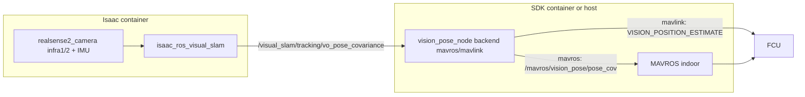

# Localization (control/localization)

## Role

External-navigation integration for GPS-denied (indoor) flight. Feeds a Visual
SLAM pose to the FCU so its EKF (ArduPilot EKF3 / PX4 EKF2) can estimate
position without GPS.

It lives under `control` because it bridges the VSLAM producer to the MAVROS and
MAVLink transports. The pipeline is split into a **producer** (RealSense + Isaac
ROS Visual SLAM, runs in the Isaac container) and a **consumer** (a vision-pose
bridge that forwards the pose to the FCU, runs on the SDK side). They communicate
over host networking with a shared `ROS_DOMAIN_ID`.

## Topology



## Components

| Part | Path | Role |
|------|------|------|
| Producer launch | `nectar/launch/isaac_vslam_realsense.launch.py` | RealSense + Visual SLAM (Isaac container) |
| Consumer launch | `nectar/launch/vision_pose.launch.py` | MAVROS (optional) + vision-pose bridge |
| MAVROS relay | `control/localization/vision_pose_bridge.py` (`MavrosVisionRelay`) | republish pose to `/mavros/vision_pose/pose_cov` |
| MAVLink bridge | reused from `nectar.control.mavlink.VisionPoseBridge` | send `VISION_POSITION_ESTIMATE` |
| DDS bridge | `control/px4/vision_bridge.py` (`Px4VisionOdometryBridge`) | publish `px4_msgs/VehicleOdometry` to `/fmu/in/vehicle_visual_odometry` |
| Node | `control/localization/nodes/vision_pose_node.py` | select backend, wire the bridge |
| VSLAM params | `control/localization/config/vslam_realsense.yaml` | RealSense + Visual SLAM tuning |
| MAVROS config | `control/mavros/config/indoor_mavros.yaml`, `indoor_pluginlists.yaml` | indoor MAVROS profile |

## Run

> **Prerequisite:** both sides must share `ROS_DOMAIN_ID` (default `14`, see `scripts/lib/config.sh`).

1. Producer (Isaac container). One self-contained command clones `isaac_ros_common`
   (`release-3.2`), pulls the prebuilt NVCR base, builds the Nectar layer, and
   drops you into the Isaac container with the workspace mounted:

```bash
make isaac-run          # or: ./docker/isaac_vslam/run_docker.sh
# inside the container, start the producer with the baked helper:
nectar-vslam            # = ros2 launch nectar/launch/isaac_vslam_realsense.launch.py
```

2. Consumer (SDK container or host), pick the transport you fly with:

**MAVROS transport**:

```bash
ros2 launch nectar vision_pose.launch.py backend:=mavros fcu_url:=/dev/ttyTHS1:921600
```

**Direct pymavlink transport** (no MAVROS):

```bash
ros2 launch nectar vision_pose.launch.py backend:=mavlink mavlink_url:=udp:127.0.0.1:14551
```

**Native uXRCE-DDS** (PX4 only; needs a running `MicroXRCEAgent` + `px4_msgs`):

```bash
ros2 launch nectar vision_pose.launch.py backend:=dds
```

## FCU setup

The bridge only delivers the pose — the FCU's estimator still has to be told to
fuse it, and **ArduPilot (EKF3) and PX4 (EKF2) use different parameters and a
different minimum rate**. Both backends send MAVLink
[`VISION_POSITION_ESTIMATE`](https://mavlink.io/en/messages/common.html#VISION_POSITION_ESTIMATE)
(#102); the EKF fuses it once configured. With no GPS, the **EKF origin must be
set** before position control engages.

> Our indoor flights to date are on **ArduPilot 4.6.x / 4.8-dev**. The PX4 set
> below is for our planned move to PX4 on Pixhawk: it is grounded in the PX4
> docs and matches the reference pipeline (the same MAVROS relay) used by the
> [VSLAM-UAV tutorial](https://www.andrewbernas.com/docs/tutorials/robots/vslam/setup)
> on PX4 v1.15.4, but we have not yet flown it on our own hardware.

### ArduPilot (EKF3)

| Parameter | Value | Purpose |
|-----------|-------|---------|
| `VISO_TYPE` | `1` (MAVLink) | Enable the external-nav backend that consumes `VISION_POSITION_ESTIMATE` from a companion (the T265 path uses `2`, see [Hardware notes](#hardware-notes)) |
| `EK3_SRC1_POSXY` | `6` (ExternalNav) | Horizontal position from VSLAM |
| `EK3_SRC1_VELXY` | `6` or `0` | Horizontal velocity (cuVSLAM provides it) or none |
| `EK3_SRC1_POSZ` | `6` (ExternalNav) | Height — see [Height source](#height-source) |
| `EK3_SRC1_VELZ` | `6` or `0` | Vertical velocity or none |
| `EK3_SRC1_YAW` | `6` (ExternalNav) | Yaw from VSLAM (with `COMPASS_USE=0`), or `1` to keep the compass |
| `VISO_POS_X/Y/Z` | camera offset (m) | Camera position in the body frame |
| `GPS1_TYPE` | `0` | Disable GPS indoors (renamed from `GPS_TYPE` in 4.5+) |

Rate ≥ 4 Hz. Tuning: `VISO_POS_M_NSE`, `VISO_YAW_M_NSE`, `VISO_DELAY_MS`,
`VISO_QUAL_MIN`. Set the origin via Mission Planner ("Set EKF Origin"),
the `SET_GPS_GLOBAL_ORIGIN` message, or the `ahrs-set-origin.lua` script.
Refs: [EKF source selection](https://ardupilot.org/copter/docs/common-ekf-sources.html),
[Non-GPS position estimation](https://ardupilot.org/dev/docs/mavlink-nongps-position-estimation.html),
[`VISO_TYPE`](https://github.com/ArduPilot/ardupilot/blob/master/libraries/AP_VisualOdom/AP_VisualOdom.cpp)
and [`EK3_SRC*`](https://github.com/ArduPilot/ardupilot/blob/master/libraries/AP_NavEKF/AP_NavEKF_Source.cpp)
source.

### PX4 (EKF2)

| Parameter | Value | Purpose |
|-----------|-------|---------|
| `EKF2_EV_CTRL` | bitmask — bit0 h-pos, bit1 v-pos, bit2 3D vel, bit3 yaw (`15` = all) | Enable external-vision fusion. Released PX4 (≥1.14) has shipped this at `15`, so fusion auto-starts when data arrives — **verify on your firmware** |
| `EKF2_HGT_REF` | `3` (Vision) | Height reference — see [Height source](#height-source) |
| `EKF2_EV_DELAY` | ~`50` ms | EV delay relative to IMU; tune from logs |
| `EKF2_EV_POS_X/Y/Z` | camera offset (m) | Camera position in the body frame |
| `EKF2_GPS_CTRL` | `0` | Disable GNSS indoors |
| `EKF2_MAG_TYPE` | `None` | Only if using vision yaw |

Rate 30–50 Hz — **PX4 rejects external vision when the rate is too low** (much
stricter than ArduPilot); cuVSLAM at ~90 Hz clears this. Tuning:
`EKF2_EV_NOISE_MD`, `EKF2_EVP_NOISE`, `EKF2_EVA_NOISE`, `EKF2_EV_QMIN`. Auto and
position modes from a purely local estimate need `SET_GPS_GLOBAL_ORIGIN`.
Refs: [External position estimation](https://docs.px4.io/main/en/ros/external_position_estimation.html),
[VIO](https://docs.px4.io/main/en/computer_vision/visual_inertial_odometry.html),
[EKF2 tuning](https://docs.px4.io/main/en/advanced_config/tuning_the_ecl_ekf.html),
[`params_external_vision.yaml`](https://github.com/PX4/PX4-Autopilot/blob/main/src/modules/ekf2/params_external_vision.yaml),
[`EKF2_EV_CTRL` default (#24298)](https://github.com/PX4/PX4-Autopilot/issues/24298).

The `mavros`/`mavlink` backends deliver this estimate as `VISION_POSITION_ESTIMATE`;
the native `dds` backend publishes `px4_msgs/VehicleOdometry` on
`/fmu/in/vehicle_visual_odometry` instead (same EKF2 params, no MAVROS/MAVLink).
See [Backends](#backends).

### Height source

We do not use the **barometer** indoors — it drifts near the ground and in prop
wash. We pick POSZ between two sources and keep the rest of the set (POSXY /
VELXY / YAW) on vision:

- **Vision** (`EK3_SRC1_POSZ=6` / `EKF2_HGT_REF=Vision`): altitude is relative to
  the VSLAM origin, **no terrain following** — the drone holds a constant height
  when crossing platforms or obstacles in the arena. This is our default and has
  been useful for missions with raised platforms.
- **Downward rangefinder** (`EK3_SRC1_POSZ=2` / `EKF2_HGT_REF=Range` +
  `EKF2_RNG_CTRL`): altitude **follows the terrain**. ArduPilot warns this is
  "only appropriate ... where the floor is flat with no ground clutter"
  ([EKF sources](https://ardupilot.org/copter/docs/common-ekf-sources.html)); PX4
  notes "the local NED origin will move up and down with ground level"
  ([EKF2 tuning](https://docs.px4.io/main/en/advanced_config/tuning_the_ecl_ekf.html)).
  Over fixed obstacles the vehicle then climbs to compensate, so we mask the step
  drops upstream with the
  [`ObstacleMaskFilter`](../../sensors/README.md#obstaclemaskfilter) before the
  FCU ever sees them.

## Backends

- `mavros`: `MavrosVisionRelay` republishes the VSLAM `PoseWithCovarianceStamped`
  (ENU) onto `/mavros/vision_pose/pose_cov`; MAVROS converts to NED for the FCU.
- `mavlink`: `nectar.control.mavlink.VisionPoseBridge` converts ENU->NED and
  sends `VISION_POSITION_ESTIMATE` over a dedicated pymavlink link.
- `dds`: `nectar.control.px4.Px4VisionOdometryBridge` converts ENU->NED and
  publishes `px4_msgs/VehicleOdometry` on `/fmu/in/vehicle_visual_odometry`
  (PX4 native uXRCE-DDS). Needs a running `MicroXRCEAgent` and `px4_msgs`; set
  `px4_namespace` to match a namespaced client.

## Visualization

Pre-flight check from the laptop (same `ROS_DOMAIN_ID` as the Jetson): move the
drone by hand and confirm the pose tracks, is low-noise, and that the path snaps
back on return (loop closure). NVIDIA recommends running RViz on a remote PC, not
the Jetson, to avoid loading the VSLAM node
([RealSense tutorial](https://nvidia-isaac-ros.github.io/concepts/visual_slam/cuvslam/tutorial_realsense.html)).

Two profiles (`rviz/vslam_light.rviz`, `rviz/vslam_full.rviz`):

| Profile | Shows | Producer cost |
|---------|-------|---------------|
| `light` (default) | TF + odometry + SLAM path (green) + VO path (purple) | none (tracking topics are always published) |
| `full` | light + landmarks / loop-closure clouds + pose graph | requires `enable_visualization:=true` |

The `light` profile draws two always-published trajectories: the **green** SLAM
path (`/visual_slam/tracking/slam_path`, loop-closure-corrected) and the
**purple** VO path (`/visual_slam/tracking/vo_path`, raw odometry). When a loop
closes, the green path snaps relative to the purple — that is the loop closure,
visible with no producer cost. The literal purple loop-closure point cloud lives
in `full` (it is a `/visual_slam/vis/*` topic, only published with
`enable_visualization:=true`).

Both `light` paths are shown as a **rolling buffer** (default last 15 s) so the
window does not fill with the whole trajectory. `vslam_rviz.launch.py` runs a
`path_window_node` relay next to RViz (no Jetson cost) that republishes
`/visual_slam/tracking/{slam,vo}_path` trimmed to the last `window_seconds` onto
`*_windowed` topics, which the light profile subscribes to. Set `window_seconds`
to `0` for full history.

**Laptop (nectar built)**:

```bash
ros2 launch nectar vslam_rviz.launch.py profile:=light            # or profile:=full
ros2 launch nectar vslam_rviz.launch.py window_seconds:=30        # longer buffer
```

**Laptop (repo only, no build)** — run the relay too, else the light paths are empty:

```bash
ros2 run nectar path_window_node.py    # if built; otherwise: python3 .../nodes/path_window_node.py
rviz2 -d src/nectar-sdk/nectar/nectar/control/localization/rviz/vslam_light.rviz
```

The `full` profile needs the producer to publish the `/visual_slam/vis/*` topics,
which are off by default to keep the Jetson light:

```bash
nectar-vslam enable_visualization:=true
```

## Hardware notes

Current rig: Intel RealSense **D435i** + **Isaac ROS Visual SLAM (cuVSLAM)** on a
Jetson Orin; pose output ~90 Hz. This is the producer the launch files target
(`make isaac-run` to build/enter the Isaac container, then `nectar-vslam` to
start the camera and SLAM; the bridge runs in a second terminal).

Legacy / fallback: Intel RealSense **T265** +
[`vision_to_mavros`](https://github.com/Black-Bee-Drones/vision_to_mavros) (our
ROS 2 port of [thien94/vision_to_mavros](https://github.com/thien94/vision_to_mavros)),
which aligns the T265 `/tf` to ENU and publishes `/mavros/vision_pose/pose`
(`VISO_TYPE=2`). Black Bee flew the T265 in 2023 (3rd place indoor at IMAV 2023,
our first indoor drone). We moved to the D435i + cuVSLAM after 2024: the T265 is
discontinued and needs legacy `librealsense`/`realsense-ros`, is sensitive to
vibration and to the environment, and a crash that cracked its lens cover left it
tracking less reliably. The T265 path still works and remains a fallback. The
companion-side setup we started from is LuckyBird's T265 series
([part 1](https://discuss.ardupilot.org/t/integration-of-ardupilot-and-vio-tracking-camera-part-1-getting-started-with-the-intel-realsense-t265-on-rasberry-pi-3b/43162))
and the ArduPilot [ROS VIO](https://ardupilot.org/dev/docs/ros-vio-tracking-camera.html)
and [Intel T265](https://ardupilot.org/copter/docs/common-vio-tracking-camera.html) pages.

## References

- [Isaac ROS Visual SLAM (isaac_ros_visual_slam)](https://nvidia-isaac-ros.github.io/repositories_and_packages/isaac_ros_visual_slam/isaac_ros_visual_slam/index.html)
- [Isaac ROS Development Environment](https://nvidia-isaac-ros.github.io/v/release-3.2/concepts/docker_devenv/index.html)
