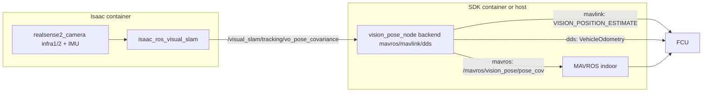

# Localization (control/localization)

## Documentation Index

| Doc | Scope |
|-----|-------|
| This README | Architecture, Run, FCU setup, EKF origin, indoor SOP, SITL, RViz |
| [concepts.md](concepts.md) | SLAM / VIO / V-SLAM theory, math, FCU fusion, T265 vs cuVSLAM |
| [legacy.md](legacy.md) | 2023–2024 T265 + `vision_to_mavros` history and versions |

## Role

External-navigation integration for GPS-denied (indoor) flight. Feeds a Visual
SLAM pose to the FCU so its EKF (ArduPilot EKF3 / PX4 EKF2) can estimate
position without GPS.

It lives under `control` because it bridges the VSLAM producer to the MAVROS and
MAVLink transports. The pipeline is split into a **producer** (RealSense + Isaac
ROS Visual SLAM, runs in the Isaac container) and a **consumer** (a vision-pose
bridge that forwards the pose to the FCU, runs on the SDK side). They communicate
over host networking with a shared `ROS_DOMAIN_ID`.

## Topology


```mermaid
flowchart LR
  subgraph isaac [Isaac container]
    rs[realsense2_camera infra1/2 + IMU]
    vslam[isaac_ros_visual_slam]
    rs --> vslam
  end
  subgraph sdk [SDK container or host]
    bridge[vision_pose_node backend mavros/mavlink/dds]
    mavros[MAVROS indoor]
  end
  vslam -->|"/visual_slam/tracking/vo_pose_covariance"| bridge
  bridge -->|"mavros: /mavros/vision_pose/pose_cov"| mavros
  bridge -->|"mavlink: VISION_POSITION_ESTIMATE"| fcu[FCU]
  bridge -->|"dds: VehicleOdometry"| fcu
  mavros --> fcu
```

## Components

| Part | Path | Role |
|------|------|------|
| Producer launch | `nectar/launch/isaac_vslam_realsense.launch.py` | RealSense + Visual SLAM (Isaac container) |
| Consumer launch | `nectar/launch/vision_pose.launch.py` | MAVROS (optional) + vision-pose bridge |
| MAVROS relay | `control/localization/vision_pose_bridge.py` (`MavrosVisionRelay`) | republish pose to `/mavros/vision_pose/pose_cov` |
| MAVLink bridge | reused from `nectar.control.mavlink.VisionPoseBridge` | send `VISION_POSITION_ESTIMATE` |
| DDS bridge | `control/px4/vision_bridge.py` (`Px4VisionOdometryBridge`) | publish `px4_msgs/VehicleOdometry` to `/fmu/in/vehicle_visual_odometry` |
| Velocity (optional) | `MavrosVisionSpeedRelay`, `nectar.control.mavlink.VisionSpeedBridge`, `speed_topic` on the DDS bridge | see [Velocity](#velocity-optional) |
| Frame conversions | `control/localization/frames.py` | body twist -> world -> NED |
| Node | `control/localization/nodes/vision_pose_node.py` | select backend, wire the bridge |
| VSLAM params | `control/localization/config/vslam_realsense.yaml` | RealSense + Visual SLAM tuning |
| MAVROS config | `control/mavros/config/indoor_mavros.yaml`, `indoor_pluginlists.yaml` | indoor MAVROS profile |

## Run

> **Prerequisite:** producer and consumer share `ROS_DOMAIN_ID` (default `14`, see `scripts/lib/config.sh`). Jetson, companion/host, and optional laptop (RViz) must use the same domain.

### 1. Producer (Isaac container)

```bash
make isaac-run          # or: ./docker/isaac_vslam/run_docker.sh
# inside:
nectar-vslam            # = ros2 launch nectar/launch/isaac_vslam_realsense.launch.py
```

Confirm RealSense enumerates and VSLAM topics publish. Docker notes:
[Isaac ROS Visual SLAM (Jetson)](../../../../docker/README.md#isaac-ros-visual-slam-jetson).

### 2. Consumer — vision feeder (keep running)

| Backend | Command |
|---------|---------|
| MAVROS | `ros2 launch nectar vision_pose.launch.py backend:=mavros fcu_url:=…` |
| Direct MAVLink | `ros2 launch nectar vision_pose.launch.py backend:=mavlink mavlink_url:=…` |
| PX4 DDS | `ros2 launch nectar vision_pose.launch.py backend:=dds` |

Or: `make driver DRONE=mavlink ENV=indoor`. Verify fused pose
([Indoor procedure](#indoor-procedure)), then start the mission on a **different**
MAVLink endpoint than the feeder.

`mavlink_url` / `fcu_url` are free-form — match your serial line or router fan-out.
Example Black Bee Jetson MAVProxy layout (GCS / mission / feeder):
`14550` / `14551` / `14552`.

Respect the [one feeder rule](#one-feeder-rule): do not also start a second vision
feeder on the same FCU link from a mission.

### 3. Mission

`PoseSource.VISION` with `auto_vision_feed=False` (default): mission **subscribes**
to the VSLAM topic for companion nav and does **not** send `VISION_*`. Opt-in
`auto_vision_feed=True` for a single-process feed (do not also run the standalone
mavlink feeder on the same endpoint). Optional velocity on that path:
`vision_send_speed=True`.

## Indoor procedure

Day-of-flight checklist for the **current** stack (D435i + cuVSLAM). Commands and
FCU tables are above and in [FCU setup](#fcu-setup); this section is order and
practice only.

### Mounting (*Black Bee practice*)

VIO / V-SLAM assume the camera and IMU move with the airframe. Vibration or a
loose mount looks like motion to the estimator.

- Align the D435i optical axis with the extrinsics you configured (`VISO_POS_*` /
  Isaac launch frames).
- Soft-mount: rubber bands and foam between camera and frame; foam in the sensor
  case where it helps without blocking lenses or USB.
- After transport or remount, restart producer + bridge and re-run the checks
  below — do not reuse yesterday’s map session.

### Bring-up

1. **Producer** — [Run §1](#1-producer-isaac-container).
2. **Consumer** — [Run §2](#2-consumer--vision-feeder-keep-running).
3. **Pipeline check** — move the airframe by hand; fused FCU local pose must
   change (`vision_fcu_check.py` and/or GCS MAVLink Inspector). Optional RViz:
   [Visualization](#visualization).
4. **EKF origin** — only when required; see [EKF origin](#ekf-origin). Optional
   feeder flag: `set_ekf_origin:=true`.
5. **Warm-up** — walk the vehicle slowly through the volume it will fly (square /
   circle / arena walk-around). Smooth motion; avoid abrupt yaw and people
   crossing the FOV ([failure modes](concepts.md#failure-modes-practical)). This
   builds map coverage and lets you abort on the ground if tracking looks bad.
6. **Scale / vertical sanity** — lift and translate by hand; fused X/Y/Z should
   move roughly the right distance. (T265 bring-up historically stressed a ~1 m
   lift for vertical scale — [Legacy](legacy.md); with D435i + cuVSLAM treat it as
   a check, not a hidden calibration.)
7. **First flight** — Stabilize or AltHold → gentle motion while watching fused
   pose → Loiter only when tracking looks stable (ready to drop back immediately).
   Then mission / harder profiles. Pattern from LuckyBird
   [Discourse part 2](https://discuss.ardupilot.org/t/integration-of-ardupilot-and-vio-tracking-camera-part-2-complete-installation-and-indoor-non-gps-flights/43405).

After long power-on, mount/USB/param changes, or odd GCS warnings: restart
producer + bridge (and reboot the FCU after param changes).

### Triage

| Symptom | Likely cause | What to try |
|---------|--------------|-------------|
| No VSLAM topics | Camera / Isaac / USB | `rs-enumerate-devices` in Isaac container; USB3; restart `nectar-vslam` |
| VSLAM OK, FCU pose frozen | Bridge, domain, or dual feeder | Shared `ROS_DOMAIN_ID`; restart consumer; [one feeder rule](#one-feeder-rule) |
| Vision on ROS, EKF unused | Params / origin | [FCU setup](#fcu-setup), [EKF origin](#ekf-origin); reboot after params |
| Jumpy / diverging path | Vibration, texture, abrupt motion, stale session | Soft-mount; slower warm-up; restart producer |
| Loiter oscillates / walks | Delay / noise; velocity double-count | Tune `VISO_DELAY_MS` / noise; leave `send_speed` off unless logs show benefit |
| Strange GCS flags after long power-on | Stale nodes / EKF state | Restart FCU + producer + bridge |

## Velocity (optional)

By default feeders send **position only**. `send_speed:=true` on
`vision_pose.launch.py` (or `vision_send_speed=True` with `auto_vision_feed`) also
sends VSLAM velocity; pose keeps running. EKF3 does not initialise on velocity
alone ([ardupilot#23485](https://github.com/ArduPilot/ardupilot/issues/23485)).

| Backend | Velocity carrier |
|---------|------------------|
| `mavros` | `geometry_msgs/TwistStamped` on `/mavros/vision_speed/speed_twist`; the [`vision_speed`](https://github.com/mavlink/mavros/blob/ros2/mavros_extras/src/plugins/vision_speed_estimate.cpp) plugin converts ENU -> NED and sends [`VISION_SPEED_ESTIMATE`](https://mavlink.io/en/messages/common.html#VISION_SPEED_ESTIMATE) |
| `mavlink` | `VISION_SPEED_ESTIMATE` (#103) over the same pymavlink link as the pose |
| `dds` | `velocity` + `velocity_frame = VELOCITY_FRAME_NED` on the `VehicleOdometry` already published for the pose |

```bash
ros2 launch nectar vision_pose.launch.py backend:=mavros send_speed:=true
ros2 launch nectar vision_pose.launch.py backend:=mavlink send_speed:=true mavlink_url:=…
```

Arguments: `speed_topic` (default `/visual_slam/tracking/odometry`); node also has
`speed_output_topic`, `speed_timeout_s`.

### What cuVSLAM actually provides

cuVSLAM estimates **pose and pose covariance**; it has no velocity state. The
twist on `/visual_slam/tracking/odometry` is produced by the ROS wrapper as a
finite difference over the last 10 poses,
`dp = pose(t0)⁻¹ · pose(t1)`
([`PoseCache::GetVelocity`](https://github.com/NVIDIA-ISAAC-ROS/isaac_ros_visual_slam/blob/main/isaac_ros_visual_slam/src/impl/pose_cache.cpp)).
It is therefore derived from the same pose we already send, not an independent
measurement. Acceleration is an *input* (RealSense IMU, `tracking_mode:=1`), not
an output.

That form of `dp` makes the twist **body-frame** (`child_frame_id`, FLU), as
`nav_msgs/Odometry` requires. `VISION_SPEED_ESTIMATE` carries no attitude, so the
FCU cannot rotate it: the bridges rotate body -> world with the attitude of the
same odometry sample before the ENU -> NED swap (`frames.py`). `ODOMETRY` is the
counter-example — it carries the quaternion and ArduPilot rotates the body-FRD
velocity itself.

### FCU setup for velocity

ArduPilot lists the velocity as optional alongside the position
([Non-GPS Position Estimation](https://ardupilot.org/dev/docs/mavlink-nongps-position-estimation.html)).
It is only fused once the source is selected:

- `EK3_SRC1_VELXY = 6`, `EK3_SRC1_VELZ = 6` (ExternalNav). With `0` the messages
  are received and logged but not fused.
- `VISO_VEL_M_NSE` sets the velocity measurement noise. ArduPilot **ignores** the
  covariance field of `VISION_SPEED_ESTIMATE` and always uses this parameter
  ([`AP_VisualOdom_MAV.cpp`](https://github.com/ArduPilot/ardupilot/blob/master/libraries/AP_VisualOdom/AP_VisualOdom_MAV.cpp)),
  so it is the only knob for how much the EKF trusts this input. Because the
  twist is differentiated from the position we already send, starting
  conservative (the `0.1` m/s default) avoids double-counting one measurement as
  two independent ones.
- PX4: `EKF2_EV_CTRL` bit 2 enables 3D velocity fusion.

Check `XKFS`/`XKF3` innovations in the logs before and after enabling.

## FCU setup

The bridge only delivers the pose — the FCU's estimator still has to be told to
fuse it. **ArduPilot (EKF3) and PX4 (EKF2) use different parameters and a
different minimum rate**. Both MAVLink backends send
[`VISION_POSITION_ESTIMATE`](https://mavlink.io/en/messages/common.html#VISION_POSITION_ESTIMATE)
(#102); the EKF fuses it once configured. Origin rules differ by firmware — see
[EKF origin](#ekf-origin).

> Our indoor **hardware** flights to date are on **ArduPilot 4.6.x / 4.8-dev**.
> The PX4 set below is grounded in the PX4 docs and matches the reference
> pipeline (the same MAVROS relay) used by the
> [VSLAM-UAV tutorial](https://www.andrewbernas.com/docs/tutorials/robots/vslam/setup)
> on PX4 v1.15.4. **SITL** already exercises this path
> (`ENV=indoor` → `indoor_room_px4` + `gz_vision_source`); validate on your
> Pixhawk before competition use.

### ArduPilot (EKF3)

| Parameter | Value | Purpose |
|-----------|-------|---------|
| `VISO_TYPE` | `1` (MAVLink) | Enable the external-nav backend that consumes `VISION_POSITION_ESTIMATE` from a companion (the T265 path uses `2`, see [Hardware notes](#hardware-notes)) |
| `EK3_SRC1_POSXY` | `6` (ExternalNav) | Horizontal position from VSLAM |
| `EK3_SRC1_VELXY` | `6` or `0` | Horizontal velocity — `6` only with `send_speed:=true`, see [Velocity](#velocity-optional) |
| `EK3_SRC1_POSZ` | `6` (ExternalNav) | Height — see [Height source](#height-source) |
| `EK3_SRC1_VELZ` | `6` or `0` | Vertical velocity, same condition as `VELXY` |
| `EK3_SRC1_YAW` | `6` (ExternalNav) | Yaw from VSLAM (with `COMPASS_USE=0`), or `1` to keep the compass |
| `VISO_POS_X/Y/Z` | camera offset (m) | Camera position in the body frame |
| `GPS1_TYPE` | `0` | Disable GPS indoors (renamed from `GPS_TYPE` in 4.5+) |

Rate ≥ 4 Hz. Tuning: `VISO_POS_M_NSE`, `VISO_YAW_M_NSE`, `VISO_DELAY_MS`,
`VISO_QUAL_MIN`. Refs:
[EKF source selection](https://ardupilot.org/copter/docs/common-ekf-sources.html),
[Non-GPS position estimation](https://ardupilot.org/dev/docs/mavlink-nongps-position-estimation.html),
[`VISO_TYPE`](https://github.com/ArduPilot/ardupilot/blob/master/libraries/AP_VisualOdom/AP_VisualOdom.cpp),
[`EK3_SRC*`](https://github.com/ArduPilot/ardupilot/blob/master/libraries/AP_NavEKF/AP_NavEKF_Source.cpp).

### PX4 (EKF2)

| Parameter | Value | Purpose |
|-----------|-------|---------|
| `EKF2_EV_CTRL` | bitmask — bit0 h-pos, bit1 v-pos, bit2 3D vel, bit3 yaw (`15` = all) | Enable external-vision fusion. Released PX4 (≥1.14) has shipped this at `15`, so fusion auto-starts when data arrives — **verify on your firmware** |
| `EKF2_HGT_REF` | `3` (Vision) | Height reference — see [Height source](#height-source) |
| `EKF2_EV_DELAY` | ~`50` ms | EV delay relative to IMU; tune from logs |
| `EKF2_EV_POS_X/Y/Z` | camera offset (m) | Camera position in the body frame |
| `EKF2_GPS_CTRL` | `0` | Disable GNSS indoors |
| `EKF2_MAG_TYPE` | `None` | Only if using vision yaw |

Rate 30–50 Hz — **PX4 rejects external vision when the rate is too low** (much
stricter than ArduPilot); cuVSLAM at ~90 Hz clears this. Tuning:
`EKF2_EV_NOISE_MD`, `EKF2_EVP_NOISE`, `EKF2_EVA_NOISE`, `EKF2_EV_QMIN`. Refs:
[External position estimation](https://docs.px4.io/main/en/ros/external_position_estimation.html),
[VIO](https://docs.px4.io/main/en/computer_vision/visual_inertial_odometry.html),
[EKF2 tuning](https://docs.px4.io/main/en/advanced_config/tuning_the_ecl_ekf.html),
[`params_external_vision.yaml`](https://github.com/PX4/PX4-Autopilot/blob/main/src/modules/ekf2/params_external_vision.yaml),
[`EKF2_EV_CTRL` default (#24298)](https://github.com/PX4/PX4-Autopilot/issues/24298).

The `mavros`/`mavlink` backends deliver this estimate as `VISION_POSITION_ESTIMATE`;
the native `dds` backend publishes `px4_msgs/VehicleOdometry` on
`/fmu/in/vehicle_visual_odometry` instead (same EKF2 params, no MAVROS/MAVLink).
See [Backends](#backends).

### EKF origin

The EKF **origin** is the global lat/lon/alt that defines local NED `(0,0,0)`.
It is **not** Home (RTL return point) and **not** the VSLAM map origin.
Home stays with the FCU: ArduPilot initializes it after origin (and again at
arm for Copter RTL). The bridge never sends `SET_HOME_POSITION`.

**Opt-in from the vision feeder** (default off):

```bash
ros2 launch nectar vision_pose.launch.py backend:=mavlink set_ekf_origin:=true
# optional overrides:
#   origin_lat:=… origin_lon:=… origin_alt_m:=… origin_timeout_s:=2.0
```

Defaults are the Black Bee lab lat/lon (`-22.41434308754571`,
`-45.44843145453864`) with `origin_alt_m:=0.0` (set site AMSL if the GCS map
height should look right). If `GPS_GLOBAL_ORIGIN` is already present, the send
is skipped. Supported on `mavros`, `mavlink`, and `dds`.

Manual alternatives: Mission Planner *Set EKF Origin Here*,
`SET_GPS_GLOBAL_ORIGIN`, or
[`ahrs-set-origin.lua`](https://github.com/ArduPilot/ardupilot/blob/master/libraries/AP_Scripting/examples/ahrs-set-origin.lua).

**ArduPilot**
([Non-GPS Position Estimation](https://ardupilot.org/dev/docs/mavlink-nongps-position-estimation.html),
[Home / origin](https://ardupilot.org/dev/docs/mavlink-get-set-home-and-origin.html)):

- If **no GPS** is providing a fix, set the origin before the EKF can estimate
  position (needed for Loiter / Guided / Auto and for publishing local pose).
- The actual lat/lon values only need to be valid WGS84; they are a reference,
  not a survey.
- Once set, the origin cannot be moved until reboot.
- If a **GPS is present and gets a fix**, ArduPilot normally sets the origin
  itself ([Non-GPS Navigation](https://ardupilot.org/copter/docs/common-non-gps-navigation-landing-page.html)).
- From **4.7+**, `AHRS_OPTIONS` bit 3 (RecordOrigin) + bit 4
  (UseRecordedOriginForNonGPS) can save/restore the origin across power cycles
  so you need not set it every boot.
- The vehicle icon on the Mission Planner map appears when an origin exists
  ([T265 wiki](https://ardupilot.org/copter/docs/common-vio-tracking-camera.html),
  LuckyBird); that is GCS visualization, not a separate calibration step.

Stabilize / AltHold do not need a position estimate. If you “just run” without
setting origin and Loiter still works, origin was already defined (GPS fix,
recorded origin on 4.7+, or a prior GCS/script/`set_ekf_origin` set).

**PX4**
([External position estimation](https://docs.px4.io/main/en/ros/external_position_estimation.html)):

- Local EV fusion (Position / local OFFBOARD) uses the local frame from vision;
  the VSLAM-UAV setup guide does not require setting an origin for that path.
- `SET_GPS_GLOBAL_ORIGIN` is for building a **global** estimate from local pose
  so **auto modes that need global position** (Mission, Return, …) can run
  indoors (`set_ekf_origin:=true` on the `dds` / `mavros` backends covers this).

**Legacy note:** LuckyBird’s ROS path and `set_origin.py` / MP click were
explicit. Upstream `t265_to_mavlink.py` can optionally send
`SET_GPS_GLOBAL_ORIGIN`. Black Bee `vision_to_mavros` (ROS 2) only republishes
pose. See [Legacy](legacy.md).

### Height source

We do not use the **barometer** indoors — it drifts near the ground and in prop
wash. We pick POSZ between two sources and keep the rest of the set (POSXY /
VELXY / YAW) on vision:

- **Vision** (`EK3_SRC1_POSZ=6` / `EKF2_HGT_REF=Vision`): altitude is relative to
  the VSLAM origin, **no terrain following** — the drone holds a constant height
  when crossing platforms or obstacles in the arena. This is our default and has
  been useful for missions with raised platforms.
- **Downward rangefinder** (`EK3_SRC1_POSZ=2` / `EKF2_HGT_REF=Range` +
  `EKF2_RNG_CTRL`): altitude **follows the terrain**. ArduPilot warns this is
  "only appropriate ... where the floor is flat with no ground clutter"
  ([EKF sources](https://ardupilot.org/copter/docs/common-ekf-sources.html)); PX4
  notes "the local NED origin will move up and down with ground level"
  ([EKF2 tuning](https://docs.px4.io/main/en/advanced_config/tuning_the_ecl_ekf.html)).
  Over fixed obstacles the vehicle then climbs to compensate, so we mask the step
  drops upstream with the
  [`ObstacleMaskFilter`](../../sensors/README.md#obstaclemaskfilter) before the
  FCU ever sees them.

## Backends

- `mavros`: `MavrosVisionRelay` republishes the VSLAM `PoseWithCovarianceStamped`
  (ENU) onto `/mavros/vision_pose/pose_cov`; MAVROS converts to NED for the FCU.
- `mavlink`: `nectar.control.mavlink.VisionPoseBridge` converts ENU->NED and
  sends `VISION_POSITION_ESTIMATE` over a dedicated pymavlink link.
- `dds`: `nectar.control.px4.Px4VisionOdometryBridge` converts ENU->NED and
  publishes `px4_msgs/VehicleOdometry` on `/fmu/in/vehicle_visual_odometry`
  (PX4 native uXRCE-DDS). Needs a running `MicroXRCEAgent` and `px4_msgs`; set
  `px4_namespace` to match a namespaced client.

Each backend gains a velocity path with `send_speed:=true`
([Velocity](#velocity-optional)); the pose path above is unaffected.

## One feeder rule

Exactly **one** process may send external vision into the FCU:

| Transport | Default feeder | Mission role |
|-----------|----------------|--------------|
| MAVROS | `vision_pose_node backend:=mavros` | Subscribes to `/mavros/vision_pose/…` |
| Direct pymavlink | standalone `vision_pose_node backend:=mavlink` on a dedicated endpoint | `PoseSource.VISION`, `auto_vision_feed=False` (subscribe-only) |
| uXRCE-DDS | `vision_pose_node backend:=dds` | Reads fused pose from PX4 DDS topics |

Opt-in `auto_vision_feed=True`: mission sends `VISION_*` (optional `vision_send_speed`).
Never also run the standalone mavlink feeder on the same endpoint.

## SITL

Gazebo indoor: ground-truth → canonical VSLAM topics → same backends → EKF3 / EKF2.

| Firmware | Terminal 1 | Terminal 2 (`sim-bridge`) | Feeder | Mission |
|----------|------------|---------------------------|--------|---------|
| ArduPilot `PROTOCOL=mavlink` (default) | `sim-start … ENV=indoor` | Gazebo + `vision_pose_node` on SERIAL0 (`tcp:…:5760`) | mavlink node | SERIAL1 (`tcp:…:5762`) |
| ArduPilot `PROTOCOL=mavros` | same | Gazebo + MAVROS + `vision_pose_node` | mavros node | SERIAL0 |
| PX4 `mavros` / `dds` | `sim-start FIRMWARE=px4 ENV=indoor` | producer + consumer | mavros / dds node | matching preset |
| PX4 `PROTOCOL=mavlink` | same | producer only (single offboard UDP) | mission `auto_vision_feed=True` | `PX4_MAVLINK_SITL_VISION_CONFIG` |

Shared arena: ArduPilot composes `nectar_indoor`; PX4 uses `indoor_room_px4` +
`x500_nectar` (PosePublisher ~50 Hz). Params: ArduPilot `indoor.parm`; PX4
`px4_indoor.env`. Stock PX4 `x500_vision` only via explicit override. Full matrix:
[simulation README](../../../../simulation/README.md).

To exercise optional EKF origin on ArduPilot indoor:

```bash
make sim-start  FIRMWARE=ardupilot ENV=indoor
make sim-bridge FIRMWARE=ardupilot ENV=indoor ARGS='set_ekf_origin:=true'
# vision_pose_node log: "EKF origin: sent …" or "already set, skip send"
```

Note: stock ArduPilot SITL still anchors a SIM home origin (Canberra) even with
`GPS1_TYPE=0`, so a late overwrite usually will not stick — use the log line to
confirm the feeder path; validate lat/lon on GPS-denied hardware (or after a
clean FCU with no origin).

```bash
ros2 topic hz /visual_slam/tracking/vo_pose_covariance   # ~50 Hz
ros2 topic echo /mavros/vision_pose/pose_cov --once        # PROTOCOL=mavros
```

## Visualization

Path overlays show the **SLAM / odometry estimate** so you can judge tracking
quality and loop closure — they are not a calibration step. Use them in
[bring-up](#bring-up) to check: path tracks hand motion, noise is acceptable for
Loiter, and the green SLAM path snaps on revisit (loop closure).

NVIDIA recommends running RViz on a remote PC, not the Jetson
([RealSense tutorial](https://nvidia-isaac-ros.github.io/concepts/visual_slam/cuvslam/tutorial_realsense.html)).

Two profiles (`rviz/vslam_light.rviz`, `rviz/vslam_full.rviz`):

| Profile | Shows | Producer cost |
|---------|-------|---------------|
| `light` (default) | TF + odometry + SLAM path (green) + VO path (purple) | none (tracking topics are always published) |
| `full` | light + landmarks / loop-closure clouds + pose graph | requires `enable_visualization:=true` |

The `light` profile draws two always-published trajectories: the **green** SLAM
path (`/visual_slam/tracking/slam_path`, loop-closure-corrected) and the
**purple** VO path (`/visual_slam/tracking/vo_path`, raw odometry). When a loop
closes, the green path snaps relative to the purple — that is the loop closure,
visible with no producer cost. The literal purple loop-closure point cloud lives
in `full` (it is a `/visual_slam/vis/*` topic, only published with
`enable_visualization:=true`).

Both `light` paths are shown as a **rolling buffer** (default last 15 s) so the
window does not fill with the whole trajectory. `vslam_rviz.launch.py` runs a
`path_window_node` relay next to RViz (no Jetson cost) that republishes
`/visual_slam/tracking/{slam,vo}_path` trimmed to the last `window_seconds` onto
`*_windowed` topics, which the light profile subscribes to. Set `window_seconds`
to `0` for full history.

**Laptop (nectar built)**:

```bash
ros2 launch nectar vslam_rviz.launch.py profile:=light            # or profile:=full
ros2 launch nectar vslam_rviz.launch.py window_seconds:=30        # longer buffer
```

**Laptop (repo only, no build)** — run the relay too, else the light paths are empty:

```bash
ros2 run nectar path_window_node.py    # if built; otherwise: python3 .../nodes/path_window_node.py
rviz2 -d src/nectar-sdk/nectar/nectar/control/localization/rviz/vslam_light.rviz
```

The `full` profile needs the producer to publish the `/visual_slam/vis/*` topics,
which are off by default to keep the Jetson light:

```bash
nectar-vslam enable_visualization:=true
```

## Hardware notes

**Current:** Intel RealSense **D435i** + **Isaac ROS Visual SLAM (cuVSLAM)** on a
Jetson Orin Nano; pose ~90 Hz. Producer / consumer: [Run](#run). Day-of-flight:
[Indoor procedure](#indoor-procedure).

**Legacy / fallback:** RealSense **T265** +
[`vision_to_mavros`](https://github.com/Black-Bee-Drones/vision_to_mavros)
(`VISO_TYPE=2`). Full history, versions, and bring-up:
[Legacy T265](legacy.md). Conceptual comparison:
[Concepts](concepts.md#two-systems-we-use).

## References

Module theory and a fuller bibliography: [Concepts → References](concepts.md#references).

- [Isaac ROS Visual SLAM (isaac_ros_visual_slam)](https://nvidia-isaac-ros.github.io/repositories_and_packages/isaac_ros_visual_slam/isaac_ros_visual_slam/index.html)
- [cuVSLAM](https://nvidia-isaac-ros.github.io/concepts/visual_slam/cuvslam/index.html)
- [Isaac ROS Development Environment](https://nvidia-isaac-ros.github.io/v/release-3.2/concepts/docker_devenv/index.html)
- [ArduPilot: Non-GPS Position Estimation](https://ardupilot.org/dev/docs/mavlink-nongps-position-estimation.html)
- [ArduPilot: Setting Home and/or EKF origin](https://ardupilot.org/dev/docs/mavlink-get-set-home-and-origin.html)
- [ArduPilot: Non-GPS Navigation](https://ardupilot.org/copter/docs/common-non-gps-navigation-landing-page.html)
- [PX4: External Position Estimation](https://docs.px4.io/main/en/ros/external_position_estimation.html)
