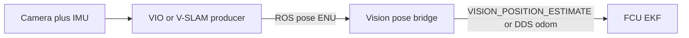

# Indoor localization concepts

Foundations for GPS-denied (indoor) flight with external visual navigation.
This page explains **what** SLAM / VIO / V-SLAM are and **how** the flight
controller fuses that pose. For SDK commands and FCU parameter tables, see the
[Localization README](README.md). For day-of-flight procedure, see
[Indoor flight](flight.md). For the older T265 path, see [Legacy T265](legacy.md).

> Sections marked *Black Bee practice* are operational guidance from our flights.
> Everything else is grounded in the cited vendor and firmware documentation.

## Why external navigation indoors

Without GNSS, the autopilot still needs a consistent local position to hold
Loiter, run GUIDED/OFFBOARD setpoints, or fly autonomous missions. ArduPilot
and PX4 solve this by treating a companion vision estimate as an **external
navigation** source for the EKF (EKF3 / EKF2), the same role GPS plays outdoors
([ArduPilot non-GPS position estimation](https://ardupilot.org/dev/docs/mavlink-nongps-position-estimation.html),
[PX4 external position estimation](https://docs.px4.io/main/en/ros/external_position_estimation.html)).

Two consequences follow:

1. **Someone must produce a pose** — a visual-inertial tracker or V-SLAM stack
   on the companion (or on a dedicated tracking camera).
2. **Someone must set the EKF origin** when no GPS is attached, otherwise the
   filter has no world frame to express position in. See
   [FCU setup](README.md#fcu-setup) and
   [vehicle coordinate frames](../vehicle/README.md#coordinate-frames).

Nectar's localization module is the **bridge**: it takes a ROS pose from the
vision producer and delivers it to the FCU over MAVROS, direct MAVLink, or
PX4 DDS. It does not implement SLAM itself.

## SLAM, VO, VIO, V-SLAM

[Simultaneous Localization and Mapping (SLAM)](https://en.wikipedia.org/wiki/Simultaneous_localization_and_mapping)
jointly estimates the sensor's pose and a map of the environment. A widely
cited survey is Cadena et al., *Past, Present, and Future of Simultaneous
Localization and Mapping* (IEEE Transactions on Robotics, 2016)
([IEEE Xplore](https://ieeexplore.ieee.org/document/7747236)).

Useful distinctions for flight:

| Term | Meaning | Typical failure mode |
|------|---------|----------------------|
| **Visual odometry (VO)** | Incremental pose from camera motion only | Drift grows without bound; sensitive to texture and lighting |
| **Visual-inertial odometry (VIO)** | VO fused with an IMU | Still drifts; better short-term smoothness and scale observability |
| **V-SLAM** | VO/VIO plus a **map** and usually **loop closure** | Can correct drift when revisiting known places; map quality depends on the scene |

**Odometry** answers "where am I relative to where I started?" and accumulates
error. **Mapping + loop closure** answers "have I been here before?" and can
pull the estimate back when the same landmarks are recognized again.

NVIDIA's [cuVSLAM](https://nvidia-isaac-ros.github.io/concepts/visual_slam/cuvslam/index.html)
is a GPU-accelerated stereo / multi-camera visual-inertial SLAM library exposed
in ROS 2 through
[Isaac ROS Visual SLAM](https://nvidia-isaac-ros.github.io/repositories_and_packages/isaac_ros_visual_slam/isaac_ros_visual_slam/index.html).
The Intel RealSense **T265** was a dedicated tracking camera that ran a VIO
pipeline on-device and published pose / TF (now discontinued; see
[Legacy T265](legacy.md)).

RViz path overlays (green SLAM path vs purple VO path in our light profile)
**visualize the estimate**. They are not a calibration step. Warm-up motion
that builds map coverage is still useful — that is operational practice, not
sensor extrinsic calibration. See [Indoor flight](flight.md#visualization-and-map-warm-up).

## Basic mathematics

Teaching-level sketch only. For a full treatment of estimation on manifolds,
see Barfoot, *State Estimation for Robotics*, or the Cadena survey above.

### Pose

A rigid-body pose is an element of the special Euclidean group \(SE(3)\): a
rotation \(R \in SO(3)\) and a translation \(t \in \mathbb{R}^3\),

\[
T = \begin{bmatrix} R & t \\ 0^\top & 1 \end{bmatrix} \in SE(3).
\]

Composition \(T_{WA} = T_{WB}\,T_{BA}\) chains frames. The SDK core uses
**ENU / FLU**; the FCU uses **NED / FRD**. Transports convert on the wire —
see [vehicle coordinate frames](../vehicle/README.md#coordinate-frames).

Vision systems often publish pose in a camera or odometry frame that still
needs a body-frame offset (`VISO_POS_*` / `EKF2_EV_POS_*`) so the EKF knows
where the camera sits relative to the vehicle center.

### Front-end and back-end (conceptual)

Most visual SLAM stacks share a two-layer structure (Cadena et al.):

- **Front-end** — detect and match features (or use dense photometric residuals)
  across frames; associate measurements with landmarks; reject outliers.
- **Back-end** — estimate poses (and optionally landmark positions) with a
  filter (e.g. EKF) or an optimizer (bundle adjustment / pose graph).

**Loop closure** adds a relative-pose (or landmark) constraint between
non-consecutive poses when the same place is recognized. Solving the graph
then corrects accumulated drift along the path. In Isaac ROS Visual SLAM you
can see that correction as the green `/visual_slam/tracking/slam_path`
snapping relative to the purple `/visual_slam/tracking/vo_path`
([Visualization](README.md#visualization)).

### Measurement into the flight-controller EKF

The companion does **not** replace the FCU attitude/position estimator. It
sends an external pose (and optionally velocity) that the EKF fuses as a
measurement. On the MAVLink path the usual message is
[`VISION_POSITION_ESTIMATE`](https://mavlink.io/en/messages/common.html#VISION_POSITION_ESTIMATE)
(#102); velocity may use
[`VISION_SPEED_ESTIMATE`](https://mavlink.io/en/messages/common.html#VISION_SPEED_ESTIMATE)
(#103). ArduPilot documents the expected rate (≥ 4 Hz) and source selection
in [Non-GPS Position Estimation](https://ardupilot.org/dev/docs/mavlink-nongps-position-estimation.html).
PX4 documents external vision fusion and rate expectations in
[External Position Estimation](https://docs.px4.io/main/en/ros/external_position_estimation.html)
and [VIO](https://docs.px4.io/main/en/computer_vision/visual_inertial_odometry.html).

Conceptually, each vision pose is a measurement of the vehicle's position
(and often yaw) in the local frame, with a delay and a noise model:

- **Delay** — vision is late relative to the IMU. Firmware exposes this as
  `VISO_DELAY_MS` (ArduPilot) or `EKF2_EV_DELAY` (PX4). Wrong delay shows up
  as lag or oscillation in Loiter.
- **Trust / noise** — how strongly the EKF believes the vision update
  (`VISO_POS_M_NSE`, `VISO_YAW_M_NSE`, PX4 `EKF2_EVP_NOISE` / `EKF2_EVA_NOISE`,
  etc.). Tight noise on a bad estimate fights the IMU; loose noise under-uses
  a good one.
- **Source selection** — ArduPilot `EK3_SRC1_* = 6` (ExternalNav) or PX4
  `EKF2_EV_CTRL` bits must enable fusion, or messages are received but ignored
  ([EKF source selection](https://ardupilot.org/copter/docs/common-ekf-sources.html)).

Nectar's bridges send **position by default**. Optional velocity
(`send_speed:=true`) is documented under
[Velocity](README.md#velocity-optional): cuVSLAM's twist on
`/visual_slam/tracking/odometry` is a finite difference over recent poses in
the Isaac ROS wrapper, not an independent velocity state — so enabling both
position and velocity fusion can double-count one measurement if noise is set
aggressively.

### Scale

Monocular VO has an unobservable metric scale; stereo and VIO (with IMU
excitation) make scale observable. Stereo RealSense infra pairs and IMU-aided
pipelines are the usual indoor choices for metric Loiter. Historically, T265
bring-up guidance included lifting the vehicle ~1 m before flight so vertical
motion exercised scale — see [Indoor flight](flight.md#scale-and-vertical-check)
and [Legacy T265](legacy.md).

## VIO / V-SLAM components

A working indoor stack needs more than "a camera and ROS":

| Piece | Role |
|-------|------|
| **Camera(s)** | Intensity (and optionally depth) for front-end matching. Stereo improves metric scale. |
| **IMU** | High-rate angular rate and acceleration; bridges vision gaps and helps scale. Must be time-aligned with images. |
| **Extrinsics** | Camera↔IMU and camera↔body transforms. Wrong offsets bias the fused estimate. |
| **Time sync** | Image and IMU stamps on a common clock; large skew looks like delay. |
| **Producer** | Device VIO (T265) or onboard SLAM (cuVSLAM on Jetson). |
| **Bridge** | Frame alignment, rate limiting, MAVLink/MAVROS/DDS delivery. |
| **FCU EKF** | Fuses vision with IMU (and optionally rangefinder / baro for height). |

### Failure modes (practical)

These show up repeatedly in firmware docs and in flight:

- **Textureless or repetitive scenes** — blank walls, shiny floors, strong
  repeating patterns → feature starvation or false matches.
- **Motion blur / abrupt motion** — fast translation or yaw exceeds tracker
  assumptions.
- **Vibration** — soft-mount the camera; hard-coupling props noise into the IMU
  and image (*Black Bee practice*: foam and rubber bands between mounts).
- **Moving objects in view** — people walking close to the lens during bring-up
  corrupt the map / pose.
- **Lighting changes** — sudden exposure shifts confuse matching.
- **Rolling shutter** (depending on sensor) — fast rotation warps geometry;
  global-shutter or careful motion helps.
- **Emitter / IR interference** (D435i) — Isaac ROS RealSense notes warn that
  the IR projector can disturb stereo matching if left on for VSLAM; follow the
  [RealSense cuVSLAM tutorial](https://nvidia-isaac-ros.github.io/concepts/visual_slam/cuvslam/tutorial_realsense.html).

## How the firmware consumes vision

1. Producer publishes pose (Nectar current path:
   `/visual_slam/tracking/vo_pose_covariance` at ~90 Hz from Isaac ROS Visual
   SLAM).
2. Bridge converts frames if needed and forwards to the FCU
   ([Backends](README.md#backends)).
3. EKF fuses when sources and origin are configured
   ([FCU setup](README.md#fcu-setup)).
4. Position modes (Loiter, GUIDED, OFFBOARD) use the fused local pose — the
   same pose the vehicle core reads for indoor `PoseSource.VISION` navigation.

Exactly **one** process may feed vision into the FCU at a time
([One feeder rule](README.md#one-feeder-rule)).

## Two systems we use

| | T265 + on-device VIO | D435i + Isaac ROS cuVSLAM |
|---|---|---|
| **Where tracking runs** | Tracking ASIC on the camera | Jetson (Isaac ROS container) |
| **Map / loop closure** | Device VIO (limited external visibility) | Explicit V-SLAM topics; loop closure visible in paths / vis clouds |
| **Companion (Black Bee)** | Raspberry Pi (2023–2024) | Jetson Orin Nano |
| **FCU link** | `vision_to_mavros` → MAVROS → `VISION_POSITION_ESTIMATE` | Nectar `vision_pose` backends (MAVROS / MAVLink / DDS) |
| **ArduPilot `VISO_TYPE`** | `2` (Intel T265) | `1` (MAVLink) |
| **Typical pose topic into MAVROS** | `/mavros/vision_pose/pose` | `/mavros/vision_pose/pose_cov` |
| **Status** | Discontinued camera; fallback | Current indoor path |

Detail for the old stack: [Legacy T265](legacy.md).
Detail for running the new stack: [Localization README](README.md) and
[Indoor flight](flight.md).

## References

### Surveys and theory

- C. Cadena et al., *Past, Present, and Future of Simultaneous Localization and Mapping*, IEEE TRO, 2016 — [IEEE Xplore](https://ieeexplore.ieee.org/document/7747236)
- T. D. Barfoot, *State Estimation for Robotics* (Cambridge University Press)

### NVIDIA / cuVSLAM

- [cuVSLAM concept page](https://nvidia-isaac-ros.github.io/concepts/visual_slam/cuvslam/index.html)
- [Isaac ROS Visual SLAM (`isaac_ros_visual_slam`)](https://nvidia-isaac-ros.github.io/repositories_and_packages/isaac_ros_visual_slam/isaac_ros_visual_slam/index.html)
- [RealSense + cuVSLAM tutorial](https://nvidia-isaac-ros.github.io/concepts/visual_slam/cuvslam/tutorial_realsense.html)
- [cuVSLAM technical report (arXiv:2506.04359)](https://arxiv.org/abs/2506.04359)

### Autopilot / MAVLink

- [ArduPilot: Non-GPS Position Estimation](https://ardupilot.org/dev/docs/mavlink-nongps-position-estimation.html)
- [ArduPilot: EKF Source Selection](https://ardupilot.org/copter/docs/common-ekf-sources.html)
- [ArduPilot: ROS VIO tracking camera](https://ardupilot.org/dev/docs/ros-vio-tracking-camera.html)
- [ArduPilot: Intel RealSense T265](https://ardupilot.org/copter/docs/common-vio-tracking-camera.html)
- [PX4: External Position Estimation](https://docs.px4.io/main/en/ros/external_position_estimation.html)
- [PX4: Visual Inertial Odometry (VIO)](https://docs.px4.io/main/en/computer_vision/visual_inertial_odometry.html)
- [MAVLink `VISION_POSITION_ESTIMATE`](https://mavlink.io/en/messages/common.html#VISION_POSITION_ESTIMATE)

### Community / legacy bridge

- LuckyBird (Thien Nguyen), ArduPilot Discourse T265 series — [part 1](https://discuss.ardupilot.org/t/integration-of-ardupilot-and-vio-tracking-camera-part-1-getting-started-with-the-intel-realsense-t265-on-rasberry-pi-3b/43162), [part 2](https://discuss.ardupilot.org/t/integration-of-ardupilot-and-vio-tracking-camera-part-2-complete-installation-and-indoor-non-gps-flights/43405)
- [thien94/vision_to_mavros](https://github.com/thien94/vision_to_mavros) (ROS 1) and [Black-Bee-Drones/vision_to_mavros](https://github.com/Black-Bee-Drones/vision_to_mavros) (ROS 2 adaptation)
