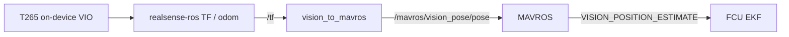

# Legacy: T265 and vision_to_mavros

Historical indoor path Black Bee flew before D435i + Isaac ROS Visual SLAM:
Intel RealSense **T265** tracking camera, companion computer (typically a
Raspberry Pi), MAVROS, and [`vision_to_mavros`](https://github.com/Black-Bee-Drones/vision_to_mavros).

This page is for understanding older logs, fallback hardware, and how the
current Nectar bridge evolved. For the **current** stack, use the
[Localization README](README.md) and [Indoor flight](flight.md). Concepts:
[Concepts](concepts.md).

## Timeline

| Period | Stack | Notes |
|--------|-------|-------|
| **2023** | ROS 1, RPi, T265, `vision_to_mavros` (thien94), ArduPilot | First indoor competition drone; IMAV 2023 indoor (3rd). |
| **2024** | ROS 2 Humble, RPi, T265, Black Bee [`vision_to_mavros`](https://github.com/Black-Bee-Drones/vision_to_mavros) port | Same data flow; ROS 2 launches (`t265_all_nodes_launch.py`). |
| **After 2024** | Jetson Orin Nano, D435i, Isaac ROS cuVSLAM, Nectar `vision_pose` | T265 discontinued; vibration- and environment-sensitive; a crash that cracked a lens cover left tracking less reliable. T265 remains a documented fallback. |

## Data flow



Compared to today:

| | Legacy T265 | Current D435i + cuVSLAM |
|---|-------------|-------------------------|
| Pose producer | On-camera VIO | Isaac ROS Visual SLAM on Jetson |
| Bridge | External `vision_to_mavros` package | Nectar `control/localization` (`vision_pose_node`) |
| MAVROS topic | `/mavros/vision_pose/pose` | `/mavros/vision_pose/pose_cov` (typical) |
| ArduPilot `VISO_TYPE` | `2` (Intel T265) | `1` (MAVLink) |
| Rate limiting / ENU align | Inside `vision_to_mavros` | Producer + Nectar backends / MAVROS |

LuckyBird's overview of frames and why a bridge is required:
[Discourse part 2](https://discuss.ardupilot.org/t/integration-of-ardupilot-and-vio-tracking-camera-part-2-complete-installation-and-indoor-non-gps-flights/43405).
`realsense-ros` already publishes in ROS ENU conventions, but camera mounting
and the T265 body/world alignment still need a rotation so the FCU heading
matches the vehicle — that is a primary job of `vision_to_mavros`.

## What vision_to_mavros does

From the [Black Bee ROS 2 README](https://github.com/Black-Bee-Drones/vision_to_mavros)
and the upstream [thien94 package](https://github.com/thien94/vision_to_mavros):

1. **TF → pose** — look up `source_frame_id` → `target_frame_id` (defaults
   around `/camera_link` and `/camera_odom_frame`) and publish
   `geometry_msgs/PoseStamped` on `/mavros/vision_pose/pose`.
2. **Rate limit** — T265 / TF can be far faster than the FCU needs; LuckyBird
   notes ~10–15 Hz as a practical minimum and ~30 Hz as typical
   (`output_rate`, default `30.0` in the ROS 2 port).
3. **Mount / world alignment** — `roll_cam`, `pitch_cam`, `yaw_cam`, and
   `gamma_world` rotate camera and world frames into the ENU body convention
   MAVROS expects before NED conversion on the wire.

Example front-facing defaults (USB port to the right):
`roll_cam=0`, `pitch_cam=0`, `yaw_cam=0`, `gamma_world=-1.5707963`.
Other orientations are tabulated in the package README.

Launches (ROS 2):

```bash
ros2 launch vision_to_mavros t265_tf_to_mavros_launch.py   # bridge only
ros2 launch vision_to_mavros t265_all_nodes_launch.py       # T265 + MAVROS + bridge
```

## Software versions (SDK pins)

T265 needs **older** librealsense / realsense-ros than current D4xx defaults.
Pins live in [`scripts/lib/config.sh`](../../../../scripts/lib/config.sh),
[COMPATIBILITY.md](../../../../docs/COMPATIBILITY.md),
[docs/setup/realsense.md](../../../../docs/setup/realsense.md), and
[docker/README.md](../../../../docker/README.md).

| Target | librealsense | realsense-ros | Notes |
|--------|--------------|---------------|-------|
| Humble D4xx (SDK default) | v2.55.1 | 4.55.1 | `make realsense` |
| **T265 (Humble only)** | **v2.53.1** | **4.51.1** | `LIBREALSENSE_VERSION=v2.53.1 REALSENSE_ROS_TAG=4.51.1 make realsense` |
| Docker `:humble-t265` | v2.53.1 | 4.51.1 | Prebuilt T265-oriented image |
| Isaac VSLAM layer (D435i producer) | v2.55.1 (RSUSB) | **4.51.1-isaac** | Inside `make isaac-run` image — not the T265 stack |

Do not mix a T265 with the Isaac cuVSLAM producer image expecting first-class
support; the Isaac path targets D435i stereo + IMU for Visual SLAM.

Historical companion images on the team also used librealsense **2.50.0** during
early ROS 2 bring-up; prefer the SDK override above for anything new.

## ArduPilot parameters (T265)

From ArduPilot's
[Intel RealSense T265](https://ardupilot.org/copter/docs/common-vio-tracking-camera.html)
page and team bring-up notes:

| Parameter | Typical value | Purpose |
|-----------|---------------|---------|
| `VISO_TYPE` | `2` | Intel T265 backend |
| `EK3_SRC1_POSXY` | `6` | ExternalNav horizontal position |
| `EK3_SRC1_VELXY` | `6` or as tuned | ExternalNav horizontal velocity (T265 provided velocity) |
| `EK3_SRC1_POSZ` | `1` (Baro) or `6` | Team often preferred **baro for Z** because vision height was sensitive to vibration; current D435i path defaults to vision Z — see [Height source](README.md#height-source) |
| `EK3_SRC1_VELZ` | `6` | ExternalNav vertical velocity |
| `EK3_SRC1_YAW` | `6` or compass | Vision yaw vs compass |
| `GPS1_TYPE` | `0` | Optional: disable GPS indoors |
| Serial to companion | e.g. `SERIAL2_PROTOCOL=2`, `SERIAL2_BAUD=921` | MAVLink to the RPi (port depends on wiring) |

Reboot the FCU after changing these. Set **EKF origin** in the GCS before
position modes (same requirement as today).

## Historical bring-up (ROS 2 era)

Summarized public procedure (LuckyBird + team ROS 2 adaptation):

1. Power airframe and companion; confirm T265 on USB3 and companion↔FCU serial.
2. On the companion: confirm the camera (`rs-enumerate-devices`).
3. Launch the stack — all-in-one:
   `ros2 launch vision_to_mavros t265_all_nodes_launch.py`
   or the three nodes separately (realsense T265 launch, MAVROS,
   `t265_tf_to_mavros_launch.py`) as in LuckyBird part 2.
4. Verify `/mavros/vision_pose/pose` rate (~30 Hz) and
   `VISION_POSITION_ESTIMATE` in the GCS MAVLink Inspector.
5. Set EKF origin on the map.
6. **Scale check:** lift the vehicle ~**1 m** and set it down again (ArduPilot /
   team guidance for T265 vertical scale), then hand-move and confirm the GCS
   icon tracks.
7. First flight: Stabilize/AltHold → gentle motion → Loiter with immediate
   revert if tracking fails — same pattern as [Indoor flight](flight.md#first-flight).

ROS 1 used `roslaunch` equivalents (`rs_t265.launch`,
`t265_tf_to_mavros.launch`, `t265_all_nodes.launch`); the graph was the same.

## What carried over vs what changed

**Still true today**

- EKF origin required without GPS.
- Hand-move / GCS icon check before Loiter.
- Soft-mount and vibration care.
- One vision feeder into the FCU.
- Stabilize/AltHold before trusting Loiter on a new setup.

**Changed with Nectar + cuVSLAM**

- Producer runs on Jetson inside the Isaac container (`nectar-vslam`), not as
  on-camera T265 VIO.
- Bridge is in-tree (`vision_pose.launch.py` / `VisionPoseBridge` /
  `MavrosVisionRelay`), not a separate `vision_to_mavros` package.
- `VISO_TYPE=1` and covariance pose topic are the default ArduPilot path.
- Loop-closure and SLAM/VO path visualization are first-class
  ([Visualization](README.md#visualization)).
- Optional velocity is derived in the Isaac wrapper and gated behind
  `send_speed:=true` ([Velocity](README.md#velocity-optional)).

## References

- [ArduPilot: Intel RealSense T265](https://ardupilot.org/copter/docs/common-vio-tracking-camera.html)
- [ArduPilot: ROS VIO tracking camera](https://ardupilot.org/dev/docs/ros-vio-tracking-camera.html)
- LuckyBird T265 series — [part 1](https://discuss.ardupilot.org/t/integration-of-ardupilot-and-vio-tracking-camera-part-1-getting-started-with-the-intel-realsense-t265-on-rasberry-pi-3b/43162), [part 2](https://discuss.ardupilot.org/t/integration-of-ardupilot-and-vio-tracking-camera-part-2-complete-installation-and-indoor-non-gps-flights/43405)
- [thien94/vision_to_mavros](https://github.com/thien94/vision_to_mavros) · [Black-Bee-Drones/vision_to_mavros](https://github.com/Black-Bee-Drones/vision_to_mavros)
- [RealSense setup (T265 override)](../../../../docs/setup/realsense.md)
- [Docker RealSense / `:humble-t265`](../../../../docker/README.md)
- [Concepts — system comparison](concepts.md#two-systems-we-use)
