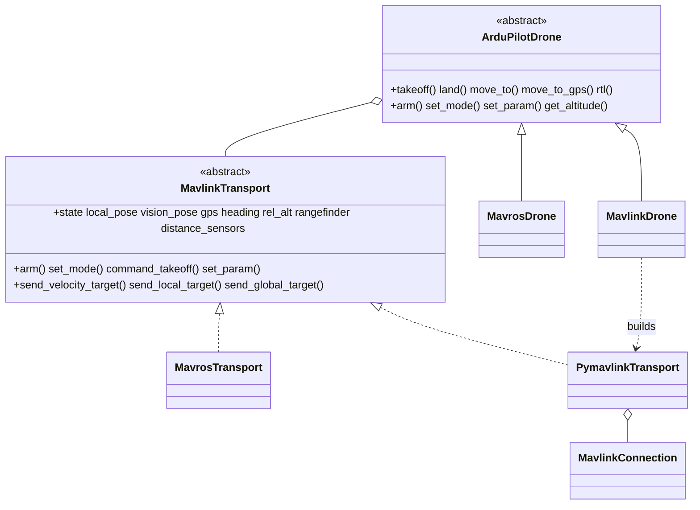

# Direct MAVLink Control

A direct [pymavlink](https://mavlink.io/en/mavgen_python/) control path for ArduPilot vehicles, for cases where the [MAVROS](../mavros/README.md) bridge is unavailable, undesired, or insufficient (lighter companion stack, custom plugins, or a single owner of the FCU serial port).

`MavlinkDrone` is the same ArduPilot vehicle as [`MavrosDrone`](../mavros/drone.py), reached over a different transport. Both subclass the shared [`ArduPilotDrone`](../ardupilot/README.md) core, so **all flight/navigation logic is identical** — only the wire plumbing differs.



## Components

### `MavlinkConnection`

Thin wrapper around `mavutil.mavlink_connection` in [`connection.py`](connection.py). Opens a single MAVLink endpoint, performs the heartbeat handshake to discover `target_system`/`target_component`, and exposes the raw connection via `.master`. Adds a **`send_lock`**: a single endpoint must have one RX reader but may have many senders (setpoints, heartbeat, rangefinder, vision bridge), and `mav.*_send` is not thread-safe, so every sender serializes through this lock.

### `PymavlinkTransport`

[`transport.py`](transport.py) — the `MavlinkTransport` implementation that owns the FCU link directly.

- **RX**: a ROS timer on the drone's node drains `recv_match(blocking=False)` and dispatches each message through a handler table. Decoded types: `HEARTBEAT`, `GLOBAL_POSITION_INT`, `LOCAL_POSITION_NED`, `ATTITUDE`, `RANGEFINDER`/`DISTANCE_SENSOR`, `PARAM_VALUE`, `COMMAND_ACK`, and `STATUSTEXT`. This keeps the concurrency model identical to MAVROS — telemetry updates on the executor thread, blocking flight calls read it on the user thread.
- **TX**: a 1 Hz heartbeat timer announces the companion; commands go via `command_long`/`set_mode`/`param_set`; setpoints via `set_position_target_local_ned` / `set_position_target_global_int`.
- **Frames**: the core speaks ENU/FLU; the transport converts to the wire's NED/FRD on egress and back to ENU on ingest (exactly what MAVROS does internally).
- **Streams**: on `start()` it requests message intervals via [`streams.py`](streams.py) (`MAV_CMD_SET_MESSAGE_INTERVAL`, with a `REQUEST_DATA_STREAM` fallback).

#### STATUSTEXT surfacing

MAVROS forwards FCU [`STATUSTEXT`](https://mavlink.io/en/messages/common.html#STATUSTEXT) to `/rosout`; the direct transport has no such relay, so `_on_statustext` logs FCU text on the drone's ROS logger at a matching severity (`MAV_SEVERITY_ERROR` → `error`, `WARNING` → `warn`, else `info`). This surfaces the actual reason a command was rejected — most usefully `PreArm: ...` failures — which would otherwise be invisible over a direct link. Consecutive identical messages are de-duplicated.

#### Parameter confirmation

`set_param` clears any cached value, sends `PARAM_SET`, then waits up to **0.5 s** for the FCU's `PARAM_VALUE` echo and verifies the echoed value matches (within tolerance) before returning `True`/logging the confirmation. ArduPilot echoes a known parameter within a few milliseconds and stays silent for an unknown one, so the short timeout keeps alias probing (4.6 `WPNAV_*` → 4.8 `WP_*`) responsive without false negatives on a fast link. Unlike the MAVROS service result (which only confirms the request was accepted), this confirms the value actually took.

#### Distance sensors

Each `DISTANCE_SENSOR` message is decoded into a `DistanceReading` and stored by sensor id in a copy-on-write map, exposed as `distance_sensors` (and `get_distance(orientation)` on the drone). The downward sensor also updates `rangefinder`. Every reported orientation is collected automatically, with no SDK-side configuration beyond the FCU rangefinder/proximity setup. See the [ArduPilot core README](../ardupilot/README.md#distance-sensors) for the data model.

#### Stream rates

[`streams.py`](streams.py) requests these per-message rates on `start()` (override via `MavlinkConfig.stream_rates`). ArduPilot Non-GPS guidance wants pose ≥ 4 Hz; the defaults request more so PID navigation has fresh feedback.

| Message | Rate (Hz) |
| --- | --- |
| `HEARTBEAT` | 1 |
| `SYS_STATUS` | 2 |
| `ATTITUDE` | 20 |
| `GLOBAL_POSITION_INT` | 10 |
| `LOCAL_POSITION_NED` | 20 |
| `GPS_RAW_INT` | 5 |
| `RANGEFINDER` | 10 |
| `DISTANCE_SENSOR` | 10 |
| `VFR_HUD` | 5 |
| `HOME_POSITION` | 1 |

A rate `<= 0` disables a stream. `GPS_RAW_INT` and a few others are requested for completeness even though position is taken from `GLOBAL_POSITION_INT`/`LOCAL_POSITION_NED`.

The single-RX-reader rule is what lets a `RangefinderPublisher` and a `VisionPoseBridge` share the same `MavlinkConnection` safely — they only *send*, through the lock.

### `VisionPoseBridge`

[`vision_bridge.py`](vision_bridge.py) — indoor external-navigation feed. With MAVROS gone, the FCU's EKF3 still needs an external position source. `MavlinkDrone` starts this automatically when `pose_source=VISION`: it subscribes to `MavlinkConfig.vision_pose_topic` and forwards **each received sample** to the FCU as [`VISION_POSITION_ESTIMATE`](https://mavlink.io/en/messages/common.html#VISION_POSITION_ESTIMATE) (ArduPilot [Non-GPS Position Estimation](https://ardupilot.org/dev/docs/mavlink-nongps-position-estimation.html) wants ≥ 4 Hz), replacing what [`vision_to_mavros`](../../../../vision_to_mavros) does through MAVROS. It also exposes the same pose as `vision_pose` so companion-side PID navigation works.

**Which topic to point at** (`vision_pose_topic`):

| Scenario | Topic | Why |
| --- | --- | --- |
| Real hardware | the VSLAM output, e.g. `/visual_slam/tracking/vo_pose_covariance` or `/vslam/pose` (default) | The bridge *is* the relay; subscribe directly to the estimator, no MAVROS involved. |
| Gazebo sim (indoor) | `/mavros/vision_pose/pose_cov` | The indoor sim launch already forwards Gazebo ground-truth pose there; reuse it instead of standing up a second source. The `MAVLINK_SITL_VISION_CONFIG` preset sets this. |

The forwarding rate equals the subscription rate — the bridge does not resample. `MavlinkConfig.vision_rate_hz` exists but is **not currently wired** into the bridge; do not rely on it to throttle or pad the feed.

## Quick start

```python
from nectar.control import DroneFactory, MavlinkConfig, PoseSource

# Outdoor / SITL over TCP
config = MavlinkConfig(connection_string="tcp:127.0.0.1:5760", expect_lidar=False)
drone = DroneFactory.create("mavlink", config)

drone.takeoff(altitude=2.0)
drone.move_to(x=2.0, y=1.0, z=0.0, precision=0.2)
drone.rtl(land=True)
```

```python
# Real hardware over serial (Jetson <-> Pixhawk)
config = MavlinkConfig(connection_string="/dev/ttyTHS1", baud=921600)
drone = DroneFactory.create("mavlink", config)
```

```python
# Indoor, vision-based: VisionPoseBridge feeds the EKF automatically
config = MavlinkConfig(
    pose_source=PoseSource.VISION,
    connection_string="/dev/ttyUSB0",
    vision_pose_topic="/vslam/pose",
)
drone = DroneFactory.create("mavlink", config)
```

Ready-made presets ([`config.py`](../config.py)): `MAVLINK_SITL_CONFIG` (SITL on tcp `5760`), `MAVLINK_SITL_GAZEBO_CONFIG` (SITL+Gazebo on the secondary port tcp `5762`, so a direct link can run alongside MAVROS on `5760`), and `MAVLINK_SITL_VISION_CONFIG` (indoor, `vision_pose_topic=/mavros/vision_pose/pose_cov`).

### Connection string format

Unlike `MavrosConfig` (MAVROS `fcu_url`), `MavlinkConfig.connection_string` is **pymavlink-native**:

| Form | Example |
| --- | --- |
| TCP | `tcp:127.0.0.1:5760` |
| UDP listener | `udp:127.0.0.1:14551` |
| UDP sender | `udpout:192.168.1.10:14550` |
| Serial | `/dev/ttyUSB0` (+ `baud=`) |

### Sharing the connection with a rangefinder

```python
from nectar.sensors.rangefinder_publisher import RangefinderPublisher

pub = RangefinderPublisher(sensor, drone.connection)  # shares the lock
pub.start()
```

## When to use which transport

| | `MavrosDrone` (`"mavros"`) | `MavlinkDrone` (`"mavlink"`) |
| --- | --- | --- |
| Link | requires a running `mavros_node` | owns the FCU endpoint directly |
| Deps | ROS MAVROS stack | pymavlink only |
| Indoor vision feed | `vision_to_mavros` + MAVROS | built-in `VisionPoseBridge` |
| Best for | full ROS deployments, existing MAVROS tooling | minimal companion stacks, single serial owner |

Both expose the identical `Drone` API and capabilities.

## References

- [pymavlink documentation](https://mavlink.io/en/mavgen_python/)
- [MAVLink common messages](https://mavlink.io/en/messages/common.html)
- [ArduPilot Copter commands in Guided mode](https://ardupilot.org/dev/docs/copter-commands-in-guided-mode.html)
- [ArduPilot Non-GPS position estimation](https://ardupilot.org/dev/docs/mavlink-nongps-position-estimation.html)
- [mavlink-router](https://github.com/mavlink-router/mavlink-router) — fan out the FCU's serial to multiple endpoints
