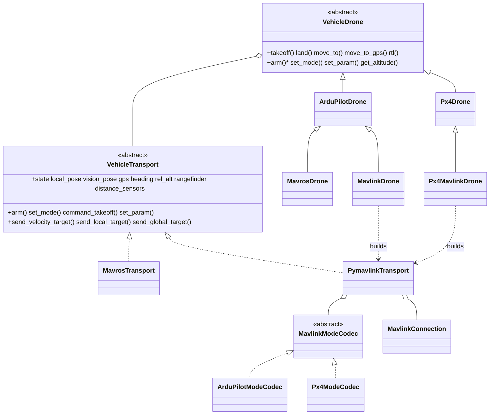

# Direct MAVLink Control

A direct [pymavlink](https://mavlink.io/en/mavgen_python/) control path for ArduPilot **and PX4** vehicles, for cases where the [MAVROS](../mavros/README.md) bridge is unavailable, undesired, or insufficient (lighter companion stack, custom plugins, or a single owner of the FCU serial port).

`MavlinkDrone` is the same ArduPilot vehicle as [`MavrosDrone`](../mavros/drone.py), reached over a different transport. Both subclass the shared [`ArduPilotDrone`](../ardupilot/README.md) core, so **all flight/navigation logic is identical** — only the wire plumbing differs.

`PymavlinkTransport` is **firmware-neutral**: an injected [`MavlinkModeCodec`](modes.py) isolates the one firmware difference (flight-mode encode/decode). `ArduPilotModeCodec` (default, `SET_MODE` + pymavlink `mode_mapping()`) backs `MavlinkDrone`; [`Px4ModeCodec`](../px4/mavlink_drone.py) (`MAV_CMD_DO_SET_MODE` with PX4 `(main, sub)` modes) backs [`Px4MavlinkDrone`](../px4/mavlink_drone.py). Telemetry, setpoints, arming, params and stream rates are shared unchanged.


```mermaid
classDiagram
    class VehicleDrone {
        <<abstract>>
        +takeoff() land() move_to() move_to_gps() rtl()
        +arm()* set_mode() set_param() get_altitude()
    }
    class ArduPilotDrone
    class Px4Drone
    class VehicleTransport {
        <<abstract>>
        +state local_pose vision_pose gps heading rel_alt rangefinder distance_sensors
        +arm() set_mode() command_takeoff() set_param()
        +send_velocity_target() send_local_target() send_global_target()
    }
    class MavrosTransport
    class PymavlinkTransport
    class MavlinkModeCodec {
        <<abstract>>
    }
    class ArduPilotModeCodec
    class Px4ModeCodec

    VehicleDrone o-- VehicleTransport
    VehicleDrone <|-- ArduPilotDrone
    VehicleDrone <|-- Px4Drone
    VehicleTransport <|.. MavrosTransport
    VehicleTransport <|.. PymavlinkTransport
    ArduPilotDrone <|-- MavrosDrone
    ArduPilotDrone <|-- MavlinkDrone
    Px4Drone <|-- Px4MavlinkDrone
    MavlinkDrone ..> PymavlinkTransport : builds
    Px4MavlinkDrone ..> PymavlinkTransport : builds
    PymavlinkTransport o-- MavlinkConnection
    PymavlinkTransport o-- MavlinkModeCodec
    MavlinkModeCodec <|.. ArduPilotModeCodec
    MavlinkModeCodec <|.. Px4ModeCodec
```

## Components

### `MavlinkConnection`

Thin wrapper around `mavutil.mavlink_connection` in [`connection.py`](connection.py). Opens a single MAVLink endpoint, performs the heartbeat handshake to discover `target_system`/`target_component`, and exposes the raw connection via `.master`. Adds a **`send_lock`**: a single endpoint must have one RX reader but may have many senders (setpoints, heartbeat, rangefinder, vision bridge), and `mav.*_send` is not thread-safe, so every sender serializes through this lock.

### `PymavlinkTransport`

[`transport.py`](transport.py) — the `VehicleTransport` implementation that owns the FCU link directly.

- **RX**: a ROS timer on the drone's node drains `recv_match(blocking=False)` and dispatches each message through a handler table. Decoded types: `HEARTBEAT`, `GLOBAL_POSITION_INT`, `LOCAL_POSITION_NED`, `ATTITUDE`, `RANGEFINDER`/`DISTANCE_SENSOR`, `PARAM_VALUE`, `COMMAND_ACK`, and `STATUSTEXT`. This keeps the concurrency model identical to MAVROS — telemetry updates on the executor thread, blocking flight calls read it on the user thread.
- **TX**: a 1 Hz heartbeat timer announces the companion; commands go via `command_long`/`set_mode`/`param_set`; setpoints via `set_position_target_local_ned` / `set_position_target_global_int`.
- **Frames**: the core speaks ENU/FLU; the transport converts to the wire's NED/FRD on egress and back to ENU on ingest (exactly what MAVROS does internally).
- **Streams**: on `start()` it requests message intervals via [`streams.py`](streams.py) (`MAV_CMD_SET_MESSAGE_INTERVAL`); a legacy `REQUEST_DATA_STREAM` helper (`request_data_streams`) is also provided in `streams.py` for older firmware but is not called automatically.

#### STATUSTEXT surfacing

MAVROS forwards FCU [`STATUSTEXT`](https://mavlink.io/en/messages/common.html#STATUSTEXT) to `/rosout`; the direct transport has no such relay, so `_on_statustext` logs FCU text on the drone's ROS logger at a matching severity (`MAV_SEVERITY_ERROR` → `error`, `WARNING` → `warn`, else `info`). This surfaces the actual reason a command was rejected — most usefully `PreArm: ...` failures — which would otherwise be invisible over a direct link. Consecutive identical messages are de-duplicated.

#### Command acknowledgements

`arm()`, `disarm()`, `command_takeoff()`, and other `COMMAND_LONG` calls (`do_servo`, …) send with `want_ack=True` and wait `MavlinkConfig.ack_timeout` (default **5 s**) for [`COMMAND_ACK`](https://mavlink.io/en/messages/common.html#COMMAND_ACK). The FCU may already have applied the command (e.g. PWM) before the ACK reaches the companion; a timeout log with visible motion is that lag, not a failed servo. Missing ACK or a result other than `ACCEPTED` / `IN_PROGRESS` returns `False`. The ArduPilot/PX4 vehicle layer then also requires `is_armed` to become true after arm — ACK alone is not enough. `set_mode` does not use this ACK wait: it sends `SET_MODE` and then polls HEARTBEAT for `mode_timeout` (default **10 s**). Takeoff/land settle semantics (including FCU `STANDBY` after land) live in the [vehicle core](../vehicle/README.md#takeoff-and-landing).

#### Parameter confirmation

`set_param` clears any cached value, sends `PARAM_SET`, then waits up to **0.5 s** for the FCU's `PARAM_VALUE` echo and verifies the echoed value matches (within tolerance) before returning `True`/logging the confirmation. ArduPilot echoes a known parameter within a few milliseconds and stays silent for an unknown one, so the short timeout keeps alias probing (4.6 `WPNAV_*` → 4.8 `WP_*`) responsive without false negatives on a fast link. Unlike the MAVROS service result (which only confirms the request was accepted), this confirms the value actually took.

#### Distance sensors

Each `DISTANCE_SENSOR` message is decoded into a `DistanceReading` and stored by sensor id in a copy-on-write map, exposed as `distance_sensors` (and `get_distance(orientation)` on the drone). The downward sensor also updates `rangefinder`. Every reported orientation is collected automatically, with no SDK-side configuration beyond the FCU rangefinder/proximity setup. See the [vehicle core README](../vehicle/README.md#distance-sensors) for the data model.

#### Stream rates

[`streams.py`](streams.py) requests these per-message rates on `start()` (override via `MavlinkConfig.stream_rates`). ArduPilot Non-GPS guidance wants pose ≥ 4 Hz; the defaults request more so PID navigation has fresh feedback.

| Message | Rate (Hz) |
| --- | --- |
| `HEARTBEAT` | 1 |
| `SYS_STATUS` | 2 |
| `EXTENDED_SYS_STATE` | 2 |
| `ATTITUDE` | 20 |
| `GLOBAL_POSITION_INT` | 10 |
| `LOCAL_POSITION_NED` | 20 |
| `GPS_RAW_INT` | 5 |
| `RANGEFINDER` | 10 |
| `DISTANCE_SENSOR` | 10 |
| `VFR_HUD` | 5 |
| `HOME_POSITION` | 1 |

`EXTENDED_SYS_STATE` carries [`landed_state`](https://mavlink.io/en/messages/common.html#MAV_LANDED_STATE) (same primary input as [MAVSDK](https://mavsdk.mavlink.io/) `in_air`). ArduPilot does not stream it unless requested; see [Takeoff and Landing](../vehicle/README.md#takeoff-and-landing).

A rate `<= 0` disables a stream. `GPS_RAW_INT` and a few others are requested for completeness even though position is taken from `GLOBAL_POSITION_INT`/`LOCAL_POSITION_NED`.

The single-RX-reader rule is what lets a `RangefinderPublisher` and a `VisionPoseBridge` share the same `MavlinkConnection` safely — they only *send*, through the lock.

### Vision pose (indoor)

[`vision_bridge.py`](vision_bridge.py) — GPS-denied external navigation. With
`pose_source=VISION`, `PymavlinkTransport` always fills `vision_pose` from
`vision_pose_topic` for companion PID. Who sends
[`VISION_POSITION_ESTIMATE`](https://mavlink.io/en/messages/common.html#VISION_POSITION_ESTIMATE)
to the FCU (ArduPilot [Non-GPS Position Estimation](https://ardupilot.org/dev/docs/mavlink-nongps-position-estimation.html)
wants ≥ 4 Hz) is controlled by `auto_vision_feed`:

| `auto_vision_feed` | FCU feed | Companion pose |
| --- | --- | --- |
| `False` (default) | Separate `vision_pose_node backend:=mavlink` on **another** MAVLink endpoint | `VisionPoseSubscriber` |
| `True` | Mission-owned `VisionPoseBridge` (optional `vision_send_speed` → `VisionSpeedBridge`) | same bridge `on_pose` |

Never run both senders on the same endpoint. End-to-end pipeline (producer,
backends, FCU setup): [Localization](../localization/README.md).

**Which topic to point at** (`vision_pose_topic`):

| Scenario | Topic | Why |
| --- | --- | --- |
| Real hardware | VSLAM output, `/visual_slam/tracking/vo_pose_covariance` (default) | Subscribe directly to the estimator |
| Gazebo sim (indoor) | same | `gz_vision_source` republishes ground truth on the canonical topic (`MAVLINK_SITL_VISION_CONFIG`) |

Forwarding rate equals the subscription rate. `vision_rate_hz` is **not** wired — do not rely on it to throttle.

## Quick start

**Outdoor / SITL over TCP**:

```python
from nectar.control import DroneFactory, MavlinkConfig, PoseSource

config = MavlinkConfig(connection_string="tcp:127.0.0.1:5760", expect_lidar=False)
drone = DroneFactory.create("mavlink", config)

drone.takeoff(altitude=2.0)
drone.move_to(x=2.0, y=1.0, z=0.0, precision=0.2)
drone.rtl(land=True)
```

**Real hardware over serial** (Jetson ↔ Pixhawk):

```python
config = MavlinkConfig(connection_string="/dev/ttyTHS1", baud=921600)
drone = DroneFactory.create("mavlink", config)
```

**Indoor, vision-based** (external feeder by default):

```python
config = MavlinkConfig(
    pose_source=PoseSource.VISION,
    connection_string="/dev/ttyUSB0",  # or a router UDP endpoint for the mission
    vision_pose_topic="/visual_slam/tracking/vo_pose_covariance",
)
drone = DroneFactory.create("mavlink", config)
```

Ready-made presets ([`config.py`](../config.py)): `MAVLINK_SITL_CONFIG` (tcp `5760`),
`MAVLINK_SITL_GAZEBO_CONFIG` / `MAVLINK_SITL_VISION_CONFIG` (mission on SERIAL1 tcp `5762`;
indoor feeder on SERIAL0 tcp `5760` when `mavros:=false`).

### Connection string format

Unlike `MavrosConfig` (MAVROS `fcu_url`), `MavlinkConfig.connection_string` is **pymavlink-native**:

| Form | Example |
| --- | --- |
| TCP | `tcp:127.0.0.1:5760` |
| UDP listener | `udp:127.0.0.1:14551` |
| UDP sender | `udpout:192.168.1.10:14550` |
| Serial | `/dev/ttyUSB0` (+ `baud=`) |

### Sharing the connection with a rangefinder

```python
from nectar.sensors.rangefinder_publisher import RangefinderPublisher

pub = RangefinderPublisher(sensor, drone.connection)  # shares the lock
pub.start()
```

## When to use which transport

| | `MavrosDrone` (`"mavros"`) | `MavlinkDrone` (`"mavlink"`) |
| --- | --- | --- |
| Link | requires a running `mavros_node` | owns the FCU endpoint directly |
| Deps | ROS MAVROS stack | pymavlink only |
| Indoor vision feed | `vision_pose` → MAVROS | external `vision_pose_node` (default) or `auto_vision_feed=True` |
| Best for | full ROS deployments, existing MAVROS tooling | minimal companion stacks, single serial owner |

Both expose the identical `Drone` API and capabilities.

## References

- [pymavlink documentation](https://mavlink.io/en/mavgen_python/)
- [MAVLink common messages](https://mavlink.io/en/messages/common.html)
- [ArduPilot Copter commands in Guided mode](https://ardupilot.org/dev/docs/copter-commands-in-guided-mode.html)
- [ArduPilot Non-GPS position estimation](https://ardupilot.org/dev/docs/mavlink-nongps-position-estimation.html)
- [mavlink-router](https://github.com/mavlink-router/mavlink-router) — fan out the FCU's serial to multiple endpoints
