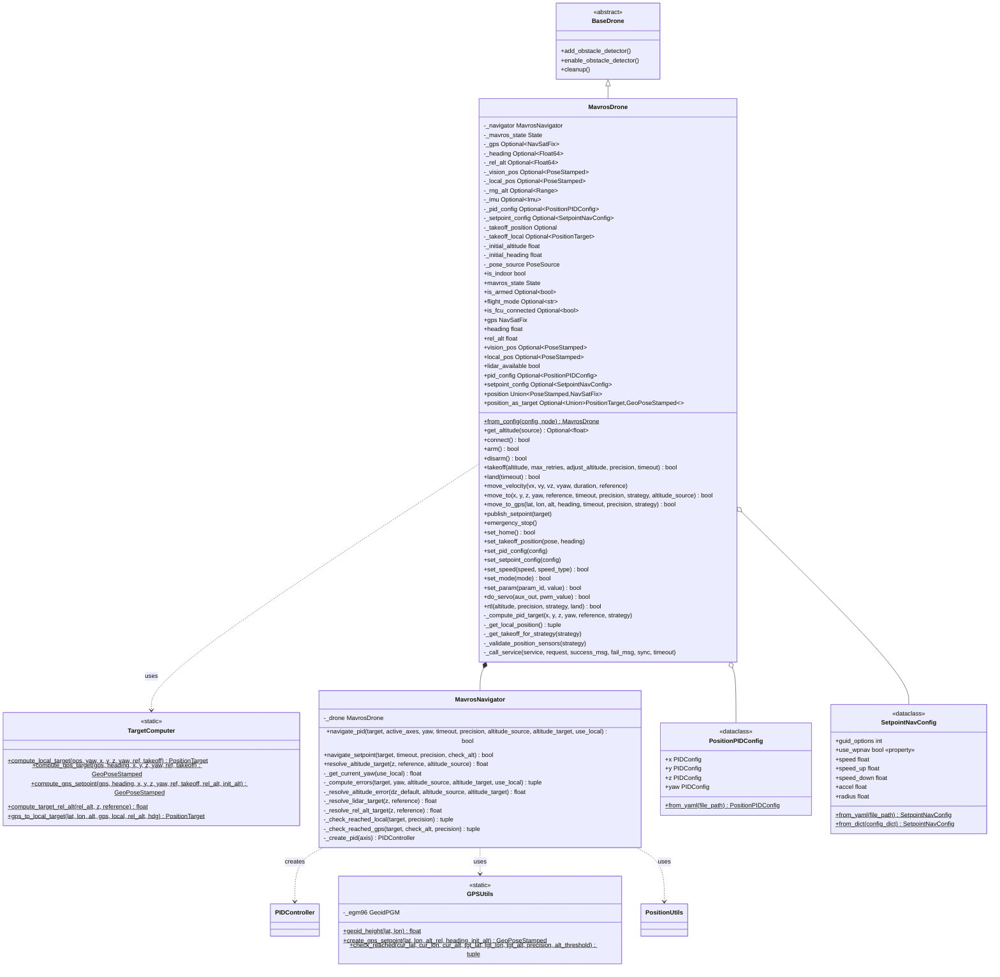
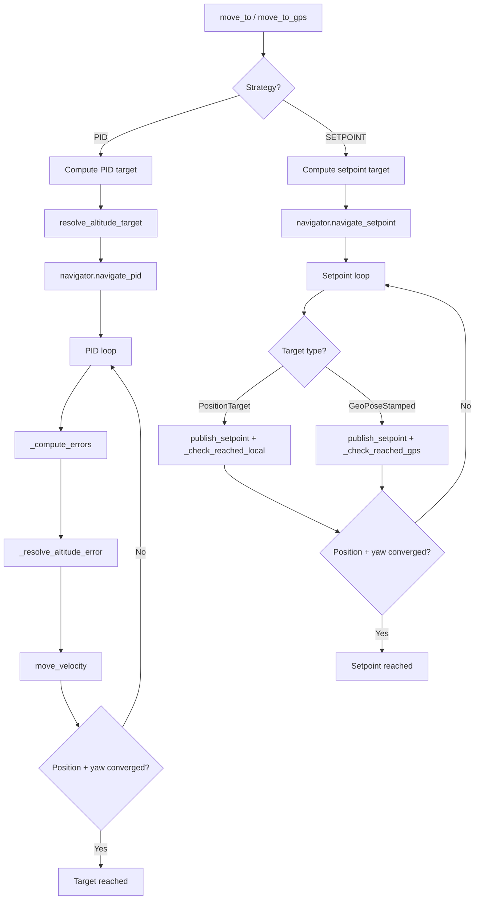
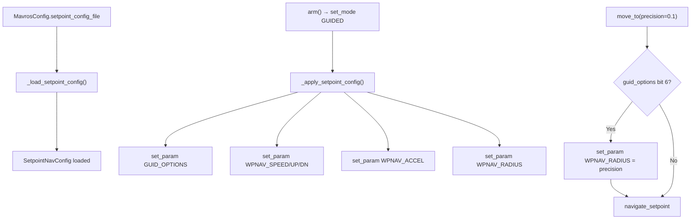

# MAVROS Control Module

ArduPilot/PX4 drone control via MAVROS for ROS2.

## Key Concepts

### MAVLink and MAVROS

[MAVLink](https://ardupilot.org/dev/docs/mavlink-basics.html) is a lightweight binary protocol used for communication between the flight controller (FCU), ground stations, and companion computers. [MAVROS](https://github.com/mavlink/mavros) is a ROS2 node that bridges MAVLink and ROS2, exposing FCU data as topics/services and translating ROS2 commands into MAVLink messages.

This SDK uses MAVROS to send velocity/position commands and read sensor data. The drone must be in [GUIDED mode](https://ardupilot.org/dev/docs/copter-commands-in-guided-mode.html) for offboard control.

### Flight Modes

ArduPilot [flight modes](https://ardupilot.org/copter/docs/flight-modes.html) determine how the FCU interprets inputs. Key modes used by this SDK:

| Mode | Description |
|------|-------------|
| GUIDED | Offboard control. Accepts position/velocity commands from companion computer via MAVLink. Required for SDK navigation. |
| STABILIZE | Manual stabilized flight. Pilot controls via RC. |
| LOITER | GPS-based position hold. Maintains position when sticks centered. |
| RTL | Return to launch. Autonomously flies back to home position and lands. |
| LAND | Auto-land at current position. |

Mode is set via `drone.set_mode()` which calls the [`/mavros/set_mode`](https://docs.ros.org/en/humble/p/mavros/) service. See [MAVLink flight mode protocol](https://ardupilot.org/dev/docs/mavlink-get-set-flightmode.html).

### EKF (Extended Kalman Filter)

The [EKF](https://ardupilot.org/copter/docs/common-apm-navigation-extended-kalman-filter-overview.html) is ArduPilot's state estimator. It fuses IMU, GPS, barometer, and optionally vision/rangefinder data to produce a reliable estimate of the vehicle's position, velocity, and attitude. All altitude and position values in this SDK ultimately come from the EKF's output via MAVROS topics.

### Altitude Types

ArduPilot uses [several altitude definitions](https://ardupilot.org/copter/docs/common-understanding-altitude.html):

| Type | Description | Source | SDK Usage |
|------|-------------|--------|-----------|
| **AGL** (Above Ground Level) | Distance from vehicle to ground directly below | Rangefinder (lidar) | `AltitudeSource.LIDAR`, terrain following |
| **Relative** | Altitude above HOME/ORIGIN. Displayed in GCS/OSD. | EKF (baro + GPS) | `AltitudeSource.REL_ALT`, `move_to_gps` |
| **AMSL** (Above Mean Sea Level) | Altitude above mean sea level | EKF + geoid model | MAVROS GPS setpoint topics |
| **Ellipsoid (WGS84)** | Raw GPS altitude above WGS84 reference ellipsoid. Not the same as AMSL. | GPS receiver | Raw `NavSatFix.altitude` |
| **Vision Z** | Z component from vision pose in local frame. Relative to vision system origin. | External VIO (T265, d435i, etc.) | `AltitudeSource.VISION`, indoor navigation |

**AMSL vs Ellipsoid**: GPS receivers output altitude above the WGS84 ellipsoid, but MAVROS setpoint topics expect AMSL. The difference is the [geoid height](https://en.wikipedia.org/wiki/EGM96), corrected by `GPSUtils` using the EGM96 model.

**Surface Tracking**: When a [downward-facing rangefinder](https://ardupilot.org/copter/docs/common-rangefinder-landingpage.html) is within range, ArduPilot performs [surface tracking](https://ardupilot.org/copter/docs/terrain-following.html) -- adjusting target altitude to maintain constant AGL. Our `AltitudeSource.LIDAR` mode implements a similar concept at the SDK level via PID control.

### Coordinate Frames

| Frame | Axes | Origin | Used For |
|-------|------|--------|----------|
| **NED** (North-East-Down) | X=North, Y=East, Z=Down | Home or local origin | MAVROS local setpoints (`FRAME_LOCAL_NED`) |
| **Body NED** | X=Forward, Y=Right, Z=Down | Vehicle center | Velocity commands (`FRAME_BODY_NED`) |
| **WGS84** | Latitude, Longitude, Altitude | Earth reference ellipsoid | GPS coordinates (`NavSatFix`, `GeoPoseStamped`) |
| **Local Vision** | Depends on VIO setup | Vision system origin | Vision pose (`PoseWithCovarianceStamped`), indoor |

MAVROS bridges between the FCU's internal frames and ROS2 messages. For indoor operation, an external vision system must publish pose to `/mavros/vision_pose/pose_cov`. See [ArduPilot VIO setup](https://ardupilot.org/copter/docs/common-vio-tracking-camera.html) and [vision_to_mavros](https://github.com/Black-Bee-Drones/vision_to_mavros).

The SDK's `MoveReference` enum maps to these frames:
- **BODY**: offsets relative to current position and heading (body NED)
- **WORLD**: velocities in local NED frame (`move_velocity` only)
- **TAKEOFF**: offsets relative to stored takeoff position and heading

## Architecture



## MavrosDrone

### Initialization

```python
from nectar.control import DroneFactory, MavrosConfig, PoseSource

config = MavrosConfig(
    pose_source=PoseSource.VISION,          # or GPS
    expect_lidar=True,                      # Wait for lidar at startup
    connection_string="serial:///dev/ttyUSB0:921600",
    pid_config_file=None,                   # Optional custom PID config
    setpoint_config_file=None,              # Optional custom setpoint nav config
)

drone = DroneFactory.create("mavros", config, node)
```

### Pose Sources

**VISION** (Indoor):
- Subscribes to `/mavros/vision_pose/pose_cov`
- Uses local NED frame
- Requires external pose estimation (Realsense, T265, etc.)

**GPS** (Outdoor):
- Subscribes to `/mavros/global_position/global`
- Uses WGS84 coordinates with EGM96 geoid correction
- Requires GPS fix and compass heading

### Properties

```python
drone.is_indoor                 # bool: True if pose_source == VISION
drone.mavros_state             # State: FCU state (mode, armed, connected)
drone.gps                      # NavSatFix: GPS data (outdoor only)
drone.heading                  # float: Compass heading degrees (outdoor only)
drone.rel_alt                  # float: Relative altitude (outdoor only)
drone.vision_pos               # PoseStamped: Vision pose (indoor only, normalized)
drone.local_pos                # PoseStamped: EKF local position (always available)
drone.lidar_available          # bool: Whether lidar data has been received
drone.get_altitude()           # float: Best available altitude (lidar > vision Z > rel_alt)
drone.get_altitude(AltitudeSource.LIDAR)   # float: Lidar rangefinder reading
drone.get_altitude(AltitudeSource.VISION)  # float: Vision pose Z
drone.get_altitude(AltitudeSource.REL_ALT) # float: GPS relative altitude
drone.position                 # Union[PoseStamped, NavSatFix]: Raw position
drone.pid_config               # PositionPIDConfig: Current PID configuration
drone.setpoint_config          # SetpointNavConfig: Current setpoint nav configuration
```

### Takeoff

```python
drone.takeoff(altitude=1.5)  # Default: adjust_altitude=True, precision=0.12m, timeout=25s
drone.takeoff(altitude=2.0, adjust_altitude=False)
drone.takeoff(altitude=1.5, precision=0.15, timeout=30.0)
```

**Sequence**:
1. Arms drone in GUIDED mode
2. Sets takeoff position (first attempt only)
3. Sends takeoff command to FCU
4. Waits for altitude gain (verifies height change >= 0.1m)
5. If `adjust_altitude=True`: Uses `move_to()` to fine-tune altitude to target
6. Retries up to `max_retries` times if altitude doesn't change

## Navigation

Navigation logic is encapsulated in `MavrosNavigator` (composition), keeping `MavrosDrone` focused on hardware interface, sensor data, and target computation.

### Capability Matrix

| Entry Point | PoseSource | Strategy | Reference | AltitudeSource | Notes |
|------------|-----------|----------|-----------|----------------|-------|
| `move_to` | VISION | PID | BODY, TAKEOFF | AUTO, VISION, LIDAR | Default indoor — raw vision pose |
| `move_to` | VISION | PID_LOCAL | BODY, TAKEOFF | AUTO, VISION, LIDAR | EKF local pose (unified frame) |
| `move_to` | VISION | SETPOINT | BODY, TAKEOFF | N/A | Local setpoint via setpoint_raw/local |
| `move_to` | VISION | ~~SETPOINT_GLOBAL~~ | — | — | ❌ No GPS indoors |
| `move_to` | GPS | PID | BODY, TAKEOFF | AUTO, LIDAR, REL_ALT | Default outdoor — raw GPS |
| `move_to` | GPS | PID_LOCAL | BODY, TAKEOFF | AUTO, LIDAR, REL_ALT | EKF local pose (unified frame) |
| `move_to` | GPS | SETPOINT | BODY, TAKEOFF | N/A | Local setpoint via setpoint_raw/local |
| `move_to` | GPS | SETPOINT_GLOBAL | BODY, TAKEOFF | N/A | GPS setpoint with AMSL (long range) |
| `move_to` | any | any | WORLD | any | ❌ Not supported |
| `move_to_gps` | GPS | PID | N/A | REL_ALT | GPS waypoint with raw GPS PID |
| `move_to_gps` | GPS | PID_LOCAL | N/A | REL_ALT | GPS waypoint with EKF local PID |
| `move_to_gps` | GPS | ~~SETPOINT~~ | — | — | ❌ GPS input needs global output |
| `move_to_gps` | GPS | SETPOINT_GLOBAL | N/A | N/A | GPS setpoint to FCU |
| `move_to_gps` | VISION | any | N/A | any | ❌ Not supported |
| `move_velocity` | any | N/A | BODY, WORLD, TAKEOFF | N/A | Direct velocity command |

### Navigation Examples

**Indoor -- move relative to current position (BODY)**:
```python
# Drone moves 2m forward, then 1m left from where it ends up
drone.move_to(x=2.0, y=0.0, z=0.0)             # 2m forward
drone.move_to(x=0.0, y=1.0, z=0.0)             # 1m left
drone.move_to(z=0.5)                            # 0.5m up (x/y disabled)
```

**Indoor -- move relative to takeoff position (TAKEOFF)**:
```python
# Coordinates are absolute offsets from where the drone took off
drone.move_to(x=2.0, y=0.0, z=0.0, reference=MoveReference.TAKEOFF)  # 2m forward of takeoff
drone.move_to(x=2.0, y=1.0, z=0.0, reference=MoveReference.TAKEOFF)  # same X, 1m left of takeoff
drone.move_to(x=0.0, y=0.0, z=0.0, reference=MoveReference.TAKEOFF)  # back to takeoff position
```

**Indoor -- terrain following with lidar**:
```python
# z is height above ground (lidar reading), not position-based
drone.move_to(x=2.0, y=0.0, z=0.3, altitude_source=AltitudeSource.LIDAR)  # fly at 0.3m AGL
drone.move_to(x=2.0, y=0.0, z=1.5, altitude_source=AltitudeSource.LIDAR)  # fly at 1.5m AGL

# With TAKEOFF reference, z is absolute AGL altitude
drone.move_to(x=0.0, y=0.0, z=1.0,
              reference=MoveReference.TAKEOFF,
              altitude_source=AltitudeSource.LIDAR)  # hold 1.0m AGL at takeoff XY
```

**EKF local position (PID_LOCAL) -- unified indoor/outdoor**:
```python
# Uses /mavros/local_position/pose for PID feedback (same code indoor and outdoor)
drone.move_to(x=2.0, y=0.0, z=0.0, strategy=NavigationStrategy.PID_LOCAL)
```

**Local setpoint (SETPOINT) -- FCU handles position control**:
```python
# Publishes target to setpoint_raw/local. Works indoor and outdoor.
drone.move_to(x=2.0, y=1.0, z=0.0, strategy=NavigationStrategy.SETPOINT)
```

**Outdoor -- GPS waypoint navigation**:
```python
# PID with raw GPS (default)
drone.move_to_gps(lat=-27.1234, lon=-48.4567, altitude=15.0, precision=1.0)

# GPS global setpoint (long range, FCU handles navigation)
drone.move_to_gps(lat=-27.1234, lon=-48.4567, altitude=15.0,
                  strategy=NavigationStrategy.SETPOINT_GLOBAL)

# PID with EKF local position
drone.move_to_gps(lat=-27.1234, lon=-48.4567, altitude=15.0,
                  strategy=NavigationStrategy.PID_LOCAL)
```

**Outdoor -- relative movement with PID + lidar**:
```python
drone.move_to(x=5.0, y=0.0, z=0.0, altitude_source=AltitudeSource.LIDAR)
```

**Velocity control**:
```python
# Body-frame: forward relative to where drone is pointing
drone.move_velocity(vx=0.5, vy=0.0, vz=0.0, reference=MoveReference.BODY)

# World-frame: north in NED frame regardless of heading
drone.move_velocity(vx=0.5, vy=0.0, vz=0.0, reference=MoveReference.WORLD)

# Timed: move forward for 2 seconds then stop
drone.move_velocity(vx=1.0, duration=2.0, reference=MoveReference.BODY)
```

### Altitude Source Behavior

| AltitudeSource | Sensor | When Used | dz Computation |
|---------------|--------|-----------|----------------|
| AUTO | Best available | Default for `move_to` | Position-based via `get_body_distance()` |
| LIDAR | Rangefinder | Terrain following, precise AGL | `altitude_target - current_lidar` |
| VISION | Vision pose Z | Indoor altitude hold | Position-based via `get_body_distance()` |
| REL_ALT | GPS relative alt | `move_to_gps` PID, outdoor | `altitude_target - current_rel_alt` |

**LIDAR altitude target resolution**:
- BODY reference: `current_lidar + z` (relative offset)
- TAKEOFF reference: `z` (absolute height above ground)
- Capped at 15m; falls back to position-based if exceeded

### Navigation Flow



### PID Navigation

Velocity-based control with closed-loop feedback via `MavrosNavigator.navigate_pid()`.

**Algorithm**:
```
1. MavrosDrone computes target position (based on reference frame)
2. MavrosDrone resolves altitude_target (based on altitude_source)
3. MavrosNavigator creates PID controllers from config
4. Loop at ~100 Hz:
   a. Compute body-frame errors (dx, dy, dz, dyaw)
   b. Override dz if altitude_target set (LIDAR/REL_ALT source)
   c. Update PID controllers with errors
   d. Generate and publish velocity commands
   e. Check arrival condition
```

**Dead Zone**: Velocity commands zeroed when within `precision / 2` meters to prevent oscillation.

### Setpoint Navigation

Direct position setpoint publishing via `MavrosNavigator.navigate_setpoint()`. Handles both indoor and outdoor targets in a single method:

**Indoor** (PositionTarget): Publishes to `/mavros/setpoint_raw/local`, checks Euclidean distance using vision pose.

**Outdoor** (GeoPoseStamped): Publishes to `/mavros/setpoint_position/global` with AMSL-corrected altitude, checks geodesic distance using GPS and relative altitude.

**Yaw convergence**: Both PID and setpoint navigation verify that the target yaw has been reached (within `YAW_THRESHOLD = 3°`) before declaring arrival. Yaw error is computed via `PositionUtils.compute_yaw_error()` and logged alongside distance each iteration.

#### ArduPilot GUIDED Mode Position Controllers

When the SDK publishes a `PositionTarget` to `/mavros/setpoint_raw/local`, MAVROS translates it into a [`SET_POSITION_TARGET_LOCAL_NED`](https://mavlink.io/en/messages/common.html#SET_POSITION_TARGET_LOCAL_NED) MAVLink message (see [`setpoint_mixin.hpp`](https://github.com/mavlink/mavros/blob/ros2/mavros/include/mavros/setpoint_mixin.hpp)). ArduPilot's GUIDED mode then routes the message to one of two internal position controllers, depending on the [`GUID_OPTIONS`](https://ardupilot.org/copter/docs/ac2_guidedmode.html#guided-mode-options) parameter:

| Controller | GUID_OPTIONS | ArduPilot SubMode | Trajectory | Speed Control |
|---|---|---|---|---|
| **AC_PosControl** (default) | bit 6 = 0 | `SubMode::Pos` | Direct PID to target | Speed limits from WPNAV at init |
| **AC_WPNav** | bit 6 = 1 (value 64) | `SubMode::WP` | S-curve path planning | Full WPNAV parameter set |

Source: [`mode_guided.cpp :: set_pos_NED_m()`](https://github.com/ArduPilot/ardupilot/blob/master/ArduCopter/mode_guided.cpp) — the `use_wpnav_for_position_control()` conditional selects the sub-mode based on GUID_OPTIONS bit 6.

**AC_PosControl (SubMode::Pos) — Default behavior**

The default GUIDED mode behavior for position-only targets. ArduPilot's position controller runs a PID loop directly toward the target point. At initialization ([`pva_control_start()`](https://github.com/ArduPilot/ardupilot/blob/master/ArduCopter/mode_guided.cpp)), speed limits are read from WPNAV parameters:

```
pos_control->NE_set_max_speed_accel_m(wp_nav->get_default_speed_NE_ms(), ...)
pos_control->D_set_max_speed_accel_m(wp_nav->get_default_speed_down_ms(), wp_nav->get_default_speed_up_ms(), ...)
```

Characteristics:
- Flies toward target with basic PID, no trajectory shaping
- Speed limits are set once at mode init, not re-read dynamically from WPNAV params
- No internal "arrival radius" concept — the SDK's `_check_reached_local()` handles arrival detection
- Target can be updated rapidly (suitable for continuous position streaming)
- Can produce abrupt movements at high speeds or long distances

**AC_WPNav (SubMode::WP) — S-curve path planning**

Enabled by setting `GUID_OPTIONS` bit 6 (value 64). Uses the same [AC_WPNav](https://github.com/ArduPilot/ardupilot/tree/master/libraries/AC_WPNav) library as AUTO mode, providing S-curve trajectory planning with controlled acceleration and deceleration.

Characteristics:
- Flies a straight-line path with smooth S-curve speed profile (trapezoidal accel/decel)
- Respects all `WPNAV_*` parameters dynamically (speed, radius, accel, jerk)
- Uses `WPNAV_RADIUS` for internal arrival detection and deceleration planning
- Supports object avoidance path planning ([Bendy Ruler](https://ardupilot.org/copter/docs/common-oa-bendyruler.html), [Dijkstra](https://ardupilot.org/copter/docs/common-oa-dijkstras.html))
- Target should **not** be updated rapidly — each new target triggers a full trajectory replan
- Best suited for point-to-point missions (go to point, stop, perform action)

See [ArduPilot PosControl and Navigation overview](https://ardupilot.org/dev/docs/code-overview-copter-poscontrol-and-navigation.html) and [Guided Mode documentation](https://ardupilot.org/copter/docs/ac2_guidedmode.html).

#### WPNAV Parameters

ArduPilot v4.6.3 [`WPNAV_*` parameters](https://ardupilot.org/copter/docs/parameters-Copter-stable-V4.6.3.html#wpnav-parameters) control navigation speed, acceleration, and precision. Default values from [`AC_WPNav.cpp`](https://github.com/ArduPilot/ardupilot/blob/Copter-4.6.3/libraries/AC_WPNav/AC_WPNav.cpp):

| Parameter | Description | ArduPilot Default | Unit | Range |
|---|---|---|---|---|
| `WPNAV_SPEED` | Horizontal speed | 1000 (10 m/s) | cm/s | 10–2000 |
| `WPNAV_SPEED_UP` | Climb speed | 250 (2.5 m/s) | cm/s | 10–1000 |
| `WPNAV_SPEED_DN` | Descent speed | 150 (1.5 m/s) | cm/s | 10–500 |
| `WPNAV_ACCEL` | Horizontal acceleration | 250 (2.5 m/s²) | cm/s/s | 50–500 |
| `WPNAV_RADIUS` | Waypoint arrival radius | 200 (2.0 m) | cm | 5–1000 |
| `WPNAV_ACCEL_Z` | Vertical acceleration | 100 (1.0 m/s²) | cm/s/s | 50–500 |
| `WPNAV_JERK` | Horizontal jerk | 1.0 | m/s/s/s | 1–20 |
| `WPNAV_RFND_USE` | Rangefinder terrain following | 1 (enabled) | bool | 0–1 |

> **Note**: In ArduPilot dev (v4.8+), these are renamed to `WP_*`. The SDK uses descriptive field names (`speed`, `radius`) so only the internal `_apply_setpoint_config()` mapping needs updating for version changes.

**How parameters affect each sub-mode:**

| Behavior | SubMode::Pos (default) | SubMode::WP (GUID_OPTIONS=64) |
|---|---|---|
| WPNAV_SPEED | Read once at init as PosControl limit | Re-read every loop, controls trajectory |
| WPNAV_RADIUS | Not used (SDK handles arrival) | Used for deceleration and arrival |
| WPNAV_ACCEL | Read once at init | Controls S-curve acceleration profile |
| WPNAV_RFND_USE | Not used (`is_terrain_alt=false` for `SET_POSITION_TARGET_LOCAL_NED`) | Only if terrain alt is explicitly requested |

#### Speed Control at Runtime

Two mechanisms exist for changing speed limits during flight:

**`set_param("WPNAV_SPEED", value)`** — Updates the stored FCU parameter via [`PARAM_SET`](https://mavlink.io/en/messages/common.html#PARAM_SET). In SubMode::WP, the new value is picked up on the next `update_wpnav()` loop. In SubMode::Pos, it only takes effect at the next mode initialization (e.g., re-arm or mode switch).

**`set_speed(speed, speed_type)`** — Sends [`MAV_CMD_DO_CHANGE_SPEED`](https://ardupilot.org/copter/docs/common-mavlink-mission-command-messages-mav_cmd.html#mav-cmd-do-change-speed) (command 178). This directly calls `set_speed_NE_ms()` / `set_speed_up_ms()` / `set_speed_down_ms()` on the current flight mode, which immediately updates AC_PosControl's active speed limits. Works in both sub-modes.

Source: [`GCS_MAVLink_Copter.cpp :: handle_MAV_CMD_DO_CHANGE_SPEED()`](https://github.com/ArduPilot/ardupilot/blob/master/ArduCopter/GCS_MAVLink_Copter.cpp)

```python
# Immediate speed change via MAV_CMD_DO_CHANGE_SPEED
drone.set_speed(0.5, "horizontal")   # 0.5 m/s horizontal
drone.set_speed(0.3, "climb")        # 0.3 m/s climb
drone.set_speed(0.3, "descent")      # 0.3 m/s descent
drone.set_speed(-2, "horizontal")    # revert to WPNAV_SPEED default
```

#### Position + Velocity in PositionTarget

The `PositionTarget` message supports both position and velocity fields simultaneously via `type_mask`. However, combined position+velocity does **not** mean "go to position at this max speed". As explained in [ArduPilot issue #3536](https://github.com/ArduPilot/ardupilot/issues/3536#issuecomment-305703504), the caller must provide a **continuous stream** of desired positions and velocities — the vehicle tries to achieve both simultaneously. This is useful for curved paths (e.g., circles) where the caller continuously updates the position and velocity vector, but is **not suitable** for point-to-point navigation where the drone should fly to a point and stop.

### Velocity Control

Direct velocity command publishing to flight controller.

**Method**: `move_velocity(vx, vy, vz, vyaw, duration, reference)`

**Reference Frames**:
- **BODY** (default): Uses `FRAME_BODY_NED`. Velocities relative to current orientation.
- **WORLD**: Uses `FRAME_LOCAL_NED`. Velocities relative to world NED frame.
- **TAKEOFF**: Transforms velocities from takeoff frame to body frame before publishing.

**Duration**: If `duration` is specified, command is published at 30 Hz for the specified time. If `None`, command is published once (continuous until next command).

## Reference Frame Transformations

### Supported References by Method

| Method | BODY | WORLD | TAKEOFF |
|--------|------|-------|---------|
| `move_velocity()` | yes | yes | yes |
| `move_to()` | yes | no | yes |

**Note**: `move_to()` does not support `WORLD` reference and will raise `CapabilityNotSupportedError` if used.

### BODY Frame

Relative to current position and orientation.

**move_velocity**: Uses `FRAME_BODY_NED` coordinate frame.

**move_to**: Transforms relative offsets to world coordinates:
```python
dx = x * cos(current_yaw) - y * sin(current_yaw)
dy = x * sin(current_yaw) + y * cos(current_yaw)
target = current_position + (dx, dy, z)
```

### WORLD Frame

Relative to world/local NED frame. **move_velocity only**.

### TAKEOFF Frame

Relative to takeoff position and orientation.

**move_velocity**: Transforms velocities from takeoff frame to body frame before publishing.

**move_to**: Direct offset from takeoff position:
```python
target = takeoff_position + rotate(x, y, z, takeoff_yaw)
```

**Requirement**: Takeoff position must be set via `takeoff()` or `set_takeoff_position()`.

## RTL Implementation

### PID Strategy

Navigate to takeoff position using PID control.

**Sequence**:
1. If altitude specified: climb/descend to altitude
2. Navigate to takeoff position (x=0, y=0, z=0, reference=TAKEOFF)
3. If `land=True`: execute landing

```python
drone.rtl(altitude=5.0, strategy=RTLStrategy.PID, land=True)
```

### ArduPilot Strategy

Trigger ArduPilot's native RTL mode.

**Sequence**:
1. If altitude specified: set RTL_ALT parameter
2. Set mode to "RTL"
3. If `land=False`: return after 5 seconds

```python
drone.rtl(altitude=15.0, strategy=RTLStrategy.ARDUPILOT, land=True)
```

## ROS2 Topics

### Subscribers

| Topic | Type | Purpose |
|-------|------|---------|
| `/mavros/state` | State | FCU connection and mode |
| `/mavros/rangefinder/rangefinder` | Range | Lidar altitude |
| `/mavros/imu/data` | Imu | IMU measurements |
| `/mavros/local_position/pose` | PoseStamped | EKF local position (always) |
| `/mavros/vision_pose/pose_cov` | PoseWithCovarianceStamped | Vision pose (indoor, auto-detected) |
| `/mavros/vision_pose/pose` | PoseStamped | Vision pose (indoor, auto-detected) |
| `/mavros/global_position/global` | NavSatFix | GPS position (outdoor) |
| `/mavros/global_position/rel_alt` | Float64 | Relative altitude (outdoor) |
| `/mavros/global_position/compass_hdg` | Float64 | Compass heading (outdoor) |

### Publishers

| Topic | Type | Purpose |
|-------|------|---------|
| `/mavros/setpoint_raw/local` | PositionTarget | Velocity/position setpoints |
| `/mavros/setpoint_position/global` | GeoPoseStamped | GPS setpoints (outdoor) |
| `/mavros/setpoint_raw/global` | GlobalPositionTarget | GPS raw setpoints (outdoor) |

### Services

| Service | Type | Purpose |
|---------|------|---------|
| `/mavros/set_mode` | SetMode | Change flight mode |
| `/mavros/cmd/arming` | CommandBool | Arm/disarm motors |
| `/mavros/cmd/takeoff` | CommandTOL | Takeoff command |
| `/mavros/cmd/land` | CommandTOL | Land command |
| `/mavros/cmd/set_home` | CommandHome | Set home position |
| `/mavros/cmd/command` | CommandLong | Generic MAVLink commands |
| `/mavros/param/set_parameters` | SetParameters | Set FCU parameters |

## PID Configuration

### Default Configurations

**Indoor** (`config/mavros/position_indoor.yaml`):
```yaml
x:
  kp: 0.5
  output_min: -0.42
  output_max: 0.42

y:
  kp: 0.5
  output_min: -0.42
  output_max: 0.42

z:
  kp: 0.22
  output_min: -0.15
  output_max: 0.1

yaw:
  kp: 0.5
  ki: 0.1
  output_min: -0.2
  output_max: 0.2
```

**Outdoor** (`config/mavros/position_outdoor.yaml`):
```yaml
x:
  kp: 0.8
  output_min: -1.0
  output_max: 1.0

y:
  kp: 0.8
  output_min: -1.0
  output_max: 1.0

z:
  kp: 0.5
  output_min: -0.8
  output_max: 0.8

yaw:
  kp: 0.5
  ki: 0.1
  output_min: -0.3
  output_max: 0.3
```

### Runtime Updates

```python
# From YAML file
drone.set_pid_config("/path/to/config.yaml")

# From dictionary
drone.set_pid_config({
    "x": {"kp": 0.8, "output_min": -1.0, "output_max": 1.0},
    "y": {"kp": 0.8, "output_min": -1.0, "output_max": 1.0},
    "z": {"kp": 0.5, "output_min": -0.8, "output_max": 0.8},
    "yaw": {"kp": 0.5, "ki": 0.1, "output_min": -0.3, "output_max": 0.3}
})

# From PositionPIDConfig object
from nectar.control.pid import PositionPIDConfig, PIDConfig

config = PositionPIDConfig(
    x=PIDConfig(kp=0.8, output_min=-1.0, output_max=1.0),
    y=PIDConfig(kp=0.8, output_min=-1.0, output_max=1.0),
    z=PIDConfig(kp=0.5, output_min=-0.8, output_max=0.8),
    yaw=PIDConfig(kp=0.5, ki=0.1, output_min=-0.3, output_max=0.3)
)
drone.set_pid_config(config)
```

## Setpoint Navigation Configuration

Controls ArduPilot GUIDED mode behavior when using `NavigationStrategy.SETPOINT`. Manages the position controller sub-mode (AC_PosControl vs AC_WPNav) and WPNAV parameters.

### How It Works

1. **On init**: `_load_setpoint_config()` loads from `setpoint_config_file` (if provided), otherwise from `config/mavros/setpoint_indoor.yaml` or `setpoint_outdoor.yaml` based on `is_indoor`.
2. **On arm**: `_apply_setpoint_config()` sends `GUID_OPTIONS` and all `WPNAV_*` parameters to the FCU via `set_param()`. Logs which parameters failed.
3. **On move_to (SETPOINT)**: If `use_wpnav` (bit 6 set in `guid_options`), syncs `WPNAV_RADIUS` with the `precision` parameter (cached to avoid redundant `set_param` calls on repeated `move_to` with the same precision).



### Default Configurations

All values in SI units (m/s, m). Converted to ArduPilot units (cm/s, cm) internally by `_apply_setpoint_config()`.

**Indoor** (`config/mavros/setpoint_indoor.yaml`):
```yaml
guid_options: 65    # bit 0 (arm from TX) + bit 6 (WPNav)
speed: 0.5          # 50 cm/s horizontal
speed_up: 0.3       # 30 cm/s climb
speed_down: 0.3     # 30 cm/s descent
accel: 0.5          # 50 cm/s/s horizontal acceleration
radius: 0.1         # 10 cm arrival radius
```

**Outdoor** (`config/mavros/setpoint_outdoor.yaml`):
```yaml
guid_options: 65    # bit 0 (arm from TX) + bit 6 (WPNav)
speed: 2.0          # 200 cm/s horizontal
speed_up: 1.5       # 150 cm/s climb
speed_down: 1.0     # 100 cm/s descent
accel: 1.0          # 100 cm/s/s horizontal acceleration
radius: 0.3         # 30 cm arrival radius
```

Both default to `guid_options: 65` (WPNav S-curve + arm from TX). The SDK speed defaults are intentionally conservative compared to ArduPilot's factory defaults (10 m/s, 2.0 m radius) to prevent aggressive movements.

### Dataclass Defaults

`SetpointNavConfig()` without a YAML file uses these values (fallback if no config file is found):

| Field | Default | ArduPilot Factory Default |
|---|---|---|
| `guid_options` | `65` (bit 0 + bit 6) | `0` |
| `speed` | 2.0 m/s | 10.0 m/s |
| `speed_up` | 1.5 m/s | 2.5 m/s |
| `speed_down` | 1.5 m/s | 1.5 m/s |
| `accel` | 1.0 m/s² | 2.5 m/s² |
| `radius` | 0.2 m | 2.0 m |

`guid_options` is the [`GUID_OPTIONS`](https://ardupilot.org/copter/docs/ac2_guidedmode.html#guided-mode-options) bitmask sent directly to the FCU. The `use_wpnav` property returns `True` when bit 6 is set. Common values:

| Value | Bits | Meaning |
|---|---|---|
| 0 | — | Default GUIDED (AC_PosControl, no TX arm) |
| 1 | 0 | Allow arming from TX |
| 64 | 6 | WPNav S-curve only |
| 65 | 0 + 6 | **SDK default**: arm from TX + WPNav |
| 193 | 0 + 6 + 7 | Arm from TX + WPNav + weathervaning |

### Runtime Updates

```python
# From YAML file
drone.set_setpoint_config("/path/to/custom_setpoint.yaml")

# From Path object
from pathlib import Path
drone.set_setpoint_config(Path("/path/to/custom_setpoint.yaml"))

# From dictionary (partial updates use from_dict defaults for missing keys)
drone.set_setpoint_config({"guid_options": 65, "speed": 0.3, "radius": 0.1})

# Disable WPNav (use AC_PosControl default)
drone.set_setpoint_config({"guid_options": 1, "speed": 0.5})

# From SetpointNavConfig object
from nectar.control import SetpointNavConfig

config = SetpointNavConfig(guid_options=65, speed=0.5, radius=0.1)
drone.set_setpoint_config(config)
```

`set_setpoint_config()` updates the config and immediately calls `_apply_setpoint_config()` to send the new parameters to the FCU.

### Speed Control

For immediate speed changes during flight (without re-applying the full config), use `set_speed()`:

```python
drone.set_speed(0.8, "horizontal")   # MAV_CMD_DO_CHANGE_SPEED type 0
drone.set_speed(0.5, "climb")        # MAV_CMD_DO_CHANGE_SPEED type 1
drone.set_speed(0.3, "descent")      # MAV_CMD_DO_CHANGE_SPEED type 2
```

This sends [`MAV_CMD_DO_CHANGE_SPEED`](https://ardupilot.org/copter/docs/common-mavlink-mission-command-messages-mav_cmd.html#mav-cmd-do-change-speed) which directly updates AC_PosControl's active speed limits. Works in both SubMode::Pos and SubMode::WP. See [Guided Mode speed control](https://ardupilot.org/copter/docs/ac2_guidedmode.html#speed-control).

### Usage Examples

**Conservative indoor navigation with WPNav S-curve:**
```python
config = MavrosConfig(
    pose_source=PoseSource.VISION,
    setpoint_config_file="/path/to/slow_indoor.yaml",
)
drone = DroneFactory.create("mavros", config, node)

# WPNav enabled by default (guid_options=65), just adjust speed
drone.set_setpoint_config({"speed": 0.3, "radius": 0.1})

# move_to syncs WPNAV_RADIUS with precision when WPNav is enabled (bit 6)
drone.move_to(x=2.0, y=0.0, z=0.0, strategy=NavigationStrategy.SETPOINT, precision=0.1)
```

**Outdoor with WPNav + runtime speed adjustment:**
```python
# Uses setpoint_outdoor.yaml automatically (pose_source=GPS, guid_options=65 → WPNav)
drone.move_to(x=5.0, y=0.0, z=0.0, strategy=NavigationStrategy.SETPOINT)

# Slow down for precise approach
drone.set_speed(0.5, "horizontal")
drone.move_to(x=1.0, y=0.0, z=0.0, strategy=NavigationStrategy.SETPOINT, precision=0.2)
```

## ArduPilot-Specific Features

### Flight Modes

```python
drone.set_mode("GUIDED")     # Offboard control
drone.set_mode("STABILIZE")  # Manual stabilized
drone.set_mode("LOITER")     # Position hold
drone.set_mode("RTL")        # Return to launch
drone.set_mode("LAND")       # Auto land
```

### Parameter Setting

Supports both integer and float values. Uses `integer_value` for `int`, `double_value` for `float`.

```python
drone.set_param("RTL_ALT", 1500)           # int: RTL altitude in cm
drone.set_param("WPNAV_SPEED", 200.0)      # float: 200 cm/s horizontal
drone.set_param("GUID_OPTIONS", 65)         # int: bits 0 + 6 (arm from TX + WPNav)
```

### Speed Control

Runtime speed changes via [`MAV_CMD_DO_CHANGE_SPEED`](https://ardupilot.org/copter/docs/common-mavlink-mission-command-messages-mav_cmd.html#mav-cmd-do-change-speed). Immediately updates AC_PosControl limits.

```python
drone.set_speed(0.5, "horizontal")   # groundspeed (type 0)
drone.set_speed(0.3, "climb")        # climb speed (type 1)
drone.set_speed(0.3, "descent")      # descent speed (type 2)
drone.set_speed(-2, "horizontal")    # revert to WPNAV_SPEED default
```

### Servo Control

Controls auxiliary servo outputs (AUX1-AUX8, mapped to FCU channels 9-16). See [ArduPilot Servo Documentation](https://ardupilot.org/copter/docs/common-servo.html).

```python
drone.do_servo(aux_out=1, pwm_value=1500)  # Servo channel 9
drone.do_servo(aux_out=2, pwm_value=2000)  # Servo channel 10
```

## GPS Utilities

`GPSUtils` provides static methods for GPS navigation, used internally by `MavrosNavigator` and `MavrosDrone` for outdoor operations.

### EGM96 Geoid Correction

GPS altitude (WGS84 ellipsoid) differs from AMSL by the geoid height at a given location. MAVROS setpoint topics expect AMSL altitude. `GPSUtils` uses the [EGM96 geoid model](https://en.wikipedia.org/wiki/EGM96) (5-minute grid, cubic interpolation) to convert:

```
AMSL = GPS_ellipsoid_altitude - geoid_height + relative_altitude
```

The EGM96 dataset must be installed (provided by [GeographicLib](https://geographiclib.sourceforge.io/)). Can check in the intallation guide.

### API

**create_gps_setpoint**: Creates a `GeoPoseStamped` with AMSL-corrected altitude and heading quaternion.

```python
from nectar.control.mavros.gps_utils import GPSUtils

setpoint = GPSUtils.create_gps_setpoint(
    latitude=-27.1234,
    longitude=-48.4567,
    altitude_rel=15.0,         # Relative altitude above home (meters)
    heading=90.0,              # Heading in degrees (0=North, clockwise)
    initial_altitude=100.0,    # GPS altitude at startup for offset calculation
)
# Returns: GeoPoseStamped with AMSL altitude ready for MAVROS
```

**geoid_height**: Returns the EGM96 geoid height for a coordinate.

```python
height = GPSUtils.geoid_height(latitude=-27.1234, longitude=-48.4567)
```

**check_reached**: Checks if current GPS position is within precision of target using geodesic distance.

```python
reached, distance, alt_diff = GPSUtils.check_reached(
    current_lat, current_lon, current_alt,
    target_lat, target_lon, target_alt,
    precision_radius=0.5,   # Horizontal threshold (meters)
    alt_threshold=0.5,      # Vertical threshold (meters)
)
```

## Service Call Behavior

All MAVROS service calls use `_call_service` with automatic response validation and deadlock-safe execution.

Per [ROS 2 guidelines](https://docs.ros.org/en/humble/How-To-Guides/Sync-Vs-Async.html), we use `call_async()` with a spin loop to avoid deadlock:

```python
future = service.call_async(request)
while not future.done():
    rclpy.spin_once(self._node, timeout_sec=0.05)
    if elapsed > timeout:
        raise TimeoutError(...)
result = future.result()
```

| Parameter | Default | Description |
|-----------|---------|-------------|
| `sync` | `True` | If True, waits for response using spin loop. If False, returns immediately. |
| `timeout` | `10.0` | Maximum seconds to wait for service availability and response. |

### Response Validation

| Service Type | Field Checked | Failure Condition |
|--------------|---------------|-------------------|
| `SetMode` | `mode_sent` | `False` |
| `CommandBool`, `CommandTOL`, `CommandLong` | `success`, `result` | `success=False` or `result != ACCEPTED` |
| `SetParameters` | `results[].successful` | Any `False` |

### MAV_RESULT Codes

MAVROS command services return [MAVLink MAV_RESULT](https://mavlink.io/en/messages/common.html#MAV_RESULT) codes in the `result` field:

| Code | Name | Description |
|------|------|-------------|
| 0 | `ACCEPTED` | Command executed successfully |
| 1 | `TEMPORARILY_REJECTED` | Command valid but cannot execute now |
| 2 | `DENIED` | Command invalid or not permitted |
| 3 | `UNSUPPORTED` | Command not supported by autopilot |
| 4 | `FAILED` | Command failed to execute |
| 5 | `IN_PROGRESS` | Command being executed |

Failed commands log the result code:
```
[WARN] /mavros/cmd/arming: Failed (Result: DENIED)
```

---

## References

### MAVLink & MAVROS
- [MAVLink Basics](https://ardupilot.org/dev/docs/mavlink-basics.html)
- [MAVLink Protocol](https://mavlink.io/en/)
- [MAV_RESULT Enum](https://mavlink.io/en/messages/common.html#MAV_RESULT)
- [MAV_CMD Commands](https://mavlink.io/en/messages/common.html#mav_commands)
- [MAVROS GitHub](https://github.com/mavlink/mavros)
- [MAVROS ROS2 API](https://docs.ros.org/en/humble/p/mavros/)
- [MAVROS Wiki (ROS1, still useful)](https://wiki.ros.org/mavros)

### ArduPilot
- [ArduPilot Copter Documentation](https://ardupilot.org/copter/)
- [Flight Modes](https://ardupilot.org/copter/docs/flight-modes.html)
- [MAVLink Flight Mode Protocol](https://ardupilot.org/dev/docs/mavlink-get-set-flightmode.html)
- [GUIDED Mode Commands](https://ardupilot.org/dev/docs/copter-commands-in-guided-mode.html)
- [Guided Mode](https://ardupilot.org/copter/docs/ac2_guidedmode.html) — GUID_OPTIONS, speed control, WPNav
- [PosControl and Navigation Code Overview](https://ardupilot.org/dev/docs/code-overview-copter-poscontrol-and-navigation.html) — AC_PosControl vs AC_WPNav
- [WPNAV Parameters (v4.6.3)](https://ardupilot.org/copter/docs/parameters-Copter-stable-V4.6.3.html#wpnav-parameters)
- [MAV_CMD_DO_CHANGE_SPEED](https://ardupilot.org/copter/docs/common-mavlink-mission-command-messages-mav_cmd.html#mav-cmd-do-change-speed)
- [Understanding Altitude](https://ardupilot.org/copter/docs/common-understanding-altitude.html)
- [EKF Navigation Filter](https://ardupilot.org/copter/docs/common-apm-navigation-extended-kalman-filter-overview.html)
- [Rangefinders](https://ardupilot.org/copter/docs/common-rangefinder-landingpage.html)
- [Terrain Following](https://ardupilot.org/copter/docs/terrain-following.html)
- [Servo Configuration](https://ardupilot.org/copter/docs/common-servo.html)

### ArduPilot Source Code
- [`mode_guided.cpp`](https://github.com/ArduPilot/ardupilot/blob/master/ArduCopter/mode_guided.cpp) — GUIDED mode sub-modes, pva_control_start(), set_pos_NED_m()
- [`AC_WPNav.cpp`](https://github.com/ArduPilot/ardupilot/blob/Copter-4.6.3/libraries/AC_WPNav/AC_WPNav.cpp) — WPNav parameter defaults, S-curve trajectory
- [`AC_PosControl.h`](https://github.com/ArduPilot/ardupilot/blob/master/libraries/AC_AttitudeControl/AC_PosControl.h) — Position controller PID, speed limits
- [`GCS_MAVLink_Copter.cpp`](https://github.com/ArduPilot/ardupilot/blob/master/ArduCopter/GCS_MAVLink_Copter.cpp) — MAV_CMD_DO_CHANGE_SPEED handler, SET_POSITION_TARGET_LOCAL_NED handler

### Vision & Indoor Navigation
- [VIO Tracking Camera (ArduPilot)](https://ardupilot.org/copter/docs/common-vio-tracking-camera.html)
- [ROS VIO Setup Guide](https://ardupilot.org/dev/docs/ros-vio-tracking-camera.html)
- [vision_to_mavros](https://github.com/Black-Bee-Drones/vision_to_mavros)

### ROS2
- [Sync vs Async Service Clients](https://docs.ros.org/en/humble/How-To-Guides/Sync-Vs-Async.html)
- [ROS2 Executors](https://docs.ros.org/en/humble/Concepts/Intermediate/About-Executors.html)
- [Callback Groups](https://docs.ros.org/en/humble/How-To-Guides/Using-callback-groups.html)
