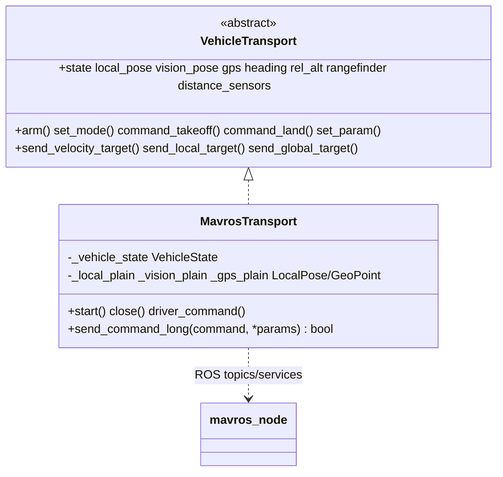

# MAVROS Transport

`MavrosTransport` connects the shared [vehicle core](../vehicle/README.md) to a running [`mavros_node`](https://github.com/mavlink/mavros). It backs the same vehicle over MAVROS for both firmwares (`MavrosDrone` for ArduPilot, `Px4MavrosDrone` for PX4) — the firmware-agnostic flight, navigation, takeoff/land, GPS, RTL, and PID behavior is **shared and documented in [`vehicle/README.md`](../vehicle/README.md)** (ArduPilot setpoint/parameter specifics in [`ardupilot/README.md`](../ardupilot/README.md)).

> For the public `Drone` API, navigation methods, references, altitude sources, takeoff/land detection, and PID configuration, see the [vehicle core README](../vehicle/README.md).

## Role

[`MavrosTransport`](transport.py) implements the [`VehicleTransport`](../vehicle/transport.py) interface against MAVROS:

- **Telemetry** ← ROS **subscriptions**. Each callback converts a `mavros_msgs`/`geometry_msgs`/`sensor_msgs` message into a plain `vehicle/types` value and stores it atomically.
- **Commands** → ROS **service clients** (`/mavros/set_mode`, `/mavros/cmd/*`, `/mavros/param/set_parameters`).
- **Setpoints** → ROS **publishers** (`/mavros/setpoint_raw/local`, `/mavros/setpoint_position/global`).
- **Frame conversion** is handled by MAVROS itself (ENU↔NED), so the transport publishes ROS-convention values directly.



`MavrosDrone` is simply `ArduPilotDrone` built with a `MavrosTransport`, and `Px4MavrosDrone` is `Px4Drone` built with the same transport (see [`drone.py`](drone.py) and [`../px4/mavros_drone.py`](../px4/mavros_drone.py)).

## Requirements

MAVROS is an opt-in dependency (it is not part of the core SDK install). Install it once with `make drone-mavros` (or `./scripts/setup.sh drone mavros`), which adds `ros-<distro>-mavros`/`-mavros-extras` and the GeographicLib datasets.

A `mavros_node` must then be bridging the FCU. The transport can launch it for you when `MavrosConfig.start_driver=True`:

```
ros2 launch mavros apm.launch fcu_url:=<connection_string>
```

`MavrosConfig.connection_string` is a MAVROS [`fcu_url`](https://github.com/mavlink/mavros/blob/ros2/mavros/README.md) (e.g. `serial:///dev/ttyUSB0:921600`, `tcp://127.0.0.1:5760`), **not** a pymavlink string. See the [MAVLink transport](../mavlink/README.md) for the direct-connection alternative.

## Configuration

```python
import nectar
from nectar.control import DroneFactory, MavrosConfig, PoseSource

nectar.init()

config = MavrosConfig(
    pose_source=PoseSource.VISION,        # VISION (indoor) or GPS (outdoor)
    expect_lidar=True,                    # wait for rangefinder at startup
    connection_string="serial:///dev/ttyUSB0:921600",
    apply_setpoint_params=False,          # True to push WPNAV/GUID params to the FCU on arm
)
drone = DroneFactory.create("mavros", config)
```

`MavrosConfig` exposes a topic name for every subscription (`state_topic`, `lidar_topic`, `local_position_topic`, `vision_topic`, `gps_topic`, `heading_topic`, `rel_alt_topic`), an optional `distance_sensors` tuple (see [Distance Sensors](#distance-sensors)), plus `pid_config_file` / `setpoint_config_file` / `apply_setpoint_params` (consumed by the shared core). The pose source selects the indoor vs outdoor subscription set.

**SITL presets** (in [`config.py`](../config.py)): `SITL_CONFIG`, `SITL_GPS_CONFIG`, `SITL_GAZEBO_CONFIG`, `SITL_VISION_CONFIG`.

## Telemetry Mapping

Subscriber callbacks convert ROS messages to the core's plain types:

| ROS topic | ROS type | Core type | Stored as |
|---|---|---|---|
| `/mavros/state` | `mavros_msgs/State` | `VehicleState` | `state` |
| `/mavros/local_position/pose` | `geometry_msgs/PoseStamped` | `LocalPose` | `local_pose` |
| `/mavros/vision_pose/pose_cov` | `geometry_msgs/PoseWithCovarianceStamped` | `LocalPose` | `vision_pose` |
| `/mavros/vision_pose/pose` | `geometry_msgs/PoseStamped` | `LocalPose` | `vision_pose` |
| `/mavros/global_position/global` | `sensor_msgs/NavSatFix` | `GeoPoint` | `gps` |
| `/mavros/global_position/rel_alt` | `std_msgs/Float64` | `float` | `rel_alt` |
| `/mavros/global_position/compass_hdg` | `std_msgs/Float64` | `float` | `heading` |
| `/mavros/rangefinder/rangefinder` | `sensor_msgs/Range` | `float` | `rangefinder` |

`/mavros/state` is subscribed with `TRANSIENT_LOCAL` durability so the latest cached state is delivered on subscribe (reliably catching arm/mode changes). The vision subscription is chosen at runtime: a `PoseWithCovarianceStamped` callback when the topic name contains `pose_cov`, otherwise a plain `PoseStamped`. Indoor (`pose_source=VISION`) subscribes to the vision topic; outdoor subscribes to GPS, rel-alt, and compass heading.

## Distance Sensors

`lidar_topic` feeds the downward `rangefinder` used for altitude. To expose additional rangefinders or proximity sectors (`distance_sensors` / `get_distance(orientation)` on the drone), two sides must line up:

1. MAVROS must publish them. Its [`distance_sensor`](https://github.com/mavlink/mavros/blob/ros2/mavros_extras/src/plugins/distance_sensor.cpp) plugin maps each FCU `DISTANCE_SENSOR` id to a `sensor_msgs/Range` topic through the plugin's per-sensor parameters.
2. The SDK must subscribe to those topics. `Range` carries no id or orientation, so declare each one in `MavrosConfig.distance_sensors` to tag the incoming readings:

```python
from nectar.control import MavrosConfig, DistanceSensorTopic, SensorOrientation

config = MavrosConfig(
    distance_sensors=(
        DistanceSensorTopic("/mavros/distance_sensor/rangefinder_fwd", SensorOrientation.FORWARD, sensor_id=1),
        DistanceSensorTopic("/mavros/distance_sensor/rangefinder_left", SensorOrientation.LEFT, sensor_id=2),
    ),
)
```

`sensor_type` is derived from `Range.radiation_type`; `signal_quality` is not available over MAVROS and stays `None`. The direct [MAVLink transport](../mavlink/README.md) needs none of this, reading id and orientation straight from `DISTANCE_SENSOR`. See the [vehicle core README](../vehicle/README.md#distance-sensors) for the data model.

## ROS2 Topics and Services

### Subscribers

| Topic | Type | Purpose |
|-------|------|---------|
| `/mavros/state` | State | FCU connection, mode, armed |
| `/mavros/local_position/pose` | PoseStamped | EKF local position (always) |
| `/mavros/vision_pose/pose_cov` · `/mavros/vision_pose/pose` | PoseWithCovarianceStamped · PoseStamped | Vision pose (indoor) |
| `/mavros/global_position/global` | NavSatFix | GPS position (outdoor) |
| `/mavros/global_position/rel_alt` | Float64 | Relative altitude (outdoor) |
| `/mavros/global_position/compass_hdg` | Float64 | Compass heading (outdoor) |
| `/mavros/rangefinder/rangefinder` | Range | Lidar altitude |

### Publishers

| Topic | Type | Purpose |
|-------|------|---------|
| `/mavros/setpoint_raw/local` | PositionTarget | Velocity and local-position setpoints |
| `/mavros/setpoint_position/global` | GeoPoseStamped | GPS position setpoints (outdoor) |
| `/mavros/setpoint_raw/global` | GlobalPositionTarget | GPS raw setpoints (outdoor) |

Local setpoints use a velocity bitmask (velocity + yaw-rate active) for `move_velocity` and a position bitmask (position + yaw active) for local position targets. MAVROS translates `PositionTarget` to [`SET_POSITION_TARGET_LOCAL_NED`](https://mavlink.io/en/messages/common.html#SET_POSITION_TARGET_LOCAL_NED) (see [`setpoint_mixin.hpp`](https://github.com/mavlink/mavros/blob/ros2/mavros/include/mavros/setpoint_mixin.hpp)).

### Services

| Service | Type | Purpose |
|---------|------|---------|
| `/mavros/set_mode` | SetMode | Change flight mode |
| `/mavros/cmd/arming` | CommandBool | Arm/disarm motors |
| `/mavros/cmd/takeoff` | CommandTOL | Takeoff command |
| `/mavros/cmd/land` | CommandTOL | Land command |
| `/mavros/cmd/set_home` | CommandHome | Set home position |
| `/mavros/cmd/command` | CommandLong | Generic MAVLink commands (`set_speed`, `do_servo`, disarm) |
| `/mavros/param/set_parameters` | SetParameters | Set FCU parameters |

## Service-Call Behavior

All service calls go through `BaseDrone._call_service`, which is deadlock-safe: per the [ROS 2 sync/async guidance](https://docs.ros.org/en/humble/How-To-Guides/Sync-Vs-Async.html) it calls `call_async` and blocks on the future while the SDK executor keeps spinning callbacks on a background thread. It returns the **response object** (or `None` on timeout/error); it only validates response fields when a `validator` is passed.

The transport interprets responses as follows:

| Command | Method | Success condition |
|---|---|---|
| set_mode, arm, takeoff, land, set_home, disarm | `bool(res)` | **Service-ACK heuristic** — a returned response counts as success |
| generic `COMMAND_LONG` (`set_speed`, `do_servo`) | `send_command_long` | `bool(res) and res.success` |
| `set_param` | — | all `results[].successful` |

**Why the service-ACK heuristic for arm/takeoff/land**: validating `res.success` / `res.result` on these services produced false negatives and unnecessary retries, so the transport treats a well-formed MAVROS response as acceptance and lets the vehicle core confirm the outcome from telemetry: `arm()` polls `is_armed`/mode, and takeoff/land use [`FlightSequencer`](../vehicle/README.md#takeoff-and-landing) settle detection. Generic `COMMAND_LONG` has no follow-up state to poll, so it still checks `res.success`.

### MAV_RESULT Codes

MAVROS command services report [MAVLink MAV_RESULT](https://mavlink.io/en/messages/common.html#MAV_RESULT) in the `result` field: `0 ACCEPTED`, `1 TEMPORARILY_REJECTED`, `2 DENIED`, `3 UNSUPPORTED`, `4 FAILED`, `5 IN_PROGRESS`.

## Indoor Vision

With MAVROS, the FCU's EKF (ArduPilot EKF3 / PX4 EKF2) receives external navigation through MAVROS' own vision plugin: an external pose source publishes to `/mavros/vision_pose/pose_cov` (or `/pose`), and MAVROS converts ENU→NED and sends [`VISION_POSITION_ESTIMATE`](https://mavlink.io/en/messages/common.html#VISION_POSITION_ESTIMATE) to the FCU. The transport only **subscribes** to the same topic to expose `vision_pose` for companion-side PID navigation.

- **D435i + Isaac ROS Visual SLAM** (current): `D435i → isaac_ros_visual_slam → relay → /mavros/vision_pose/pose_cov`
- **T265 + [vision_to_mavros](https://github.com/Black-Bee-Drones/vision_to_mavros)** (legacy/fallback): `T265 VIO → /tf → vision_to_mavros (ENU alignment) → /mavros/vision_pose/pose`

Per-firmware FCU parameters (sources, rate, height source) and the EKF-origin step are documented in [Localization → FCU setup](../localization/README.md#fcu-setup) (ArduPilot EKF-origin detail: [EKF Origin](../ardupilot/README.md#ekf-origin-indoor-requirement)). The direct [MAVLink transport](../mavlink/README.md) replaces this MAVROS relay with a built-in `VisionPoseBridge`.

## References

- [MAVROS GitHub](https://github.com/mavlink/mavros) · [MAVROS ROS2 API](https://docs.ros.org/en/humble/p/mavros/) · [MAVROS Wiki](https://wiki.ros.org/mavros)
- [SET_POSITION_TARGET_LOCAL_NED](https://mavlink.io/en/messages/common.html#SET_POSITION_TARGET_LOCAL_NED) · [MAV_RESULT](https://mavlink.io/en/messages/common.html#MAV_RESULT) · [VISION_POSITION_ESTIMATE](https://mavlink.io/en/messages/common.html#VISION_POSITION_ESTIMATE)
- [ROS 2 Sync vs Async Service Clients](https://docs.ros.org/en/humble/How-To-Guides/Sync-Vs-Async.html) · [ROS 2 Executors](https://docs.ros.org/en/humble/Concepts/Intermediate/About-Executors.html)
- [vision_to_mavros](https://github.com/Black-Bee-Drones/vision_to_mavros) · [Isaac ROS cuVSLAM with RealSense](https://nvidia-isaac-ros.github.io/concepts/visual_slam/cuvslam/tutorial_realsense.html)
- Shared flight logic: [`vehicle/README.md`](../vehicle/README.md) · ArduPilot specifics: [`ardupilot/README.md`](../ardupilot/README.md)
