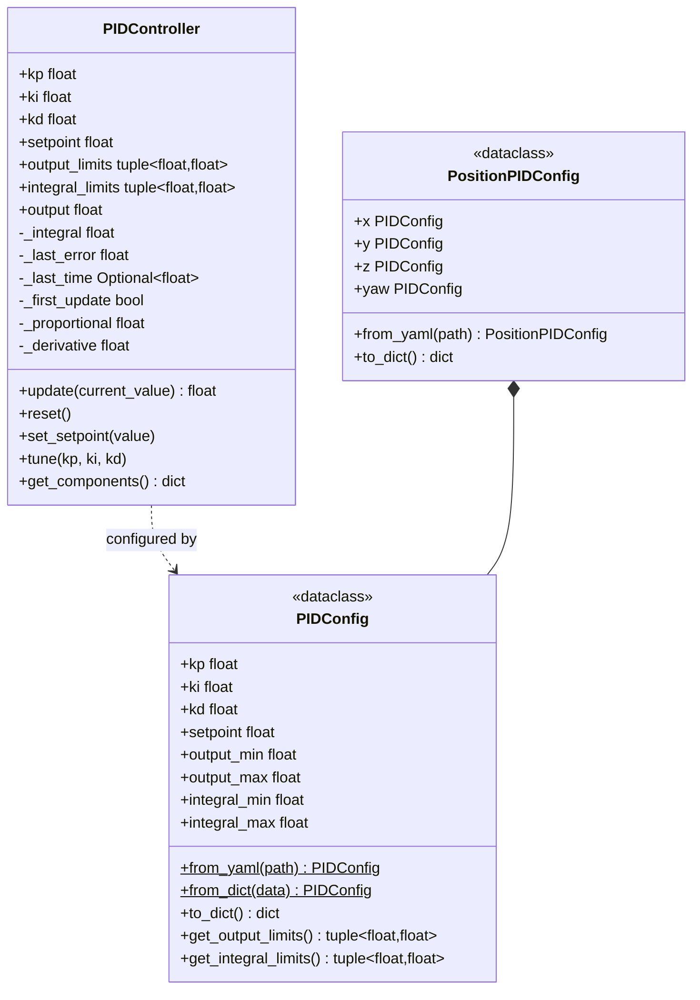

# PID Controller Module

Configurable PID controller implementation with YAML-based tuning and multi-axis support for position control.

## Architecture



## PIDController

Standard PID implementation with anti-windup and output clamping.

### API

```python
from nectar.control.pid import PIDController

pid = PIDController(
    kp: float = 1.0,                      # Proportional gain
    ki: float = 0.0,                      # Integral gain
    kd: float = 0.0,                      # Derivative gain
    setpoint: float = 0.0,                # Target value
    output_limits: tuple = (-1.0, 1.0),   # Output clamp
    integral_limits: tuple = (-1.0, 1.0)  # Anti-windup
)
```

### Control Loop

```python
control_output = pid.update(current_value: float) -> float
```

**Algorithm**:
```
1. Calculate error: e(t) = setpoint - current_value
2. Proportional term: P = kp × e(t)
3. Integral term: I = ki × ∫e(t)dt (clamped to integral_limits)
4. Derivative term: D = kd × de/dt
5. Output = P + I + D (clamped to output_limits)
```

**Delta Time**: Automatically computed from `time.time()` between updates.

### Methods

```python
pid.update(current_value)              # Returns control output
pid.reset()                            # Clear integral, previous error
pid.set_setpoint(value)                # Change target
pid.tune(kp, ki, kd)                   # Update gains
pid.get_components()                   # Returns {'p': ..., 'i': ..., 'd': ...}
```

## PIDConfig

Configuration dataclass for single-axis PID.

```python
from nectar.control.pid import PIDConfig

config = PIDConfig(
    kp=0.5,
    ki=0.0,
    kd=0.0,
    output_min=-0.42,
    output_max=0.42,
    integral_min=-0.5,
    integral_max=0.5
)
```

### Loading from YAML

```yaml
# pid_config.yaml
kp: 0.5
ki: 0.0
kd: 0.0
output_min: -0.42
output_max: 0.42
integral_min: -0.5
integral_max: 0.5
```

```python
config = PIDConfig.from_yaml("pid_config.yaml")
```

### Loading from Dictionary

```python
config = PIDConfig.from_dict({
    "kp": 0.5,
    "output_min": -0.42,
    "output_max": 0.42
})
```

**Default Values**: Unspecified fields use defaults (ki=0.0, kd=0.0, etc.).

## PositionPIDConfig

Multi-axis configuration for position control (X, Y, Z, yaw).

```python
from nectar.control.pid import PositionPIDConfig, PIDConfig

config = PositionPIDConfig(
    x=PIDConfig(kp=0.5, output_min=-0.42, output_max=0.42),
    y=PIDConfig(kp=0.5, output_min=-0.42, output_max=0.42),
    z=PIDConfig(kp=0.22, output_min=-0.15, output_max=0.1),
    yaw=PIDConfig(kp=0.5, ki=0.1, output_min=-0.2, output_max=0.2)
)
```

### YAML Format

```yaml
# position_config.yaml
x:
  kp: 0.5
  ki: 0.0
  kd: 0.0
  output_min: -0.42
  output_max: 0.42
  integral_min: -0.5
  integral_max: 0.5

y:
  kp: 0.5
  output_min: -0.42
  output_max: 0.42

z:
  kp: 0.22
  output_min: -0.15
  output_max: 0.1

yaw:
  kp: 0.5
  ki: 0.1
  output_min: -0.2
  output_max: 0.2
  integral_min: -0.05
  integral_max: 0.05
```

```python
config = PositionPIDConfig.from_yaml("position_config.yaml")
```

## Usage in Drone Control

### ArduPilotDrone Integration

PID controllers created per-axis from configuration:

```python
# In VehicleNavigator.navigate_pid()
pid_x = self._create_pid("x")      # Creates from self._pid_config.x
pid_y = self._create_pid("y")
pid_z = self._create_pid("z")
pid_yaw = self._create_pid("yaw")

# Control loop
while True:
    dx, dy, dz, dyaw = self._compute_errors(target, yaw)

    vx = pid_x.update(-dx)
    vy = pid_y.update(-dy)
    vz = pid_z.update(-dz)
    vyaw = pid_yaw.update(-dyaw)

    drone.move_velocity(vx, vy, vz, vyaw)
```

### Configuration Loading

**Automatic** (based on pose source):
```python
# Indoor mode loads: ardupilot/config/position_indoor.yaml
# Outdoor mode loads: ardupilot/config/position_outdoor.yaml
# SITL presets use the position_sim_indoor.yaml / position_sim_outdoor.yaml variants.
config = MavrosConfig(pose_source=PoseSource.VISION)
drone = DroneFactory.create("mavros", config)
```

**Explicit**:
```python
config = MavrosConfig(
    pose_source=PoseSource.VISION,
    pid_config_file="/path/to/custom.yaml"
)
```

**Runtime**:
```python
drone.set_pid_config("/path/to/config.yaml")
drone.set_pid_config(config_dict)
drone.set_pid_config(PositionPIDConfig(...))
```

## Tuning Guidelines

### Proportional Gain (kp)

Controls response magnitude.

- **Higher kp**: Faster response, potential overshoot
- **Lower kp**: Slower response, more stable

**Indoor**: 0.3-0.6 (vision pose is accurate)
**Outdoor**: 0.6-1.0 (GPS noise requires higher gain)

### Integral Gain (ki)

Eliminates steady-state error.

- **Higher ki**: Faster error elimination, potential instability
- **Lower ki**: Slower convergence, more stable

**Typical**: 0.0-0.1 (often not needed for position control)
**Yaw**: 0.05-0.15 (helps with compass drift)

### Derivative Gain (kd)

Dampens oscillations and overshoot.

- **Higher kd**: More damping, sensitive to noise
- **Lower kd**: Less damping, smoother response

**Position Control**: Usually 0.0 (velocity commands already provide damping)

### Output Limits

Velocity command limits (m/s for position, rad/s for yaw).

**Indoor**: ±0.4-0.6 m/s (safe in constrained space)
**Outdoor**: ±0.8-1.5 m/s (more aggressive allowed)
**Vertical**: ±0.15-0.8 m/s (asymmetric: slower ascent)

### Integral Limits

Anti-windup protection.

**Typical**: 10-20% of output limits
**Purpose**: Prevent integral term from accumulating during saturation

## Default Configurations

### Indoor (Vision-based)

```yaml
x:
  kp: 0.5
  output_min: -0.42
  output_max: 0.42

y:
  kp: 0.5
  output_min: -0.42
  output_max: 0.42

z:
  kp: 0.22
  output_min: -0.15
  output_max: 0.1

yaw:
  kp: 0.5
  ki: 0.1
  output_min: -0.2
  output_max: 0.2
```

**Rationale**:
- Lower velocities for safety indoors
- Asymmetric Z limits (slower ascent to avoid ceiling collisions)
- Yaw integral term compensates for vision pose drift

### Outdoor (GPS-based)

```yaml
x:
  kp: 0.8
  output_min: -1.0
  output_max: 1.0

y:
  kp: 0.8
  output_min: -1.0
  output_max: 1.0

z:
  kp: 0.5
  output_min: -0.8
  output_max: 0.8

yaw:
  kp: 0.5
  ki: 0.1
  output_min: -0.3
  output_max: 0.3
```

**Rationale**:
- Higher gains compensate for GPS latency and noise
- Larger velocity limits for faster waypoint transitions
- Symmetric Z limits (open outdoor environment)

## Examples

### Basic PID Control

```python
from nectar.control.pid import PIDController

altitude_pid = PIDController(
    kp=0.5,
    ki=0.1,
    kd=0.0,
    setpoint=10.0,
    output_limits=(-0.5, 0.5)
)

while True:
    current_altitude = get_altitude()
    vz = altitude_pid.update(current_altitude)
    set_velocity_z(vz)
```

### Position Control with Configuration

```python
from nectar.control.pid import PositionPIDConfig

config = PositionPIDConfig.from_yaml("ardupilot/config/position_outdoor.yaml")

pid_x = PIDController(
    kp=config.x.kp,
    ki=config.x.ki,
    kd=config.x.kd,
    output_limits=config.x.get_output_limits(),
    integral_limits=config.x.get_integral_limits()
)
```

### Tuning During Flight

```python
# Start with conservative gains
drone.set_pid_config({
    "x": {"kp": 0.3, "output_min": -0.3, "output_max": 0.3},
    "y": {"kp": 0.3, "output_min": -0.3, "output_max": 0.3},
    "z": {"kp": 0.2, "output_min": -0.2, "output_max": 0.2}
})

drone.move_to(x=2.0, y=0.0, z=0.0)

# Increase gains if response too slow
drone.set_pid_config({
    "x": {"kp": 0.6, "output_min": -0.5, "output_max": 0.5},
    "y": {"kp": 0.6, "output_min": -0.5, "output_max": 0.5}
})

drone.move_to(x=-2.0, y=0.0, z=0.0)
```
