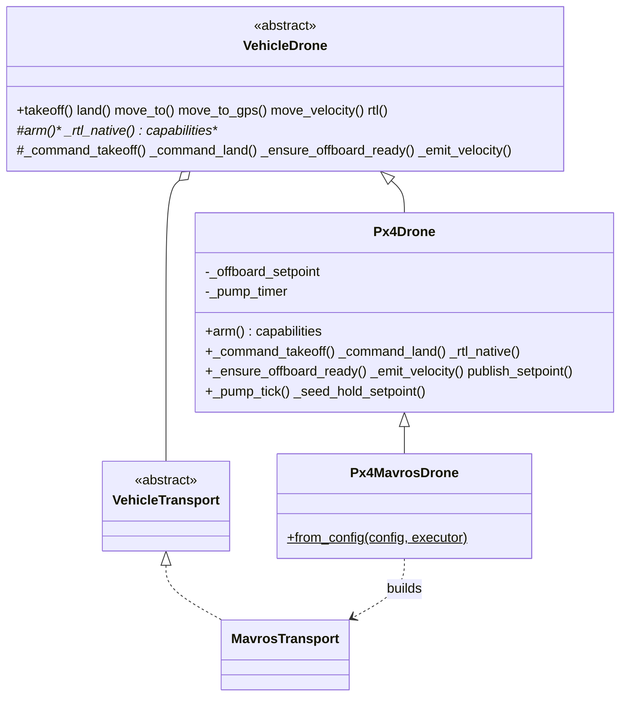

# PX4 Firmware

[PX4](https://px4.io/) support built on the shared [vehicle core](../vehicle/README.md). `Px4Drone` implements the PX4-specific flight semantics; the transport-agnostic navigation, PID, sequencer, and movement API are inherited unchanged from `VehicleDrone`.

> For the public `Drone` API, navigation methods, references, altitude sources, and takeoff/land detection, see the [Vehicle Core](../vehicle/README.md). This README covers only what is PX4-specific.

## Role

`Px4Drone` ([`drone.py`](drone.py)) specializes [`VehicleDrone`](../vehicle/drone.py) for PX4:

- **Offboard control**: PX4 only accepts `OFFBOARD` mode — and only arms in it — while setpoints stream faster than 2 Hz, and it drops out of offboard if the stream stalls for ~500 ms ([PX4 offboard](https://docs.px4.io/main/en/ros2/offboard_control.html)). A background ROS timer (the *offboard pump*) republishes the last commanded setpoint at `offboard_rate_hz` (default 20 Hz) so the vehicle stays in offboard between explicit movement commands.
- **Arm sequence**: seed a hold setpoint → stream it → switch to `OFFBOARD` → arm.
- **Takeoff**: climbs to an offboard position setpoint (no mode change), reusing the velocity-based settle detection in [`FlightSequencer`](../vehicle/sequencer.py).
- **Land / RTL**: PX4 `AUTO.LAND` / `AUTO.RTL` modes; RTL altitude via `RTL_RETURN_ALT`, loiter-vs-land via `RTL_LAND_DELAY`.

`Px4Drone` is transport-agnostic; it is paired with one of three backends so a mission runs unchanged on any of them:

- `Px4MavrosDrone` (`px4`, [`mavros_drone.py`](mavros_drone.py)) — `Px4Drone` on [`MavrosTransport`](../mavros/README.md), the same MAVROS plumbing the ArduPilot drones use, reached through `mavros px4.launch`.
- `Px4MavlinkDrone` (`px4_mavlink`, [`mavlink_drone.py`](mavlink_drone.py)) — `Px4Drone` on the firmware-neutral [`PymavlinkTransport`](../mavlink/README.md) with a `Px4ModeCodec`: a direct MAVLink link, no MAVROS. Mirrors ArduPilot's `mavlink` drone.
- `Px4DdsDrone` (`px4_dds`, [`dds_drone.py`](dds_drone.py)) — `Px4Drone` on [`Px4DdsTransport`](dds_transport.py), native PX4 uORB over uXRCE-DDS (see below).

PX4 flight-mode encoding for the MAVLink backends lives once in [`modes.py`](modes.py) (`MODE_TO_PX4` + `px4_mode_name`), shared by `Px4ModeCodec` and `Px4DdsTransport`.

## Architecture



## Flight modes

PX4 [flight modes](https://docs.px4.io/main/en/flight_modes_mc/) used by this SDK (MAVROS `custom_mode` strings):

| Mode | Use |
|------|-----|
| `OFFBOARD` | Companion setpoint control (move_to / move_velocity). Required for SDK navigation. |
| `AUTO.LAND` | Land at the current position (`land()`). |
| `AUTO.RTL` | Return to launch (`rtl(method=NATIVE)`). |

Unlike ArduPilot's single `GUIDED` mode, PX4 separates offboard control from the autonomous takeoff/land/RTL modes, and offboard requires the continuous setpoint stream described above.

## Capabilities

`Px4Drone.capabilities` is derived from the configured `pose_source` (see [`capabilities.py`](../capabilities.py)): `PID_NAV`, `LOCAL_SETPOINT`, `VELOCITY_BODY`/`WORLD`/`TAKEOFF`, `ACTUATOR`, `GRIPPER`, `PARAMS`, `NATIVE_RTL`, `OBSTACLE_AVOIDANCE`, `RANGEFINDER`, `DISTANCE_SENSORS`, plus `GPS_NAV`/`GLOBAL_SETPOINT` (outdoor) or `VISION_POSE` (indoor). PX4 declares `ACTUATOR` (`DO_SET_ACTUATOR`) and `GRIPPER` (`DO_GRIPPER`) for payloads, but not ArduPilot's per-channel PWM `SERVO` path (`do_servo`); see [Payload actuators](#payload-actuators--gripper).

## Configuration

```python
import nectar
from nectar.control import DroneFactory, Px4MavrosConfig, PoseSource

nectar.init()

config = Px4MavrosConfig(
    pose_source=PoseSource.GPS,                   # GPS (outdoor) or VISION (indoor)
    connection_string="udp://:14540@127.0.0.1:14580",  # PX4 SITL offboard API
    offboard_rate_hz=20.0,                        # setpoint stream rate (>2 Hz)
)
drone = DroneFactory.create("px4", config)
```

`Px4MavrosConfig` carries the MAVROS topic names (identical to `MavrosConfig`), `connection_string` (a MAVROS `fcu_url`), `offboard_rate_hz`, `mavros_launch` (default `px4.launch`), and the setpoint-config fields `setpoint_config_file` / `apply_setpoint_params` (see below).

**SITL presets** (in [`config.py`](../config.py)): `PX4_SITL_CONFIG`, `PX4_SITL_GAZEBO_CONFIG`, `PX4_SITL_VISION_CONFIG`.

## Setpoint configuration (speed / acceleration)

PX4's analog of ArduPilot's WPNAV parameters is the multicopter position-controller `MPC_*` family. [`Px4SetpointConfig`](setpoint_config.py) carries SI-unit speed/accel/jerk limits and maps them to `MPC_*` (see the [PX4 Controller Diagrams](https://docs.px4.io/main/en/flight_stack/controller_diagrams) and [Parameter Reference](https://docs.px4.io/main/en/advanced/parameter_reference)):

| Field | PX4 param | Meaning |
|-------|-----------|---------|
| `speed` | `MPC_XY_CRUISE` | Horizontal cruise speed |
| `vel_max` | `MPC_XY_VEL_MAX` | Horizontal speed hard cap (raised to ≥ `speed`) |
| `speed_up` / `speed_down` | `MPC_Z_VEL_MAX_UP` / `MPC_Z_VEL_MAX_DN` | Climb / descent speed |
| `accel` | `MPC_ACC_HOR` | Horizontal acceleration |
| `accel_up` / `accel_down` | `MPC_ACC_UP_MAX` / `MPC_ACC_DOWN_MAX` | Vertical acceleration |
| `jerk` | `MPC_JERK_AUTO` | Trajectory jerk limit |
| `yaw_rate` | `MPC_YAWRAUTO_MAX` | Auto yaw rate (deg/s) |
| `takeoff_speed` | `MPC_TKO_SPEED` | Takeoff climb speed |

These govern the **POSITION / POSITION_GLOBAL** setpoint paths and the PX4 offboard takeoff climb. The default **PID / PID_EKF** path is unaffected — there the SDK computes velocity and the ceiling is the per-axis PID output clamp (see [vehicle/README.md](../vehicle/README.md#pid-configuration)), identical to ArduPilot.

Set via config (`apply_setpoint_params=True` pushes the params to the FCU on `arm()`) or at runtime; `set_speed` changes a single axis live:

```python
from nectar.control import DroneFactory, Px4MavrosConfig, Px4SetpointConfig

drone = DroneFactory.create("px4", Px4MavrosConfig(
    setpoint_config_file="setpoint_outdoor.yaml", apply_setpoint_params=True,
))
drone.set_setpoint_config({"speed": 3.0, "accel": 2.5})  # push MPC_* to the FCU
drone.set_speed(2.0, "horizontal")                        # live: MPC_XY_CRUISE/VEL_MAX
```

Bundled presets live in [`config/`](config) (`setpoint_outdoor.yaml`, `setpoint_indoor.yaml`, and the `setpoint_sim_*` SITL variants). **Limitation:** the native uXRCE-DDS backend (`px4_dds`) cannot set parameters, so `apply_setpoint_params` / `set_setpoint_config` / `set_speed` are no-ops there — use the MAVROS or direct-MAVLink backend, or set the `MPC_*` params in QGC.

## Payload actuators / gripper

For payloads (e.g. a release hook), use the firmware-neutral API on any backend:

```python
drone.set_gripper(grab=False)        # MAV_CMD_DO_GRIPPER: release (grab=True closes)
drone.set_actuator(index=1, value=1.0)  # MAV_CMD_DO_SET_ACTUATOR: normalized -1..1
```

PX4 maps these to the `Gripper` and `Peripheral Actuator Set` output functions configured in [Actuators](https://docs.px4.io/main/en/config/actuators.html) / [Servo Gripper](https://docs.px4.io/main/en/peripherals/gripper_servo.html). ArduPilot's per-channel `do_servo(channel, pwm)` is not available on PX4 (it declares no `SERVO` capability); `set_actuator` / `set_gripper` are the portable replacements.

## Requirements

A `mavros_node` must be bridging the PX4 FCU. The transport launches it for you when `Px4MavrosConfig.start_driver=True`:

```
ros2 launch mavros px4.launch fcu_url:=<connection_string>
```

For PX4 SITL the offboard MAVLink API is on UDP 14540 (`udp://:14540@127.0.0.1:14580`); on hardware use the appropriate serial/UDP `fcu_url`.

## Simulation

PX4 SITL with Gazebo (PX4 starts Gazebo itself), via the unified simulation CLI:

```bash
# Terminal 1: PX4 SITL + Gazebo (shared Nectar outdoor world + x500_nectar),
# offboard on udp 14540. Matched sensors: /front_camera/*, /down_camera, and
# the downward lidar on /mavros/rangefinder/rangefinder.
make sim-start FIRMWARE=px4 ENV=outdoor

# Terminal 2: MAVROS + camera bridges
make sim-bridge FIRMWARE=px4 ENV=outdoor

# Run a script (MAVROS backend)
python3 basic.py --drone px4
```

For the direct-pymavlink backend, drop MAVROS on Terminal 2 and use the
`px4_mavlink` drone (it connects to UDP 14540 itself; the rangefinder arrives as
MAVLink `DISTANCE_SENSOR`, cameras via `ros_gz_bridge`):

```bash
make sim-bridge FIRMWARE=px4 ENV=outdoor PROTOCOL=mavlink   # cameras only, no MAVROS
python3 basic.py --drone px4_mavlink --connection udp:0.0.0.0:14540
```

`make sim-start FIRMWARE=px4 ENV=outdoor` flies PX4 in the same arena as
`make sim-start FIRMWARE=ardupilot ENV=outdoor`, with the same sensor topics, so
missions are firmware-agnostic. Install once with `make sim-install FIRMWARE=px4`.
See the
[Simulation guide](../../../simulation/README.md#shared-world-architecture-one-source-of-truth)
for the shared-world architecture.

## Usage

```python
import nectar
from nectar.control import DroneFactory, PX4_SITL_GAZEBO_CONFIG

nectar.init()
drone = DroneFactory.create("px4", PX4_SITL_GAZEBO_CONFIG)

drone.takeoff(altitude=3.0)
drone.move_to(x=5.0, y=0.0, z=0.0, precision=0.3)
drone.move_to_gps(latitude=-22.413, longitude=-45.449, altitude=15.0)
drone.rtl(land=True)
nectar.shutdown()
```

## Native uXRCE-DDS path (`px4_dds`)

A second transport reaches PX4 directly over its [uXRCE-DDS bridge](https://docs.px4.io/main/en/ros2/user_guide.html) using [`px4_msgs`](https://github.com/PX4/px4_msgs) — no MAVROS. `Px4DdsDrone` is `Px4Drone` on a [`Px4DdsTransport`](dds_transport.py):

- Telemetry on `/fmu/out/*` (`VehicleLocalPosition`, `VehicleStatus`, `VehicleGlobalPosition`) with the `sensor_data` QoS PX4 requires.
- Commands via `/fmu/in/vehicle_command` (`VehicleCommand`); setpoints via `/fmu/in/offboard_control_mode` + `/fmu/in/trajectory_setpoint`.
- PX4 NED/FRD is converted to/from the core's ENU/FLU in the transport.

Requirements (one-time) — builds `px4_msgs` and the agent (against ROS's Fast-DDS):

```bash
make sim-install FIRMWARE=px4 ARGS=--native
```

Usage — 3 terminals (PX4 SITL starts the uXRCE-DDS client itself):

```bash
make sim-start  FIRMWARE=px4 ENV=outdoor                 # T1: PX4 SITL + Gazebo
make sim-bridge FIRMWARE=px4 ENV=outdoor PROTOCOL=dds     # T2: MicroXRCEAgent udp4 -p 8888
python3 nectar/nectar/examples/control/basic.py --drone px4_dds --env outdoor
```

```python
from nectar.control import DroneFactory, PX4_DDS_SITL_CONFIG
drone = DroneFactory.create("px4_dds", PX4_DDS_SITL_CONFIG)
```

Notes / limitations:

- **Versioned topics**: PX4 versions some uORB topics (e.g. `vehicle_local_position_v1`, `vehicle_status_v4`). `Px4DdsConfig` exposes `local_position_topic` / `status_topic` / `global_position_topic` (defaults track current PX4 `main`); override them to match a different firmware. `px4_msgs` must be the branch matching your PX4 release.
- `set_param` is not bridged over uXRCE-DDS by default (use QGC or the MAVROS path); native `rtl(method=NATIVE)` still switches to `AUTO.RTL` but cannot push `RTL_RETURN_ALT`.
- Global (GPS) setpoints are local-frame only on the native path; use a PID method or the MAVROS path for `move_to_gps` with `POSITION_GLOBAL`.
- No-sudo setups: if the agent is installed to a user prefix instead of `/usr/local`, add its lib dir to `LD_LIBRARY_PATH` (the `--native` install uses `sudo make install` + `ldconfig`, which avoids this).

## References

- [PX4 User Guide](https://docs.px4.io/) · [Basic Concepts](https://docs.px4.io/main/en/getting_started/px4_basic_concepts.html)
- [Flight Modes (Multicopter)](https://docs.px4.io/main/en/flight_modes_mc/) · [Basic Flying (MC)](https://docs.px4.io/main/en/flying/basic_flying_mc.html)
- [ROS 2 User Guide](https://docs.px4.io/main/en/ros2/) · [ROS 2 Offboard Control](https://docs.px4.io/main/en/ros2/offboard_control.html)
- [PX4 Simulation](https://docs.px4.io/main/en/simulation/) · [Gazebo Simulation](https://docs.px4.io/main/en/sim_gazebo_gz/)
- Shared flight logic: [`vehicle/README.md`](../vehicle/README.md) · MAVROS plumbing: [`mavros/README.md`](../mavros/README.md)
