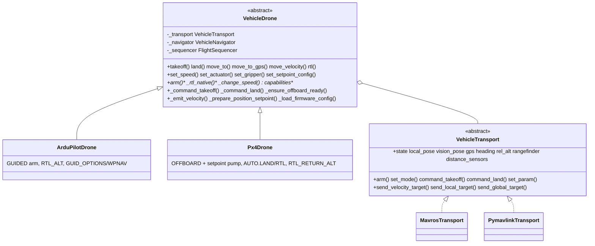
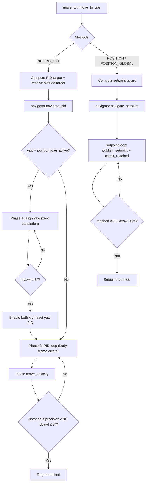

# Vehicle Core

Firmware-agnostic flight logic shared by every MAVLink-class autopilot in the SDK. ArduPilot and PX4 are the **same vehicle behavior reached through different firmware semantics and transports** — all navigation, takeoff/land detection, GPS math, PID control, and movement API live here exactly once. Firmware specializations ([ardupilot](../ardupilot/README.md), [px4](../px4/README.md)) implement only the parts that differ; transports ([mavros](../mavros/README.md), [mavlink](../mavlink/README.md)) implement only the wire plumbing.

> This README is the reference for the shared behavior — navigation methods, reference frames, altitude sources, takeoff/land detection, GPS/EGM96 handling, and PID configuration — and applies to every vehicle (ArduPilot and PX4 alike). Firmware-specific semantics are in [ardupilot/README.md](../ardupilot/README.md) (GUIDED, WPNAV/GUID_OPTIONS, native RTL params) and [px4/README.md](../px4/README.md) (OFFBOARD, mode names, RTL params).

## Design

A two-axis **bridge**: a firmware-semantics class (`VehicleDrone` subclass) is composed with a wire-protocol `VehicleTransport`. The drone side owns flight orchestration on plain, ROS-free types ([`types.py`](types.py)); the transport side converts those to/from its wire format (ROS topics/services, raw MAVLink, or uXRCE-DDS). Identical flight logic therefore serves ArduPilot and PX4 over MAVROS or a direct link without duplication.



## Modules

| File | Responsibility |
| --- | --- |
| `types.py` | Plain dataclasses (`Vec3`, `LocalPose`, `GeoPoint`, `Attitude`, `VehicleState`, `LocalTarget`, `GlobalTarget`, `TargetFrame`). ENU/radians conventions. No ROS imports. |
| `transport.py` | `VehicleTransport` ABC: telemetry read-properties + command/setpoint write-methods + lifecycle. |
| `setpoint_config.py` | `SetpointConfig` base — SI speed/accel/jerk limits, shared YAML/dict I/O and range-clamp; firmware `to_fcu_params` (ArduPilot `WPNAV_*`, PX4 `MPC_*`). |
| `drone.py` | `VehicleDrone(BaseDrone)` — shared flight behavior + firmware hooks. |
| `navigator.py` | `VehicleNavigator` — PID and setpoint navigation loops over plain targets/poses. |
| `target_computer.py` | Stateless target computation (local/GPS offsets → `LocalTarget`/`GlobalTarget`). |
| `gps_utils.py` | EGM96 geoid correction, geodesic arrival checks, global-target construction. |
| `sequencer.py` | `FlightSequencer` — velocity-based takeoff/land settle detection. |

## Firmware hooks

`VehicleDrone` keeps all orchestration and delegates the firmware-specific pieces to overridable hooks:

| Hook | Default | ArduPilot | PX4 |
|------|---------|-----------|-----|
| `arm()` | abstract | GUIDED + (optional) WPNAV params | OFFBOARD + setpoint pump |
| `_command_takeoff(alt)` | transport `command_takeoff` | FCU takeoff command | offboard climb setpoint |
| `_command_land()` | transport `command_land` | FCU land command | `AUTO.LAND` |
| `_rtl_native(alt, land)` | abstract | `RTL_ALT`/`RTL_ALT_FINAL` + `RTL` mode | `RTL_RETURN_ALT`/`RTL_LAND_DELAY` + `AUTO.RTL` |
| `_ensure_offboard_ready()` | no-op | no-op (GUIDED persists) | (re)enter OFFBOARD, keep pump alive |
| `_prepare_position_setpoint(p)` | no-op | sync `WPNAV_RADIUS` | no-op |
| `_emit_velocity(...)` | transport send | transport send | also store for the offboard pump |
| `_change_speed(v, axis)` | abstract | `DO_CHANGE_SPEED` | `MPC_XY_CRUISE`/`MPC_Z_VEL_MAX_*` param |
| `_load_firmware_config()` | load setpoint config | + radius bookkeeping | + start the offboard pump |
| `_apply_setpoint_config()` | `set_param` per param (+alias) | WPNAV cm/s + `WP_*` alias | `MPC_*` (SI) |
| `capabilities` | abstract | declares ArduPilot set | declares PX4 set |

## Conventions

- **Frames**: the core is ENU (x=East, y=North, z=Up) / FLU; transports convert to/from the wire's NED/FRD.
- **Yaw**: radians, ENU (0 = East, CCW positive). Compass *heading* (degrees, NED) is kept separate for GPS body-frame math.
- **Atomicity**: telemetry properties return the most-recent value via whole-object assignment (atomic under the GIL), so the flight thread never sees a half-written pose.

## Connection and Readiness

`connect()` does not return as soon as the transport starts — it waits (up to a timeout) for a live FCU heartbeat, setting `_connected` only once the link is up. After connecting:

- `is_fcu_connected` — FCU heartbeat present (raw link state).
- `is_ready` — connected **and** the driver/transport is running; this is the gate the higher-level calls check before arming or commanding.

## Altitude Types

The FCU exposes [several altitude definitions](https://ardupilot.org/copter/docs/common-understanding-altitude.html); the SDK selects between them with `AltitudeSource`:

| Type | Description | Source | SDK Usage |
|------|-------------|--------|-----------|
| **AGL** (Above Ground Level) | Distance to ground directly below | Rangefinder (lidar) | `AltitudeSource.LIDAR`, terrain following |
| **Relative** | Altitude above HOME/ORIGIN | EKF (baro + GPS) | `AltitudeSource.REL_ALT`, `move_to_gps` |
| **AMSL** (Above Mean Sea Level) | Altitude above mean sea level | EKF + geoid model | Global setpoints |
| **Ellipsoid (WGS84)** | Raw GPS altitude above WGS84 ellipsoid | GPS receiver | Raw `GeoPoint.altitude` |
| **Vision Z** | Z from vision pose, relative to vision origin | External VIO | `AltitudeSource.VISION`, indoor navigation |

**AMSL vs Ellipsoid**: GPS receivers output altitude above the WGS84 ellipsoid, but global setpoints expect AMSL. The difference is the [geoid height](https://en.wikipedia.org/wiki/EGM96), corrected by `GPSUtils` using the EGM96 model.

**Surface Tracking**: with a [downward-facing rangefinder](https://ardupilot.org/copter/docs/common-rangefinder-landingpage.html) in range, the FCU can hold constant AGL ([ArduPilot surface tracking](https://ardupilot.org/copter/docs/terrain-following.html)). `AltitudeSource.LIDAR` implements a similar concept at the SDK level via PID control.

## Coordinate Frames

The FCU uses **NED** (North-East-Down) / **FRD** (Forward-Right-Down) internally. The SDK core uses **ENU** (East-North-Up) / **FLU** (Forward-Left-Up). The transport performs the conversion on egress/ingest — **SDK code always uses ENU/FLU**.

| Frame | SDK (ENU/FLU) | FCU Internal (NED/FRD) | Origin |
|-------|---------------|------------------------|--------|
| **World** | X=East, Y=North, Z=Up | X=North, Y=East, Z=Down | EKF origin |
| **Body** | X=Forward, Y=Left, Z=Up | X=Forward, Y=Right, Z=Down | Vehicle center |
| **WGS84** | Latitude, Longitude, Altitude | Same | Earth reference ellipsoid |

The SDK's `MoveReference` enum maps to a wire `TargetFrame`:

| MoveReference | TargetFrame | Velocity meaning (SDK input) |
|---|---|---|
| **BODY** | BODY (FRAME_BODY_NED) | vx=forward, vy=left, vz=up (heading-relative) |
| **WORLD** | LOCAL (FRAME_LOCAL_NED) | vx=east, vy=north, vz=up (absolute directions) |
| **TAKEOFF** | BODY (FRAME_BODY_NED) | Velocities in takeoff heading, rotated to current body frame |

The EKF local frame needs an origin — outdoors GPS sets it automatically; indoors it must be set manually before flight (firmware-specific — see [ardupilot/README.md](../ardupilot/README.md#ekf-origin-indoor-requirement)). Without it, the local pose is not published and `FRAME_LOCAL_NED` commands won't work.

## Distance Sensors

`rangefinder` / `AltitudeSource.LIDAR` exposes only the downward sensor used for altitude. Every rangefinder and proximity sector the FCU reports (one `DISTANCE_SENSOR` message per unit) is also available as raw telemetry, for obstacle detection, redundancy, or verification:

- `drone.distance_sensors` — `dict[int, DistanceReading]` keyed by MAVLink sensor id, holding the most recent reading per sensor.
- `drone.get_distance(orientation)` — the latest `DistanceReading` facing a given `SensorOrientation`, or `None`.

`SensorOrientation` mirrors the [MAV_SENSOR_ORIENTATION](https://mavlink.io/en/messages/common.html#MAV_SENSOR_ORIENTATION) values used for distance sensors: `FORWARD`, the yaw sectors (`FORWARD_RIGHT`, `RIGHT`, `BACK_RIGHT`, `BACK`, `BACK_LEFT`, `LEFT`, `FORWARD_LEFT`), `UP`, `DOWN`, and `OTHER`. Each `DistanceReading` carries `distance`, `orientation`, `min_distance` / `max_distance`, `sensor_id`, `sensor_type` ([MAV_DISTANCE_SENSOR](https://mavlink.io/en/messages/common.html#MAV_DISTANCE_SENSOR)), `signal_quality` (when reported), `raw_orientation`, and a monotonic `timestamp`.

Sensor setup is on the FCU side (e.g. ArduPilot `RNGFNDx_*` [rangefinder setup](https://ardupilot.org/copter/docs/common-rangefinder-setup.html) and, for horizontal sectors, `PRXx_*` [proximity sensors](https://ardupilot.org/copter/docs/common-proximity-landingpage.html)). The downward sensor (`SensorOrientation.DOWN`) also updates `rangefinder`. The direct MAVLink transport collects all readings automatically; the MAVROS transport requires them declared in config (see the [MAVROS README](../mavros/README.md#distance-sensors)).

## Takeoff and Landing

Liftoff/touchdown detection lives in [`FlightSequencer`](sequencer.py). Detection is **velocity-based**: a hovering or grounded airframe has `|dz/dt| ≈ 0` even when the rangefinder/EKF/vision spike ±0.2–0.3 m for a fraction of a second. This is drone-size agnostic — it tracks rate-of-change, not absolute altitude — so it works regardless of where the rangefinder reads zero (body height, hook/payload offset).

### Takeoff

```python
drone.takeoff(altitude=1.5)  # defaults: max_retries=2, adjust_altitude=True, precision=0.12m, timeout=25s
drone.takeoff(altitude=2.0, adjust_altitude=False)
```

**Sequence** (per attempt):

1. **Arm**: enter the firmware's offboard/guided mode and arm, polling vehicle state to confirm each step (GUIDED for ArduPilot, OFFBOARD for PX4 — see the firmware READMEs).
2. **Spin-up**: short hardware-safety delay (`_SPIN_UP_DELAY`).
3. **Takeoff position**: captured on the first attempt only (used by `MoveReference.TAKEOFF` and RTL).
4. **Takeoff command**: `_command_takeoff(altitude)` (FCU takeoff command on ArduPilot, an offboard climb setpoint on PX4).
5. **Wait for liftoff + settle**: `wait_takeoff_settle(start_alt, start_alt + altitude, timeout)`. No fixed sleep.
6. **Adjust** (if `adjust_altitude=True` and off-target by more than `precision`): `move_to(z=altitude, reference=TAKEOFF, method=PID)`.

**Settle detection** — the climb is declared settled when **all** hold:

- **Lifted**: altitude rose by `_LIFTOFF_DELTA` above `start_alt`.
- **Target-proximity gate**: altitude is at or above `floor = target_alt - _settle_band`, where `_settle_band = min(_SETTLE_ALT_TOLERANCE, _SETTLE_ALT_FRACTION × climb)`. This prevents a slow initial liftoff (low velocity, still near the ground) from being mistaken for a completed takeoff. The band scales with the commanded climb, so short hops use a tight gate and tall climbs are not forced to hit the target exactly (the post-settle adjustment refines the remainder).
- **Velocity**: the mean vertical velocity over `_SETTLE_WINDOW` is below `_SETTLE_VELOCITY`.

Climb progress (altitude, gain, vertical velocity) is logged at roughly 1 Hz so a long takeoff stays observable.

**Short-circuits**:
- Already airborne (`is_airborne`): skip the flow and return success.
- Settled but `height_gain < _LIFTOFF_DELTA` while `is_airborne` reports flight: accept (sensor-glitch tolerance).
- Liftoff never detected after `timeout`: disarm and retry; on the last attempt, fail.

**Tunables** (class constants on `FlightSequencer`):

| Constant | Default | Meaning |
|---|---|---|
| `_SPIN_UP_DELAY` | 2.7 s | Post-arm hardware-safety delay before the takeoff command |
| `_LIFTOFF_DELTA` | 0.08 m | Rise above `start_alt` to consider lifted |
| `_SETTLE_WINDOW` | 0.8 s | Rolling window over which vertical velocity is averaged |
| `_SETTLE_VELOCITY` | 0.25 m/s | Vertical speed below which the hover is declared settled |
| `_SETTLE_POLL` | 0.1 s | Poll interval for settle/landed loops |
| `_SETTLE_LOG_INTERVAL` | 1.0 s | Throttle for the climb-progress log |
| `_SETTLE_ALT_TOLERANCE` | 0.5 m | Maximum settle band below target |
| `_SETTLE_ALT_FRACTION` | 0.3 | Fraction of the climb used as the settle band |

If detection still times out (very noisy lidar, slow climb that never fully stops), raise `_SETTLE_VELOCITY` or shorten `_SETTLE_WINDOW`. The end-of-takeoff adjustment still pulls the drone to within `precision`, so a permissive velocity threshold costs nothing in final altitude accuracy.

### Land

```python
drone.land()              # default timeout=60s
drone.land(timeout=45.0)
```

**Sequence**:
1. Capture `start_alt`.
2. Send `_command_land()` (FCU land command on ArduPilot, `AUTO.LAND` on PX4).
3. **Wait for touchdown** (`wait_landed`): the drone has descended (`start_alt - alt > _LIFTOFF_DELTA` or `alt < _LANDED_THRESHOLD`) **and** its descent velocity over `_LAND_SETTLE_WINDOW` has dropped below `_LAND_STOP_VELOCITY`, **or** the FCU reports `armed=False`.

`land()` returns `True` at touchdown without waiting for the autopilot's disarm delay, so the caller is unblocked as soon as the drone is on the ground. Check `drone.is_armed` to confirm motors are off.

| Constant | Default | Meaning |
|---|---|---|
| `_LANDED_THRESHOLD` | 0.3 m | Absolute "already low" fallback for the descent gate |
| `_LAND_SETTLE_WINDOW` | 1.2 s | Rolling window for descent-velocity calculation |
| `_LAND_STOP_VELOCITY` | 0.05 m/s | Descent rate below which touchdown is declared |

| Symptom | Knob |
|---|---|
| `Land timed out` on very slow descent (< 0.1 m/s) | lower `_LAND_STOP_VELOCITY` (e.g. 0.03) |
| Detection fires while still descending fast | raise `_LAND_STOP_VELOCITY` (e.g. 0.08) |
| Noisy lidar on ground (prop wash) causes false negatives | raise `_LAND_SETTLE_WINDOW` (e.g. 2.0) |
| Real drone — want faster detection | lower `_LAND_SETTLE_WINDOW` (e.g. 0.8) |

## Navigation

Navigation lives in [`VehicleNavigator`](navigator.py), keeping the drone classes focused on the firmware/hardware interface, sensor data, and target computation.

`move_to` and `move_to_gps` accept `method: NavigationMethod` (defaults: `move_to` → `PID_EKF`, `move_to_gps` → `PID`). `rtl` accepts `method: RTLMethod` (default `NAVIGATE`, which uses `PID_EKF` internally).

### Capability Matrix

| Entry Point | PoseSource | Method | Reference | AltitudeSource | Notes |
|------------|-----------|--------|-----------|----------------|-------|
| `move_to` | VISION | PID | BODY, TAKEOFF | AUTO, VISION, LIDAR | Raw vision pose (SDK velocity PID) |
| `move_to` | VISION | PID_EKF | BODY, TAKEOFF | AUTO, VISION, LIDAR | **Default** — EKF local pose (unified frame) |
| `move_to` | VISION | POSITION | BODY, TAKEOFF | N/A | Local setpoint |
| `move_to` | VISION | POSITION_GLOBAL | — | — | Unsupported (no GPS indoors) |
| `move_to` | GPS | PID | BODY, TAKEOFF | AUTO, LIDAR, REL_ALT | Raw GPS (SDK velocity PID) |
| `move_to` | GPS | PID_EKF | BODY, TAKEOFF | AUTO, LIDAR, REL_ALT | **Default** — EKF local pose (unified frame) |
| `move_to` | GPS | POSITION | BODY, TAKEOFF | N/A | Local setpoint |
| `move_to` | GPS | POSITION_GLOBAL | BODY, TAKEOFF | N/A | GPS setpoint with AMSL (long range) |
| `move_to` | any | any | WORLD | any | Unsupported (raises `CapabilityNotSupportedError`) |
| `move_to_gps` | GPS | PID | N/A | REL_ALT | GPS waypoint, raw GPS PID (**default**) |
| `move_to_gps` | GPS | PID_EKF | N/A | REL_ALT | GPS waypoint, EKF local PID |
| `move_to_gps` | GPS | POSITION | — | — | Unsupported (GPS input needs global output) |
| `move_to_gps` | GPS | POSITION_GLOBAL | N/A | N/A | GPS setpoint to FCU |
| `move_to_gps` | VISION | any | N/A | any | Unsupported |
| `move_velocity` | any | N/A | BODY, WORLD, TAKEOFF | N/A | Direct velocity command |

PX4 shares this matrix; the one deviation is `POSITION_GLOBAL` over the native uXRCE-DDS backend (`px4_dds`), where global setpoints are local-frame only — use a PID method or the MAVROS path (see [px4/README.md](../px4/README.md#native-uxrce-dds-path-px4_dds)).

### `move_to` Parameter Behavior

**Axis values — `x`, `y`, `z`, `yaw`**: each can be a `float` or `None`. The behavior depends on the method:

| Value | PID / PID_EKF | POSITION / POSITION_GLOBAL |
|-------|---------------|----------------------------|
| `float` | Active — PID drives this axis | Included in the FCU target |
| `None` | **Disabled** — no velocity on this axis, excluded from the arrival check | Zero offset — holds current position/yaw on this axis |

**Key difference**: with PID methods, `None` truly disables the axis (no velocity, excluded from the distance check). With POSITION methods the FCU receives a full 3D+yaw target and controls all axes; `None` means zero offset (a snapshot of the current value at call time).

> **Note on `None` accuracy**: with **PID**, a disabled axis is uncontrolled — wind or inertia can cause drift with no correction. With **POSITION**, the target for a `None` axis is a snapshot of the current position, which may differ slightly from where you want to be. For precise multi-axis positioning, specify all axes explicitly.

**Reference frames — `reference`**:

| Reference | Origin | Heading | Use case |
|-----------|--------|---------|----------|
| `BODY` | Current position | Current heading | "Move 2m forward from where I am now" |
| `TAKEOFF` | Takeoff position | Takeoff heading | "Go to the point 3m forward of where I took off" |

With **BODY**, offsets chain from the current position. With **TAKEOFF**, offsets are absolute from the takeoff origin; `None` axes hold the current position on that axis (not the takeoff origin). `move_to` does not support `WORLD` and raises `CapabilityNotSupportedError`.

```
TAKEOFF reference, drone at (3, -2) in takeoff frame:

move_to(x=0, y=None) → target (0, -2)   # takeoff-origin X, current Y preserved
move_to(x=0, y=0)    → target (0, 0)    # full takeoff origin
```

#### Yaw + Position Behavior (PID / PID_EKF)

When `yaw` is specified together with a position axis (`x` or `y`), PID navigation is **yaw-first**:

1. **Phase 1 — Yaw alignment**: rotate to target yaw while holding position (zero translation). Completes when `|dyaw| ≤ 3°` (`YAW_THRESHOLD`).
2. **Phase 2 — Translation**: move to the target with yaw hold. Both `x` and `y` are activated regardless of which was specified, because after rotation the world-frame target may project onto either body axis.

The position target is computed at call time in the original heading direction — yaw rotation changes only the final orientation. With POSITION / POSITION_GLOBAL, yaw and position are controlled simultaneously by the FCU (no yaw-first phase).

### Navigation Examples

```python
# BODY (relative to current position)
drone.move_to(x=2.0, y=0.0, z=0.0)            # 2m forward
drone.move_to(z=0.5)                           # 0.5m up (x/y disabled)
drone.move_to(x=3.0, yaw=45.0)                 # rotate 45°, then 3m to target

# TAKEOFF (absolute offsets from takeoff origin)
drone.move_to(x=2.0, y=0.0, z=0.0, reference=MoveReference.TAKEOFF)
drone.move_to(x=0.0, y=0.0, z=0.0, reference=MoveReference.TAKEOFF)  # back to takeoff

# Terrain following (z = height above ground)
drone.move_to(x=2.0, z=0.3, altitude_source=AltitudeSource.LIDAR)   # fly at 0.3m AGL

# EKF local PID (unified indoor/outdoor) and FCU position control
drone.move_to(x=2.0, method=NavigationMethod.PID_EKF)
drone.move_to(x=2.0, y=1.0, method=NavigationMethod.POSITION)

# GPS waypoints (outdoor)
drone.move_to_gps(latitude=-27.1234, longitude=-48.4567, altitude=15.0, precision=1.0)
drone.move_to_gps(latitude=-27.1234, longitude=-48.4567, altitude=15.0,
                  method=NavigationMethod.POSITION_GLOBAL)

# Velocity
drone.move_velocity(vx=0.5, reference=MoveReference.BODY)     # forward (heading-relative)
drone.move_velocity(vx=0.5, reference=MoveReference.WORLD)    # east (ENU absolute)
drone.move_velocity(vx=1.0, duration=2.0)                     # forward for 2s, then stop
```

### Altitude Source Behavior

| AltitudeSource | Sensor | When Used | dz Computation |
|---------------|--------|-----------|----------------|
| AUTO | Best available | Default for `move_to` | Position-based body distance |
| LIDAR | Rangefinder | Terrain following, precise AGL | `altitude_target - current_lidar` |
| VISION | Vision pose Z | Indoor altitude hold | Position-based body distance |
| REL_ALT | GPS relative alt | `move_to_gps` PID, outdoor | `altitude_target - current_rel_alt` |

**Altitude `z` parameter by reference**:

| Reference | `z` | LIDAR | REL_ALT | AUTO / VISION |
|-----------|-----|-------|---------|---------------|
| BODY | `float` | `current_lidar + z` | `current_rel_alt + z` | Position-based dz |
| BODY | `None` | Disabled | Disabled | Disabled (FCU holds) |
| TAKEOFF | `float` | `z` (absolute AGL) | `z` (absolute rel alt) | `takeoff_z + z` |
| TAKEOFF | `None` | Disabled | Disabled | Disabled (holds current) |

**LIDAR limit**: capped at 15 m (`LIDAR_ALTITUDE_LIMIT`); falls back to position-based if exceeded.

The takeoff position is stored at the **start of `takeoff()`** (on the ground, before climbing). For vision/local frames `takeoff_z ≈ 0`, so with AUTO/VISION + TAKEOFF reference `z` is effectively the **absolute height above the takeoff ground level**. After `takeoff(1.5)`, use `z=1.5` to hold the same height — `z=0` means "go to ground level".

**Ground collision safety**: `move_to` rejects `z` values that would produce a target altitude ≤ 0 (with TAKEOFF, `z ≤ 0`; with BODY, `current_altitude + z ≤ 0`). The axis is set to `None` (altitude disabled) and a warning is logged; the drone still moves on the other axes.

### Navigation Flow



### PID Navigation

Velocity-based control with closed-loop feedback via `navigate_pid()`:

1. The drone computes the target position (world frame, per reference) and resolves the altitude target (per altitude source).
2. The navigator creates per-axis PID controllers from `pid_config`.
3. If yaw + position: align yaw first (Phase 1), then enable both x and y.
4. Position loop (~100 Hz): compute the body-frame position and yaw errors, override the altitude error if an altitude target is set (LIDAR/REL_ALT), update the PIDs, publish velocity, and check arrival (`distance ≤ precision AND |dyaw| ≤ 3°`).

**Dead zone**: per-axis velocity is zeroed when `|error| < precision / 2` to prevent oscillation. **Active axes**: only non-`None` axes are controlled and counted in the distance check (the yaw+x/y exception above applies).

### Setpoint (Position) Navigation

Direct setpoint publishing via `navigate_setpoint()`. The FCU receives a full target (position + yaw) and controls all axes simultaneously — no yaw-first phase.

- **Local** (`LocalTarget`): publishes a local NED setpoint; checks Euclidean distance using the EKF local pose.
- **Global** (`GlobalTarget`): publishes a global AMSL setpoint; checks geodesic distance using GPS + relative altitude.

Both verify the target yaw is reached (within `YAW_THRESHOLD = 3°`) before declaring arrival.

How a firmware routes a published setpoint to its onboard controllers is firmware-specific: ArduPilot's GUIDED-mode `AC_PosControl`/`AC_WPNav` selection and `WPNAV_*` parameters are in [ardupilot/README.md](../ardupilot/README.md#ardupilot-guided-mode-position-controllers); PX4's continuous OFFBOARD setpoint pump is in [px4/README.md](../px4/README.md).

### Reference Frame Transformations

| API | BODY | WORLD | TAKEOFF |
|-----|------|-------|---------|
| `move_velocity()` | yes | yes | yes |
| `move_to()` | yes | no | yes |

- **BODY** — relative to current position/orientation. `move_to` rotates the offset into world coordinates by the current yaw before adding it to the current position.
- **WORLD** — absolute ENU directions regardless of heading (`move_velocity` only; `move_to` raises `CapabilityNotSupportedError`). Works indoors (vision + EKF origin) and outdoors (GPS).
- **TAKEOFF** — relative to the takeoff position/orientation. Requires the takeoff position to be set via `takeoff()` or `set_takeoff_position()`.

## RTL

`rtl()` defaults to `RTLMethod.NAVIGATE` (SDK PID path to home). Use `RTLMethod.NATIVE` for the FCU's own RTL mode.

```python
drone.rtl(altitude=5.0, method=RTLMethod.NAVIGATE, land=True)   # climb, fly to takeoff via PID, land
drone.rtl(method=RTLMethod.NATIVE)                              # FCU RTL, auto-land
```

- **NAVIGATE**: optionally climb/descend to `altitude`, navigate to the takeoff position (`x=0, y=0, z=0, reference=TAKEOFF`, `PID_EKF`), then land if `land=True`. This path is identical across firmwares.
- **NATIVE**: switches the FCU into its own return-to-launch mode; the mode name and altitude/loiter parameters are firmware-specific — see [ardupilot/README.md](../ardupilot/README.md#rtl) (`RTL`, `RTL_ALT`/`RTL_ALT_FINAL`) and [px4/README.md](../px4/README.md) (`AUTO.RTL`, `RTL_RETURN_ALT`/`RTL_LAND_DELAY`).

## GPS Utilities

[`GPSUtils`](gps_utils.py) provides static methods for outdoor navigation, used by the navigator and drone.

### EGM96 Geoid Correction

GPS altitude (WGS84 ellipsoid) differs from AMSL by the geoid height. Global setpoints expect AMSL. `GPSUtils` uses the [EGM96 geoid model](https://en.wikipedia.org/wiki/EGM96) (5′ grid, cubic interpolation) to convert:

```
AMSL = GPS_ellipsoid_altitude - geoid_height + relative_altitude
```

The EGM96 dataset must be installed (provided by [GeographicLib](https://geographiclib.sourceforge.io/), read from `/usr/share/GeographicLib/geoids/egm96-5.pgm`).

### API

```python
from nectar.control.vehicle.gps_utils import GPSUtils

GPSUtils.geoid_height(latitude, longitude)                     # EGM96 geoid height (m)

GPSUtils.create_global_target(                                 # AMSL-corrected GlobalTarget
    latitude, longitude, altitude_rel, heading, initial_altitude
)

reached, distance, alt_diff = GPSUtils.check_reached(          # geodesic arrival check
    cur_lat, cur_lon, cur_alt, tgt_lat, tgt_lon, tgt_alt,
    precision_radius=0.5, alt_threshold=0.5,
)

east, north = GPSUtils.local_offset(                           # equirectangular E/N offset (m)
    cur_lat, cur_lon, tgt_lat, tgt_lon,
)
```

`create_global_target` stores yaw in ENU radians (converted from the NED `heading`) to match the local-frame convention. `local_offset` is an equirectangular approximation of the east/north offset in meters; arrival is always decided by the geodesic distance from `check_reached`.

## PID Configuration

`VehicleDrone` loads a `PositionPIDConfig` (per-axis `x/y/z/yaw` `PIDConfig`) at construction. If `pid_config_file` is set it is loaded from there; otherwise the bundled per-firmware presets (`position_indoor.yaml` / `position_outdoor.yaml`, under each firmware's `config/` — [ardupilot/config](../ardupilot/config) or [px4/config](../px4/config)) are selected by `is_indoor`. SITL presets ship as `position_sim_indoor.yaml` / `position_sim_outdoor.yaml` — point `pid_config_file` at them when flying the simulator. Update at runtime from a file path, dict, or object:

```python
drone.set_pid_config("/path/to/config.yaml")
drone.set_pid_config({"x": {"kp": 0.8, "output_min": -1.0, "output_max": 1.0}})
```

The controller internals (gains, output clamps, integral handling) live in [`pid/README.md`](../pid/README.md).

## Transports

The same vehicle is reached over interchangeable transports, all implementing the `VehicleTransport` ABC:

- [`mavros/`](../mavros/README.md) — `MavrosTransport`: subscriptions → telemetry, service clients → commands, publishers → setpoints. Requires a running `mavros_node`. Shared by ArduPilot and PX4.
- [`mavlink/`](../mavlink/README.md) — `PymavlinkTransport`: owns the FCU link directly (RX timer decode, direct `mav.*_send`), built-in vision bridge. Firmware-neutral via an injected mode codec.
- [`px4/`](../px4/README.md) — `Px4DdsTransport`: native PX4 uORB over the uXRCE-DDS bridge (`px4_msgs`), no MAVROS.

## References

- [MAVLink common messages](https://mavlink.io/en/messages/common.html) · [MAV_FRAME](https://mavlink.io/en/messages/common.html#MAV_FRAME) · [SET_POSITION_TARGET_LOCAL_NED](https://mavlink.io/en/messages/common.html#SET_POSITION_TARGET_LOCAL_NED)
- [Understanding Altitude](https://ardupilot.org/copter/docs/common-understanding-altitude.html) · [EGM96](https://en.wikipedia.org/wiki/EGM96) · [GeographicLib](https://geographiclib.sourceforge.io/)
- Firmware specifics: [ardupilot/README.md](../ardupilot/README.md) · [px4/README.md](../px4/README.md) · PID tuning: [pid/README.md](../pid/README.md)
