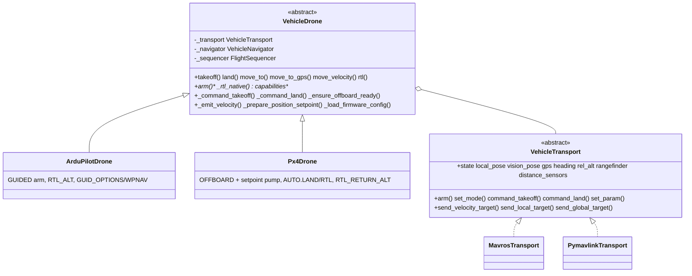

# Vehicle Core

Firmware-agnostic flight logic shared by every MAVLink-class autopilot in the SDK. ArduPilot and PX4 are the **same vehicle behavior reached through different firmware semantics and transports** — all navigation, takeoff/land detection, GPS math, PID control, and movement API live here exactly once. Firmware specializations ([ardupilot](../ardupilot/README.md), [px4](../px4/README.md)) implement only the parts that differ; transports ([mavros](../mavros/README.md), [mavlink](../mavlink/README.md)) implement only the wire plumbing.

## Design

A two-axis **bridge**: a firmware-semantics class (`VehicleDrone` subclass) is composed with a wire-protocol `VehicleTransport`. The drone side owns flight orchestration on plain, ROS-free types ([`types.py`](types.py)); the transport side converts those to/from its wire format (ROS topics/services, raw MAVLink, or uXRCE-DDS). Identical flight logic therefore serves ArduPilot and PX4 over MAVROS or a direct link without duplication.

## Modules

| File | Responsibility |
| --- | --- |
| `types.py` | Plain dataclasses (`Vec3`, `LocalPose`, `GeoPoint`, `Attitude`, `VehicleState`, `LocalTarget`, `GlobalTarget`, `TargetFrame`). ENU/radians conventions. No ROS imports. |
| `transport.py` | `VehicleTransport` ABC: telemetry read-properties + command/setpoint write-methods + lifecycle. |
| `drone.py` | `VehicleDrone(BaseDrone)` — shared flight behavior + firmware hooks. |
| `navigator.py` | `VehicleNavigator` — PID and setpoint navigation loops over plain targets/poses. |
| `target_computer.py` | Stateless target computation (local/GPS offsets → `LocalTarget`/`GlobalTarget`). |
| `gps_utils.py` | EGM96 geoid correction, geodesic arrival checks, global-target construction. |
| `sequencer.py` | `FlightSequencer` — velocity-based takeoff/land settle detection. |

## Firmware hooks

`VehicleDrone` keeps all orchestration and delegates the firmware-specific pieces to overridable hooks:

| Hook | Default | ArduPilot | PX4 |
|------|---------|-----------|-----|
| `arm()` | abstract | GUIDED + (optional) WPNAV params | OFFBOARD + setpoint pump |
| `_command_takeoff(alt)` | transport `command_takeoff` | FCU takeoff command | offboard climb setpoint |
| `_command_land()` | transport `command_land` | FCU land command | `AUTO.LAND` |
| `_rtl_native(alt, land)` | abstract | `RTL_ALT`/`RTL_ALT_FINAL` + `RTL` mode | `RTL_RETURN_ALT`/`RTL_LAND_DELAY` + `AUTO.RTL` |
| `_ensure_offboard_ready()` | no-op | no-op (GUIDED persists) | (re)enter OFFBOARD, keep pump alive |
| `_prepare_position_setpoint(p)` | no-op | sync `WPNAV_RADIUS` | no-op |
| `_emit_velocity(...)` | transport send | transport send | also store for the offboard pump |
| `_load_firmware_config()` | no-op | load `SetpointNavConfig` | start the offboard pump |
| `capabilities` | abstract | declares ArduPilot set | declares PX4 set |

## Conventions

- **Frames**: the core is ENU (x=East, y=North, z=Up) / FLU; transports convert to/from the wire's NED/FRD.
- **Yaw**: radians, ENU (0 = East, CCW positive). Compass *heading* (degrees, NED) is kept separate for GPS body-frame math.
- **Atomicity**: telemetry properties return the most-recent value via whole-object assignment (atomic under the GIL), so the flight thread never sees a half-written pose.

## Behavior reference

The public `Drone` API, navigation methods (`POSITION`, `POSITION_GLOBAL`, `PID`, `PID_EKF`), reference frames, altitude sources, takeoff/land settle detection, GPS/EGM96 handling, and PID tuning are documented in depth — and apply to every vehicle — in the [ArduPilot core README](../ardupilot/README.md). Firmware-specific deviations are in [px4/README.md](../px4/README.md) (offboard, mode names, RTL params).
