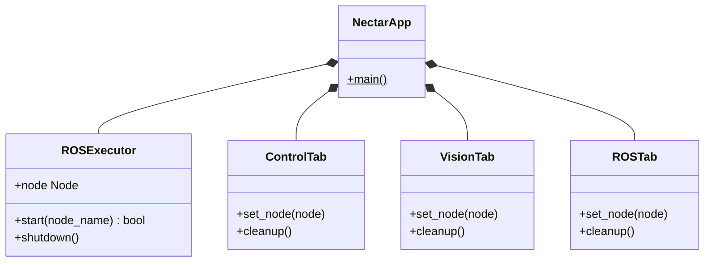
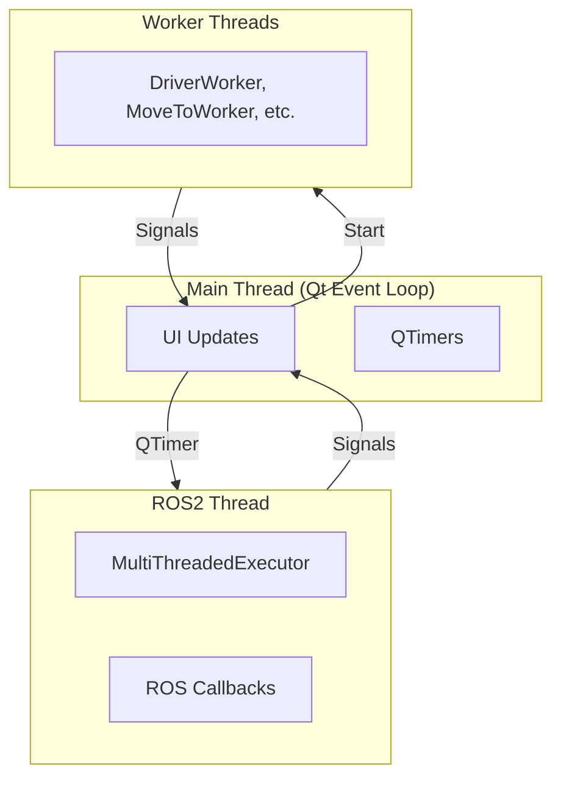

# Interface Module

Qt6/PySide6-based graphical user interface for drone control, computer vision, and ROS2 system tools.

## Quick Start

```python
from nectar.interface import main

# Launch the GUI
main()
```

Or from command line:

```bash
ros2 run nectar gui
```

## Features

### Control Tab

Drone control interface with keyboard-based velocity control and position navigation.

**Connection Flow**:
1. **Connect Driver**: Starts ROS2 driver (MAVROS/Bebop) in background
2. **Initialize Instance**: Creates drone object with configuration
3. **Ready**: Flight controls enabled

**Status Indicators**:
- **Driver**: ROS2 driver process running
- **Instance**: Drone object initialized
- **FCU**: Flight controller connected (Mavros only)
- **Armed**: Motors armed state (Mavros only)

**Velocity Control**:
- **Keyboard**: W/S (up/down), A/D (yaw), Arrow keys (forward/back/left/right)
- **Sliders**: Adjust max velocity per axis (Vx, Vy, Vz, Vyaw)
- **Reference Frame**: Body, World, or Takeoff

**Position Control** (Mavros only):
- Navigate to target position with X, Y, Z, Yaw offsets
- Reference frames: Body or Takeoff
- Configurable precision and timeout

**Supported Drones**:
- **Mavros**: Full control (arm, takeoff, land, velocity, position, telemetry)
- **Bebop**: Basic control (takeoff, land, velocity, flips)

### Vision Tab

Real-time computer vision processing with multiple camera sources and filters.

**Camera Sources**: Webcam, RealSense, OAK-D, ROS topic, File

**Filter Categories**:
- **Color**: HSV color filtering with calibration
- **Edge**: Canny edge detection, contours
- **Blur/Transform**: Gaussian blur, sharpen, rotate, resize
- **Morphology**: Erode, dilate, adaptive threshold, histogram equalization
- **Effects**: Pencil sketch, stylization, cartoonify, Hough lines/circles, optical flow
- **AI**: Hand tracking (MediaPipe), face mesh (MediaPipe)
- **Markers**: ArUco detection (17 dictionary types)

**Depth Estimation** (depth cameras):
- Real-time distance measurement
- Colorized depth visualization
- Click-to-measure distance

### ROS Tab

ROS2 system introspection and interaction tools.

**Topics**:
- Browse, subscribe, and publish messages
- Real-time message viewing
- Auto-detect QoS settings

**Services**:
- Browse and call services
- Custom request/response handling

**Parameters**:
- View and modify node parameters
- Real-time updates

**Plot**:
- Real-time plotting of numeric fields
- Multiple plots, pause/resume
- Export to CSV

## Architecture

### High-Level Structure



### Thread Model



**Key Points**:
- ROS2 executor runs in separate thread
- Blocking operations (driver start, navigation) use worker threads
- Velocity commands sent via QTimer (50ms interval)
- All UI updates happen in main thread

## For Developers

### Widgets

Reusable UI components available in `nectar.interface.widgets`:

| Widget | Purpose |
|--------|---------|
| `Card` | Elevated container with rounded corners |
| `StatusIndicator` | Status dot with label (active/inactive/warning/error) |
| `LabeledSlider` | Vertical slider with label and value display |
| `CollapsibleSection` | Expandable/collapsible section |
| `VideoDisplay` | OpenCV frame display with click support |
| `ImageViewer` | Video display with info label |
| `DualVideoDisplay` | RGB and depth display |
| `DroneConfigPanel` | Drone configuration UI |
| `DetectionConfigPanel` | Object detection model configuration |
| `MessageFieldEditor` | ROS message field editor |
| `ParameterReconfigureWidget` | ROS2 parameter editor |

**Example**:

```python
from nectar.interface import Card, StatusIndicator, LabeledSlider

card = Card()
card.add_widget(StatusIndicator("Status", "active"))
card.add_widget(LabeledSlider("Speed", 0.0, 1.0, 0.5))
```

### ROSExecutor

Manages ROS2 node and executor in background thread:

```python
from nectar.interface import ROSExecutor

executor = ROSExecutor()
executor.start("my_node")
node = executor.node  # Access ROS2 node
executor.shutdown()
```

**Signals**:
- `status_changed(bool)`: ROS2 connection status
- `error_occurred(str)`: ROS2 errors

### Worker Threads

Long-running operations use QThread workers to avoid UI freezes:

- **DriverWorker**: Start/stop ROS2 driver processes
- **DroneInstanceWorker**: Initialize drone objects
- **MoveToWorker**: Position navigation (blocking PID loop)
- **FlightActionWorker**: Service calls (arm, takeoff, land)
- **CameraInitWorker**: Camera initialization

**Pattern**:

```python
worker = MyWorker()
worker_thread = QThread()
worker.moveToThread(worker_thread)
worker.finished.connect(worker_thread.quit)
worker_thread.started.connect(worker.run)
worker_thread.start()
```

### Service Calls

ROS2 services use async pattern to avoid deadlocks:

```python
future = service.call_async(request)
while not future.done():
    rclpy.spin_once(node, timeout_sec=0.05)
result = future.result()
```

### Module Structure

```
interface/
├── app.py                # NectarApp (main window)
├── ros_executor.py       # ROS2-Qt integration
├── theme.py              # Styling and colors
│
├── tabs/
│   ├── control_tab.py    # Drone control
│   ├── vision_tab.py     # Camera and filters
│   └── ros_tab.py        # ROS2 tools
│
└── widgets/
    ├── components.py     # Basic widgets
    ├── drone_config.py   # Drone configuration
    ├── detection_panel.py # Detection configuration
    ├── message_editor.py # Message editor
    └── param_reconfigure.py # Parameter editor
```

### Theming

Colors defined in `theme.py`:

```python
from nectar.interface import COLORS

COLORS.background      # #0D1117
COLORS.surface         # #161B22
COLORS.accent          # #FDCE01 (yellow)
COLORS.success         # #3FB950 (green)
COLORS.error           # #F85149 (red)
# ... see theme.py for full list
```

## Troubleshooting

**UI Freezes**: Ensure blocking operations use worker threads (not main thread)

**Service Timeouts**: Check driver is running and FCU is connected

**No Telemetry**: Verify driver connection and sensor configuration matches FCU setup

**Camera Not Working**: Check device permissions and ROS topic names

## References

- [Qt for Python](https://doc.qt.io/qtforpython-6/)
- [ROS2 Executors](https://docs.ros.org/en/humble/Concepts/Intermediate/About-Executors.html)
