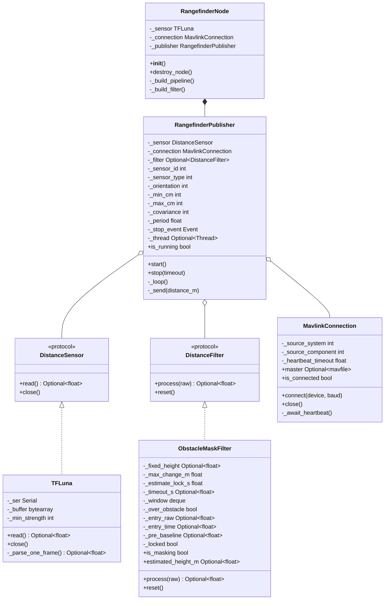
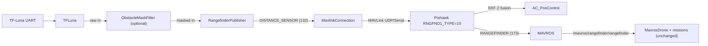
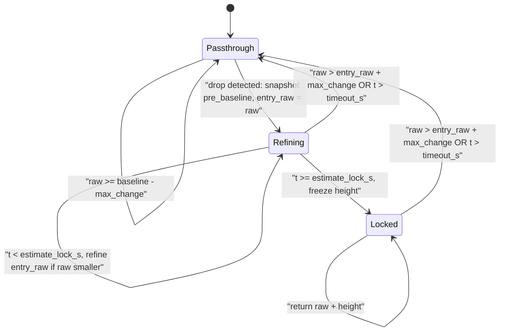

# Sensors Module

Companion-side sensor drivers and value filters, plus a ready-made ROS2 node that bridges a serial rangefinder to MAVLink `DISTANCE_SENSOR` so an ArduPilot/PX4 FCU can consume it as its primary rangefinder.

The module is composition-first: a `DistanceSensor` (driver) and an optional `DistanceFilter` are wired into a `RangefinderPublisher` that pushes filtered samples into a `MavlinkConnection`. Each piece is independently usable.

## Why this exists

When a downward-facing LiDAR is the EKF altitude source (`EK3_SRC1_POSZ = Rangefinder`), flying over a fixed obstacle (e.g. a sphere on a hose) causes a step drop in the rangefinder reading that ArduPilot interprets as the vehicle descending. The position controller climbs to compensate, lifting the drone above its target altitude. Connecting the LiDAR to the companion computer instead of the FCU lets us mask those step drops before the EKF ever sees them.

ArduPilot has no native parameter to reject step changes in the rangefinder — the filter must live upstream of the FCU. See [ArduPilot terrain following docs](https://ardupilot.org/copter/docs/terrain-following.html) and [`AP_RangeFinder_Benewake_CAN.h`](https://github.com/ArduPilot/ardupilot/blob/master/libraries/AP_RangeFinder/AP_RangeFinder_Benewake_CAN.h).

## Architecture



## Data flow



## Components

### `DistanceSensor` and `DistanceFilter` (Protocols)

Lightweight structural interfaces in [`base.py`](base.py). Implementations only need to match the shape; no inheritance is required (matches the `Drone` and `ObstacleDetector` convention in `nectar/control`).

```python
class DistanceSensor(Protocol):
    def read(self) -> Optional[float]: ...
    def close(self) -> None: ...

class DistanceFilter(Protocol):
    def process(self, raw_distance: float) -> Optional[float]: ...
    def reset(self) -> None: ...
```

### `TFLuna`

Benewake TF-Luna serial driver in [`benewake/tfluna.py`](benewake/tfluna.py). Parses the standard 9-byte UART frame (`0x59 0x59 ...`), validates checksum and signal strength, and returns the latest valid reading on each `read()`. Non-blocking: small serial timeout, drains `in_waiting` per call, returns `None` when no fresh frame is ready.

```python
from nectar.sensors import TFLuna

sensor = TFLuna(port="/dev/ttyUSB0", baudrate=115200)
distance_m = sensor.read()  # float | None
sensor.close()
```

Hardware reference: [TF-Luna product page](https://en.benewake.com/TFLuna/index.html) and [Data Download](https://en.benewake.com/DataDownload/index.aspx?pid=20&lcid=21) (datasheet, user manual, Pixhawk application notes).

> Spec range is 0.20 - 8.00 m. In practice the sensor returns valid readings down to roughly 0.05 - 0.08 m, which is why `min_distance_m` defaults to `0.05`. Keep `RNGFND1_MIN_CM = 20` on the FCU per manufacturer spec — the SDK's reported `DISTANCE_SENSOR.min_distance` and ArduPilot's gating are independent on purpose.

### `ObstacleMaskFilter`

Stateful rangefinder filter in [`filters/obstacle_mask.py`](filters/obstacle_mask.py). Detects a sudden drop, masks readings for the duration of the obstacle, recovers when the reading returns to the pre-entry baseline. The obstacle height is **auto-estimated by default** from the entry drop magnitude (`pre_baseline - entry_raw`), so missions don't need to know obstacle dimensions in advance. Pass `obstacle_height_m` explicitly to lock the estimate to a fixed value.

#### State machine



Algorithm:
- Maintain a rolling average over the last `avg_window` readings while not masking.
- Enter the masked state when `raw < baseline - max_change_m`. Snapshot `pre_baseline` and `entry_raw`.
- For the first `estimate_lock_s` after entry (default 0.2 s): refine `entry_raw` whenever a smaller raw arrives, so the deepest beam reading is captured as the obstacle is fully crossed. After this window, the height is frozen.
- While masking: return `raw + (pre_baseline - entry_raw)` (or the fixed override).
- Exit when `raw > entry_raw + max_change_m`, or after `timeout_s` (safety reset).

#### Hook walkthrough (auto-detect)

```
t=0.0s   hover at 3.40 m AGL    raw=3.40  masked=3.40  state=Passthrough
t=1.0s   enter sphere column    raw=1.70  masked=3.40  state=Refining (h=1.70)
t=1.05s  beam settles on top    raw=1.65  masked=3.40  state=Refining (h=1.75)
t=1.20s  estimate locks         h=1.75 frozen          state=Locked
t=2..5s  descend over sphere    raw=0.30  masked=2.05  state=Locked
t=5.1s   exit sphere column     raw=3.20  masked=3.20  state=Passthrough
```

While refining at constant altitude the masked output stays at `pre_baseline` because `raw + (pre_baseline - entry_raw)` collapses to `pre_baseline` whenever `entry_raw` is updated to the current raw. Once the height locks, the masked stream tracks any drone descent linearly, so the FCU's `EK3_SRC1_POSZ=Rangefinder` setup behaves correctly throughout the mission without any prior knowledge of obstacle dimensions.

```python
from nectar.sensors import ObstacleMaskFilter

# Auto-detect (recommended): height learned from each crossing.
f = ObstacleMaskFilter(
    max_change_m=0.30,       # entry/exit hysteresis (also caps physically reachable descent rate)
    avg_window=10,           # samples for the entry baseline
    estimate_lock_s=0.2,     # how long to refine the height after entry
    timeout_s=5.0,           # force-reset if stuck masked too long
)

# Fixed height override (e.g. for SITL or known fixtures).
f_fixed = ObstacleMaskFilter(obstacle_height_m=1.7)

filtered = f.process(raw)    # float (current sample masked or passed through)
f.is_masking                 # bool
f.estimated_height_m         # float | None (current estimate while masking)
f.reset()                    # clear all state (e.g. on mode change)
```

### `RangefinderPublisher`

Composition piece in [`rangefinder_publisher.py`](rangefinder_publisher.py). Owns a background thread that reads the sensor at a configurable rate, applies the optional filter, and sends MAVLink `DISTANCE_SENSOR` (id 132) over the connection.

```python
from nectar.control import MavlinkConnection
from nectar.sensors import (
    ObstacleMaskFilter,
    RangefinderPublisher,
    TFLuna,
)
from pymavlink import mavutil

sensor = TFLuna(port="/dev/ttyUSB0")
conn = MavlinkConnection()
conn.connect("udp:127.0.0.1:14551")

publisher = RangefinderPublisher(
    sensor=sensor,
    connection=conn,
    sensor_id=0,
    sensor_type=mavutil.mavlink.MAV_DISTANCE_SENSOR_LASER,
    orientation=mavutil.mavlink.MAV_SENSOR_ROTATION_PITCH_270,  # downward
    min_distance_m=0.05,
    max_distance_m=8.0,
    rate_hz=50.0,
    filter=ObstacleMaskFilter(),  # auto-detect; pass obstacle_height_m=X to lock
)

publisher.start()
# ... mission runs ...
publisher.stop()
sensor.close()
conn.close()
```

`filter=None` publishes raw readings.

### `RangefinderNode`

ROS2 entry point in [`nodes/rangefinder_node.py`](nodes/rangefinder_node.py). Declares every knob as a ROS parameter so per-mission tuning lives in the launch file rather than in mission code.

```bash
# Raw passthrough (no filter)
ros2 run nectar rangefinder_node.py --ros-args \
    -p serial_port:=/dev/ttyUSB0 \
    -p mavlink_url:=udp:127.0.0.1:14551

# Auto-detect (Hook mission and similar): no obstacle_height_m needed
ros2 run nectar rangefinder_node.py --ros-args \
    -p serial_port:=/dev/ttyUSB0 \
    -p mavlink_url:=udp:127.0.0.1:14551 \
    -p filter:=obstacle_mask

# Fixed-height override (SITL, known fixtures)
ros2 run nectar rangefinder_node.py --ros-args \
    -p serial_port:=/dev/ttyUSB0 \
    -p mavlink_url:=udp:127.0.0.1:14551 \
    -p filter:=obstacle_mask \
    -p obstacle_height_m:=1.7
```

#### Parameters

- `serial_port` (string, default `/dev/ttyUSB0`) — TF-Luna device path.
- `baudrate` (int, default `115200`) — TF-Luna baud rate.
- `mavlink_url` (string, default `udp:127.0.0.1:14551`) — pymavlink endpoint to the FCU. Use a UDP fan-out (e.g. mavlink-router) if MAVROS already owns the FCU's serial line.
- `mavlink_baud` (int, default `921600`) — Used only for serial endpoints.
- `source_system` (int, default `1`) — MAVLink system ID this companion presents.
- `source_component` (int, default `191`) — `MAV_COMP_ID_ONBOARD_COMPUTER`.
- `heartbeat_timeout_s` (float, default `30.0`) — Max wait for the first FCU heartbeat.
- `sensor_id` (int 0-7, default `0`) — Maps to ArduPilot `RNGFND<id+1>_*` slot.
- `orientation` (int, default `25`) — `MAV_SENSOR_ORIENTATION` enum (`25` = `PITCH_270`, downward).
- `min_distance_m` / `max_distance_m` (float, default `0.05` / `8.0`) — Sensor range, sent as part of `DISTANCE_SENSOR`.
- `covariance_cm` (int 0-254, default `0`) — `0` means "use FCU defaults".
- `rate_hz` (float, default `50.0`) — Publish rate.
- `filter` (string, default `none`) — `none` or `obstacle_mask`.
- `obstacle_height_m` (float, default `0.0`) — Obstacle height override in meters. `<= 0` enables auto-detection (the recommended default). Forwarded to `ObstacleMaskFilter` only when `filter=obstacle_mask`.
- `max_change_m`, `avg_window`, `estimate_lock_s`, `timeout_s` — Forwarded to `ObstacleMaskFilter` when `filter=obstacle_mask`. Use `timeout_s <= 0` to disable the safety reset; `estimate_lock_s` is ignored in fixed-height mode.

## ArduPilot setup (one-time)

Set on the FCU via Mission Planner / parameter editor:

- `RNGFND1_TYPE = 10` (MAVLink)
- `RNGFND1_MIN_CM = 20`, `RNGFND1_MAX_CM = 800` (TF-Luna manufacturer spec; see [datasheet](https://en.benewake.com/DataDownload/index.aspx?pid=20&lcid=21))
- `RNGFND1_ORIENT = 25` (Down)
- Physically disconnect the TF-Luna's UART from the Pixhawk so the only rangefinder source is the filtered MAVLink stream.
- Keep `EK3_SRC1_POSZ = Rangefinder` and `EK3_RNG_USE_HGT = -1` if that is your current configuration; the masking filter is what makes that combination safe across known obstacles.

The Jetson and MAVROS both need access to the FCU MAVLink stream. The standard pattern is to run [mavlink-router](https://github.com/mavlink-router/mavlink-router) (or equivalent) on the Jetson to fan out the FCU's serial link to both MAVROS and this node's UDP endpoint.

## DISTANCE_SENSOR vs RANGEFINDER

These are two different MAVLink messages with opposite directions:

- [`DISTANCE_SENSOR` (id 132)](https://mavlink.io/en/messages/common.html#DISTANCE_SENSOR): companion-to-FCU. What this node sends. Carries sensor metadata (id, type, orientation, min/max).
- [`RANGEFINDER` (id 173, ardupilotmega)](https://github.com/mavlink/c_library_v1/blob/master/ardupilotmega/mavlink_msg_rangefinder.h): FCU-to-GCS telemetry. What MAVROS reads to publish `/mavros/rangefinder/rangefinder`.

This node only emits `DISTANCE_SENSOR`. The `RANGEFINDER` flow is handled by ArduPilot and MAVROS without any code from this module.

## Validation

Bench (no flight):

```bash
ros2 run nectar rangefinder_node.py --ros-args -p mavlink_url:=udp:127.0.0.1:14551
ros2 topic echo /mavros/rangefinder/rangefinder
```

Drop a known-height object under the sensor while echoing the topic. The reading should jump by the masked offset and recover when the object is removed.

Standalone (no ROS): see [`examples/sensors/rangefinder_example.py`](../examples/sensors/rangefinder_example.py).

## Known limitations of the auto-detect mode

- **Inverse case (sudden rise) is not masked.** The filter only triggers on drops. Flying off a table or cliff makes raw spike up; this filter does nothing about it.
- **Powering on directly above an obstacle contaminates the baseline.** The rolling average needs at least a few flat-ground samples before the first crossing. Workaround: take off, fly to clear ground for at least `avg_window` samples, then proceed.
- **Stacked or back-to-back obstacles**: the filter exits and re-enters per obstacle, which is the correct behavior. Each entry re-estimates the height from the new drop.
- **Wide, gradually-rising obstacle (slope > `max_change_m / sample_period`)**: not detected as an obstacle because there is no step drop. This is intentional — slow elevation changes look like terrain, not an obstacle.

## Troubleshooting

- **`No FCU heartbeat received within 30s`**: pymavlink can't reach the FCU. Check `mavlink_url`, that mavlink-router is running, and that the UDP port matches. Verify with `mavproxy.py --master=udp:127.0.0.1:14551`.
- **MAVROS still shows the raw reading**: confirm `RNGFND1_TYPE = 10` on the FCU and that the direct UART is physically disconnected. The FCU prefers the directly wired sensor when both are present.
- **Filter masks during a legitimate descent**: `max_change_m` is too tight. Increase it, or shrink `avg_window` so the baseline tracks the descent faster.
- **Auto-estimated height is too small** (drone still climbs slightly when crossing the obstacle): the lock window expired before the beam reached the deepest point. Increase `estimate_lock_s` (e.g. 0.4 s), or lock the height with `obstacle_height_m`.
- **Auto-estimated height is too large** (drone dips when entering the masked region): noisy entry sample. Increase `avg_window` so the pre-baseline is more stable, or lock the height with `obstacle_height_m`.
- **Stuck masked**: lower `timeout_s` (default 5.0 s) or set it to a value just larger than the longest obstacle traversal expected for the mission.
- **TF-Luna returns `None` constantly**: check baud (default 115200), wiring, and that no other process is holding the serial port. Increase `min_strength` if you suspect the sensor is reading through low-confidence reflections.

## References

- [Benewake TF-Luna product page](https://en.benewake.com/TFLuna/index.html) and [Data Download](https://en.benewake.com/DataDownload/index.aspx?pid=20&lcid=21) (datasheet, user manual, Pixhawk app notes)
- [ArduPilot rangefinder landing page](https://ardupilot.org/copter/docs/common-rangefinder-landingpage.html)
- [ArduPilot terrain following](https://ardupilot.org/copter/docs/terrain-following.html)
- [ArduPilot Benewake setup](https://ardupilot.org/copter/docs/common-benewake-tf02-lidar.html)
- [`AP_RangeFinder.h`](https://github.com/ArduPilot/ardupilot/blob/master/libraries/AP_RangeFinder/AP_RangeFinder.h)
- [`DISTANCE_SENSOR` MAVLink message](https://mavlink.io/en/messages/common.html#DISTANCE_SENSOR)
- [pymavlink documentation](https://mavlink.io/en/mavgen_python/)
