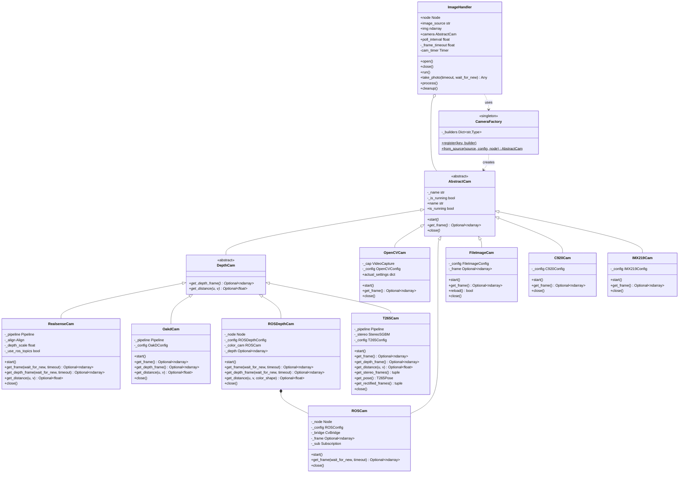
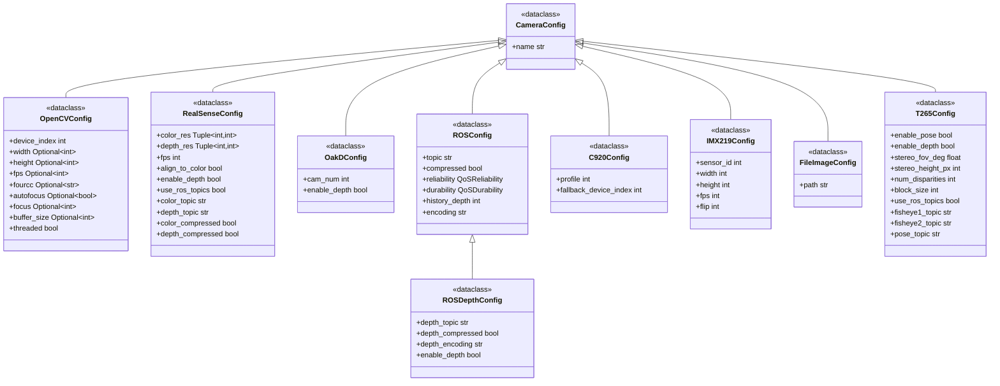
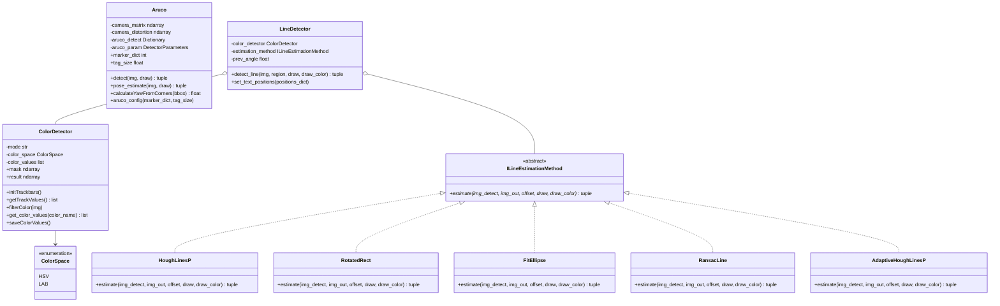
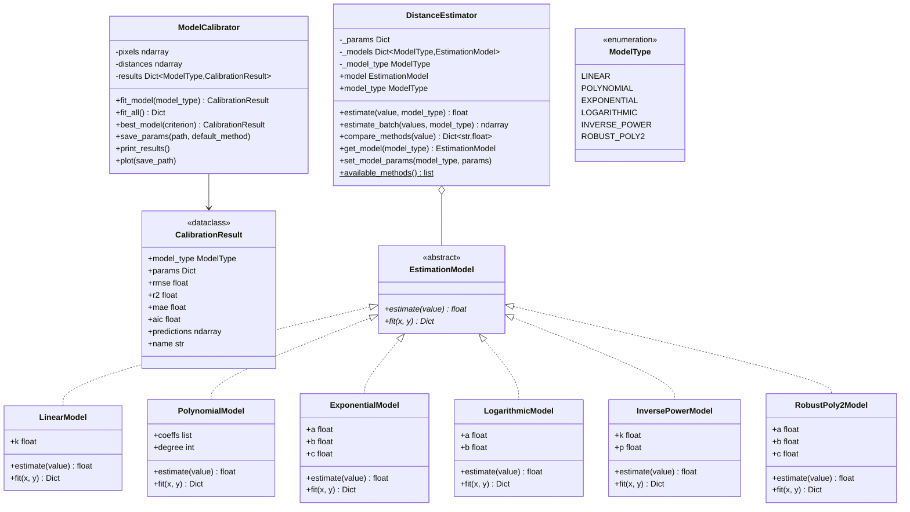
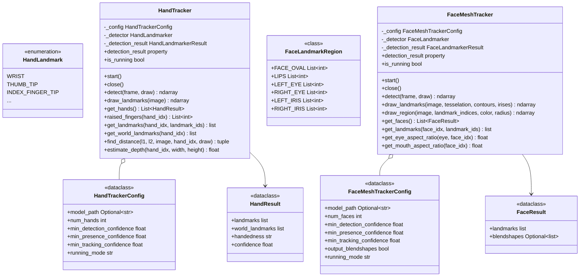
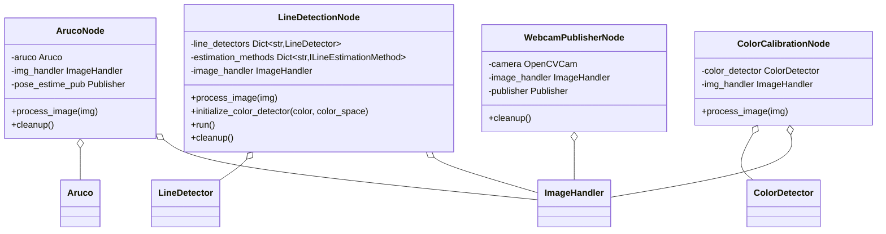

# Vision Module

Camera abstraction layer and image processing algorithms for ROS2. Provides unified interface for multiple camera backends and computer vision pipelines.

## Documentation Index

- **README.md**: This file - Module architecture, API reference, and usage
- **camera/**: Camera drivers and abstraction layer
  - `drivers/`: Camera implementations (`opencv_cam.py`, `realsense_cam.py`, `t265_cam.py`, `oakd_cam.py`, etc.)
  - `calibration/`: Intrinsic camera calibration
- **algorithms/**: Vision algorithms
  - `markers/`: ArUco fiducial marker detection
  - `color/`: HSV/LAB color space filtering
  - `line/`: Line detection with multiple estimation methods
  - `distance/`: Pixel-to-distance regression models
- **nodes/**: ROS2 nodes for common vision tasks
- **utils/**: Utility functions for image-based calculations

## Architecture



### Configuration Classes



## Core Components

### CameraFactory

Creates camera instances from source identifiers. Auto-detects source type.

**API**:
```python
CameraFactory.from_source(source: str, config: CameraConfig = None, node: Node = None) -> AbstractCam
CameraFactory.register(key: str, builder: Type[AbstractCam])
```

**Registered Sources**:
| Key | Camera Class | Description |
|-----|--------------|-------------|
| `webcam` | `OpenCVCam` | Generic USB webcams |
| `opencv` | `OpenCVCam` | Alias for webcam |
| `realsense` | `RealsenseCam` | Intel RealSense D4xx (color + depth via pyrealsense2) |
| `t265` | `T265Cam` | Intel RealSense T265 (fisheye + stereo depth + 6DOF pose) |
| `oakd` | `OakdCam` | Luxonis OAK-D cameras |
| `c920` | `C920Cam` | Logitech C920/C920e |
| `imx219` | `IMX219Cam` | Raspberry Pi Camera v2 (Jetson) |
| `ros` | `ROSCam` | ROS2 image topics |
| `ros_depth` | `ROSDepthCam` | ROS2 color + depth image topics |
| `file` | `FileImageCam` | Static image files |

**Auto-detection**:
- File paths → `FileImageCam`
- Topics starting with `/` → `ROSCam`
- Registered keys → Corresponding camera

**Example**:
```python
from nectar.vision import CameraFactory, OpenCVConfig

# Simple usage
camera = CameraFactory.from_source("webcam")

# With configuration
config = OpenCVConfig(width=1280, height=720, fps=30)
camera = CameraFactory.from_source("webcam", config=config)

# From ROS topic
camera = CameraFactory.from_source("/camera/image_raw", node=node)

# From file
camera = CameraFactory.from_source("/path/to/image.jpg")
```

### ImageHandler

Timer-based camera interface backed by an internal ROS 2 `Node` (registered with the SDK runtime executor — see [`nectar.runtime`](../runtime.py)). Invokes a processing callback on every frame and optionally renders to an OpenCV window.

**API**:
```python
ImageHandler(
    image_source: str,
    image_processing_callback: Callable = None,
    show_result: str = None,             # OpenCV window name
    *,
    config: CameraConfig = None,
    camera: AbstractCam = None,          # Pre-configured camera
    poll_interval: float = 0.01,         # Timer period (seconds)
    frame_timeout: float = 0.1,          # Frame wait timeout (async)
    executor: Executor = None,           # Defaults to nectar.runtime executor
)
```

**Methods**:
- `run()`: Start continuous frame capture with timer
- `open()`: Manual camera initialization
- `close()`: Stop camera
- `take_photo(timeout, wait_for_new)`: Single-shot capture
- `cleanup()`: Release the camera, destroy the timer, and unregister the internal node

**Example**:
```python
import nectar
from nectar.vision import ImageHandler, OpenCVConfig

nectar.init()

handler = ImageHandler(
    image_source="webcam",
    config=OpenCVConfig(width=1280, height=720),
    image_processing_callback=lambda frame: detector.detect(frame),
    show_result="Camera View",
)
handler.run()
nectar.spin()
```

### AbstractCam

Base class for all camera drivers. Defines the camera interface contract.

**Interface**:
```python
class AbstractCam(ABC):
    name: str                           # Camera identifier
    is_running: bool                    # Capture status

    def start() -> None                 # Initialize camera
    def get_frame() -> Optional[ndarray]  # Capture BGR frame
    def close() -> None                 # Release resources
```

### DepthCam

Extension for RGB-D cameras. Adds depth capture and distance measurement.

**Additional Interface**:
```python
class DepthCam(AbstractCam):
    def get_depth_frame() -> Optional[ndarray]  # Depth in meters (float32)
    def get_distance(u: int, v: int) -> Optional[float]  # Distance at pixel
```

### T265Cam

Intel RealSense T265 tracking camera driver. The T265 has two 848x800 global-shutter fisheye cameras (30 Hz), a BMI055 IMU (gyro 200 Hz, accel 62 Hz), and an onboard Movidius Myriad 2 VPU running V-SLAM that outputs 6DOF pose at 200 Hz.

The T265 is not a depth camera. `T265Cam` computes stereo depth on the host from the fisheye pair using OpenCV's StereoSGBM with Kannala-Brandt fisheye undistortion, following the [librealsense t265_stereo.py](https://github.com/IntelRealSense/librealsense/blob/v2.53.1/wrappers/python/examples/t265_stereo.py) reference. Effective depth range is ~0.3-3m given the 64mm baseline.

**Access modes**:

| Mode | `use_ros_topics` | When to use |
|------|-------------------|-------------|
| Direct | `False` | T265 dedicated to SDK. Uses pyrealsense2 callback-based pipeline. |
| ROS topics | `True` | `realsense2_camera` already running (e.g. for navigation via `vision_to_mavros`). Subscribes to fisheye + CameraInfo + pose topics. |

When `realsense2_camera` holds the USB device, direct mode will fail. Use ROS topic mode to share the camera.

**Stereo depth pipeline** (one-time on `start()`):
1. Get Kannala-Brandt intrinsics (K, D) and stereo extrinsics (R, T) from pyrealsense2 profiles or `CameraInfo` topics
2. Compute `cv2.fisheye.initUndistortRectifyMap` for left and right
3. Build projection matrices P and reprojection matrix Q

**Per-frame** (`get_depth_frame()`):
1. Remap both fisheye images with pre-computed maps
2. Run `cv2.StereoSGBM` on rectified pair
3. Convert disparity to depth via `depth = focal * baseline / disparity`

**Configuration** (`T265Config`):

| Parameter | Type | Default | Description |
|-----------|------|---------|-------------|
| `enable_pose` | bool | `True` | Subscribe to / capture 6DOF pose stream |
| `enable_depth` | bool | `True` | Compute stereo depth from fisheye pair |
| `stereo_fov_deg` | float | `90.0` | Output FOV for rectified stereo images |
| `stereo_height_px` | int | `300` | Output height in pixels (width = height + max_disp) |
| `num_disparities` | int | `96` | StereoSGBM max disparity search range (must be divisible by 16) |
| `block_size` | int | `16` | StereoSGBM block size |
| `use_ros_topics` | bool | `False` | `True`: subscribe to ROS topics. `False`: direct pyrealsense2. |
| `fisheye1_topic` | str | `/camera/fisheye1/image_raw` | Left fisheye topic (ROS mode) |
| `fisheye2_topic` | str | `/camera/fisheye2/image_raw` | Right fisheye topic (ROS mode) |
| `pose_topic` | str | `/camera/pose/sample` | Pose topic (ROS mode, Odometry or PoseStamped) |

**T265Pose** dataclass (returned by `get_pose()`):

| Field | Type | Description |
|-------|------|-------------|
| `translation` | ndarray (3,) | Position [x, y, z] in meters |
| `rotation` | ndarray (4,) | Quaternion [x, y, z, w] |
| `velocity` | ndarray (3,) | Linear velocity [vx, vy, vz] m/s |
| `angular_velocity` | ndarray (3,) | Angular velocity [wx, wy, wz] rad/s |
| `tracker_confidence` | int | 0 (failed) to 3 (high) |
| `timestamp` | float | Host-synchronized timestamp in seconds |

**API**:
```python
T265Cam(config: T265Config, node: Node = None)

cam.start()
cam.get_frame()                  # Left fisheye as BGR (800x848x3)
cam.get_stereo_frames()          # (left, right) grayscale pair
cam.get_depth_frame()            # Stereo depth, float32 meters (300x300)
cam.get_distance(u, v)           # Distance at pixel in stereo output
cam.get_pose()                   # T265Pose dataclass
cam.get_rectified_frames()       # Undistorted+rectified pair (cropped)
cam.close()
```

**Example**:
```python
from nectar.vision import T265Cam, T265Config

# Direct mode
cam = T265Cam(T265Config(enable_depth=True, enable_pose=True))
cam.start()

frame = cam.get_frame()          # left fisheye (BGR)
depth = cam.get_depth_frame()    # stereo depth (float32, meters)
pose = cam.get_pose()            # T265Pose
left, right = cam.get_stereo_frames()

# ROS topic mode (realsense2_camera already running)
cam = T265Cam(T265Config(use_ros_topics=True), node=node)
cam.start()
```

**T265 V-SLAM options** (direct mode only, set on pose sensor before `pipeline.start()`):

| Option | pyrealsense2 name | Default | Description |
|--------|-------------------|---------|-------------|
| Mapping | `rs.option.enable_mapping` | 1 (on) | Internal feature map. Reduces drift via small loop closures. |
| Relocalization | `rs.option.enable_relocalization` | 1 (on) | Reconnects to map after large drift. Can cause large pose jumps. |
| Pose jumping | `rs.option.enable_pose_jumping` | 1 (on) | Allows discontinuous translation corrections. |
| Map preservation | `rs.option.enable_map_preservation` | 0 (off) | Preserve map across stop/start cycles. |

For drone flight with ArduPilot EKF: disable relocalization and pose jumping (the EKF cannot handle discontinuous position teleports). Keep mapping enabled. See [PR #4321](https://github.com/IntelRealSense/librealsense/pull/4321), [realsense-ros #779](https://github.com/IntelRealSense/realsense-ros/issues/779).

**pyrealsense2 version**: T265 requires `pyrealsense2==2.53.1.4623` (last PyPI release with TM2 support). Version 2.54+ dropped T265.

## Algorithms

### Algorithm Architecture



### ArUco Markers

Detects ArUco markers using `cv2.aruco.ArucoDetector` and estimates 6-DOF pose via `cv2.aruco.estimatePoseSingleMarkers`. Requires camera intrinsic matrix from calibration.

**API**:
```python
Aruco(marker_dict: int, tag_size: float)

# Detection only
bbox, marker_id = aruco.detect(img, draw=True)

# Pose estimation (requires calibration)
marker_id, translation, yaw = aruco.pose_estimate(img, draw=True)
```

**Parameters**:
- `marker_dict`: Dictionary size (4, 5, 6, 7 for 4x4, 5x5, etc.)
- `tag_size`: Physical marker size in meters

**Returns** (pose_estimate):
- `marker_id`: Detected marker ID or None
- `translation`: [x, y, z] in meters (camera frame)
- `yaw`: Marker rotation in degrees (0-360)

**Example**:
```python
from nectar.vision import Aruco

aruco = Aruco(marker_dict=5, tag_size=0.05)  # 5x5, 5cm

while True:
    frame = camera.get_frame()
    marker_id, translation, yaw = aruco.pose_estimate(frame, draw=True)

    if marker_id is not None:
        x, y, z = translation
        print(f"Marker {marker_id}: x={x:.2f}m, y={y:.2f}m, z={z:.2f}m, yaw={yaw:.1f}°")
```

### Color Detection

Color space filtering using `cv2.inRange()` with morphological operations (dilate, erode). Supports HSV (hue 0-179, saturation/value 0-255) and LAB (L 0-255, a/b 0-255) color spaces.

**Modes**:
- `track`: Interactive trackbar calibration
- `preset`: Load pre-calibrated values from JSON

**API**:
```python
ColorDetector(mode: str = "track", color: str = None, color_space: ColorSpace = ColorSpace.HSV)

detector.filterColor(img)  # Updates detector.mask and detector.result
detector.initTrackbars()   # Create calibration window (track mode)
detector.saveColorValues() # Save calibration to JSON
```

**Example**:
```python
from nectar.vision import ColorDetector, ColorSpace

# Calibration mode
detector = ColorDetector(mode="track", color_space=ColorSpace.HSV)
detector.initTrackbars()

while True:
    frame = camera.get_frame()
    detector.filterColor(frame)
    cv2.imshow("Mask", detector.mask)

    if cv2.waitKey(1) == ord('s'):
        detector.saveColorValues()  # Prompts for color name

# Preset mode
detector = ColorDetector(mode="preset", color="red", color_space=ColorSpace.HSV)
detector.filterColor(frame)
mask = detector.mask
```

**Calibration File** (`color_calibration.json`):
```json
{
    "red": {
        "HSV": [[0, 100, 100], [10, 255, 255]],
        "LAB": [[20, 150, 128], [255, 200, 200]]
    },
    "blue": {
        "HSV": [[100, 100, 100], [130, 255, 255]]
    }
}
```

### Line Detection

Color-based line detection using binary mask from `ColorDetector` + geometric estimation.

**Estimation Methods**:
| Method | Algorithm | When to Use |
|--------|-----------|-------------|
| `HoughLinesP` | `cv2.HoughLinesP` → `cv2.fitLine` on endpoints | Thin lines, multiple segments to merge |
| `RotatedRect` | `cv2.minAreaRect` on largest contour | Thick continuous lines, single blob |
| `FitEllipse` | `cv2.fitEllipse` on contour | Curved/arc-shaped lines |
| `RansacLine` | `cv2.fitLine` with DIST_L2 on contour points | Noisy masks with outlier pixels |
| `AdaptiveHoughLinesP` | HoughLinesP with threshold based on `mean + std` of mask | Varying illumination conditions |

**API**:
```python
LineDetector(color: str, estimation_method: ILineEstimationMethod, color_space: ColorSpace = None)

img, mask, cx, cy, angle, width, height = detector.detect_line(
    img,
    region=(400, 300),      # ROI size (0,0 for full image)
    draw=True,
    draw_color=(0, 255, 0)
)
```

**Returns**:
- `img`: Annotated image
- `mask`: Binary region mask
- `cx, cy`: Line center coordinates (pixels)
- `angle`: Line angle in degrees (-90 to 90)
- `width, height`: Average line dimensions (pixels)

**Example**:
```python
from nectar.vision import LineDetector, HoughLinesP, RotatedRect, ColorSpace

# Using Hough transform
detector = LineDetector(
    color="blue",
    estimation_method=HoughLinesP,
    color_space=ColorSpace.HSV
)

while True:
    frame = camera.get_frame()
    result, mask, cx, cy, angle, w, h = detector.detect_line(frame, draw=True)

    if not math.isnan(cx):
        print(f"Line at ({cx:.0f}, {cy:.0f}), angle: {angle:.1f}°")
```

### Distance Estimation

Pixel measurement → real-world distance conversion using regression models. Requires calibration data: `(distance_cm, pixel_value)` pairs collected at known distances.

**Distance Architecture**:



**Model Types**:
| Model | Formula | Fitting Method |
|-------|---------|----------------|
| `LINEAR` | d = k / pixels | Mean of `distance × pixels` |
| `POLYNOMIAL` | d = Σ(aᵢ × pixelsⁱ) | `np.polyfit` (least squares) |
| `EXPONENTIAL` | d = a × e^(-b×pixels) + c | `scipy.optimize.curve_fit` |
| `LOGARITHMIC` | d = a × ln(pixels) + b | `scipy.optimize.curve_fit` |
| `INVERSE_POWER` | d = k / pixels^p | `scipy.optimize.curve_fit` with bounds |
| `ROBUST_POLY2` | d = a×pixels² + b×pixels + c | `sklearn.linear_model.HuberRegressor` (outlier-resistant) |

**Calibration Workflow**:
```python
from nectar.vision.algorithms.distance import ModelCalibrator
from pathlib import Path

# Calibration data: (distance_cm, pixel_measurement)
data = [
    (50, 32.2),
    (60, 28.5),
    (70, 24.2),
    (100, 21.6),
    (150, 16.8),
]

calibrator = ModelCalibrator(data)
calibrator.fit_all()
calibrator.print_results()

# Save best parameters
calibrator.save_params(Path("parameters.yaml"))

# Generate comparison plot
calibrator.plot(Path("model_comparison.png"))
```

**Usage**:
```python
from nectar.vision import DistanceEstimator, ModelType

estimator = DistanceEstimator(model_type=ModelType.POLYNOMIAL)

# Single estimate
pixel_height = 21.6
distance_cm = estimator.estimate(pixel_height)

# Compare all methods
results = estimator.compare_methods(pixel_height)
for model, dist in results.items():
    print(f"{model}: {dist:.1f} cm")

# Batch estimation
import numpy as np
pixels = np.array([15, 20, 25, 30])
distances = estimator.estimate_batch(pixels)
```

### MediaPipe Tracking

Hand and face tracking using MediaPipe's machine learning models. Provides real-time landmark detection for gesture recognition, face tracking, and human-computer interaction.

**MediaPipe Architecture**:



#### Hand Tracking

Detects hands and provides 21 landmark points per hand using MediaPipe HandLandmarker. Supports gesture recognition via finger state detection.

**API**:
```python
HandTracker(config: HandTrackerConfig = None)

tracker.start()                           # Initialize detector
tracker.detect(frame, draw=True)          # Detect hands
tracker.get_hands()                       # Get HandResult list
tracker.raised_fingers(hand_idx=0)        # [thumb, index, middle, ring, pinky]
tracker.close()                           # Release resources
```

**Configuration**:
| Parameter | Type | Default | Description |
|-----------|------|---------|-------------|
| `model_path` | str | None | Path to model (auto-downloads if None) |
| `num_hands` | int | 2 | Maximum hands to detect |
| `min_detection_confidence` | float | 0.5 | Detection threshold |
| `min_presence_confidence` | float | 0.5 | Presence threshold |
| `min_tracking_confidence` | float | 0.5 | Tracking threshold |
| `running_mode` | str | "IMAGE" | "IMAGE" (sync) or "LIVE_STREAM" (async) |

**Example**:
```python
from nectar.vision import HandTracker, HandTrackerConfig

config = HandTrackerConfig(num_hands=2, running_mode="IMAGE")

with HandTracker(config) as tracker:
    while True:
        frame = camera.get_frame()
        tracker.detect(frame, draw=True)

        fingers = tracker.raised_fingers()
        if fingers:
            count = sum(fingers)
            print(f"Fingers raised: {count}")

        cv2.imshow("Hands", frame)
        if cv2.waitKey(1) == ord('q'):
            break
```

**Gesture Recognition**:
```python
from nectar.vision import HandTracker, HandLandmark

with HandTracker() as tracker:
    tracker.detect(frame)

    # Get finger states: [thumb, index, middle, ring, pinky]
    fingers = tracker.raised_fingers()

    # Map to gestures
    gestures = {
        (0, 0, 0, 0, 0): "fist",
        (1, 1, 1, 1, 1): "open_palm",
        (0, 1, 0, 0, 0): "pointing",
        (0, 1, 1, 0, 0): "peace",
        (1, 0, 0, 0, 1): "rock",
    }

    gesture = gestures.get(tuple(fingers), "unknown")
```

#### Face Mesh Tracking

Detects faces and provides 478 landmark points per face for detailed facial feature tracking.

**API**:
```python
FaceMeshTracker(config: FaceMeshTrackerConfig = None)

tracker.start()                           # Initialize detector
tracker.detect(frame, draw=True)          # Detect face mesh
tracker.get_faces()                       # Get FaceResult list
tracker.get_eye_aspect_ratio("left")      # Blink detection
tracker.get_mouth_aspect_ratio()          # Mouth open detection
tracker.close()                           # Release resources
```

**Configuration**:
| Parameter | Type | Default | Description |
|-----------|------|---------|-------------|
| `model_path` | str | None | Path to model (auto-downloads if None) |
| `num_faces` | int | 1 | Maximum faces to detect |
| `output_blendshapes` | bool | False | Output expression blendshapes |
| `running_mode` | str | "LIVE_STREAM" | "IMAGE" (sync) or "LIVE_STREAM" (async) |

**Example**:
```python
from nectar.vision import FaceMeshTracker, FaceMeshTrackerConfig
from nectar.vision.algorithms.pose.face_tracker import FaceLandmarkRegion

config = FaceMeshTrackerConfig(num_faces=1)

with FaceMeshTracker(config) as tracker:
    while True:
        frame = camera.get_frame()
        tracker.detect(frame, draw=True)

        # Blink detection
        left_ear = tracker.get_eye_aspect_ratio("left")
        right_ear = tracker.get_eye_aspect_ratio("right")

        if left_ear < 0.15 and right_ear < 0.15:
            print("Blink detected!")

        cv2.imshow("Face", frame)
        if cv2.waitKey(1) == ord('q'):
            break
```

**Facial Region Extraction**:
```python
from nectar.vision import FaceLandmarkRegion

with FaceMeshTracker() as tracker:
    tracker.detect(frame)

    # Get specific regions
    left_eye = tracker.get_landmarks(landmark_ids=FaceLandmarkRegion.LEFT_EYE)
    lips = tracker.get_landmarks(landmark_ids=FaceLandmarkRegion.LIPS)

    # Draw specific region
    tracker.draw_region(frame, FaceLandmarkRegion.LEFT_EYE, color=(0, 255, 0))
```

## ROS2 Nodes

### Node Architecture



### ArUco Detection Node

```bash
ros2 run nectar aruco_node --ros-args \
    -p image_source:=webcam \
    -p marker_dict:=5 \
    -p tag_size:=0.05
```

**Parameters**:
| Parameter | Type | Default | Description |
|-----------|------|---------|-------------|
| `image_source` | string | webcam | Camera source |
| `marker_dict` | int | 5 | ArUco dictionary (4,5,6,7) |
| `tag_size` | float | 0.2 | Marker size in meters |

**Published Topics**:
- `/aruco/pose_estimate` (`nectar_interfaces/ArucoTransforms`): Marker pose

### Line Detection Node

```bash
ros2 run nectar line_detection_node --ros-args \
    -p line_colors:="blue,red" \
    -p method:=HoughLinesP \
    -p spaces:="hsv,lab" \
    -p image_source:=webcam \
    -p show_visualization:=true
```

**Parameters**:
| Parameter | Type | Default | Description |
|-----------|------|---------|-------------|
| `line_colors` | string | teste | Comma-separated colors |
| `method` | string | HoughLinesP | Estimation method |
| `spaces` | string | hsv | Comma-separated color spaces |
| `image_source` | string | webcam | Camera source |
| `show_visualization` | bool | true | Show OpenCV window |
| `visualization_name` | string | Line Detection | Window title |

**Available Methods**: `HoughLinesP`, `RotatedRect`, `FitEllipse`, `RansacLine`, `AdaptiveHoughLinesP`

**Published Topics** (per color):
- `/line_state/{color}` (`nectar_interfaces/LineInfo`): Line center, angle, dimensions
- `/line_detect/{color}` (`std_msgs/Bool`): Detection flag

### Color Calibration Node

```bash
ros2 run nectar color_calibration_node.py --ros-args \
    -p image_source:=webcam \
    -p color_space:=hsv \
    -p flood_tolerance:=15
```

Interactive HSV/LAB calibration in a single window: left-click a colored region to auto-compute thresholds via flood fill, then fine-tune with the 6 channel trackbars. The stacked view shows `original | mask | result`.

**Parameters**:
| Parameter | Type | Default | Description |
|-----------|------|---------|-------------|
| `image_source` | string | webcam | Camera source |
| `color_space` | string | hsv | Initial color space (`hsv` or `lab`) |
| `flood_tolerance` | int | 15 | Initial flood-fill tolerance for click sampling |

**Controls**: left-click to sample; `c` switch HSV/LAB, `s` save (prompts a color name), `l` load a named color, `z` undo last sample, `r` reset, `q` quit.

Saved colors are written to the shared `vision/algorithms/color/color_calibration.json` and load directly via `ColorDetector(mode="preset", color=<name>)` and `LineDetectionNode`. Requires an OpenCV GUI (mouse + trackbars).

### Webcam Publisher Node

```bash
ros2 run nectar webcam_publisher --ros-args \
    -p camera_index:=0 \
    -p width:=1280 \
    -p height:=720 \
    -p fps:=30 \
    -p use_compression:=true \
    -p jpeg_quality:=80 \
    -p threaded:=true
```

**Parameters**:
| Parameter | Type | Default | Description |
|-----------|------|---------|-------------|
| `camera_index` | int | 0 | Webcam device index |
| `width` | int | 640 | Frame width |
| `height` | int | 480 | Frame height |
| `fps` | int | 30 | Target FPS |
| `use_compression` | bool | true | JPEG compression |
| `jpeg_quality` | int | 80 | JPEG quality (0-100) |
| `buffer_size` | int | 2 | Camera buffer size |
| `threaded` | bool | true | Background capture thread |

**Published Topics**:
- `image_raw/compressed` (`sensor_msgs/CompressedImage`): Compressed JPEG
- `image_raw` (`sensor_msgs/Image`): Raw BGR (when compression disabled)

## Camera Calibration

Intrinsic calibration computes the 3×3 camera matrix (fx, fy, cx, cy) and distortion coefficients (k1, k2, p1, p2, k3). A single `CameraCalibration` node handles both board patterns and writes the shared output files (`camera_matrix.txt`, `camera_distortion.txt`) loaded via `load_calibration()`.

| Pattern | `pattern` value | Notes |
|---------|-----------------|-------|
| **ChArUco** (default, recommended) | `charuco` | Subpixel chessboard accuracy plus ArUco robustness to occlusion and partial views, so frames at the image edges still contribute |
| Chessboard | `chessboard` | Plain printed chessboard, fully visible per frame, with `cornerSubPix` refinement |

### Capture modes

| Mode | `mode` value | Behavior |
|------|--------------|----------|
| Auto (default) | `auto` | Accepts a view automatically when the board is detected with at least `min_corners_per_frame` corners and `auto_interval` seconds have passed. Stops after `target_views`. |
| Manual | `manual` | Key-driven from the preview window: `c` capture (when the board is good), `u` undo last, `r` reset all, `Enter` finish + calibrate, `q` quit. Requires a GUI window; falls back to auto when no GUI is available. |

The preview window is optional (`show_preview`), so the node runs headless (e.g. on a Jetson over SSH). Progress is also logged to the terminal in both modes.

**Print the board** (ChArUco): any board PDF from [`carlosmccosta/charuco_detector`](https://github.com/carlosmccosta/charuco_detector/tree/master/boards/vector_format/black_and_white) at 100% scale. The defaults match the **A4, 5×7, 40 mm square, 30 mm marker, DICT_4X4_1000** PDF. Glue the print to a rigid flat surface (foam board, MDF, clipboard).

**Measure after printing**: printers always rescale by ~0.5–2%. Use a caliper to measure N squares along the long axis and compute the real square size; the marker length scales by the same factor (30/40 = 0.75 for this board).

**Run** (auto ChArUco, default):
```bash
ros2 run nectar calibration.py
```

Calibrate at the **same resolution you'll use in production** (intrinsics are resolution-specific). 1080p webcam:
```bash
ros2 run nectar calibration.py --ros-args -p width:=1920 -p height:=1080
```

Manual capture with a chessboard:
```bash
ros2 run nectar calibration.py --ros-args \
    -p pattern:=chessboard \
    -p mode:=manual \
    -p chessboard_cols:=9 \
    -p chessboard_rows:=7 \
    -p square_length:=0.025
```

Headless (no preview window):
```bash
ros2 run nectar calibration.py --ros-args -p show_preview:=false
```

**Parameters**:
| Parameter | Type | Default | Description |
|-----------|------|---------|-------------|
| `pattern` | string | `charuco` | Board pattern: `charuco` or `chessboard` |
| `mode` | string | `auto` | Capture mode: `auto` or `manual` |
| `image_source` | string | `webcam` | Camera source (any value accepted by `CameraFactory`: `webcam`, `realsense`, `c920`, a ROS topic like `/camera/image_raw`, etc.) |
| `device_index` | int | `0` | OpenCV `VideoCapture` index. Only applies when `image_source` is `webcam` or `opencv` |
| `width` | int | `0` | Requested capture width in pixels. `0` keeps the camera default |
| `height` | int | `0` | Requested capture height in pixels. `0` keeps the camera default |
| `chessboard_cols` | int | `9` | Inner corners in X (chessboard only) |
| `chessboard_rows` | int | `7` | Inner corners in Y (chessboard only) |
| `squares_x` | int | `5` | Board squares in X (charuco only) |
| `squares_y` | int | `7` | Board squares in Y (charuco only) |
| `square_length` | float | `0.040` | **Measured** square side in meters (use a caliper after printing) |
| `marker_length` | float | `0.030` | **Measured** marker side in meters (charuco only; scale together with `square_length`) |
| `aruco_dict` | string | `DICT_4X4_1000` | Predefined dictionary name (charuco only). Shorthand `4X4_1000` is also accepted |
| `min_corners_per_frame` | int | `6` | Minimum corners required to accept a frame |
| `target_views` | int | `20` | Number of accepted views to collect before auto calibration |
| `auto_interval` | float | `0.75` | Seconds between automatic captures (auto mode) |
| `show_preview` | bool | `true` | Live preview window with detection overlay and progress. Auto-disabled when no GUI is available |
| `save_dataset` | bool | `true` | Also write accepted frames to `dataset/` |
| `output_dir` | string | `""` | Directory for output files and `dataset/`. Empty resolves to the `nectar.vision.camera.calibration` package directory so `load_calibration()` finds the result automatically |

Move the board to fill different regions of the image and use strong tilts (pitch/yaw ±30°), especially near the image edges where distortion is strongest.

**Programmatic Access**:
```python
from nectar.vision.camera import CameraCalibration

matrix, distortion = CameraCalibration.load_calibration()
```

**Quality check**: aim for `reprojection_error < 0.5 px` (logged after calibration). Values above 1.0 px trigger a warning and usually mean a flexed board, motion blur, or poor pose coverage.

**Output Files**:
- `camera_matrix.txt`: 3x3 intrinsic matrix
- `camera_distortion.txt`: Distortion coefficients

## Utilities

### ImageCalculus

Pixel-to-world coordinate transformations for downward-facing cameras. Uses pinhole camera model with small-angle approximations for pitch/roll compensation.

**Methods**:
```python
ImageCalculus(
    camera_offset: Dict[str, float] = None,    # {forward, right, up} in meters
    camera_resolution: Dict[str, int] = None,  # {width, height} in pixels
    pixels_per_degree: Dict[str, int] = None   # {horizontal, vertical}
)

# Ground intersection from pixel
vector = calc.calculate_vector_from_drone_to_ground(
    target_pixel=(640, 360),
    height=10.0,        # meters
    pitch=5.0,          # degrees
    roll=2.0            # degrees
)  # Returns (forward, right, down) in meters

# Pixel GPS estimation
lat, lon = ImageCalculus.estimate_pixel_gps(
    origin_lat=-27.1234,
    origin_lon=-48.4567,
    origin_row=540,
    origin_col=960,
    target_row=300,
    target_col=800,
    gsd=0.05,           # meters/pixel
    image_bearing=45.0  # degrees
)

# Offset pixels calculation
offset_px = ImageCalculus.calculate_offset_pixels(
    offset_meters=0.1,
    height_meters=10.0,
    fov_degrees=60.0,
    image_pixels=1920
)
```

## Examples

See `examples/vision/` for complete working examples:

| Example | Description |
|---------|-------------|
| `camera_example.py` | Basic camera capture and configuration |
| `depth_example.py` | Depth camera visualization and distance (RealSense D4xx, OAK-D) |
| `t265_example.py` | T265 fisheye + stereo depth + pose overlay + click-to-measure |

## Module Structure

```
vision/
├── __init__.py              # Public API exports
├── README.md                # This file
│
├── camera/                  # Camera infrastructure
│   ├── __init__.py
│   ├── abstract.py          # AbstractCam, DepthCam base classes
│   ├── config.py            # Configuration dataclasses
│   ├── factory.py           # CameraFactory
│   ├── handler.py           # ImageHandler
│   ├── calibration/         # Camera calibration
│   │   ├── calibration.py
│   │   ├── camera_matrix.txt
│   │   ├── camera_distortion.txt
│   │   └── dataset/
│   └── drivers/             # Camera implementations
│       ├── opencv_cam.py
│       ├── realsense_cam.py
│       ├── oakd_cam.py
│       ├── ros_cam.py
│       ├── ros_depth_cam.py
│       ├── t265_cam.py
│       ├── c920_cam.py
│       ├── imx219_cam.py
│       └── file_cam.py
│
├── algorithms/              # Vision algorithms
│   ├── __init__.py
│   ├── markers/             # ArUco, AprilTag
│   │   └── aruco.py
│   ├── color/               # Color detection
│   │   ├── color_detector.py
│   │   └── color_calibration.json
│   ├── line/                # Line detection
│   │   └── line_detector.py
│   ├── distance/            # Distance estimation
│   │   ├── models.py
│   │   ├── estimator.py
│   │   ├── calibrator.py
│   │   └── parameters.yaml
│   └── mediapipe/           # MediaPipe solutions
│       ├── __init__.py
│       ├── hand_tracker.py  # Hand tracking (21 landmarks)
│       └── face_tracker.py  # Face mesh (478 landmarks)
│
├── nodes/                   # ROS2 nodes
│   ├── __init__.py
│   ├── aruco_node.py
│   ├── color_calibration_node.py
│   ├── line_detection_node.py
│   └── webcam_publisher_node.py
│
└── utils/                   # Utilities
    └── image_calculus.py
```

## References

### OpenCV

| Function/Module | Documentation | Used In |
|-----------------|---------------|---------|
| `cv2.aruco.ArucoDetector` | [ArUco Detection Tutorial](https://docs.opencv.org/4.x/d5/dae/tutorial_aruco_detection.html) | `Aruco.detect()` |
| `cv2.aruco.estimatePoseSingleMarkers` | [ArUco Pose Estimation](https://docs.opencv.org/4.x/d9/d6a/group__aruco.html#ga84dd2e88f3e8c3255eb78e0f79571571) | `Aruco.pose_estimate()` |
| `cv2.cvtColor` | [Color Space Conversions](https://docs.opencv.org/4.x/d8/d01/group__imgproc__color__conversions.html) | `ColorDetector.filterColor()` |
| `cv2.inRange` | [Thresholding Operations](https://docs.opencv.org/4.x/da/d97/tutorial_threshold_inRange.html) | `ColorDetector.filterColor()` |
| `cv2.morphologyEx` | [Morphological Transformations](https://docs.opencv.org/4.x/d9/d61/tutorial_py_morphological_ops.html) | `ColorDetector.filterColor()` |
| `cv2.HoughLinesP` | [Hough Line Transform](https://docs.opencv.org/4.x/d9/db0/tutorial_hough_lines.html) | `HoughLinesP.estimate()` |
| `cv2.fitLine` | [Fitting a Line](https://docs.opencv.org/4.x/d3/dc0/group__imgproc__shape.html#gaf849da1fdafa67ee84b1e9a23b93f91f) | `HoughLinesP`, `RansacLine` |
| `cv2.minAreaRect` | [Contour Features](https://docs.opencv.org/4.x/d3/dc0/group__imgproc__shape.html#ga3d476a3417130ae5154aea421ca7ead9) | `RotatedRect.estimate()` |
| `cv2.fitEllipse` | [Contour Features](https://docs.opencv.org/4.x/d3/dc0/group__imgproc__shape.html#gaf259efaad93098103d6c27b9e4900ffa) | `FitEllipse.estimate()` |
| `cv2.calibrateCamera` | [Camera Calibration](https://docs.opencv.org/4.x/dc/dbb/tutorial_py_calibration.html) | `CameraCalibration` |
| `cv2.aruco.CharucoDetector` | [ChArUco Board Detection](https://docs.opencv.org/4.x/df/d4a/tutorial_charuco_detection.html) | `CameraCalibration` |
| `cv2.aruco.CharucoBoard.matchImagePoints` | [Calibration with ChArUco](https://docs.opencv.org/4.x/da/d13/tutorial_aruco_calibration.html) | `CameraCalibration` |
| `cv2.VideoCapture` | [Video I/O](https://docs.opencv.org/4.x/d8/dfe/classcv_1_1VideoCapture.html) | `OpenCVCam` |

### ROS2

| Package/Message | Documentation | Used In |
|-----------------|---------------|---------|
| `sensor_msgs/Image` | [sensor_msgs/Image](https://docs.ros.org/en/humble/p/sensor_msgs/msg/Image.html) | `ROSCam`, `WebcamPublisherNode` |
| `sensor_msgs/CompressedImage` | [sensor_msgs/CompressedImage](https://docs.ros.org/en/humble/p/sensor_msgs/msg/CompressedImage.html) | `WebcamPublisherNode` |
| `cv_bridge` | [cv_bridge](https://github.com/ros-perception/vision_opencv/tree/humble) | `ROSCam` |
| `nectar_interfaces/ArucoTransforms` | [nectar_interfaces](../../../nectar_interfaces/README.md) | `ArucoNode` |
| `nectar_interfaces/LineInfo` | [nectar_interfaces](../../../nectar_interfaces/README.md) | `LineDetectionNode` |

### Camera SDKs

| SDK | Documentation | Camera Class |
|-----|---------------|--------------|
| Intel RealSense (D4xx) | [RealSense SDK 2.0](https://dev.intelrealsense.com/docs/docs-get-started) | `RealsenseCam` |
| Intel RealSense (T265) | [T265 Tracking Camera](https://github.com/IntelRealSense/librealsense/blob/v2.53.1/doc/t265.md), [t265_stereo.py](https://github.com/IntelRealSense/librealsense/blob/v2.53.1/wrappers/python/examples/t265_stereo.py) | `T265Cam` |
| DepthAI | [Luxonis DepthAI Documentation](https://docs.luxonis.com/software/) | `OakdCam` |
| GStreamer | [GStreamer nvarguscamerasrc](https://docs.nvidia.com/jetson/archives/r35.4.1/DeveloperGuide/text/SD/CameraDevelopment/CameraSoftwareDevelopmentSolution.html) | `IMX219Cam` |

### MediaPipe

| Model | Documentation | Class |
|-------|---------------|-------|
| Hand Landmarker | [MediaPipe Hand Landmarker](https://ai.google.dev/edge/mediapipe/solutions/vision/hand_landmarker) | `HandTracker` |
| Face Landmarker | [MediaPipe Face Landmarker](https://ai.google.dev/edge/mediapipe/solutions/vision/face_landmarker) | `FaceMeshTracker` |

### Scientific Computing

| Library | Documentation | Used In |
|---------|---------------|---------|
| `numpy.polyfit` | [numpy.polyfit](https://numpy.org/doc/stable/reference/generated/numpy.polyfit.html) | `PolynomialModel.fit()` |
| `numpy.polyval` | [numpy.polyval](https://numpy.org/doc/stable/reference/generated/numpy.polyval.html) | `PolynomialModel.estimate()` |
| `scipy.optimize.curve_fit` | [scipy.optimize.curve_fit](https://docs.scipy.org/doc/scipy/reference/generated/scipy.optimize.curve_fit.html) | `ExponentialModel`, `LogarithmicModel`, `InversePowerModel` |
| `sklearn.linear_model.HuberRegressor` | [HuberRegressor](https://scikit-learn.org/stable/modules/generated/sklearn.linear_model.HuberRegressor.html) | `RobustPoly2Model.fit()` |

## Contributing

When adding new features:

1. **Camera drivers**: Add to `camera/drivers/`, inherit from `AbstractCam` or `DepthCam`
2. **Algorithms**: Add to `algorithms/<category>/`
3. **ROS2 nodes**: Add to `nodes/`
4. **Configuration**: Add dataclass to `camera/config.py`
5. **Register camera**: Call `CameraFactory.register()` in `camera/factory.py`
6. **Export symbols**: Add to `__init__.py`
7. **Update docs**: Add to this README
