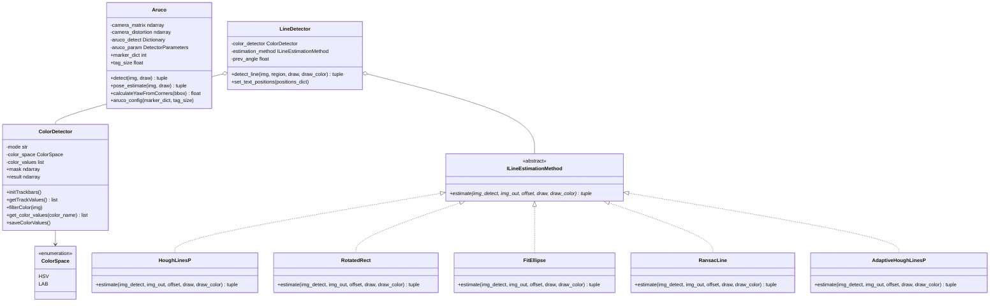
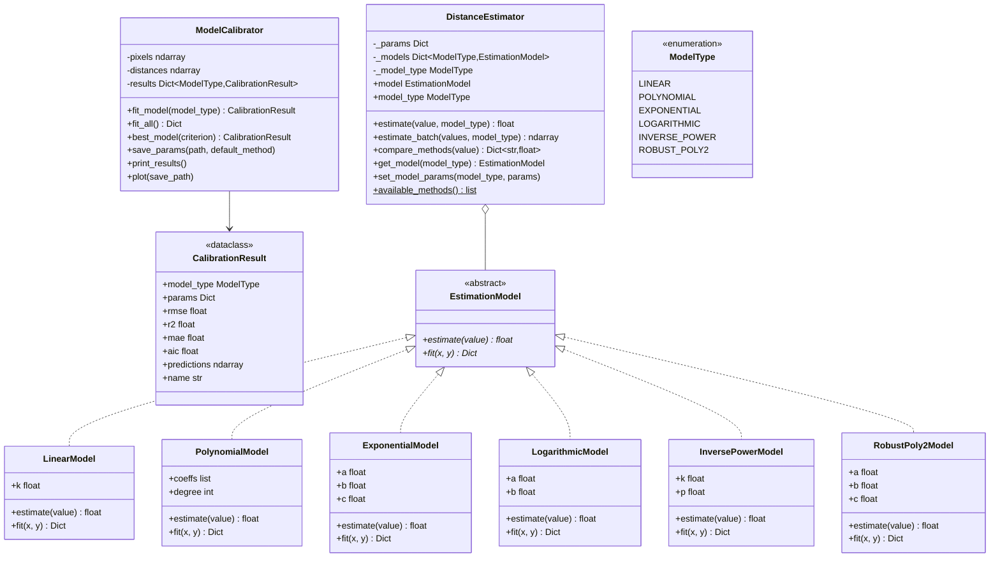
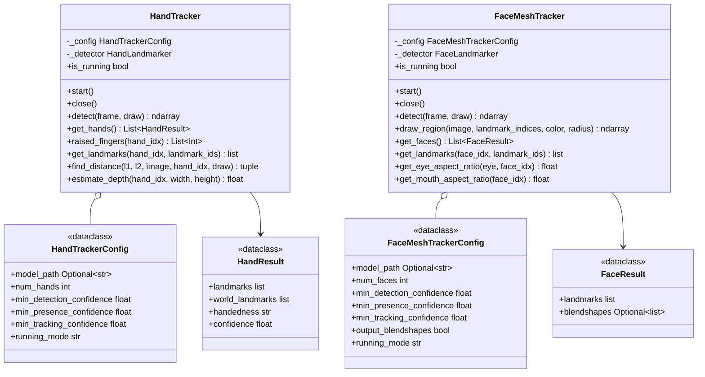

# Vision — Algorithms

Image-processing algorithms that run on frames from any [camera](../camera/README.md): ArUco
markers, color filtering, line detection, distance regression, and MediaPipe hand/face tracking.
Each is a small class you construct once and call per frame.

See also: [Cameras](../camera/README.md) · [ROS 2 nodes](../nodes/README.md) ·
[Vision overview](../README.md).

## Class hierarchy



## ArUco markers

Detects ArUco markers using `cv2.aruco.ArucoDetector` and estimates 6-DOF pose via
`cv2.aruco.estimatePoseSingleMarkers`.

> **Note:** pose estimation requires the camera intrinsic matrix from [camera calibration](../camera/README.md#camera-calibration).

```python
Aruco(marker_dict: int, tag_size: float)

bbox, marker_id = aruco.detect(img, draw=True)                  # detection only
marker_id, translation, yaw = aruco.pose_estimate(img, draw=True)  # requires calibration
```

- `marker_dict`: dictionary size (4, 5, 6, 7 for 4x4, 5x5, ...)
- `tag_size`: physical marker size in meters
- `pose_estimate` returns the marker id (or `None`), `translation` [x, y, z] in meters (camera
  frame), and `yaw` in degrees (0-360)

```python
from nectar.vision import Aruco

aruco = Aruco(marker_dict=5, tag_size=0.05)  # 5x5, 5 cm
marker_id, translation, yaw = aruco.pose_estimate(frame, draw=True)
if marker_id is not None:
    x, y, z = translation
    print(f"Marker {marker_id}: x={x:.2f} y={y:.2f} z={z:.2f} yaw={yaw:.1f}")
```

## Color detection

Color-space filtering using `cv2.inRange()` with morphological operations. HSV (hue 0-179,
saturation/value 0-255) and LAB (L 0-255, a/b 0-255) are supported. Two modes: `track` (interactive
trackbar calibration) and `preset` (load pre-calibrated values from JSON).

```python
ColorDetector(mode: str = "track", color: str = None, color_space: ColorSpace = ColorSpace.HSV)

detector.filterColor(img)  # updates detector.mask and detector.result
detector.initTrackbars()   # calibration window (track mode)
detector.saveColorValues() # save calibration to JSON
```

```python
from nectar.vision import ColorDetector, ColorSpace

# track: tune thresholds live, press 's' to save
detector = ColorDetector(mode="track", color_space=ColorSpace.HSV)
detector.initTrackbars()

# preset: load saved values from JSON
detector = ColorDetector(mode="preset", color="red", color_space=ColorSpace.HSV)
detector.filterColor(frame)
mask = detector.mask
```

Calibration file (`color_calibration.json`):

```json
{
    "red": {
        "HSV": [[0, 100, 100], [10, 255, 255]],
        "LAB": [[20, 150, 128], [255, 200, 200]]
    },
    "blue": {
        "HSV": [[100, 100, 100], [130, 255, 255]]
    }
}
```

## Line detection

Color-based line detection: a binary mask from `ColorDetector` plus a geometric estimation method.

| Method | Algorithm | When to use |
|--------|-----------|-------------|
| `HoughLinesP` | `cv2.HoughLinesP` → `cv2.fitLine` on endpoints | Thin lines, multiple segments to merge |
| `RotatedRect` | `cv2.minAreaRect` on largest contour | Thick continuous lines, single blob |
| `FitEllipse` | `cv2.fitEllipse` on contour | Curved/arc-shaped lines |
| `RansacLine` | `cv2.fitLine` with DIST_L2 on contour points | Noisy masks with outlier pixels |
| `AdaptiveHoughLinesP` | HoughLinesP with threshold from `mean + std` of mask | Varying illumination |

```python
LineDetector(color: str, estimation_method: ILineEstimationMethod, color_space: ColorSpace = None)

img, mask, cx, cy, angle, width, height = detector.detect_line(
    img, region=(400, 300), draw=True, draw_color=(0, 255, 0)
)
```

`detect_line` returns the annotated image, the binary region mask, the line center `cx, cy` in
pixels, the `angle` in degrees (-90 to 90), and the average line `width, height` in pixels.

```python
from nectar.vision import LineDetector, HoughLinesP, ColorSpace

detector = LineDetector(color="blue", estimation_method=HoughLinesP, color_space=ColorSpace.HSV)
result, mask, cx, cy, angle, w, h = detector.detect_line(frame, draw=True)
if not math.isnan(cx):
    print(f"Line at ({cx:.0f}, {cy:.0f}), angle {angle:.1f}")
```

## Distance estimation

Converts a pixel measurement to a real-world distance using regression models.

> **Note:** requires calibration data — `(distance_cm, pixel_value)` pairs collected at known distances.



| Model | Formula | Fitting method |
|-------|---------|----------------|
| `LINEAR` | d = k / pixels | Mean of `distance × pixels` |
| `POLYNOMIAL` | d = Σ(aᵢ × pixelsⁱ) | `np.polyfit` (least squares) |
| `EXPONENTIAL` | d = a × e^(-b×pixels) + c | `scipy.optimize.curve_fit` |
| `LOGARITHMIC` | d = a × ln(pixels) + b | `scipy.optimize.curve_fit` |
| `INVERSE_POWER` | d = k / pixels^p | `scipy.optimize.curve_fit` with bounds |
| `ROBUST_POLY2` | d = a×pixels² + b×pixels + c | `sklearn.linear_model.HuberRegressor` (outlier-resistant) |

Calibrate once, then estimate:

```python
from nectar.vision.algorithms.distance import ModelCalibrator
from nectar.vision import DistanceEstimator, ModelType
from pathlib import Path

data = [(50, 32.2), (60, 28.5), (70, 24.2), (100, 21.6), (150, 16.8)]  # (distance_cm, pixels)
calibrator = ModelCalibrator(data)
calibrator.fit_all()
calibrator.print_results()
calibrator.save_params(Path("parameters.yaml"))
calibrator.plot(Path("model_comparison.png"))

estimator = DistanceEstimator(model_type=ModelType.POLYNOMIAL)
distance_cm = estimator.estimate(21.6)                 # single
distances = estimator.estimate_batch([15, 20, 25, 30]) # batch
results = estimator.compare_methods(21.6)              # {model: distance}
```

## MediaPipe tracking

Real-time hand and face landmark detection using MediaPipe's models.



Both trackers share the same shape: construct with a config, use as a context manager, call
`detect(frame, draw=True)` per frame, then read landmarks. `model_path=None` auto-downloads the
model; `running_mode` is `"IMAGE"` (sync) or `"LIVE_STREAM"` (async).

**Hand tracking** — 21 landmarks per hand, with finger-state gesture recognition:

```python
from nectar.vision import HandTracker, HandTrackerConfig

with HandTracker(HandTrackerConfig(num_hands=2, running_mode="IMAGE")) as tracker:
    tracker.detect(frame, draw=True)
    fingers = tracker.raised_fingers()          # [thumb, index, middle, ring, pinky]
    gestures = {
        (0, 0, 0, 0, 0): "fist",
        (1, 1, 1, 1, 1): "open_palm",
        (0, 1, 0, 0, 0): "pointing",
        (0, 1, 1, 0, 0): "peace",
    }
    gesture = gestures.get(tuple(fingers), "unknown")
```

**Face mesh tracking** — 478 landmarks per face, with eye/mouth aspect ratios and region extraction:

```python
from nectar.vision import FaceMeshTracker, FaceMeshTrackerConfig, FaceLandmarkRegion

with FaceMeshTracker(FaceMeshTrackerConfig(num_faces=1)) as tracker:
    tracker.detect(frame, draw=True)
    if tracker.get_eye_aspect_ratio("left") < 0.15:
        print("Blink detected")
    left_eye = tracker.get_landmarks(landmark_ids=FaceLandmarkRegion.LEFT_EYE)
    tracker.draw_region(frame, FaceLandmarkRegion.LEFT_EYE, color=(0, 255, 0))
```

## Optical flow

`OpticalFlowEstimator` provides sparse and dense frame-to-frame motion estimation. See
`examples/vision/optical_flow_example.py` for a runnable visualization.

## References

| Function / library | Documentation | Used in |
|--------------------|---------------|---------|
| `cv2.aruco.ArucoDetector` | [ArUco Detection](https://docs.opencv.org/4.x/d5/dae/tutorial_aruco_detection.html) | `Aruco.detect()` |
| `cv2.aruco.estimatePoseSingleMarkers` | [ArUco Pose](https://docs.opencv.org/4.x/d9/d6a/group__aruco.html#ga84dd2e88f3e8c3255eb78e0f79571571) | `Aruco.pose_estimate()` |
| `cv2.inRange`, `cv2.morphologyEx` | [Thresholding](https://docs.opencv.org/4.x/da/d97/tutorial_threshold_inRange.html) | `ColorDetector.filterColor()` |
| `cv2.HoughLinesP`, `cv2.fitLine` | [Hough Line Transform](https://docs.opencv.org/4.x/d9/db0/tutorial_hough_lines.html) | `HoughLinesP`, `RansacLine` |
| `cv2.minAreaRect`, `cv2.fitEllipse` | [Contour Features](https://docs.opencv.org/4.x/d3/dc0/group__imgproc__shape.html) | `RotatedRect`, `FitEllipse` |
| MediaPipe Hand Landmarker | [docs](https://ai.google.dev/edge/mediapipe/solutions/vision/hand_landmarker) | `HandTracker` |
| MediaPipe Face Landmarker | [docs](https://ai.google.dev/edge/mediapipe/solutions/vision/face_landmarker) | `FaceMeshTracker` |
| `numpy.polyfit` / `scipy.optimize.curve_fit` / `sklearn.HuberRegressor` | [numpy](https://numpy.org/doc/stable/reference/generated/numpy.polyfit.html) · [scipy](https://docs.scipy.org/doc/scipy/reference/generated/scipy.optimize.curve_fit.html) · [sklearn](https://scikit-learn.org/stable/modules/generated/sklearn.linear_model.HuberRegressor.html) | distance models |
