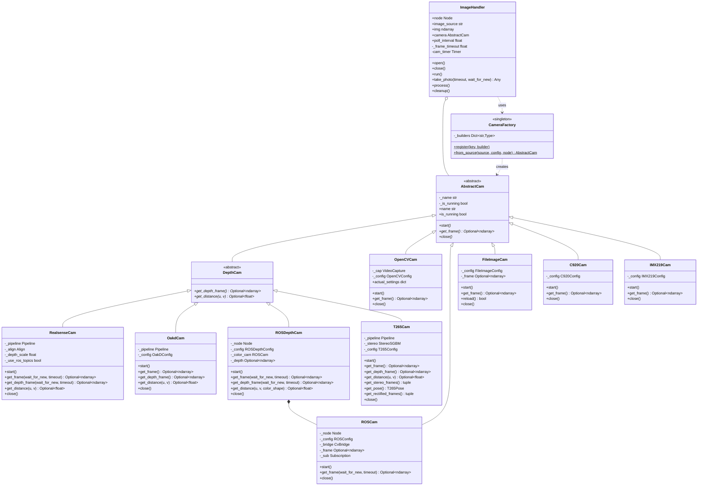
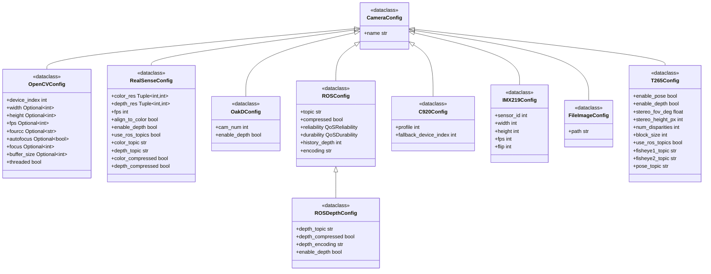

# Vision — Cameras

Camera abstraction layer for the vision module. `CameraFactory` opens any supported camera
behind a common interface; `ImageHandler` turns a camera into a callback-driven ROS 2 stream.

All cameras implement `AbstractCam` (`start` / `get_frame` / `close`); depth-capable cameras add
`DepthCam` (`get_depth_frame` / `get_distance`).

See also: [Algorithms](../algorithms/README.md) · [ROS 2 nodes](../nodes/README.md) ·
[Vision overview](../README.md).

## Class hierarchy



## CameraFactory

Creates camera instances from a source identifier, auto-detecting the source type.

```python
CameraFactory.from_source(source: str, *, config: CameraConfig = None, node: Node = None) -> AbstractCam
CameraFactory.register(key: str, builder: Type[AbstractCam])
```

**Registered sources**:

| Key | Camera class | Description |
|-----|--------------|-------------|
| `webcam` | `OpenCVCam` | Generic USB webcams |
| `opencv` | `OpenCVCam` | Alias for webcam |
| `realsense` | `RealsenseCam` | Intel RealSense D4xx (color + depth via pyrealsense2) |
| `t265` | `T265Cam` | Intel RealSense T265 (fisheye + stereo depth + 6DOF pose) |
| `oakd` | `OakdCam` | Luxonis OAK-D cameras |
| `c920` | `C920Cam` | Logitech C920/C920e |
| `imx219` | `IMX219Cam` | Raspberry Pi Camera v2 (Jetson) |
| `ros` | `ROSCam` | ROS 2 image topics |
| `ros_depth` | `ROSDepthCam` | ROS 2 color + depth image topics |
| `file` | `FileImageCam` | Static image files |

Auto-detection: a file path resolves to `FileImageCam`, a source starting with `/` to `ROSCam`,
and any registered key to its camera.

```python
from nectar.vision import CameraFactory, OpenCVConfig

camera = CameraFactory.from_source("webcam")
camera = CameraFactory.from_source("webcam", config=OpenCVConfig(width=1280, height=720, fps=30))
camera = CameraFactory.from_source("/camera/image_raw", node=node)   # ROS topic
camera = CameraFactory.from_source("/path/to/image.jpg")             # file
```

## ImageHandler

Timer-based camera interface backed by an internal ROS 2 `Node` (registered with the SDK runtime
executor — see [`nectar.runtime`](../../runtime.py)). Invokes a processing callback on every frame
and optionally renders to an OpenCV window.

```python
ImageHandler(
    image_source: str,
    image_processing_callback: Callable = None,
    show_result: str = None,             # OpenCV window name
    *,
    config: CameraConfig = None,
    camera: AbstractCam = None,          # pre-configured camera
    poll_interval: float = 0.01,         # timer period (seconds)
    frame_timeout: float = 0.1,          # frame wait timeout (async)
    executor: Executor = None,           # defaults to nectar.runtime executor
)
```

| Method | Purpose |
|--------|---------|
| `run()` | Start continuous frame capture with the timer |
| `open()` | Manual camera initialization |
| `close()` | Stop the camera |
| `take_photo(timeout_sec=1.0, wait_for_new=True)` | Single-shot capture |
| `cleanup()` | Release the camera, destroy the timer, unregister the internal node |

```python
import nectar
from nectar.vision import ImageHandler, OpenCVConfig

nectar.init()
handler = ImageHandler(
    image_source="webcam",
    config=OpenCVConfig(width=1280, height=720),
    image_processing_callback=lambda frame: detector.detect(frame),
    show_result="Camera View",
)
handler.run()
nectar.spin()
```

## AbstractCam and DepthCam

`AbstractCam` is the base class for every driver; `DepthCam` extends it for RGB-D cameras.

```python
class AbstractCam(ABC):
    name: str                              # camera identifier
    is_running: bool                       # capture status

    def start() -> None                    # initialize camera
    def get_frame() -> Optional[ndarray]   # capture BGR frame
    def close() -> None                    # release resources


class DepthCam(AbstractCam):
    def get_depth_frame() -> Optional[ndarray]           # depth in meters (float32)
    def get_distance(u: int, v: int) -> Optional[float]  # distance at pixel
```

## Configuration classes

Each driver takes a dataclass config subclassing `CameraConfig`.



## T265 tracking camera

The T265 has two 848x800 global-shutter fisheye cameras (30 Hz), a BMI055 IMU (gyro 200 Hz, accel
62 Hz), and an onboard Movidius Myriad 2 VPU running V-SLAM that outputs 6DOF pose at 200 Hz.

It is not a depth camera. `T265Cam` computes stereo depth on the host from the fisheye pair using
OpenCV's StereoSGBM with Kannala-Brandt fisheye undistortion, following the
[librealsense t265_stereo.py](https://github.com/IntelRealSense/librealsense/blob/v2.53.1/wrappers/python/examples/t265_stereo.py)
reference. Effective depth range is ~0.3-3 m given the 64 mm baseline.

**Access modes**:

| Mode | `use_ros_topics` | When to use |
|------|-------------------|-------------|
| Direct | `False` | T265 dedicated to the SDK. Uses the pyrealsense2 callback-based pipeline. |
| ROS topics | `True` | `realsense2_camera` already running. Subscribes to fisheye + CameraInfo + pose topics. |

> **Warning:** when `realsense2_camera` holds the USB device, direct mode fails. Use ROS topic mode to share the camera.

The stereo depth pipeline runs once on `start()` (Kannala-Brandt intrinsics/extrinsics from
pyrealsense2 profiles or `CameraInfo`, undistort/rectify maps, projection/reprojection matrices),
then per frame in `get_depth_frame()` (remap the fisheye pair, run `cv2.StereoSGBM`, convert
disparity to depth via `depth = focal * baseline / disparity`).

**`T265Config`**:

| Parameter | Type | Default | Description |
|-----------|------|---------|-------------|
| `enable_pose` | bool | `True` | Subscribe to / capture 6DOF pose stream |
| `enable_depth` | bool | `True` | Compute stereo depth from fisheye pair |
| `stereo_fov_deg` | float | `90.0` | Output FOV for rectified stereo images |
| `stereo_height_px` | int | `300` | Output height in pixels (width = height + max_disp) |
| `num_disparities` | int | `96` | StereoSGBM max disparity search range (divisible by 16) |
| `block_size` | int | `16` | StereoSGBM block size |
| `use_ros_topics` | bool | `False` | `True`: subscribe to ROS topics. `False`: direct pyrealsense2. |
| `fisheye1_topic` | str | `/camera/fisheye1/image_raw` | Left fisheye topic (ROS mode) |
| `fisheye2_topic` | str | `/camera/fisheye2/image_raw` | Right fisheye topic (ROS mode) |
| `pose_topic` | str | `/camera/pose/sample` | Pose topic (ROS mode, Odometry or PoseStamped) |

**`T265Pose`** (returned by `get_pose()`):

| Field | Type | Description |
|-------|------|-------------|
| `translation` | ndarray (3,) | Position [x, y, z] in meters |
| `rotation` | ndarray (4,) | Quaternion [x, y, z, w] |
| `velocity` | ndarray (3,) | Linear velocity [vx, vy, vz] m/s |
| `angular_velocity` | ndarray (3,) | Angular velocity [wx, wy, wz] rad/s |
| `tracker_confidence` | int | 0 (failed) to 3 (high) |
| `timestamp` | float | Host-synchronized timestamp in seconds |

```python
from nectar.vision import T265Cam, T265Config

# Direct mode (T265 dedicated to the SDK)
cam = T265Cam(T265Config(enable_depth=True, enable_pose=True))
cam.start()
frame = cam.get_frame()          # left fisheye (BGR, 800x848x3)
depth = cam.get_depth_frame()    # stereo depth (float32, meters, 300x300)
pose = cam.get_pose()            # T265Pose
left, right = cam.get_stereo_frames()

# ROS topic mode (realsense2_camera already running)
cam = T265Cam(T265Config(use_ros_topics=True), node=node)
cam.start()
```

**V-SLAM options** (direct mode only, set on the pose sensor before `pipeline.start()`):

| Option | pyrealsense2 name | Default | Description |
|--------|-------------------|---------|-------------|
| Mapping | `rs.option.enable_mapping` | 1 (on) | Internal feature map. Reduces drift via small loop closures. |
| Relocalization | `rs.option.enable_relocalization` | 1 (on) | Reconnects to map after large drift. Can cause large pose jumps. |
| Pose jumping | `rs.option.enable_pose_jumping` | 1 (on) | Allows discontinuous translation corrections. |
| Map preservation | `rs.option.enable_map_preservation` | 0 (off) | Preserve map across stop/start cycles. |

> **Warning:** for drone flight with the ArduPilot EKF, disable relocalization and pose jumping (the EKF cannot handle discontinuous position teleports); keep mapping enabled. See [PR #4321](https://github.com/IntelRealSense/librealsense/pull/4321), [realsense-ros #779](https://github.com/IntelRealSense/realsense-ros/issues/779).
>
> **Note — T265 and RealSense versions:** RealSense support uses two independent stacks:
>
> 1. **System / ROS (`make realsense`)** — builds **librealsense** and **realsense-ros** from
>    source. Override versions with `LIBREALSENSE_VERSION` and `REALSENSE_ROS_TAG` (defaults
>    per ROS distro are in `scripts/lib/config.sh`). For the discontinued T265 on Humble:
>    `LIBREALSENSE_VERSION=v2.53.1 REALSENSE_ROS_TAG=4.51.1 make realsense`. That build also
>    installs a matching **pyrealsense2** under `/usr/local/lib` (added to `PYTHONPATH`).
> 2. **Pip extra (`nectar-sdk[realsense]`)** — installs **PyPI pyrealsense2 ≥2.55** for **D4xx
>    direct mode** (`RealsenseCam`). PyPI dropped T265 (TM2) after 2.53.x; the pip extra does
>    not target the T265.
>
> For T265: use **ROS topic mode** (`T265Config(use_ros_topics=True)`) with the T265
> `make realsense` versions above, or **direct mode** with pyrealsense2 from a v2.53.1 source
> build — not the pip extra alone. See [RealSense setup](../../../../docs/setup/realsense.md).

## Camera calibration

Intrinsic calibration computes the 3×3 camera matrix (fx, fy, cx, cy) and distortion coefficients
(k1, k2, p1, p2, k3). A single `CameraCalibration` node handles both board patterns and writes the
shared output files (`camera_matrix.txt`, `camera_distortion.txt`) loaded via `load_calibration()`.

| Pattern | `pattern` value | Notes |
|---------|-----------------|-------|
| ChArUco (default, recommended) | `charuco` | Subpixel chessboard accuracy plus ArUco robustness to occlusion and partial views, so frames at the image edges still contribute |
| Chessboard | `chessboard` | Plain printed chessboard, fully visible per frame, with `cornerSubPix` refinement |

**Capture modes**:

| Mode | `mode` value | Behavior |
|------|--------------|----------|
| Auto (default) | `auto` | Accepts a view automatically when the board is detected with at least `min_corners_per_frame` corners and `auto_interval` seconds have passed. Stops after `target_views`. |
| Manual | `manual` | Key-driven from the preview window: `c` capture, `u` undo last, `r` reset all, `Enter` finish + calibrate, `q` quit. Requires a GUI window; falls back to auto when none is available. |

The preview window is optional (`show_preview`), so the node runs headless (e.g. on a Jetson over
SSH). Progress is logged to the terminal in both modes.

**Print the board** (ChArUco): any board PDF from
[`carlosmccosta/charuco_detector`](https://github.com/carlosmccosta/charuco_detector/tree/master/boards/vector_format/black_and_white)
at 100% scale. The defaults match the A4, 5×7, 40 mm square, 30 mm marker, DICT_4X4_1000 PDF. Glue
the print to a rigid flat surface. Printers rescale by ~0.5-2%, so measure N squares with a caliper
after printing and compute the real square size; the marker length scales by the same factor
(30/40 = 0.75 for this board).

```bash
ros2 run nectar calibration.py                                          # auto ChArUco (default)
ros2 run nectar calibration.py --ros-args -p width:=1920 -p height:=1080 # match production resolution

ros2 run nectar calibration.py --ros-args \
    -p pattern:=chessboard -p mode:=manual \
    -p chessboard_cols:=9 -p chessboard_rows:=7 -p square_length:=0.025  # manual chessboard

ros2 run nectar calibration.py --ros-args -p show_preview:=false         # headless
```

Calibrate at the same resolution you will use in production (intrinsics are resolution-specific).
Move the board to fill different regions of the image and use strong tilts (pitch/yaw ±30°),
especially near the edges where distortion is strongest.

**Parameters**:

| Parameter | Type | Default | Description |
|-----------|------|---------|-------------|
| `pattern` | string | `charuco` | Board pattern: `charuco` or `chessboard` |
| `mode` | string | `auto` | Capture mode: `auto` or `manual` |
| `image_source` | string | `webcam` | Camera source (any `CameraFactory` value) |
| `device_index` | int | `0` | OpenCV `VideoCapture` index (only for `webcam`/`opencv`) |
| `width` | int | `0` | Requested capture width; `0` keeps the camera default |
| `height` | int | `0` | Requested capture height; `0` keeps the camera default |
| `chessboard_cols` | int | `9` | Inner corners in X (chessboard only) |
| `chessboard_rows` | int | `7` | Inner corners in Y (chessboard only) |
| `squares_x` | int | `5` | Board squares in X (charuco only) |
| `squares_y` | int | `7` | Board squares in Y (charuco only) |
| `square_length` | float | `0.040` | Measured square side in meters (caliper after printing) |
| `marker_length` | float | `0.030` | Measured marker side in meters (charuco; scale with `square_length`) |
| `aruco_dict` | string | `DICT_4X4_1000` | Predefined dictionary name (charuco); shorthand `4X4_1000` accepted |
| `min_corners_per_frame` | int | `6` | Minimum corners required to accept a frame |
| `target_views` | int | `20` | Accepted views to collect before auto calibration |
| `auto_interval` | float | `0.75` | Seconds between automatic captures (auto mode) |
| `show_preview` | bool | `true` | Live preview window; auto-disabled when no GUI is available |
| `save_dataset` | bool | `true` | Also write accepted frames to `dataset/` |
| `output_dir` | string | `""` | Output directory; empty resolves to the calibration package dir so `load_calibration()` finds it |

Aim for `reprojection_error < 0.5 px` (logged after calibration). Values above 1.0 px trigger a
warning and usually mean a flexed board, motion blur, or poor pose coverage.

```python
from nectar.vision.camera import CameraCalibration

matrix, distortion = CameraCalibration.load_calibration()
```

## Image geometry (ImageCalculus)

Pixel-to-world coordinate transformations for downward-facing cameras, using a pinhole camera
model with small-angle approximations for pitch/roll compensation.

```python
from nectar.vision.utils import ImageCalculus

calc = ImageCalculus(
    camera_offset={"forward": 0.1, "right": 0.0, "up": 0.0},   # meters
    camera_resolution={"width": 1920, "height": 1080},
    pixels_per_degree={"horizontal": 30, "vertical": 30},
)

# Ground intersection from a pixel -> (forward, right, down) in meters
vector = calc.calculate_vector_from_drone_to_ground(
    target_pixel=(640, 360), height=10.0, pitch=5.0, roll=2.0
)

# Pixel -> GPS
lat, lon = ImageCalculus.estimate_pixel_gps(
    origin_lat=-27.1234, origin_lon=-48.4567,
    origin_row=540, origin_col=960,
    target_row=300, target_col=800,
    gsd=0.05, image_bearing=45.0,
)

# Meters -> pixel offset
offset_px = ImageCalculus.calculate_offset_pixels(
    offset_meters=0.1, height_meters=10.0, fov_degrees=60.0, image_pixels=1920
)
```

## References

| SDK | Documentation | Camera class |
|-----|---------------|--------------|
| Intel RealSense (D4xx) | [RealSense SDK 2.0](https://dev.intelrealsense.com/docs/docs-get-started) | `RealsenseCam` |
| Intel RealSense (T265) | [T265 docs](https://github.com/IntelRealSense/librealsense/blob/v2.53.1/doc/t265.md), [t265_stereo.py](https://github.com/IntelRealSense/librealsense/blob/v2.53.1/wrappers/python/examples/t265_stereo.py) | `T265Cam` |
| DepthAI | [Luxonis DepthAI](https://docs.luxonis.com/software/) | `OakdCam` |
| GStreamer | [nvarguscamerasrc](https://docs.nvidia.com/jetson/archives/r35.4.1/DeveloperGuide/text/SD/CameraDevelopment/CameraSoftwareDevelopmentSolution.html) | `IMX219Cam` |
| `cv2.VideoCapture` | [Video I/O](https://docs.opencv.org/4.x/d8/dfe/classcv_1_1VideoCapture.html) | `OpenCVCam` |
| `cv2.calibrateCamera` | [Camera Calibration](https://docs.opencv.org/4.x/dc/dbb/tutorial_py_calibration.html) | `CameraCalibration` |
| `cv2.aruco.CharucoDetector` | [ChArUco Detection](https://docs.opencv.org/4.x/df/d4a/tutorial_charuco_detection.html) | `CameraCalibration` |
| `sensor_msgs/Image`, `CompressedImage` | [sensor_msgs](https://docs.ros.org/en/humble/p/sensor_msgs/) | `ROSCam`, camera publisher node |
| `cv_bridge` | [cv_bridge](https://github.com/ros-perception/vision_opencv/tree/humble) | `ROSCam` |
