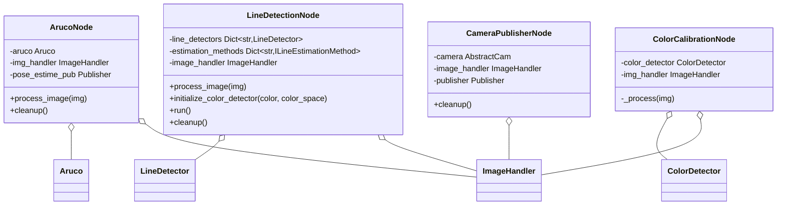

# Vision — ROS 2 nodes

Ready-to-run nodes that wrap the vision [algorithms](../algorithms/README.md) and
[cameras](../camera/README.md) as ROS 2 executables (`ros2 run nectar <node>.py`). Each drives an
`ImageHandler` internally and publishes to `nectar_interfaces` messages.

See also: [Cameras](../camera/README.md) · [Algorithms](../algorithms/README.md) ·
[Vision overview](../README.md).

## Architecture



## ArUco detection node

```bash
ros2 run nectar aruco_node.py --ros-args \
    -p image_source:=webcam -p marker_dict:=5 -p tag_size:=0.05
```

| Parameter | Type | Default | Description |
|-----------|------|---------|-------------|
| `image_source` | string | webcam | Camera source |
| `marker_dict` | int | 5 | ArUco dictionary (4, 5, 6, 7) |
| `tag_size` | float | 0.2 | Marker size in meters |

Publishes `/aruco/pose_estimate` (`nectar_interfaces/ArucoTransforms`).

## Line detection node

```bash
ros2 run nectar line_detection_node.py --ros-args \
    -p line_colors:="blue,red" -p method:=HoughLinesP \
    -p spaces:="hsv,lab" -p image_source:=webcam -p show_visualization:=true
```

| Parameter | Type | Default | Description |
|-----------|------|---------|-------------|
| `line_colors` | string | teste | Comma-separated color names from `color_calibration.json` (e.g. `blue,red`). The default `teste` is a placeholder — set explicit names that exist in your calibration file, as in the example above. |
| `method` | string | HoughLinesP | Estimation method |
| `spaces` | string | hsv | Comma-separated color spaces |
| `image_source` | string | webcam | Camera source |
| `show_visualization` | bool | true | Show OpenCV window |
| `visualization_name` | string | Line Detection | Window title |

Methods: `HoughLinesP`, `RotatedRect`, `FitEllipse`, `RansacLine`, `AdaptiveHoughLinesP`. Per color
it publishes `/line_state/{color}` (`nectar_interfaces/LineInfo`) and `/line_detect/{color}`
(`std_msgs/Bool`).

## Color calibration node

```bash
ros2 run nectar color_calibration_node.py --ros-args \
    -p image_source:=webcam -p color_space:=hsv -p flood_tolerance:=15
```

Interactive HSV/LAB calibration in one window: left-click a colored region to auto-compute
thresholds via flood fill, then fine-tune with the six channel trackbars. The stacked view shows
`original | mask | result`.

| Parameter | Type | Default | Description |
|-----------|------|---------|-------------|
| `image_source` | string | webcam | Camera source |
| `color_space` | string | hsv | Initial color space (`hsv` or `lab`) |
| `flood_tolerance` | int | 15 | Initial flood-fill tolerance for click sampling |

| Key | Action |
|-----|--------|
| left-click | Sample the clicked region (flood fill) |
| `c` | Switch HSV / LAB |
| `s` | Save (prompts for a color name) |
| `l` | Load a named color |
| `z` | Undo last sample |
| `r` | Reset |
| `q` | Quit |

Saved colors are written to the shared `algorithms/color/color_calibration.json` and load via
`ColorDetector(mode="preset", color=<name>)` and the line detection node.

> **Note:** this node requires an OpenCV GUI (mouse + trackbars).

## Camera publisher node

Publishes any `CameraFactory` source as a ROS 2 image topic. Select the driver with
`camera_source` (`webcam`, `realsense`, `oakd`, `c920`, `imx219`, `ros`, ...) and set the
source-specific parameters.

```bash
ros2 run nectar camera_publisher_node.py --ros-args \
    -p camera_source:=webcam -p device_index:=0 \
    -p width:=1280 -p height:=720 -p fps:=30 \
    -p use_compression:=true -p jpeg_quality:=80 -p threaded:=true
```

| Parameter | Type | Default | Description |
|-----------|------|---------|-------------|
| `camera_source` | string | webcam | Camera driver key passed to `CameraFactory` |
| `device_index` | int | 0 | USB/webcam device index |
| `width` / `height` | int | 640 / 480 | Frame size |
| `fps` | int | 30 | Target FPS |
| `use_compression` | bool | true | Publish JPEG-compressed images |
| `jpeg_quality` | int | 80 | JPEG quality (0-100) |
| `buffer_size` | int | 2 | Camera buffer size |
| `threaded` | bool | true | Background capture thread |

Publishes `image_raw/compressed` (`sensor_msgs/CompressedImage`) or `image_raw`
(`sensor_msgs/Image`, when compression is disabled).
