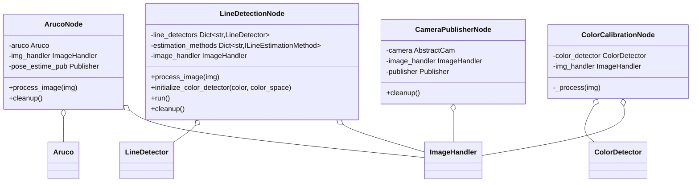

# Vision — ROS 2 nodes

Ready-to-run nodes that wrap the vision [algorithms](../algorithms/README.md) and
[cameras](../camera/README.md) as ROS 2 executables (`ros2 run nectar <node>.py`). Each drives an
`ImageHandler` internally and publishes to `nectar_interfaces` messages.

Camera and preview flags are shared. Algorithm flags stay on the node. Launch files pass
`arguments=['--source', 'webcam']` (not a YAML dump of every driver).

See also: [Cameras](../camera/README.md) · [Algorithms](../algorithms/README.md) ·
[Vision overview](../README.md).

## Shared flags

Every vision node accepts the same camera and stream flags. Camera fields are generated from the
`CameraConfig` dataclasses; omitted flags keep that driver's dataclass default (so `--width` is
not applied to Oak-D, and Oak-D `enable_depth` stays `False` unless you pass it).

```bash
ros2 run nectar aruco_node.py --source webcam --device-index 1 --no-show
ros2 run nectar aruco_node.py --source ros --topic /camera/color/image_raw/compressed --compressed
ros2 run nectar aruco_node.py --source /image_raw --publish
```

| Flag | Maps to | Notes |
|------|---------|-------|
| `--source` | `CameraFactory` key, ROS topic (`/…`), or file path | Default `webcam` |
| `--device-index` | `OpenCVConfig.device_index` | Webcam / opencv |
| `--width` `--height` `--fps` | OpenCV / IMX219 fields | Dataclass default if omitted |
| `--topic` `--compressed` | `ROSConfig` | `--source ros`, or a topic as `--source` |
| `--path` | `FileImageConfig.path` | `--source file` |
| `--color-width` `--color-height` | `RealSenseConfig.color_res` | RealSense only |
| `--show` / `--no-show` | `ImageHandler.show_result` | Interactive nodes default on; publisher defaults off |
| `--publish` `--publish-topic` `--jpeg-quality` | optional JPEG of the processed frame | Not used by `camera_publisher_node` (it always publishes the frame) |

`ros2 run nectar <node>.py --help` lists driver-specific groups. Leftover `--ros-args` still reach
`rclpy`. Line detection still exposes `line_colors` / `method` / `spaces` / `roi` as ROS parameters
for live `ros2 param set` (those do not reopen the camera).

## Architecture


```mermaid
classDiagram
    class ArucoNode {
        -aruco Aruco
        -img_handler ImageHandler
        -pose_estime_pub Publisher
        +process_image(img)
        +cleanup()
    }

    class LineDetectionNode {
        -line_detectors Dict~str,LineDetector~
        -estimation_methods Dict~str,ILineEstimationMethod~
        -image_handler ImageHandler
        +process_image(img)
        +initialize_color_detector(color, color_space)
        +run()
        +cleanup()
    }

    class ColorCalibrationNode {
        -color_detector ColorDetector
        -img_handler ImageHandler
        -_process(img)
    }

    class CameraPublisherNode {
        -camera AbstractCam
        -image_handler ImageHandler
        -publisher Publisher
        +cleanup()
    }

    ArucoNode o-- Aruco
    ArucoNode o-- ImageHandler
    LineDetectionNode o-- LineDetector
    LineDetectionNode o-- ImageHandler
    ColorCalibrationNode o-- ColorDetector
    ColorCalibrationNode o-- ImageHandler
    CameraPublisherNode o-- ImageHandler
```

## ArUco detection node

```bash
ros2 run nectar aruco_node.py --source webcam --marker-dict 5 --tag-size 0.05
```

| Flag | Type | Default | Description |
|------|------|---------|-------------|
| `--marker-dict` | int | 5 | ArUco dictionary (4, 5, 6, 7) |
| `--tag-size` | float | 0.2 | Marker size in meters |

Publishes `/aruco/pose_estimate` (`nectar_interfaces/ArucoTransforms`). `--publish` adds the
annotated image on `--publish-topic` (default `/aruco/image/compressed`).

## Line detection node

```bash
ros2 run nectar line_detection_node.py --source webcam \
    --line-colors blue,red --method HoughLinesP --spaces hsv,lab
```

| Flag | Type | Default | Description |
|------|------|---------|-------------|
| `--line-colors` | string | teste | Comma-separated color names from the calibration JSON (e.g. `blue,red`). The default `teste` is a placeholder — set names that exist in your file. |
| `--method` | string | HoughLinesP | Estimation method |
| `--spaces` | string | hsv | Comma-separated color spaces |
| `--roi` | string | 480,280 | Detection window as `width,height` |
| `--visualization-name` | string | Line Detection | Window title |
| `--calibration-file` | string | (empty) | Calibration JSON. Empty uses `~/.config/nectar/color_calibration.json`. |

Methods: `HoughLinesP`, `RotatedRect`, `FitEllipse`, `RansacLine`, `AdaptiveHoughLinesP`. Per color
it publishes `/line_state/{color}` (`nectar_interfaces/LineInfo`) and `/line_detect/{color}`
(`std_msgs/Bool`).

## Color calibration node

```bash
ros2 run nectar color_calibration_node.py --source webcam --color-space hsv --flood-tolerance 15
```

Interactive HSV/LAB calibration in one window: left-click a colored region to auto-compute
thresholds via flood fill, then fine-tune with the six channel trackbars. The stacked view shows
`original | mask | result`. Requires an OpenCV GUI.

| Flag | Type | Default | Description |
|------|------|---------|-------------|
| `--color-space` | string | hsv | Initial color space (`hsv` or `lab`) |
| `--flood-tolerance` | int | 15 | Initial flood-fill tolerance for click sampling |
| `--calibration-file` | string | (empty) | Calibration JSON. Empty uses `~/.config/nectar/color_calibration.json`. |

| Key | Action |
|-----|--------|
| left-click | Sample the clicked region (flood fill) |
| `c` | Switch HSV / LAB |
| `s` | Save (prompts for a color name) |
| `l` | Load a named color |
| `z` | Undo last sample |
| `r` | Reset |
| `q` | Quit |

Saved colors are written to `~/.config/nectar/color_calibration.json` (or `--calibration-file`) and
load via `ColorDetector(mode="preset", color=<name>)` and the line detection node.

## Camera publisher node

Publishes any `CameraFactory` source as a ROS 2 image topic. This node always publishes the frame;
use `--no-compression` for raw `sensor_msgs/Image`. Preview is off unless `--show`.

```bash
ros2 run nectar camera_publisher_node.py --source webcam --device-index 0 \
    --width 1280 --height 720 --fps 30 --jpeg-quality 80
```

| Flag | Type | Default | Description |
|------|------|---------|-------------|
| `--no-compression` | flag | (compression on) | Publish `sensor_msgs/Image` instead of JPEG |
| `--jpeg-quality` | int | 80 | JPEG quality (0-100) |
| `--log-fps-interval` | float | 5.0 | FPS log period; `0` disables |
| `--poll-interval` | float | -1 | Frame-poll period; `-1` = auto |
| `--frame-timeout` | float | -1 | New-frame wait; `-1` = auto |

Publishes `image_raw/compressed` (`sensor_msgs/CompressedImage`) or `image_raw`
(`sensor_msgs/Image`).
