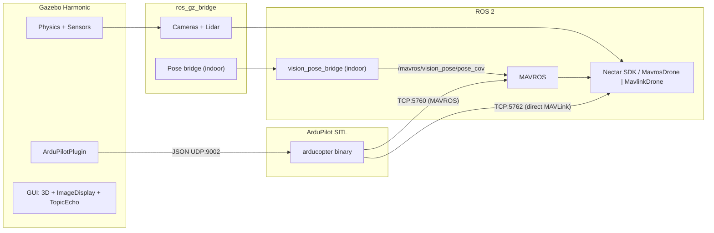
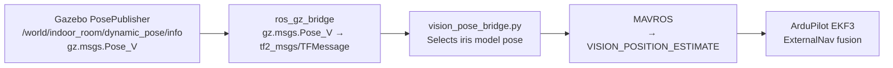

# Simulation Module

ArduPilot SITL + Gazebo Harmonic simulation for Nectar drone development and testing, over either transport (MAVROS or direct MAVLink).

## How It Works

ArduPilot [SITL](https://ardupilot.org/dev/docs/sitl-simulator-software-in-the-loop.html) runs the full ArduCopter firmware on the host machine. [Gazebo Harmonic](https://gazebosim.org/docs/harmonic) provides physics and sensor simulation. The [ArduPilotPlugin](https://github.com/ArduPilot/ardupilot_gazebo) bridges Gazebo physics to SITL via JSON over UDP (port 9002). SITL exposes two MAVLink endpoints: TCP `5760` (SERIAL0, for [MAVROS](https://github.com/mavlink/mavros)) and TCP `5762` (SERIAL1, for a direct pymavlink client / `MavlinkDrone`) — so both transports can run against the same simulator. The [ros_gz_bridge](https://github.com/ros-gz/ros_gz) converts Gazebo sensor data to ROS 2 messages.



## Two Environments

### Outdoor (GPS)

- World: `outdoor_field.sdf` -- open field with obstacle zone at x=13..18, fly-through gate
- GPS via `gz-sim-navsat-system` plugin with WGS84 coordinates (Canberra default)
- ArduPilot params: `copter.parm` + `gazebo.parm` (rangefinder enabled)
- Config preset: `SITL_GAZEBO_CONFIG` (PoseSource.GPS)

### Indoor (Vision)

- World: `indoor_room.sdf` -- 20x20x12m enclosed room, drone at x=-5, obstacle zone at x=5..9, gate
- No GPS. EKF3 uses ExternalNav (vision) for position
- `vision_pose_bridge.py` feeds Gazebo ground-truth pose to `/mavros/vision_pose/pose_cov`
- ArduPilot params: `copter.parm` + `gazebo.parm` + `indoor.parm` (GPS disabled, EKF3 ExternalNav)
- Config preset: `SITL_VISION_CONFIG` (PoseSource.VISION)

## Simulated Sensors

| Real sensor | Gazebo sensor | Topic (ROS 2) | Notes |
|---|---|---|---|
| RealSense D435i (front) | `rgbd_camera` | `/front_camera/image`, `/front_camera/depth_image`, `/front_camera/points` | 640x480, RGB + depth + point cloud |
| Arducam (down) | `camera` | `/down_camera` | 640x480 RGB, downward-facing |
| TFLuna lidar (down) | SITL simulated sonar | `/mavros/rangefinder_pub` | `RNGFND1_TYPE=1`, ground distance from physics |
| TFLuna lidar (down) | `gpu_lidar` | `/lidar/range` | Direct LaserScan via Gazebo, 1-sample rangefinder |

The rangefinder has two data paths: SITL sonar (via MAVLink `DISTANCE_SENSOR` to MAVROS) and Gazebo `gpu_lidar` (via `ros_gz_bridge`). Same as real hardware where the lidar feeds both ArduPilot and ROS directly.

## Gazebo GUI

Both world SDFs include built-in GUI plugins (no extra windows needed):

- **ImageDisplay** panels for front RGB, front depth, and down camera (start collapsed, click to expand)
- **TopicEcho** for viewing any Gazebo transport topic live
- **WorldStats** showing sim time, real time, RTF

## Installation

```bash
# ArduPilot SITL (clones ~/ardupilot, builds ArduCopter)
make sim-install

# Gazebo Harmonic + ArduPilotPlugin + ros_gz_bridge from source
make sim-install-gazebo

source ~/.bashrc
```

## Usage

### Outdoor simulation

```bash
# Terminal 1: Start SITL (loads copter.parm + gazebo.parm, wipes EEPROM)
make sim-start-gazebo

# Terminal 2: Launch Gazebo + MAVROS + ros_gz_bridge
make sim-outdoor
```

#### Direct MAVLink (no MAVROS)

```bash
# Terminal 1: same SITL
make sim-start-gazebo

# Terminal 2: Gazebo + ros_gz_bridge only (mavros:=false), drive SITL on 5762
make sim-outdoor-direct
```

`sim-outdoor-direct` runs `sitl_gazebo.launch.py world:=outdoor mavros:=false`. Connect a `MavlinkDrone` with `MAVLINK_SITL_GAZEBO_CONFIG` (tcp `5762`) — it attaches to SERIAL1 alongside or instead of MAVROS on SERIAL0.

### Indoor simulation

```bash
# Terminal 1: Start SITL (loads copter.parm + gazebo.parm + indoor.parm, wipes EEPROM)
make sim-start-indoor

# Terminal 2: Launch Gazebo + MAVROS + ros_gz_bridge + vision_pose_bridge
make sim-indoor
```

### Headless (no Gazebo)

```bash
# Terminal 1: SITL with internal physics
make sim-start

# Terminal 2: MAVROS only
make sim-mavros
```

### Stop all

```bash
make sim-stop
```

Kills arducopter, Gazebo, MAVROS, ros_gz_bridge, and vision_pose_bridge processes.

### Verify sensors

```bash
# State
ros2 topic echo /mavros/state --once

# GPS (outdoor)
ros2 topic echo /mavros/global_position/global --once --qos-reliability best_effort

# Vision pose (indoor)
ros2 topic echo /mavros/vision_pose/pose_cov --once

# Rangefinder
ros2 topic echo /mavros/rangefinder_pub --once

# Front camera
ros2 topic echo /front_camera/image --once

# Depth
ros2 topic echo /front_camera/depth_image --once
```

## Configuration Presets

Defined in `nectar/control/config.py`:

| Preset | Transport | Port | PoseSource | Lidar | Use case |
|---|---|---|---|---|---|
| `SITL_CONFIG` | mavros | 5760 | GPS | No | Headless SITL, no sensors |
| `SITL_GPS_CONFIG` | mavros | 5760 | GPS | No | Headless SITL with GPS |
| `SITL_GAZEBO_CONFIG` | mavros | 5760 | GPS | Yes | Gazebo outdoor |
| `SITL_VISION_CONFIG` | mavros | 5760 | VISION | Yes | Gazebo indoor |
| `MAVLINK_SITL_CONFIG` | mavlink | 5760 | GPS | No | Headless SITL, direct pymavlink |
| `MAVLINK_SITL_GAZEBO_CONFIG` | mavlink | 5762 | GPS | No | Gazebo outdoor, direct (SERIAL1, alongside MAVROS) |
| `MAVLINK_SITL_VISION_CONFIG` | mavlink | 5762 | VISION | No | Gazebo indoor, direct (reuses the MAVROS vision relay topic) |

```python
from nectar.control import DroneFactory, SITL_GAZEBO_CONFIG, MAVLINK_SITL_GAZEBO_CONFIG

# Outdoor over MAVROS (port 5760)
drone = DroneFactory.create("mavros", SITL_GAZEBO_CONFIG, node)

# Outdoor over direct MAVLink (port 5762, with `make sim-outdoor-direct`)
drone = DroneFactory.create("mavlink", MAVLINK_SITL_GAZEBO_CONFIG, node)
```

## Test Suite

`sitl_test.py` runs atomic navigation tests. Each test starts from a clean hover and verifies a specific capability.

### Usage

```bash
# All outdoor tests (31 tests)
python3 nectar/nectar/examples/simulation/sitl_test.py

# All indoor-compatible tests (skips GPS-only tests)
python3 nectar/nectar/examples/simulation/sitl_test.py --indoor

# Specific tests
python3 nectar/nectar/examples/simulation/sitl_test.py pid_fwd setpoint_fwd

# Test group
python3 nectar/nectar/examples/simulation/sitl_test.py --group vel

# List all tests and groups
python3 nectar/nectar/examples/simulation/sitl_test.py --list
```

### Test categories

| Group | Tests | Description |
|---|---|---|
| `vel` | vel_fwd, vel_lat, vel_up, vel_yaw, vel_takeoff, vel_world, brake | Velocity commands in BODY/WORLD/TAKEOFF frames |
| `pid` | pid_fwd, pid_lat, pid_alt, pid_yaw | PID navigation with raw GPS |
| `pid_local` | pid_local_fwd, pid_local_lat, pid_local_yaw | PID navigation with EKF local position |
| `setpoint` | setpoint_fwd, setpoint_lat, setpoint_yaw | Local position setpoint publishing |
| `setpoint_global` | setpoint_global, setpoint_global_yaw | GPS global setpoint (outdoor only) |
| `rtl` | rtl_pid, rtl_ardupilot | Return to launch |
| `square` | sq_pid, sq_pid_takeoff, sq_pid_local, sq_setpoint, sq_setpoint_global, sq_wpnav | 3m square patterns |

GPS-only tests (skipped with `--indoor`): `heading_enu`, `setpoint_global`, `setpoint_global_yaw`, `sq_setpoint_global`, `rtl_ardupilot`.

## ArduPilot Parameters

### gazebo.parm (loaded for all Gazebo sessions)

| Parameter | Value | Purpose |
|---|---|---|
| `SIM_SONAR_SCALE` | 10 | SITL sonar scaling factor |
| `RNGFND1_TYPE` | 1 | Analog rangefinder driven by SIM_SONAR |
| `RNGFND1_SCALING` | 10 | Voltage-to-distance scaling |
| `RNGFND1_PIN` | 0 | Analog pin |
| `RNGFND1_MAX` | 40 | Max range (m) |
| `RNGFND1_MIN` | 0.10 | Min range (m) |

### indoor.parm (loaded additionally for indoor)

| Parameter | Value | Purpose |
|---|---|---|
| `GPS1_TYPE` | 0 | Disable GPS |
| `EK3_SRC1_POSXY` | 6 | ExternalNav for XY position |
| `EK3_SRC1_VELXY` | 6 | ExternalNav for XY velocity |
| `EK3_SRC1_POSZ` | 1 | Barometer for Z (default) |
| `EK3_SRC1_YAW` | 6 | ExternalNav for yaw |
| `VISO_TYPE` | 1 | Enable visual odometry input |
| `ARMING_CHECK` | 388598 | Disable GPS-related arming checks |

## Indoor Vision Pose Pipeline



The `vision_pose_bridge.py` node replaces the real RealSense D435i + Isaac ROS VSLAM pipeline. It selects the `iris` model pose from the Gazebo ground-truth `TFMessage` and publishes `PoseWithCovarianceStamped` on `/mavros/vision_pose/pose_cov`.

**Frame-name fallback**: it first matches the transform whose `child_frame_id` equals the model name. On ROS 2 Jazzy the `ros_gz_bridge` `Pose_V → TFMessage` conversion strips the frame ids, leaving `child_frame_id` empty. When all names are empty the bridge falls back to the transform at `model_index` (default `0`, the iris model root) and logs a one-time warning, so the indoor pipeline publishes reliably on Jazzy.

> The direct MAVLink transport does not need this relay on real hardware — its built-in `VisionPoseBridge` subscribes straight to the VSLAM topic. In sim, `MAVLINK_SITL_VISION_CONFIG` simply reuses `/mavros/vision_pose/pose_cov` produced here to avoid a second pose source. See [mavlink/README.md](../nectar/control/mavlink/README.md).

## File Structure

```
simulation/
├── README.md                 # This file
├── params/
│   ├── gazebo.parm           # Rangefinder params (all Gazebo sessions)
│   └── indoor.parm           # No-GPS + EKF3 ExternalNav params
└── worlds/
    ├── outdoor_field.sdf     # Open field + obstacles + GPS
    └── indoor_room.sdf       # 20x20x12m room + obstacles + no GPS

scripts/simulation/
├── install_sitl.sh           # Clone and build ArduPilot SITL
├── install_gazebo.sh         # Install Gazebo + ArduPilotPlugin + ros_gz from source
├── start_sitl.sh             # Start arducopter binary (--gazebo, --indoor flags)
└── vision_pose_bridge.py     # Gazebo ground-truth → MAVROS vision pose

nectar/launch/
├── sitl.launch.py            # MAVROS-only launch (headless SITL)
└── sitl_gazebo.launch.py     # Gazebo + ros_gz_bridge (+ MAVROS unless mavros:=false)

nectar/nectar/examples/simulation/
└── sitl_test.py              # Navigation test suite (--indoor flag)
```

## References

- [ArduPilot SITL](https://ardupilot.org/dev/docs/sitl-simulator-software-in-the-loop.html)
- [ArduPilot SITL with Gazebo](https://ardupilot.org/dev/docs/sitl-with-gazebo.html)
- [ardupilot_gazebo plugin](https://github.com/ArduPilot/ardupilot_gazebo)
- [Gazebo Harmonic](https://gazebosim.org/docs/harmonic)
- [Gazebo sensors](https://gazebosim.org/api/sensors)
- [ros_gz_bridge](https://github.com/ros-gz/ros_gz)
- [MAVROS](https://github.com/mavlink/mavros)
- [ArduPilot EKF3](https://ardupilot.org/copter/docs/common-apm-navigation-extended-kalman-filter-overview.html)
- [ArduPilot VIO setup](https://ardupilot.org/copter/docs/common-vio-tracking-camera.html)
- [ArduPilot rangefinders](https://ardupilot.org/copter/docs/common-rangefinder-landingpage.html)
