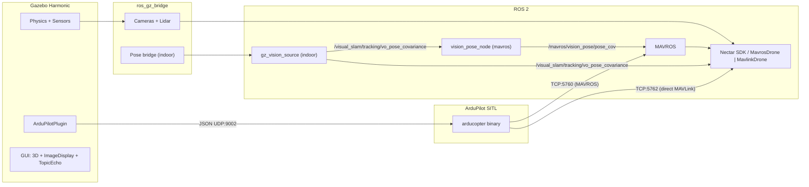
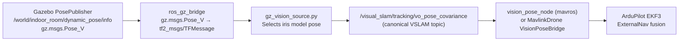

# Simulation Module

ArduPilot SITL + Gazebo Harmonic simulation for Nectar drone development and testing, over either transport (MAVROS or direct MAVLink).

## How It Works

ArduPilot [SITL](https://ardupilot.org/dev/docs/sitl-simulator-software-in-the-loop.html) runs the full ArduCopter firmware on the host machine. [Gazebo Harmonic](https://gazebosim.org/docs/harmonic) provides physics and sensor simulation. The [ArduPilotPlugin](https://github.com/ArduPilot/ardupilot_gazebo) bridges Gazebo physics to SITL via JSON over UDP (port 9002). SITL exposes two MAVLink endpoints: TCP `5760` (SERIAL0, for [MAVROS](https://github.com/mavlink/mavros)) and TCP `5762` (SERIAL1, for a direct pymavlink client / `MavlinkDrone`) — so both transports can run against the same simulator. The [ros_gz_bridge](https://github.com/ros-gz/ros_gz) converts Gazebo sensor data to ROS 2 messages.



## Two Environments

### Outdoor (GPS)

- World: `outdoor_field.sdf` -- open field with obstacle zone at x=13..18, fly-through gate
- GPS via `gz-sim-navsat-system` plugin with WGS84 coordinates (Canberra default)
- ArduPilot params: `copter.parm` + `gazebo.parm` (rangefinder enabled)
- Config preset: `SITL_GAZEBO_CONFIG` (PoseSource.GPS)

### Indoor (Vision)

- World: `indoor_room.sdf` -- 20x20x12m enclosed room, drone at x=-5, obstacle zone at x=5..9, gate
- No GPS. EKF3 uses ExternalNav (vision) for position
- `gz_vision_source.py` publishes Gazebo ground-truth pose on the canonical VSLAM topic `/visual_slam/tracking/vo_pose_covariance`; `vision_pose_node` (mavros) relays it to `/mavros/vision_pose/pose_cov`, or `MavlinkDrone` consumes it directly (mavlink) -- the same bridges as real hardware
- ArduPilot params: `copter.parm` + `gazebo.parm` + `indoor.parm` (GPS disabled, EKF3 ExternalNav)
- Config preset: `SITL_VISION_CONFIG` (PoseSource.VISION)

## Simulated Sensors

| Real sensor             | Gazebo sensor        | Topic (ROS 2)                                                              | Notes                                             |
| ----------------------- | -------------------- | -------------------------------------------------------------------------- | ------------------------------------------------- |
| RealSense D435i (front) | `rgbd_camera`        | `/front_camera/image`, `/front_camera/depth_image`, `/front_camera/points` | 640x480, RGB + depth + point cloud                |
| Arducam (down)          | `camera`             | `/down_camera`                                                             | 640x480 RGB, downward-facing                      |
| TFLuna lidar (down)     | SITL simulated sonar | `/mavros/rangefinder/rangefinder`                                          | `RNGFND1_TYPE=1`, ground distance from physics    |
| TFLuna lidar (down)     | `gpu_lidar`          | `/lidar/range`                                                             | Direct LaserScan via Gazebo, 1-sample rangefinder |

The table above is the ArduPilot world. On both firmwares the SDK reads the
downward rangefinder from `/mavros/rangefinder/rangefinder`: ArduPilot derives it
from the SITL sonar, while PX4 fuses the `x500_nectar` gz `gpu_lidar` into a
`distance_sensor` and streams it as MAVLink `DISTANCE_SENSOR` (see
`simulation/config/px4_config_sitl.yaml`). ArduPilot additionally exposes the raw
Gazebo `gpu_lidar` LaserScan on `/lidar/range`.

## Gazebo GUI

Both world SDFs include built-in GUI plugins (no extra windows needed):

- **ImageDisplay** panels for front RGB, front depth, and down camera (start collapsed, click to expand)
- **TopicEcho** for viewing any Gazebo transport topic live
- **WorldStats** showing sim time, real time, RTF

## Installation

**ArduPilot** — clones `~/ardupilot` + builds ArduCopter SITL, then installs Gazebo Harmonic + ArduPilotPlugin + ros_gz_bridge:

```bash
make sim-install FIRMWARE=ardupilot
```

**PX4** — clones `~/PX4-Autopilot` + builds px4_sitl + Gazebo, and symlinks the Nectar shared assets (`x500_nectar`, `outdoor_field_scenery`, `outdoor_field_px4`) into the PX4 tree. Add `ARGS=--native` for the uXRCE-DDS path:

```bash
make sim-install FIRMWARE=px4
```

**Both**:

```bash
make sim-install FIRMWARE=all
```

Then reload your shell: `source ~/.bashrc`.

## Usage

One pattern for both firmwares. The two-terminal split is unavoidable (the
autopilot SITL and the ROS stack are separate processes), so it is symmetric:

- **Terminal 1 — `sim-start`**: the simulator (ArduPilot SITL; for PX4 also Gazebo).
- **Terminal 2 — `sim-bridge`**: the ROS stack (Gazebo + MAVROS for ArduPilot; for PX4, MAVROS, MicroXRCE-DDS, or camera-only depending on `PROTOCOL`).

Choose the scenario with three variables (defaults `ardupilot` / `outdoor` /
`mavros`, so bare `make sim-start` + `make sim-bridge` = ArduPilot outdoor over
MAVROS). `ENV` must match between the two terminals.

- `FIRMWARE` = `ardupilot` | `px4`
- `ENV` = `outdoor` | `indoor`
- `PROTOCOL` = `mavros` | `mavlink` (direct pymavlink). For PX4, `dds` selects the native uXRCE-DDS agent.

| Scenario                          | Terminal 1                                      | Terminal 2                                                        | Mission config                                       |
| --------------------------------- | ----------------------------------------------- | ----------------------------------------------------------------- | ---------------------------------------------------- |
| ArduPilot outdoor, MAVROS         | `make sim-start FIRMWARE=ardupilot ENV=outdoor` | `make sim-bridge FIRMWARE=ardupilot ENV=outdoor`                  | `MavrosDrone` / `SITL_GAZEBO_CONFIG`                 |
| ArduPilot outdoor, direct MAVLink | (same Terminal 1)                               | `make sim-bridge FIRMWARE=ardupilot ENV=outdoor PROTOCOL=mavlink` | `MavlinkDrone` / `MAVLINK_SITL_GAZEBO_CONFIG`        |
| ArduPilot indoor, MAVROS          | `make sim-start FIRMWARE=ardupilot ENV=indoor`  | `make sim-bridge FIRMWARE=ardupilot ENV=indoor`                   | `MavrosDrone` / `SITL_VISION_CONFIG`                 |
| ArduPilot indoor, direct MAVLink  | (same Terminal 1)                               | `make sim-bridge FIRMWARE=ardupilot ENV=indoor PROTOCOL=mavlink`  | `MavlinkDrone` / `MAVLINK_SITL_VISION_CONFIG`        |
| PX4 outdoor, MAVROS               | `make sim-start FIRMWARE=px4 ENV=outdoor`       | `make sim-bridge FIRMWARE=px4 ENV=outdoor`                        | `Px4MavrosDrone` / `PX4_SITL_GAZEBO_CONFIG`          |
| PX4 outdoor, direct MAVLink       | (same Terminal 1)                               | `make sim-bridge FIRMWARE=px4 ENV=outdoor PROTOCOL=mavlink`       | `Px4MavlinkDrone` / `PX4_MAVLINK_SITL_GAZEBO_CONFIG` |
| PX4 outdoor, uXRCE-DDS            | (same Terminal 1)                               | `make sim-bridge FIRMWARE=px4 ENV=outdoor PROTOCOL=dds`           | `Px4DdsDrone` / `PX4_DDS_SITL_CONFIG`                |
| PX4 indoor (VIO)                  | `make sim-start FIRMWARE=px4 ENV=indoor`        | `make sim-bridge FIRMWARE=px4 ENV=indoor`                         | `Px4MavrosDrone` / `PX4_SITL_VISION_CONFIG`          |

- **ArduPilot**: Terminal 1 runs the SITL physics; Terminal 2 launches the Gazebo world + `ros_gz_bridge` + (unless `PROTOCOL=mavlink`) MAVROS. `mavros` uses SERIAL0 (tcp `5760`); direct MAVLink connects a `MavlinkDrone` on SERIAL1 (tcp `5762`), which `start_sitl.sh` always exposes.
- **Connection strings differ by transport**: MAVROS uses a URL (`tcp://host:port`, `udp://...`); the direct-MAVLink `MavlinkDrone` (pymavlink) uses a bare string (`tcp:127.0.0.1:5762`, `udp:host:port`, or a serial path like `/dev/ttyUSB0`). The `tcp://` URL form is also accepted for `MavlinkDrone` and normalized.
- **PX4**: Terminal 1 (`start_px4.sh`) runs PX4 **and** its Gazebo. `ENV=outdoor` spawns `x500_nectar` into the shared `outdoor_field_px4.sdf` (matched sensors); `ENV=indoor` uses PX4's `x500_vision` (GPS-denied onboard VIO). Terminal 2 runs MAVROS (+ camera bridges for outdoor; + the external-vision relay for indoor). PX4 exposes the offboard MAVLink API on UDP `14540`. With `PROTOCOL=mavlink`, Terminal 2 skips MAVROS (camera bridges only) and a `Px4MavlinkDrone` connects to UDP `14540` directly (pymavlink `udp:0.0.0.0:14540`); the rangefinder then arrives as MAVLink `DISTANCE_SENSOR`, no MAVROS.
- **PX4 uXRCE-DDS** (`PROTOCOL=dds`): Terminal 2 runs `MicroXRCEAgent` (udp4 :8888); PX4's onboard uXRCE-DDS client connects to it, exposing `/fmu/`* topics that `Px4DdsDrone` reads/writes directly (no MAVROS). One-time setup: `make sim-install FIRMWARE=px4 ARGS=--native` (builds `px4_msgs` + the agent). `px4_msgs` must match the PX4 firmware (topics are versioned, e.g. `vehicle_status_v4`).
- **Indoor** adds the vision pipeline: ArduPilot uses `gz_vision_source` → `vision_pose_node` → `/mavros/vision_pose/pose_cov`; PX4 fuses onboard VIO. Same bridges as real hardware.
- Forward extra launch/script args with `ARGS=...`, e.g. a custom ArduPilot world or a one-off mavros toggle:

```bash
make sim-bridge FIRMWARE=ardupilot ARGS="world:=rangefinder_test.sdf mavros:=false"
```

- Headless ArduPilot without Gazebo (pure MAVROS): run `./scripts/simulation/start_sitl.sh` then `ros2 launch nectar sitl.launch.py` directly.

> Run `make sim-stop` before relaunching Terminal 2 — it clears every simulation
> process for both firmwares (arducopter/px4, Gazebo, MAVROS, bridges, vision nodes).

### Shared-world architecture

The arena is split into a static **scenery model** (gate + obstacles) and a per-firmware **drone+sensor overlay**:

- `simulation/models/outdoor_field_scenery/` — gate, obstacle boxes/cylinders. Static, firmware-agnostic. Both `outdoor_field.sdf` (ArduPilot) and `outdoor_field_px4.sdf` (PX4) include it via `<include><uri>model://outdoor_field_scenery</uri></include>`.
- `simulation/models/x500_nectar/` — PX4 `x500` (merged) + the same sensors ArduPilot's `outdoor_field.sdf` jointed onto the iris. The front `rgbd_camera` (`/front_camera`) and down `camera` (`/down_camera`) bridge to ROS via `ros_gz_bridge`; the down `gpu_lidar` is wired the PX4 way (`lidar_sensor_link`/`lidar`, no custom topic) so PX4 fuses it and streams `DISTANCE_SENSOR` → `/mavros/rangefinder/rangefinder`, the same rangefinder source the SDK reads for ArduPilot.
- `simulation/worlds/outdoor_field_px4.sdf` — scenery-only world (no `<plugin>` tags; PX4's `server.config` injects gz systems globally). PX4 spawns `x500_nectar` into it via `PX4_SIM_MODEL=gz_x500_nectar`. Its GPS origin is a near-zero magnetic-declination location (lat 0, lon 40), **not** ArduPilot's Canberra. PX4's `gz_bridge` feeds the EKF gz Harmonic's magnetometer, which has a known declination/frame bug ([gz-sim#2536](https://github.com/gazebosim/gz-sim/issues/2536), [#3270](https://github.com/gazebosim/gz-sim/issues/3270); see the `x500_base` mag TODO re [gz-sim#2460](https://github.com/gazebosim/gz-sim/pull/2460)); the cold-start mag yaw is off by ~~2× the local declination (~~24° at Canberra) until GPS-course converges it, which skewed the first body-relative move. At ~0 declination there is nothing to skew, so the heading is correct from cold start. ArduPilot simulates its own consistent magnetometer and is unaffected, so it keeps Canberra; only the GPS origin differs, the scenery/sensors/physics are identical.

`install_px4.sh` symlinks the three Nectar assets into PX4's `Tools/simulation/gz/{models,worlds}` so PX4's launcher can find them while the source of truth stays in `nectar-sdk/`. `start_px4.sh --autostart` reuses PX4's existing `4001` (x500) airframe via `PX4_SYS_AUTOSTART`, so no PX4-tree airframe file is added.

### Stop all

```bash
make sim-stop
```

One stop for both firmwares: kills arducopter, PX4 (px4_sitl/bin/px4), MicroXRCEAgent, Gazebo, MAVROS, ros_gz_bridge, gz_vision_source, and vision_pose_node processes.

### Verify sensors

| Check | Command |
|-------|---------|
| State | `ros2 topic echo /mavros/state --once` |
| GPS (outdoor) | `ros2 topic echo /mavros/global_position/global --once --qos-reliability best_effort` |
| Vision pose (indoor) | `ros2 topic echo /mavros/vision_pose/pose_cov --once` |
| Rangefinder | `ros2 topic echo /mavros/rangefinder/rangefinder --once` |
| Front camera | `ros2 topic echo /front_camera/image --once` |
| Depth | `ros2 topic echo /front_camera/depth_image --once` |

### Multi-orientation rangefinders

`rangefinder_test.sdf` places an iris with front and back single-ray lidars
between two walls. The `iris_with_rangefinders` model forwards the front/back
lidars to ArduPilot as `rng_2/rng_3`, and `rangefinder_test.parm` exposes them
as `RNGFND2/3` (orientations forward/back). The downward rangefinder
(`RNGFND1`, orientation down) stays on the analog SITL sonar from `gazebo.parm`:
on the ground the airframe is only ~0.2 m tall, so a downward GPU lidar reads
below its minimum range, while the sonar reports vehicle height above terrain
reliably. ArduPilot emits one `DISTANCE_SENSOR` per instance, accessible through
`drone.distance_sensors` and `drone.get_distance(orientation)`.

**Terminal 1 — SITL with the three rangefinders**:

```bash
./scripts/simulation/start_sitl.sh --gazebo \
    --params nectar/simulation/params/rangefinder_test.parm
```

**Terminal 2 — Gazebo (and MAVROS) with the test world**:

```bash
ros2 launch nectar sitl_gazebo.launch.py world:=rangefinder_test.sdf
```

**Terminal 3 — inspect the readings** (MAVROS topics):

```bash
ros2 topic echo /mavros/rangefinder/rangefinder --once
ros2 topic echo /mavros/distance_sensor/rangefinder/front --once
```

In code, both transports expose every reported unit via `drone.distance_sensors`
and `drone.get_distance(orientation)` (the downward unit also updates
`drone.rangefinder`); see the [vehicle core README](../nectar/control/vehicle/README.md#distance-sensors).
The MAVROS path relies on the `distance_sensor` plugin entries in
`config/apm_config_sitl.yaml` (`rangefinder/rangefinder`, `rangefinder/front`,
`rangefinder/back`) mapped to orientations.

## Configuration Presets

Defined in `nectar/control/config.py`:

| Preset                       | Transport | Port  | PoseSource | Lidar | Use case                                                                            |
| ---------------------------- | --------- | ----- | ---------- | ----- | ----------------------------------------------------------------------------------- |
| `SITL_CONFIG`                | mavros    | 5760  | GPS        | No    | Headless SITL, no sensors                                                           |
| `SITL_GPS_CONFIG`            | mavros    | 5760  | GPS        | No    | Headless SITL with GPS                                                              |
| `SITL_GAZEBO_CONFIG`         | mavros    | 5760  | GPS        | Yes   | Gazebo outdoor                                                                      |
| `SITL_VISION_CONFIG`         | mavros    | 5760  | VISION     | Yes   | Gazebo indoor                                                                       |
| `MAVLINK_SITL_CONFIG`        | mavlink   | 5760  | GPS        | No    | Headless SITL, direct pymavlink                                                     |
| `MAVLINK_SITL_GAZEBO_CONFIG` | mavlink   | 5762  | GPS        | No    | Gazebo outdoor, direct (SERIAL1, alongside MAVROS)                                  |
| `MAVLINK_SITL_VISION_CONFIG` | mavlink   | 5762  | VISION     | No    | Gazebo indoor, direct (vision feed from `/visual_slam/tracking/vo_pose_covariance`) |
| `PX4_SITL_CONFIG`            | px4       | 14540 | GPS        | No    | PX4 SITL headless (offboard over MAVROS)                                            |
| `PX4_SITL_GAZEBO_CONFIG`     | px4         | 14540 | GPS        | Yes   | PX4 SITL + Gazebo (x500_nectar, outdoor)                                            |
| `PX4_SITL_VISION_CONFIG`     | px4         | 14540 | VISION     | No    | PX4 SITL + Gazebo indoor (EKF2 external vision)                                     |
| `PX4_MAVLINK_SITL_CONFIG`        | px4_mavlink | 14540 | GPS        | No    | PX4 SITL headless, direct pymavlink                                              |
| `PX4_MAVLINK_SITL_GAZEBO_CONFIG` | px4_mavlink | 14540 | GPS        | Yes   | PX4 SITL + Gazebo (x500_nectar, outdoor), direct pymavlink                       |
| `PX4_MAVLINK_SITL_VISION_CONFIG` | px4_mavlink | 14540 | VISION     | No    | PX4 SITL + Gazebo indoor, direct pymavlink (VISION_POSITION_ESTIMATE)            |
| `PX4_DDS_SITL_CONFIG`            | px4_dds     | 8888  | GPS        | Yes   | PX4 SITL native uXRCE-DDS (MicroXRCEAgent on 8888), outdoor                      |

```python
from nectar.control import (
    DroneFactory,
    SITL_GAZEBO_CONFIG,
    MAVLINK_SITL_GAZEBO_CONFIG,
    PX4_SITL_GAZEBO_CONFIG,
    PX4_MAVLINK_SITL_GAZEBO_CONFIG,
)
```

**Outdoor over MAVROS** (port 5760):

```python
drone = DroneFactory.create("mavros", SITL_GAZEBO_CONFIG)
```

**Outdoor over direct MAVLink** (port 5762, `sim-bridge ... PROTOCOL=mavlink`):

```python
drone = DroneFactory.create("mavlink", MAVLINK_SITL_GAZEBO_CONFIG)
```

**PX4 over MAVROS** (offboard UDP 14540, `sim-start`/`sim-bridge FIRMWARE=px4 ENV=outdoor`):

```python
drone = DroneFactory.create("px4", PX4_SITL_GAZEBO_CONFIG)
```

**PX4 over direct pymavlink** (offboard UDP 14540, `sim-bridge ... PROTOCOL=mavlink`):

```python
drone = DroneFactory.create("px4_mavlink", PX4_MAVLINK_SITL_GAZEBO_CONFIG)
```

## Test Suite

`sitl_test.py` runs atomic navigation tests. Each test starts from a clean hover and verifies a specific capability.

### Usage

```bash
# All outdoor tests over MAVROS (37 tests, tcp 5760)
python3 nectar/nectar/examples/simulation/sitl_test.py

# Same suite over direct pymavlink (MavlinkDrone, tcp 5762)
python3 nectar/nectar/examples/simulation/sitl_test.py --mavlink

# Indoor-compatible subset (vision config, skips the 5 GPS-only tests -> 32 tests)
python3 nectar/nectar/examples/simulation/sitl_test.py --indoor

# Land between tests for a full reset
python3 nectar/nectar/examples/simulation/sitl_test.py --fresh pid_fwd

# Specific tests / a group / list everything
python3 nectar/nectar/examples/simulation/sitl_test.py pid_fwd setpoint_fwd
python3 nectar/nectar/examples/simulation/sitl_test.py --group vel
python3 nectar/nectar/examples/simulation/sitl_test.py --list
```

Flags: `--mavlink` (direct pymavlink on tcp 5762), `--px4` (PX4 over MAVROS, offboard on udp 14540), `--indoor` (vision config, skip GPS-only tests), `--fresh` (land between tests).

### Test groups

| Group             | Tests                                                                                                | Description                            |
| ----------------- | ---------------------------------------------------------------------------------------------------- | -------------------------------------- |
| `vel`             | vel_fwd, vel_lat, vel_up, vel_yaw, vel_takeoff, vel_world, vel_world_north, vel_world_rotated, brake | Velocity in BODY/WORLD/TAKEOFF frames  |
| `pid`             | pid_fwd, pid_lat, pid_alt, pid_yaw                                                                   | PID navigation with raw GPS            |
| `pid_local`       | pid_local_fwd, pid_local_lat, pid_local_yaw                                                          | PID navigation with EKF local position |
| `setpoint`        | setpoint_fwd, setpoint_lat, setpoint_yaw                                                             | Local position setpoint publishing     |
| `setpoint_global` | setpoint_global, setpoint_global_yaw                                                                 | GPS global setpoint (outdoor only)     |
| `wpnav`           | setpoint_wpnav                                                                                       | AC_WPNav waypoint setpoint             |
| `rtl`             | rtl_pid, rtl_ardupilot                                                                               | Return to launch                       |
| `yaw`             | vel_yaw, pid_yaw, pid_local_yaw, setpoint_yaw, setpoint_global_yaw, yaw_direction, yaw_takeoff_ref   | Yaw handling across methods            |
| `world`           | vel_world, vel_world_north, vel_world_rotated                                                        | WORLD-frame velocity                   |
| `nav`             | pid_fwd, pid_lat, pid_local_fwd, pid_local_lat                                                       | Core PID navigation                    |
| `compound`        | sequential, takeoff_ref                                                                              | Multi-step sequences                   |
| `square`          | sq_pid, sq_pid_takeoff, sq_pid_local, sq_setpoint, sq_setpoint_global, sq_wpnav                      | 3m square patterns                     |

Pre-flight tests (`sensors`, `heading_enu`) run without takeoff. GPS-only tests (skipped with `--indoor`): `heading_enu`, `setpoint_global`, `setpoint_global_yaw`, `sq_setpoint_global`, `rtl_ardupilot`.

## ArduPilot Parameters

### gazebo.parm (loaded for all Gazebo sessions)

| Parameter         | Value | Purpose                                |
| ----------------- | ----- | -------------------------------------- |
| `SIM_SONAR_SCALE` | 10    | SITL sonar scaling factor              |
| `RNGFND1_TYPE`    | 1     | Analog rangefinder driven by SIM_SONAR |
| `RNGFND1_SCALING` | 10    | Voltage-to-distance scaling            |
| `RNGFND1_PIN`     | 0     | Analog pin                             |
| `RNGFND1_MAX`     | 40    | Max range (m)                          |
| `RNGFND1_MIN`     | 0.10  | Min range (m)                          |

### indoor.parm (loaded additionally for indoor)

| Parameter        | Value  | Purpose                           |
| ---------------- | ------ | --------------------------------- |
| `GPS1_TYPE`      | 0      | Disable GPS                       |
| `EK3_SRC1_POSXY` | 6      | ExternalNav for XY position       |
| `EK3_SRC1_VELXY` | 6      | ExternalNav for XY velocity       |
| `EK3_SRC1_POSZ`  | 1      | Barometer for Z (default)         |
| `EK3_SRC1_YAW`   | 6      | ExternalNav for yaw               |
| `VISO_TYPE`      | 1      | Enable visual odometry input      |
| `ARMING_CHECK`   | 388598 | Disable GPS-related arming checks |

## Indoor Vision Pose Pipeline



The `gz_vision_source.py` node replaces the real RealSense D435i + Isaac ROS VSLAM pipeline. It selects the `iris` model pose from the Gazebo ground-truth `TFMessage` and publishes `PoseWithCovarianceStamped` on the same canonical topic Isaac ROS Visual SLAM uses, `/visual_slam/tracking/vo_pose_covariance`. The downstream delivery is then identical to real hardware: `vision_pose_node` (backend `mavros`) relays it to `/mavros/vision_pose/pose_cov`, or `MavlinkDrone`'s `VisionPoseBridge` (backend `mavlink`) forwards it as `VISION_POSITION_ESTIMATE`.

**Frame-name fallback**: it first matches the transform whose `child_frame_id` equals the model name. On ROS 2 Jazzy the `ros_gz_bridge` `Pose_V → TFMessage` conversion strips the frame ids, leaving `child_frame_id` empty. When all names are empty the node falls back to the transform at `model_index` (default `0`, the iris model root) and logs a one-time warning, so the indoor pipeline publishes reliably on Jazzy.

## Layout

Simulation assets (`nectar/simulation/`):

- `params/` — ArduPilot SITL parameter files: `gazebo.parm` (rangefinders), `indoor.parm` (no-GPS + EKF3 ExternalNav), `rangefinder_test.parm` (RNGFND2/3 for the test world)
- `config/` — MAVROS bridge profiles: `apm_config_sitl.yaml` / `apm_pluginlists_sitl.yaml` (ArduPilot), `px4_config_sitl.yaml` / `px4_pluginlists_sitl.yaml` (PX4)
- `models/` — `iris_with_rangefinders` (ArduPilot), `x500_nectar` (PX4), `outdoor_field_scenery` (shared)
- `worlds/` — `outdoor_field.sdf`, `outdoor_field_px4.sdf`, `indoor_room.sdf` (20x20x12 m, no GPS), `rangefinder_test.sdf`

Install and start scripts (`scripts/simulation/`): `install_sitl.sh`, `install_gazebo.sh`,
`install_px4.sh`, `start_sitl.sh`, `start_px4.sh`, and `gz_vision_source.py` (Gazebo ground-truth
to canonical VSLAM pose topic).

Launch files (`nectar/launch/`): `sitl.launch.py` (MAVROS-only), `sitl_gazebo.launch.py`
(ArduPilot Gazebo + `ros_gz_bridge`), `px4_sitl.launch.py` (PX4 bridge). The navigation test suite
is `examples/simulation/sitl_test.py`.

## References

- [ArduPilot SITL](https://ardupilot.org/dev/docs/sitl-simulator-software-in-the-loop.html)
- [ArduPilot SITL with Gazebo](https://ardupilot.org/dev/docs/sitl-with-gazebo.html)
- [ardupilot_gazebo plugin](https://github.com/ArduPilot/ardupilot_gazebo)
- [Gazebo Harmonic](https://gazebosim.org/docs/harmonic)
- [Gazebo sensors](https://gazebosim.org/api/sensors)
- [ros_gz_bridge](https://github.com/ros-gz/ros_gz)
- [MAVROS](https://github.com/mavlink/mavros)
- [ArduPilot EKF3](https://ardupilot.org/copter/docs/common-apm-navigation-extended-kalman-filter-overview.html)
- [ArduPilot VIO setup](https://ardupilot.org/copter/docs/common-vio-tracking-camera.html)
- [ArduPilot rangefinders](https://ardupilot.org/copter/docs/common-rangefinder-landingpage.html)
