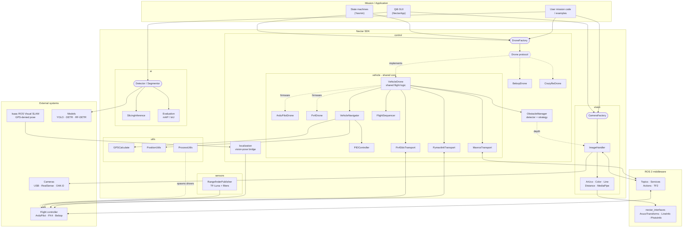

# Architecture

Mission code, state machines, and the GUI drive the SDK modules, which reach flight
controllers, cameras, and detection models through ROS 2. Each module page holds its own
detailed class diagram; this page is the end-to-end view and the patterns shared across
all modules.

## End-to-end

Read the diagram top to bottom as four layers:

1. **Application** — your mission code, [Yasmin](https://github.com/uleroboticsgroup/yasmin) state machines, or the Qt6 GUI.
2. **Nectar SDK** — the `control`, `vision`, `ai`, and `sensors` modules, each entered through a factory or protocol and backed by shared `utils`.
3. **ROS 2 middleware** — the topics, services, actions, and TF2 that carry everything, plus the `nectar_interfaces` messages.
4. **External systems** — flight controllers, cameras, VSLAM, and models.

Solid arrows are the main data/command paths; dotted arrows mark indirect or optional links (for example, a transport that owns the FCU connection directly instead of going through ROS topics).



## Design patterns

The codebase uses the same patterns across all modules, making it predictable to navigate
and extend:

| Pattern | Where | What it does |
|---------|-------|--------------|
| **Factory + Registry** | `DroneFactory`, `CameraFactory`, `Detector` | Decouples creation from usage. New types are registered at runtime and instantiated by key. |
| **Protocol** | `Drone`, `ObstacleDetector` | Defines interfaces via structural typing (duck typing). Any class matching the signature is accepted. |
| **Strategy** | `AvoidanceStrategy`, `ILineEstimationMethod`, `EstimationModel`, `BaseMergingStrategy` | Encapsulates interchangeable algorithms behind a common interface. |
| **Abstract Base Class** | `BaseDrone`, `AbstractCam`, `DepthCam`, `BaseDetectionModel` | Shares common logic and enforces method contracts for concrete implementations. |
| **Dataclass Config** | `MavrosConfig`, `OpenCVConfig`, `TrainingConfig`, `EvaluationConfig` | Type-safe configuration with defaults, validation, and YAML serialization. |

Every factory supports runtime registration, so adding a new drone type, camera driver, or
detection framework follows the same recipe:

```python
DroneFactory.register("custom", lambda cfg, executor: MyDrone(cfg, executor))
drone = DroneFactory.create("custom", config)

CameraFactory.register("thermal", ThermalCamera)
camera = CameraFactory.from_source("thermal")

Detector.register("custom", lambda name, **kw: CustomModel(name, **kw))
detector = Detector("model.bin", framework="custom")
```

## Runtime model

Each drone owns its own ROS 2 `Node`. All SDK subsystem nodes are added to a shared
`MultiThreadedExecutor` managed by `nectar.runtime`, which spins on a background thread.
Blocking calls (`takeoff`, `land`, `move_to`) sleep on the caller's thread while the
executor keeps firing telemetry callbacks. Three usage patterns share the same primitives:

- **Standalone script** — `nectar.init()` creates the shared executor and spin thread;
  `DroneFactory.create(...)` registers the drone's node with it; `nectar.shutdown()` on exit.
- **Yasmin mission** — call `nectar.use_executor(...)` once at startup so SDK subsystems
  register with the mission's executor instead of spawning a second spin thread.
- **GUI** — the app's `ROSExecutor` registers its executor with `nectar.runtime`, so
  drones and camera handlers created inside tabs share it automatically.

## Transports: one core, interchangeable links

All flight and navigation logic lives once in the firmware-agnostic `VehicleDrone`.
Firmware specializations (`ArduPilotDrone`, `Px4Drone`) add only firmware semantics and
read telemetry / issue commands through a pluggable `VehicleTransport`:

- **`MavrosTransport`** — subscriptions → telemetry, service clients → commands, publishers
  → setpoints (requires a running `mavros_node`).
- **`PymavlinkTransport`** — owns the FCU link directly; a `MavlinkModeCodec` isolates the
  only firmware difference (flight-mode encode/decode), so ArduPilot and PX4 share it.
- **`Px4DdsTransport`** — native PX4 uORB over the uXRCE-DDS bridge (`px4_msgs`).

So PX4 offers three backends (`px4`, `px4_mavlink`, `px4_dds`) and ArduPilot two
(`mavros`, `mavlink`), all sharing the same flight logic — missions are backend-agnostic.
The core works in plain, ROS-free types (ENU/FLU, radians); each transport converts to and
from its wire format. Full detail: [Vehicle core](../modules/control/vehicle.md) and the
[Control module](../modules/control/index.md).
