# Architecture

Mission code, state machines, and the GUI drive the SDK modules, which reach flight
controllers, cameras, and detection models through ROS 2. Each module page holds its own
detailed class diagram; this page is the end-to-end view and the patterns shared across
all modules.

## End-to-end

Read it left to right as four layers:

1. **Application** — your mission code, [Yasmin](https://github.com/uleroboticsgroup/yasmin) state machines, or the Qt6 GUI.
2. **Nectar SDK** — the `control`, `vision`, `ai`, and `sensors` modules, each entered through a factory or protocol and backed by shared `utils`.
3. **ROS 2 middleware** — the topics, services, actions, and TF2 that carry everything, plus the `nectar_interfaces` messages.
4. **External systems** — flight controllers, cameras, VSLAM, and models.

Each module is coloured by layer. Solid arrows are the main data/command paths; the dotted
arrow marks an optional link (depth frames feeding obstacle detection). Click the diagram to
zoom and pan.

```mermaid
---
config:
  layout: elk
  elk:
    nodePlacementStrategy: NETWORK_SIMPLEX
    mergeEdges: true
---
flowchart LR
  subgraph APP["Application"]
    direction TB
    Mission["Mission code / examples"]
    FSM["State machines · Yasmin"]
    GUI["Qt6 GUI · NectarApp"]
  end

  subgraph SDK["Nectar SDK"]
    direction TB

    subgraph CTRL["control"]
      direction TB
      DroneFactory(["DroneFactory"])
      DroneProto{{"Drone protocol"}}
      VehicleDrone["VehicleDrone<br/>ArduPilot · PX4 core"]
      Transports["Transports<br/>MAVROS · MAVLink · uXRCE-DDS"]
      OtherDrones["BebopDrone · CrazyflieDrone"]
      Nav["Navigator · PID · Sequencer"]
      Obstacles["ObstacleManager<br/>detector + strategy"]
      Loc["Localization<br/>vision-pose bridge"]
    end

    subgraph VIS["vision"]
      direction TB
      CameraFactory(["CameraFactory"])
      ImageHandler["ImageHandler"]
      VisAlgos["ArUco · Color · Line<br/>Distance · MediaPipe"]
    end

    subgraph AIM["ai"]
      direction TB
      DetSeg(["Detector / Segmentor"])
      AIExtras["Slicing · Training · Evaluation"]
    end

    subgraph SENS["sensors"]
      direction TB
      Rangefinder["Rangefinder → MAVLink<br/>TF-Luna + filters"]
    end

    subgraph UTIL["utils"]
      direction TB
      Utils["GPSCalculate · PositionUtils<br/>ProcessUtils"]
    end
  end

  subgraph ROS["ROS 2 middleware"]
    direction TB
    Topics["Topics · Services<br/>Actions · TF2"]
    Msgs["nectar_interfaces<br/>ArucoTransforms · LineInfo · PhotoInfo"]
  end

  subgraph EXT["Vehicles · sensors · models"]
    direction TB
    FCU["Flight controller<br/>ArduPilot · PX4 · Bebop · Crazyflie"]
    Cameras["Cameras<br/>USB · RealSense · OAK-D · Pi"]
    Models["Models<br/>YOLO · DETR · RF-DETR"]
    VSLAM["Isaac ROS Visual SLAM"]
  end

  Mission --> DroneFactory
  Mission --> CameraFactory
  Mission --> DetSeg
  FSM --> DroneFactory
  GUI --> DroneFactory
  GUI --> CameraFactory

  DroneFactory --> DroneProto
  DroneProto --> VehicleDrone
  DroneProto --> OtherDrones
  VehicleDrone --> Transports
  VehicleDrone --> Nav
  VehicleDrone --> Obstacles
  Nav --> Utils

  CameraFactory --> ImageHandler
  ImageHandler --> VisAlgos
  Obstacles -. depth .-> ImageHandler
  DetSeg --> AIExtras
  DetSeg --> Models
  VisAlgos --> Msgs

  Transports <--> Topics
  Transports <--> FCU
  Topics <--> FCU
  ImageHandler <--> Topics
  ImageHandler --> Cameras
  VSLAM --> Loc
  Loc --> FCU
  Rangefinder --> FCU

  classDef app fill:#3b82f6,stroke:#1d4ed8,color:#ffffff;
  classDef ctl fill:#f5a623,stroke:#b8770a,color:#1a1a1a;
  classDef vis fill:#22c55e,stroke:#15803d,color:#052e16;
  classDef aim fill:#a855f7,stroke:#7c3aed,color:#ffffff;
  classDef sen fill:#ef4444,stroke:#b91c1c,color:#ffffff;
  classDef utl fill:#94a3b8,stroke:#475569,color:#0b1220;
  classDef ros fill:#14b8a6,stroke:#0f766e,color:#04231f;
  classDef ext fill:#64748b,stroke:#334155,color:#ffffff;

  class Mission,FSM,GUI app;
  class DroneFactory,DroneProto,VehicleDrone,Transports,OtherDrones,Nav,Obstacles,Loc ctl;
  class CameraFactory,ImageHandler,VisAlgos vis;
  class DetSeg,AIExtras aim;
  class Rangefinder sen;
  class Utils utl;
  class Topics,Msgs ros;
  class FCU,Cameras,Models,VSLAM ext;
```



## Design patterns

The codebase uses the same patterns across all modules, making it predictable to navigate
and extend:

| Pattern | Where | What it does |
|---------|-------|--------------|
| **Factory + Registry** | `DroneFactory`, `CameraFactory`, `Detector` | Decouples creation from usage. New types are registered at runtime and instantiated by key. |
| **Protocol** | `Drone`, `ObstacleDetector` | Defines interfaces via structural typing (duck typing). Any class matching the signature is accepted. |
| **Strategy** | `AvoidanceStrategy`, `ILineEstimationMethod`, `EstimationModel`, `BaseMergingStrategy` | Encapsulates interchangeable algorithms behind a common interface. |
| **Abstract Base Class** | `BaseDrone`, `AbstractCam`, `DepthCam`, `BaseDetectionModel` | Shares common logic and enforces method contracts for concrete implementations. |
| **Dataclass Config** | `MavrosConfig`, `OpenCVConfig`, `TrainingConfig`, `EvaluationConfig` | Type-safe configuration with defaults, validation, and YAML serialization. |

Every factory supports runtime registration, so adding a new drone type, camera driver, or
detection framework follows the same recipe:

```python
DroneFactory.register("custom", lambda cfg, executor: MyDrone(cfg, executor))
drone = DroneFactory.create("custom", config)

CameraFactory.register("thermal", ThermalCamera)
camera = CameraFactory.from_source("thermal")

Detector.register("custom", lambda name, **kw: CustomModel(name, **kw))
detector = Detector("model.bin", framework="custom")
```

Full class and method signatures are generated from the source docstrings in the
[Python API reference](../api/index.md): [control](../api/control.md),
[vision](../api/vision.md), [ai](../api/ai.md), [sensors](../api/sensors.md), and
[utils](../api/utils.md).

## Runtime model

Each drone owns its own ROS 2 `Node`. All SDK subsystem nodes are added to a shared
`MultiThreadedExecutor` managed by `nectar.runtime`, which spins on a background thread.
Blocking calls (`takeoff`, `land`, `move_to`) sleep on the caller's thread while the
executor keeps firing telemetry callbacks. Three usage patterns share the same primitives:

| Pattern | Setup call | What happens |
|---------|-----------|--------------|
| Standalone script | `nectar.init()` | Creates the shared executor and spin thread; `DroneFactory.create(...)` registers the drone's node; `nectar.shutdown()` on exit. |
| Yasmin mission | `nectar.use_executor(...)` | Called once at startup so SDK subsystems register with the mission's executor instead of spawning a second spin thread. |
| GUI | `ROSExecutor` registers with `nectar.runtime` | Drones and camera handlers created inside tabs share the app's executor automatically. |

## Transports: one core, interchangeable links

All flight and navigation logic lives once in the firmware-agnostic `VehicleDrone`.
Firmware specializations (`ArduPilotDrone`, `Px4Drone`) add only firmware semantics and
read telemetry / issue commands through a pluggable `VehicleTransport`:

| Transport | Class | How it works | Backends |
|-----------|-------|--------------|----------|
| MAVROS | `MavrosTransport` | Subscriptions → telemetry, service clients → commands, publishers → setpoints (requires a running `mavros_node`). | `mavros`, `px4` |
| Direct MAVLink | `PymavlinkTransport` | Owns the FCU link directly; a `MavlinkModeCodec` isolates the only firmware difference (flight-mode encode/decode), so ArduPilot and PX4 share it. | `mavlink`, `px4_mavlink` |
| uXRCE-DDS | `Px4DdsTransport` | Native PX4 uORB over the uXRCE-DDS bridge (`px4_msgs`). | `px4_dds` |

So PX4 offers three backends (`px4`, `px4_mavlink`, `px4_dds`) and ArduPilot two
(`mavros`, `mavlink`), all sharing the same flight logic — missions are backend-agnostic.
The core works in plain, ROS-free types (ENU/FLU, radians); each transport converts to and
from its wire format. Full detail: [Vehicle core](../modules/control/vehicle.md) and the
[Control module](../modules/control/index.md).
