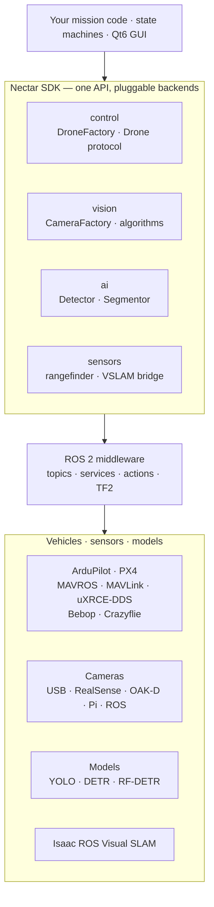

# Nectar SDK

**One consistent API for autonomous drones — flight control, computer vision, and object detection on ROS 2.**

Nectar SDK gives you one Python interface across flight stacks and transports —
[ArduPilot](https://ardupilot.org/) and [PX4](https://px4.io/) over [MAVROS](https://github.com/mavlink/mavros), direct
[MAVLink](https://mavlink.io/en/), or native [uXRCE-DDS](https://docs.px4.io/main/en/middleware/uxrce_dds), plus [Bebop](https://www.parrot.com/en/support/documentation/bebop-range) and [Crazyflie](https://www.bitcraze.io/products/crazyflie-2-1-plus/) — a camera and vision layer that
behaves the same on a webcam or a depth camera, and object detection **and** segmentation
across YOLO, DETR, and RF-DETR. A mission you write once runs on different vehicles and
sensors with minimal change, in simulation or on hardware.

<p align="center">
  <a href="https://github.com/Black-Bee-Drones/nectar-sdk/blob/main/LICENSE"></a>
  <a href="https://github.com/Black-Bee-Drones/nectar-sdk/releases/latest"></a>
  
  <a href="https://github.com/Black-Bee-Drones/nectar-sdk/stargazers"></a>
</p>

```python
import nectar
from nectar.control import DroneFactory, MavrosConfig, PoseSource

nectar.init()
drone = DroneFactory.create("mavros", MavrosConfig(pose_source=PoseSource.GPS))

drone.takeoff(altitude=2.0)
drone.move_to(x=5.0, y=0.0, z=0.0, precision=0.3)   # same call on ArduPilot, PX4, Crazyflie…
drone.land()
nectar.shutdown()
```

[Get started](getting-started/quickstart.md){ .md-button .md-button--primary }
[How it fits together](concepts/architecture.md){ .md-button }

## What's inside

<div class="grid cards" markdown>

-   **Drone control**

    One `Drone` protocol for ArduPilot and PX4 across three transports — MAVROS, direct
    MAVLink, and native uXRCE-DDS — plus Bebop and Crazyflie. Position and velocity
    navigation, GPS waypoints, RTL, PID, and obstacle handling, all backend-agnostic.

    [Control](modules/control/index.md)

-   **Computer vision**

    One `CameraFactory` for USB, RealSense, OAK-D, Pi Camera, and ROS topics, with a
    shared `ImageHandler`. ArUco, color, line, distance estimation, and optical flow,
    plus MediaPipe hand/face tracking.

    [Vision](modules/vision.md)

-   **AI: detection & segmentation**

    Object detection and instance segmentation across Ultralytics YOLO, HuggingFace
    Transformers (DETR), and RF-DETR behind one `Detector` / `Segmentor`. Training,
    evaluation, slicing inference, dataset tooling, and a `nectar-ai` CLI.

    [AI](modules/ai/index.md)

-   **Sensors & localization**

    Companion-side rangefinder → MAVLink bridge, and GPS-denied indoor flight via Intel
    RealSense + Isaac ROS Visual SLAM feeding the FCU's EKF.

    [Sensors](modules/sensors.md) ·
    [Localization](modules/control/localization.md)

-   **Desktop interface**

    A Qt6 app to arm, take off, fly, stream cameras with 20+ filters, and inspect ROS 2
    topics/services/parameters — no code required.

    [Interface](modules/interface.md)

-   **Simulation**

    ArduPilot or PX4 SITL with Gazebo, indoor and outdoor, over MAVROS or direct MAVLink
    — the same missions you fly on hardware.

    [Simulation](modules/simulation.md)

</div>

## Who it's for

Nectar SDK is built for **competition and research UAV teams** who keep rewriting the
same flight, camera, and detection glue for each new mission, vehicle, or sensor. It is
a good fit when you want to:

- **Write a mission once and run it on different vehicles** — the same `takeoff` /
  `move_to` / `move_to_gps` calls drive ArduPilot or PX4 over whichever transport your
  hardware uses, plus Crazyflie and Bebop.
- **Combine control, vision, and AI in one codebase** under consistent, typed APIs
  instead of stitching together separate libraries.
- **Move between simulation and hardware** without rewriting the mission.
- **Fly indoors (GPS-denied)** with a documented VSLAM → EKF pipeline.
- **Extend cleanly** — every subsystem uses the same factory/registry pattern, so adding
  a drone, camera, or detector follows one familiar recipe.

It is **not** a flight controller or a replacement for ArduPilot/PX4 — it sits on the
companion computer and drives them through ROS 2.

## How it fits together

Nectar SDK sits on the companion computer between your mission code and the rest of the
stack. Each module exposes one stable entry point — a factory or protocol — and talks to
flight controllers, cameras, and models through ROS 2. The backend behind each entry point
is swappable, so the same mission runs on different vehicles, sensors, and in simulation.



Every subsystem uses the same factory/registry pattern, so adding a drone, camera, or
detector follows one familiar recipe — no forking the core. The full architecture, design
patterns, and runtime model are on the [Architecture](concepts/architecture.md) page; each
module page carries its own detailed class diagram.

## About

Nectar SDK is developed by [Black Bee Drones](https://github.com/Black-Bee-Drones), Latin
America's first academic autonomous drone team, at the Federal University of Itajubá
(UNIFEI). It started in 2023 to stop rewriting the same camera, PID, and detection code
for each competition mission, and is open source under Apache-2.0 so other teams and labs
can build on it.

**Built on** [ROS 2](https://docs.ros.org/), [MAVROS](https://github.com/mavlink/mavros) /
[MAVLink](https://mavlink.io/), [NVIDIA Isaac ROS](https://nvidia-isaac-ros.github.io/),
[OpenCV](https://opencv.org/), [PyTorch](https://pytorch.org/),
[Ultralytics](https://docs.ultralytics.com/), [HuggingFace](https://huggingface.co/),
[Roboflow](https://roboflow.com/), [Intel RealSense](https://github.com/IntelRealSense/librealsense),
[Luxonis](https://docs.luxonis.com/), [MediaPipe](https://ai.google.dev/edge/mediapipe/solutions),
and [Qt for Python](https://doc.qt.io/qtforpython-6/).
