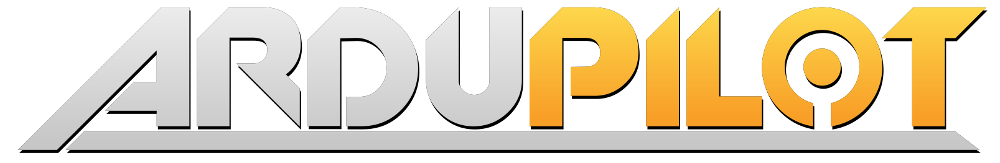
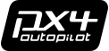
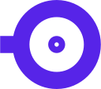

---
hide:
  - toc
---

# Nectar SDK

- [:simple-github: GitHub](https://github.com/Black-Bee-Drones/nectar-sdk)
- [:simple-apache: Apache 2.0](https://github.com/Black-Bee-Drones/nectar-sdk/blob/main/LICENSE){ .cb style="--b:#D22128" }
- [:octicons-tag-16: Latest release](https://github.com/Black-Bee-Drones/nectar-sdk/releases/latest)
- [:simple-ros: ROS 2 · Humble · Jazzy · Kilted](setup/compatibility.md)

Nectar SDK is a ROS 2 software development kit for autonomous drones. It unifies flight
control, computer vision, and AI behind one consistent set of interfaces, so a mission you
write once runs across different vehicles, sensors, and simulators with little change.

[Get started](get-started/index.md){ .md-button .md-button--primary }
[Architecture](concepts/architecture.md){ .md-button }

## See it in action

Autonomous missions our team flew with the SDK, in competition and in the field. Click any clip
to watch it larger.

  <button class="nectar-carousel__btn nectar-carousel__btn--prev" aria-label="Previous">&lsaquo;</button>
  

    

      

        <video class="nectar-autoplay" muted loop playsinline preload="none" poster="assets/media/comp-imav25.jpg">
          <source src="assets/media/comp-imav25.mp4" type="video/mp4">
        </video>
      

      
<a href="projects/imav-2025/">IMAV 2025, indoor</a>Gate entry, obstacles, moving smoke platform · 3rd place

    

    

      

        <video class="nectar-autoplay" muted loop playsinline preload="none" poster="assets/media/comp-hook.jpg">
          <source src="assets/media/comp-hook.mp4" type="video/mp4">
        </video>
      

      
<a href="projects/sae-2026/">SAE Eletroquad 2026</a>Hook and place, annotated run

    

    

      

        <video class="nectar-autoplay" muted loop playsinline preload="none" poster="assets/media/comp-imav23.jpg">
          <source src="assets/media/comp-imav23.mp4" type="video/mp4">
        </video>
      

      
<a href="projects/imav-2023/">IMAV 2023, indoor</a>Line following and ArUco landing · 3rd place

    

    

      

        <video class="nectar-autoplay" muted loop playsinline preload="none" poster="assets/media/comp-cbr.jpg">
          <source src="assets/media/comp-cbr.mp4" type="video/mp4">
        </video>
      

      
<a href="projects/cbr-2025/">CBR 2025</a>Phase 1: Precision landing on a base

    

    

      

        <video class="nectar-autoplay" muted loop playsinline preload="none" poster="assets/media/comp-slalom.jpg">
          <source src="assets/media/comp-slalom.mp4" type="video/mp4">
        </video>
      

      
<a href="projects/">SAE Eletroquad 2025</a>Slalom mission

    

  

  <button class="nectar-carousel__btn nectar-carousel__btn--next" aria-label="Next">&rsaquo;</button>

## What you can build

  

    

      <video class="nectar-autoplay" muted loop playsinline preload="none" poster="assets/media/feat-control.jpg">
        <source src="assets/media/feat-control.mp4" type="video/mp4">
      </video>
    

    

      <h3>Fly any vehicle</h3>
      
ArduPilot and PX4 over MAVROS, direct MAVLink, or native uXRCE-DDS, plus Bebop and Crazyflie, behind one flight interface. Navigation, GPS waypoints, return to launch, PID, and obstacle handling.

      <a href="get-started/control/">Fly a drone</a>
    

  

  

    

      <video class="nectar-autoplay" muted loop playsinline preload="none" poster="assets/media/feat-vision.jpg">
        <source src="assets/media/feat-vision.mp4" type="video/mp4">
      </video>
    

    

      <h3>See with any camera</h3>
      
USB, RealSense, OAK-D, Pi Camera, or a ROS topic behind one camera factory and a shared image handler. ArUco, color, line, distance estimation, optical flow, and MediaPipe.

      <a href="get-started/vision/">See with a camera</a>
    

  

  

    

      <video class="nectar-autoplay" muted loop playsinline preload="none" poster="assets/media/feat-ai.jpg">
        <source src="assets/media/feat-ai.mp4" type="video/mp4">
      </video>
    

    

      <h3>Detect and segment</h3>
      
Object detection and instance segmentation across Ultralytics YOLO, HuggingFace DETR, and RF-DETR behind one interface built to take on new models and tasks, with training and evaluation.

      <a href="get-started/ai/">Detect and segment</a>
    

  

  

    

      <video class="nectar-autoplay" muted loop playsinline preload="none" poster="assets/media/feat-localize.jpg">
        <source src="assets/media/feat-localize.mp4" type="video/mp4">
      </video>
    

    

      <h3>Fly indoors without GPS</h3>
      
A companion rangefinder bridge and a RealSense with Isaac VSLAM pipeline feed the flight controller, so the same navigation code and precision work indoors and out.

      <a href="modules/control/localization/">Localization</a>
    

  

  

    

      <video class="nectar-autoplay" muted loop playsinline preload="none" poster="assets/media/feat-interface.jpg">
        <source src="assets/media/feat-interface.mp4" type="video/mp4">
      </video>
    

    

      <h3>Operate without code</h3>
      
A desktop app to arm, take off, fly, stream cameras with live filters, tune PID with live plots, and inspect ROS 2 topics, services, and parameters.

      <a href="modules/interface/">Interface</a>
    

  

  

    

      <video class="nectar-autoplay" muted loop playsinline preload="none" poster="assets/media/feat-sim.jpg">
        <source src="assets/media/feat-sim.mp4" type="video/mp4">
      </video>
    

    

      <h3>Test in simulation</h3>
      
ArduPilot or PX4 SITL with Gazebo, indoor and outdoor, running the same missions you fly on hardware.

      <a href="setup/simulation/">Simulation</a>
    

  

## Who it's for

Nectar SDK suits academic labs, research groups, competition teams, and industry prototyping:
anyone building autonomous flight who wants control, vision, and AI under one consistent set of
interfaces. It is a good fit when you want to:

- Run one mission across different vehicles and transports, in simulation or on hardware.
- Combine flight control, computer vision, and AI in a single codebase with typed, consistent APIs.
- Fly indoors and outdoors with the same navigation code and the same precision.
- Add a new drone, camera, or model by following one familiar pattern, without forking the core.

It is not a flight controller or a replacement for ArduPilot or PX4. It runs on the companion
computer and drives them through ROS 2.

## About

Nectar SDK is developed by [Black Bee Drones](https://github.com/Black-Bee-Drones), Latin
America's first academic autonomous drone team, founded in 2014 at the Federal University of
Itajubá (UNIFEI). The team builds autonomous aircraft for missions that rely on computer vision
and artificial intelligence, and competes nationally and internationally, including
[IMAV](https://www.imavs.org/) (3rd place indoor in 2023 and 2025), the
[CBR RoboCup Flying Robots League](https://cbr.robocup.org.br/), and
[SAE Eletroquad](https://saebrasil.org.br/programas-estudantis/eletroquad/).

It started in 2023 as a way to stop rewriting the same camera, PID, and detection code for each
competition mission, and grew into a ROS 2 package with consistent interfaces across flight
control, computer vision, and AI. It is open source under Apache 2.0 so other teams and labs
can build autonomous systems more quickly.

### Built on

Robotics & flight

- [:simple-ros: ROS 2](https://docs.ros.org/)
- 
- <a class="b-logo" href="https://px4.io/">PX4</a>
- <a class="b-logo" href="https://mavlink.io/">MAVLink</a>
- <a class="b-logo" href="https://www.parrot.com/">Bebop</a>
- <a class="b-logo" href="https://www.bitcraze.io/">Bitcraze Crazyflie</a>

Perception & AI

- [:simple-opencv: OpenCV](https://opencv.org/){ .cb style="--b:#5C3EE8" }
- [:simple-pytorch: PyTorch](https://pytorch.org/){ .cb style="--b:#EE4C2C" }
- 
- [:simple-huggingface: HuggingFace](https://huggingface.co/){ .cb style="--b:#FFD21E" }
- [:simple-roboflow: Roboflow](https://roboflow.com/){ .cb style="--b:#6706CE" }
- [:simple-mediapipe: MediaPipe](https://ai.google.dev/edge/mediapipe/solutions){ .cb style="--b:#0097A7" }

Localization & sensors

- [:simple-nvidia: NVIDIA Isaac ROS](https://nvidia-isaac-ros.github.io/){ .cb style="--b:#76B900" }
- [:simple-intel: Intel RealSense](https://github.com/realsenseai/librealsense){ .cb style="--b:#0071C5" }
- <a class="b-logo" href="https://www.luxonis.com/">Luxonis</a>

### Runs on

- [:fontawesome-brands-ubuntu: Ubuntu](https://ubuntu.com/){ .cb style="--b:#E95420" }
- [:simple-nvidia: Jetson](https://developer.nvidia.com/embedded-computing){ .cb style="--b:#76B900" }
- [:fontawesome-brands-raspberry-pi: Raspberry Pi](https://www.raspberrypi.com/){ .cb style="--b:#A22846" }
- [:fontawesome-brands-windows: Windows (WSL2)](setup/compatibility.md){ .cb style="--b:#0078D4" }

